## Objectif

Ce guide explique comment configurer des tâches de sauvegarde chiffrées en utilisant la solution de sauvegarde Veeam et le service KMS d’OVHcloud (OKMS).

## Prérequis

- Être connecté à l'[espace client OVHcloud](/links/manager) et à [l'API OVHcloud](/links/api).
- Disposer d'une offre [VMware on OVHcloud](/links/hosted-private-cloud/vmware).
- Avoir lu les guides :
    - [Intégration d'un KMS pour VMware on OVHcloud](/pages/hosted_private_cloud/hosted_private_cloud_powered_by_vmware/vmware_overall_vm-encrypt).
    - [Premiers pas avec OKMS](/pages/manage_and_operate/kms/quick-start).

## En pratique

### Étape 1 : Création du certificat dans le service OKMS

#### 1.1 Créez une clé privée via l'API OVHcloud

> [!primary]
> Si vous n'êtes pas familier avec l'utilisation de l'API OVHcloud, consultez notre guide « [Premiers pas avec les API OVHcloud](/pages/manage_and_operate/api/first-steps) ».

Générez la clé privée en utilisant l’appel API suivant (sans CSR) :

> [!api]
>
> @api {v1} /okms POST / /okms/resource/{okmsId}/credential

Récupérez ensuite la clé via l'appel GET suivant :

> [!api]
>
> @api {v1} /okms GET /okms/resource/{okmsId}/credential

#### 1.2 Créer le certificat dans l'espace client OVHcloud

Connectez-vous à l'[espace client OVHcloud](/links/manager) puis cliquez sur `Hosted Private Cloud`{.action}.

Cliquez ensuite sur `Identité, Securité & Opérations`{.action} et enfin sur `Key Management Service`{.action}.

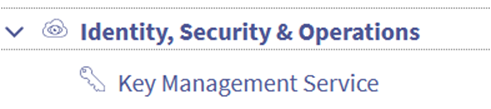{.thumbnail}

Sélectionnez votre KMS puis cliquez sur l'onglet `Certificats d'accès`{.action}

Cliquez ensuite sur le bouton `Créer un certificat d'accès`{.action}.

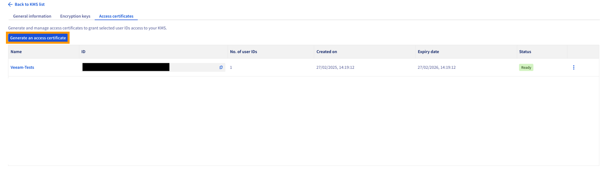{.thumbnail}

Remplissez les champs requis et sélectionnez l’option `Je n'ai pas de clé privée`{.action}.

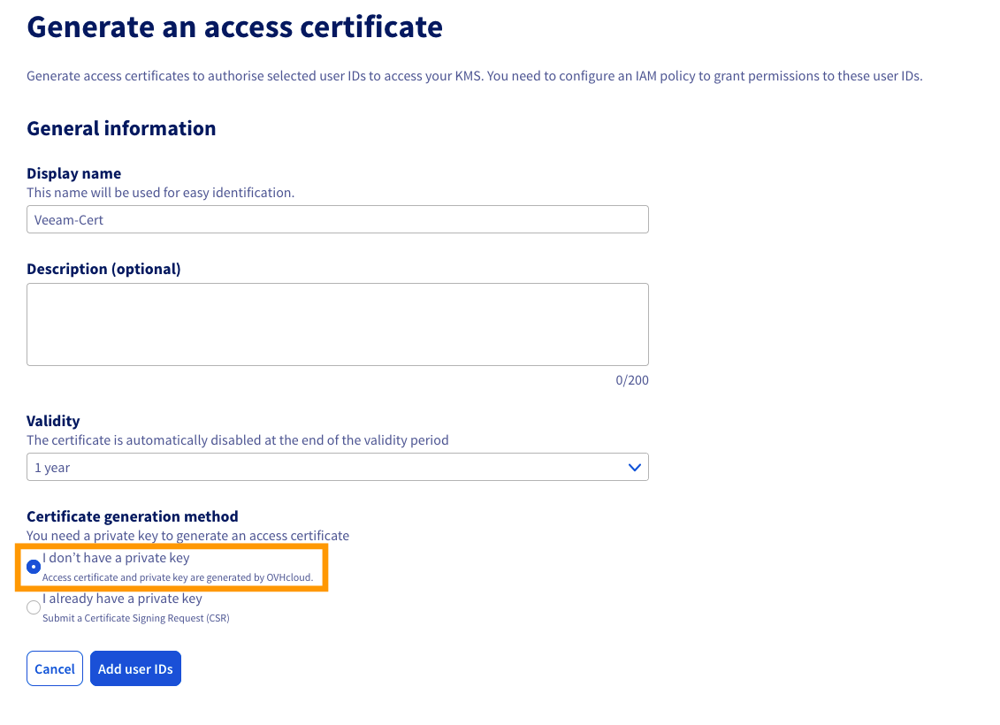{.thumbnail}

Téléchargez la clé privée.

Téléchargez le certificat.

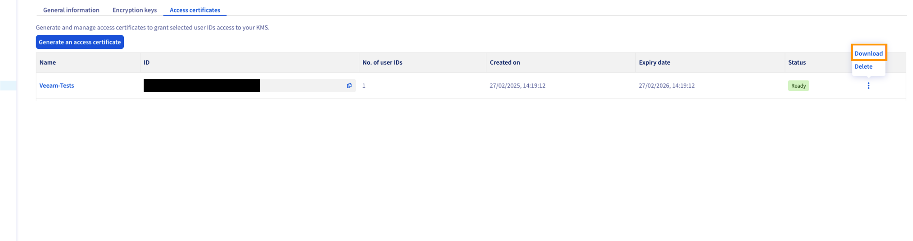{.thumbnail}

### Étape 2 : Conversion du certificat PEM en format PFX

Pour importer le certificat dans Veeam, vous devez le convertir au format `.pfx` en utilisant la commande suivante :

```bash
openssl pkcs12 -export -out cert.pfx -inkey privatekey.pem -in certificate.pem
```

### Étape 3 : Importation du certificat dans le Windows Certificate Store de Veeam

1. Ouvrez le Windows Certificate Store sur votre serveur Veeam.
1. Importez le certificat `.pfx` dans le Windows Certificate Store de Veeam.
1. Cochez l'option permettant de rendre le certificat exportable lors de l'importation.

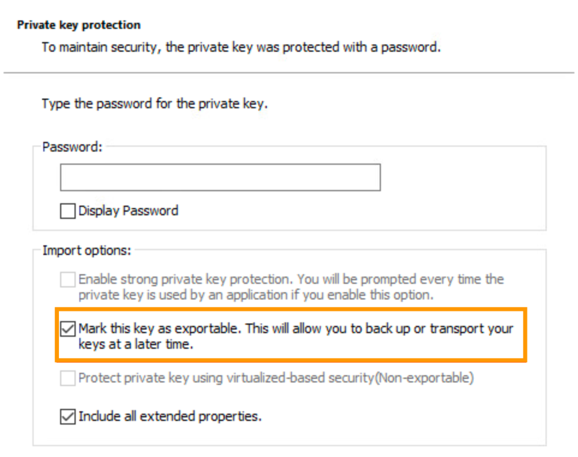{.thumbnail}

### Étape 4 : Enregistrement du KMS dans Veeam

1\. Ouvrez Veeam Backup & Replication et allez dans `Credentials & Passwords`{.action} puis cliquez sur `Key Management Servers`{.action}.

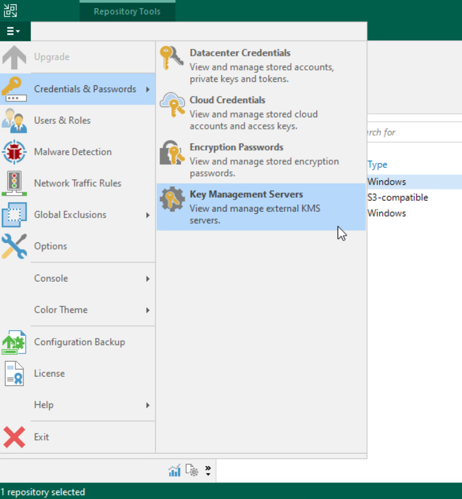{.thumbnail}

2\. Cliquez sur `Add`{.action} pour ajouter un nouveau serveur KMS.

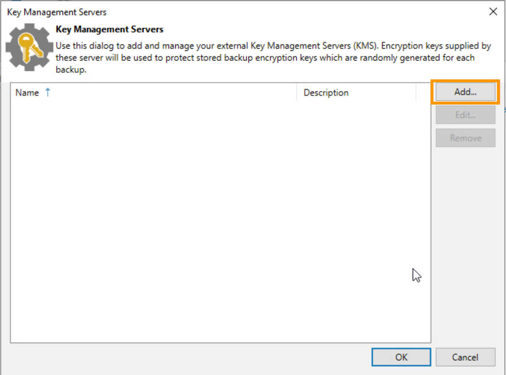{.thumbnail}

3\. Entrez l'adresse du serveur.

Par exemple, pour un KMS créé dans la région **eu-west-rbx** : <https://eu-west-rbx.okms.ovh.net>.\

Ensuite, importez votre certificat depuis le Windows Key Store (le fichier `.pfx` que vous avez importé précédemment).

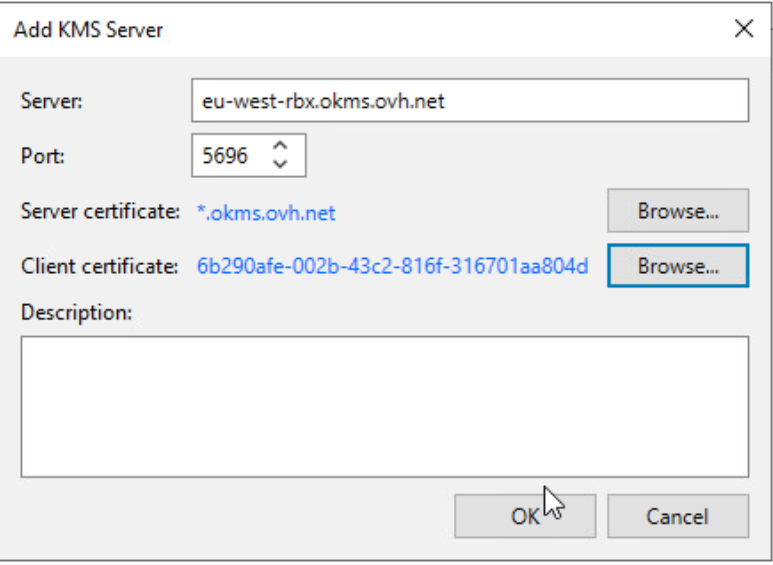{.thumbnail}

### Étape 5 : Récupération du certificat serveur

Pour récupérer le certificat depuis le serveur OKMS, utilisez cette commande :

```bash
openssl s_client -connect eu-west-rbx.okms.ovh.net:443 2>/dev/null </dev/null |  sed -ne '/-BEGIN CERTIFICATE-/,/-END CERTIFICATE-/p'
```

### Étape 6 : Configuration du chiffrement des tâches de sauvegarde

1\. Enregistrez le serveur KMS dans votre console Veeam Backup & Replication.
2\. Sélectionnez la tâche de sauvegarde souhaitée et configurez le chiffrement en utilisant le KMS enregistré.

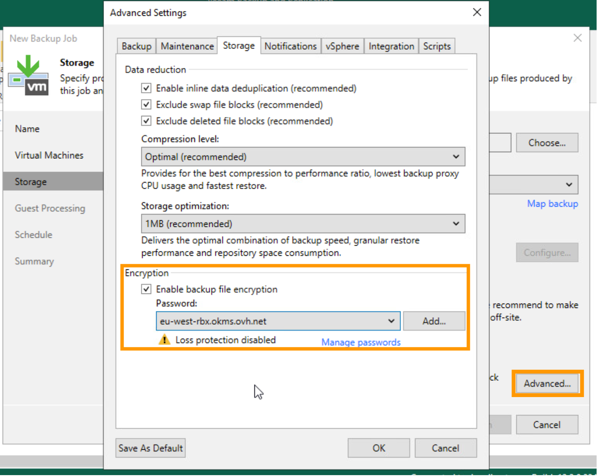{.thumbnail}

3\. Une fois la sauvegarde terminée, vous verrez une icône de cadenas à côté du nom de la sauvegarde indiquant qu'elle est chiffrée.

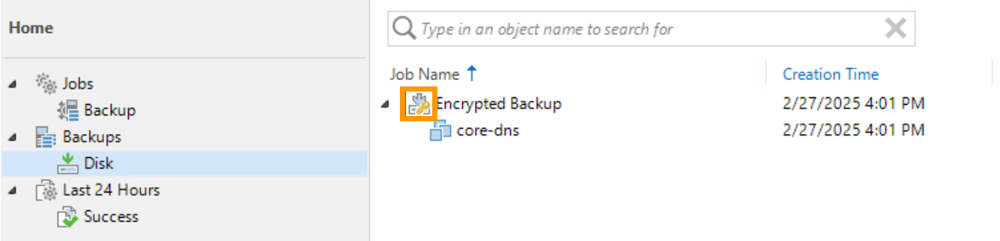{.thumbnail}

4\. Si vous rencontrez l'erreur **Unsupported attribute: OPERATION_POLICY_NAME**, suivez les instructions fournies dans la documentation pour résoudre le problème.

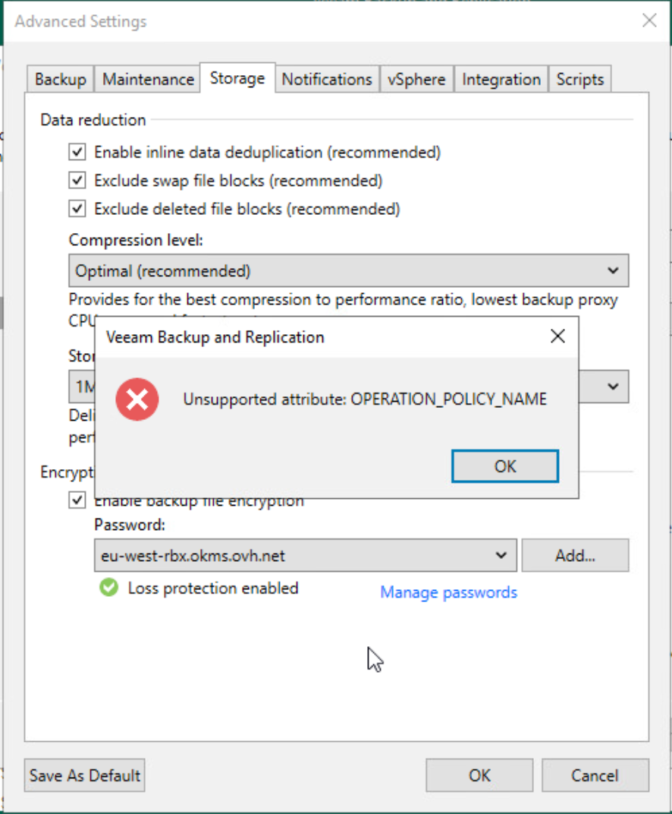{.thumbnail}

## Aller plus loin

Si vous avez besoin d'une formation ou d'une assistance technique pour la mise en oeuvre de nos solutions, contactez votre commercial ou cliquez sur [ce lien](/links/professional-services) pour obtenir un devis et demander une analyse personnalisée de votre projet à nos experts de l’équipe Professional Services.

Posez vos questions, donnez votre avis et échangez directement avec l’équipe en charge des services Hosted Private Cloud sur notre canal [Discord](https://discord.gg/ovhcloud).

Échangez avec notre [communauté d'utilisateurs](/links/community).