## Objective

This guide explains how to identify OmniOS datastores in your Hosted Private Cloud and migrate the virtual machines they contain to supported datastores using **VMware Storage vMotion**.

## Requirements

- Access to the [OVHcloud Control Panel](/links/manager)
- Administrator access to your vSphere environment (via vScope)
- Basic knowledge of VMware vSphere and Storage vMotion
- Available supported datastores as migration targets

## Instructions

### Step 1 - Identify OmniOS datastores

1. Log in to the [OVHcloud Control Panel](/links/manager).

2. Click on `Hosted Private Cloud`{.action} and select your PCC service.

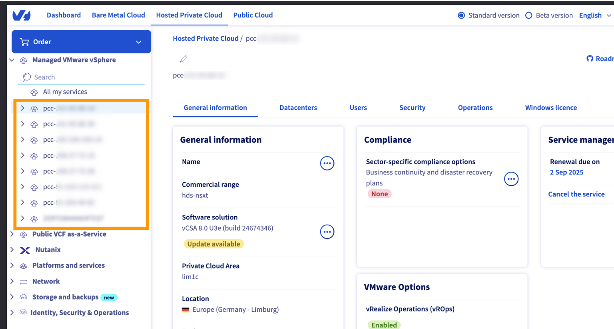{.thumbnail}

3. Go to the `Datacenters`{.action} tab.

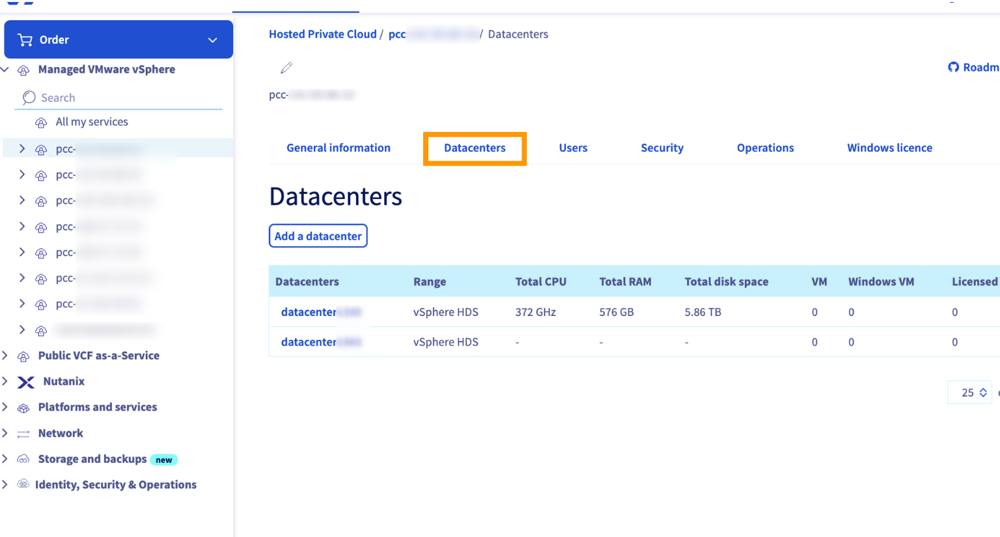{.thumbnail}

4. On the datacenter page, open the `Datastores`{.action} tab.

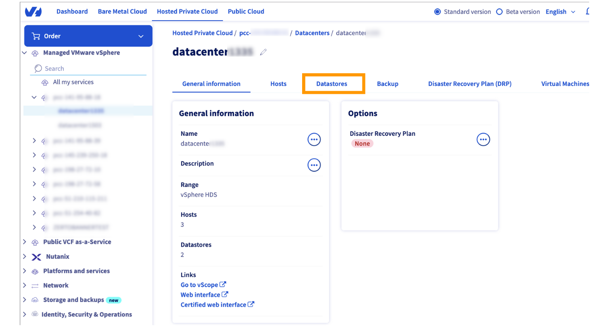{.thumbnail}

- Datastores with the prefix **tete-xxxx** are **OmniOS** datastores.

- Datastores with the prefix **cluster-xxxx** are **FreeBSD** datastores.

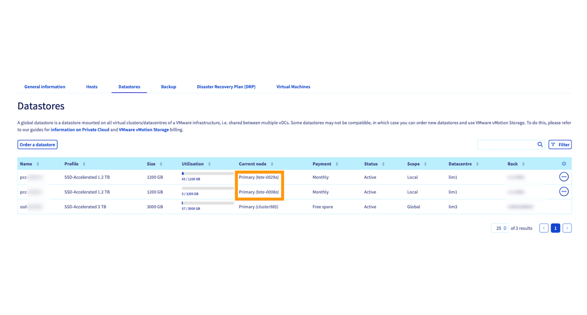{.thumbnail}

> [!primary]
> OmniOS datastores must be migrated to supported storage to ensure service continuity.

### Step 2 - Access vSphere through vScope

1. From the PCC `General information`{.action} tab, scroll down to **Management interfaces**.

2. Click on `vScope`{.action}.

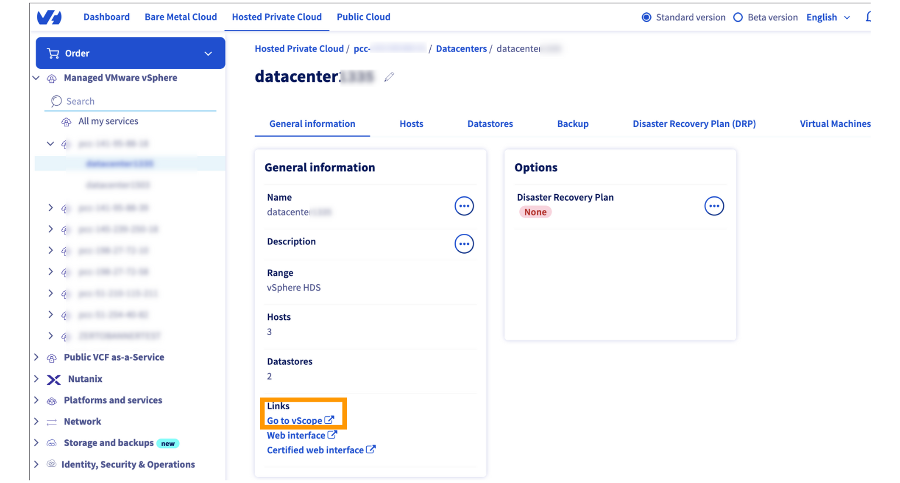{.thumbnail}

You are now connected to the vSphere interface and can perform a Storage vMotion.

### Step 3 - Migrate a virtual machine with Storage vMotion

1. In vSphere, right-click the virtual machine to migrate and select `Migrate...`{.action}.

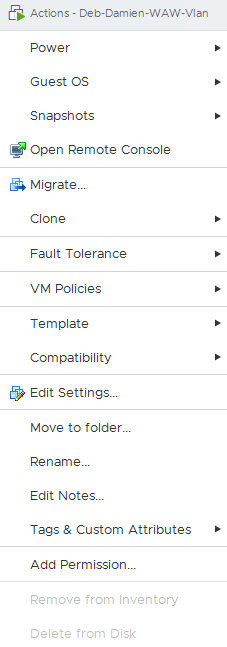{.thumbnail}

2. Choose **Change storage only**.

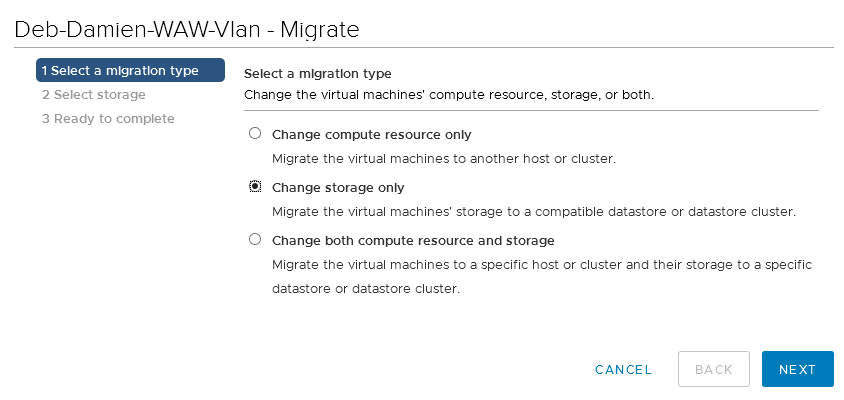{.thumbnail}

3. Select a supported datastore as the destination.

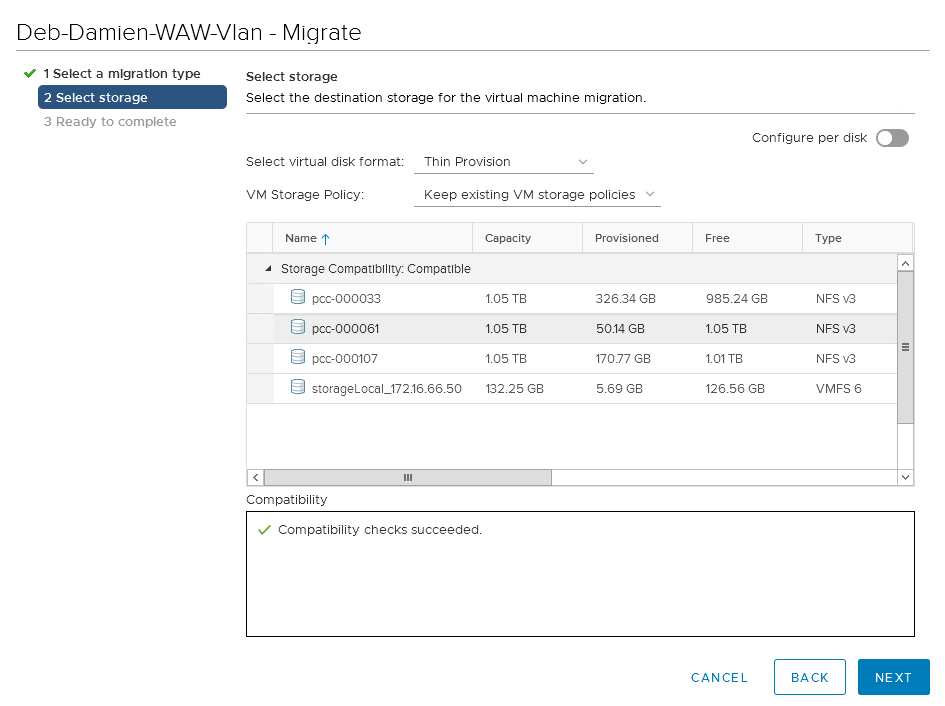{.thumbnail}

 You can also use the `Advanced`{.action} option to migrate only one disk if the VM has multiple disks.

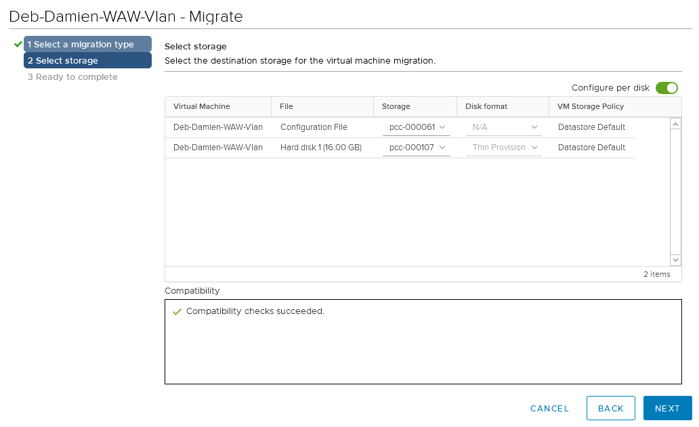{.thumbnail}

4. Click `Finish`{.action} to start the migration.

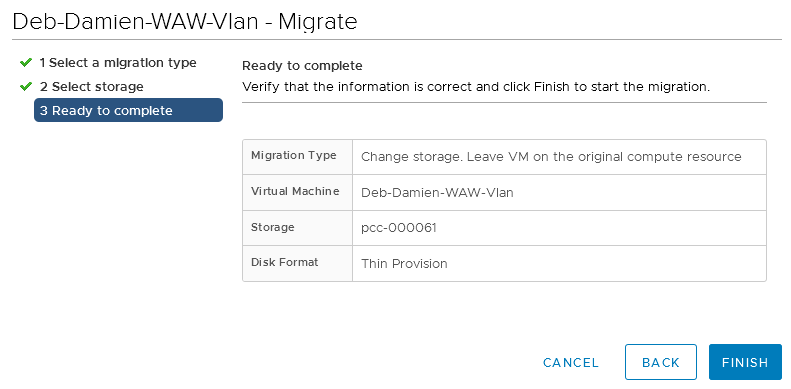{.thumbnail}

5. Monitor the migration progress in the **Recent Tasks** pane. Duration depends on VM size, IO activity, and available bandwidth.

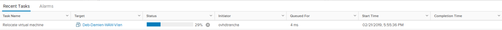{.thumbnail}

## Go further

If you need training or technical assistance to implement our solutions, contact your sales representative or click on [this link](/links/professional-services) to get a quote and ask our Professional Services experts for a custom analysis of your project.

Ask questions, give your feedback and interact directly with the team building our Hosted Private Cloud services on the dedicated [Discord](https://discord.gg/ovhcloud) channel.

Join our [community of users](/links/community).