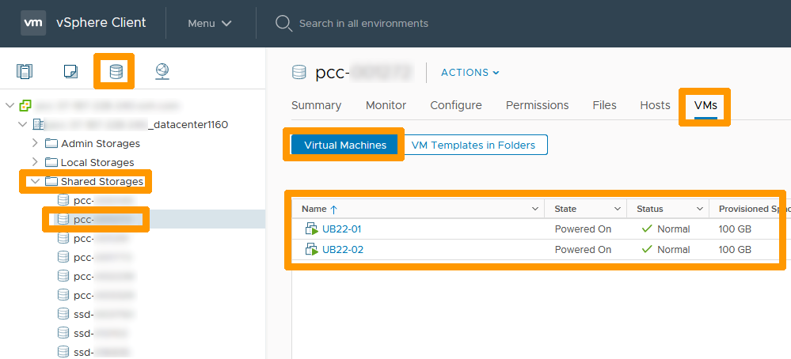
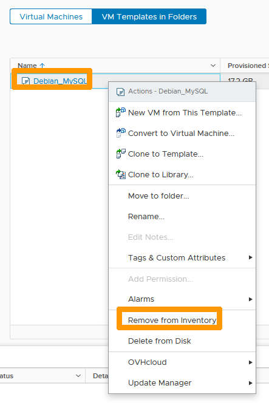
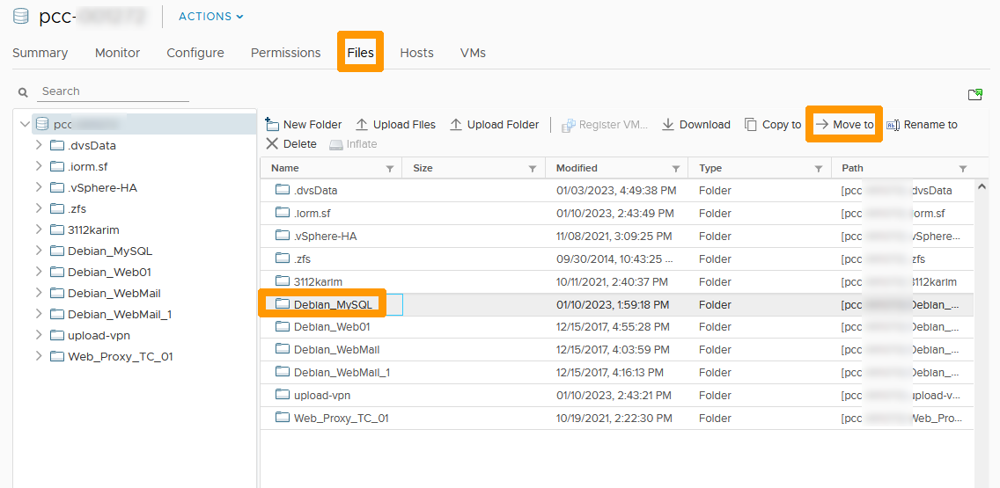
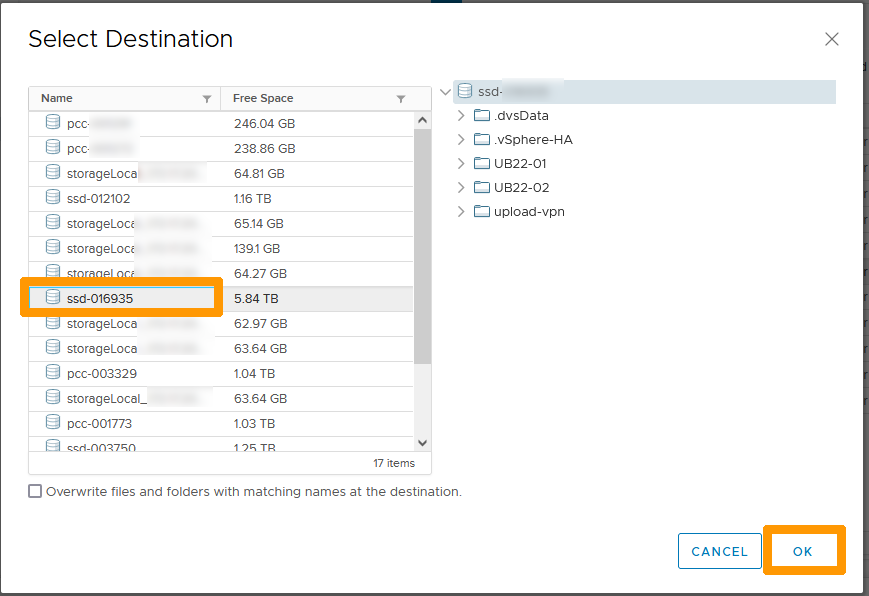
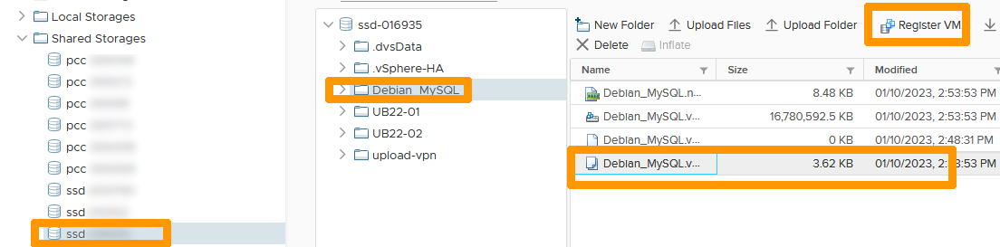
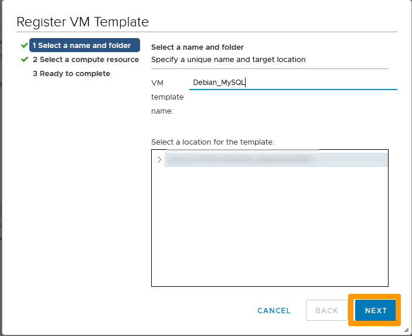
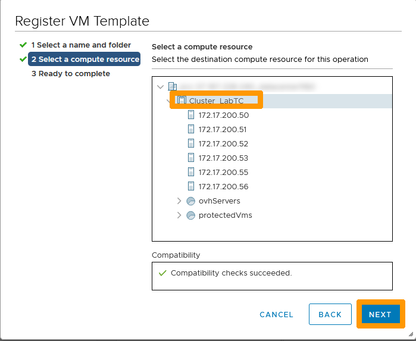
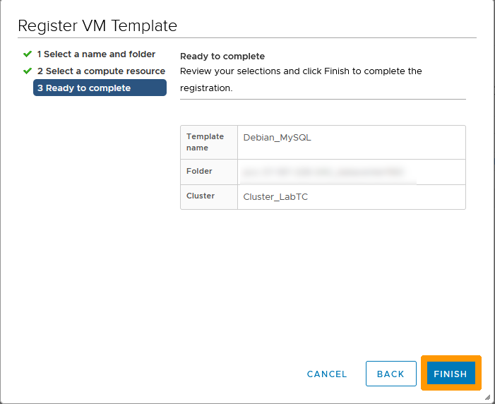
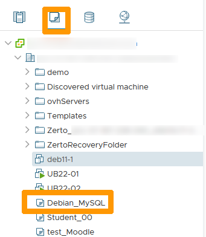

## Objectif

Ce guide explique comment identifier les datastores OmniOS de votre Hosted Private Cloud et migrer les machines virtuelles qu'ils contiennent vers des datastores supportés à l'aide de **VMware Storage vMotion**.

## Prérequis

- Accès à l’[espace client OVHcloud](/links/manager)
- Accès administrateur à votre environnement vSphere (via vScope)
- Connaissances de base de VMware vSphere et de Storage vMotion
- Datastores supportés disponibles comme cibles de migration

> [!primary]
> OVHcloud mettra à disposition l’espace de stockage libre nécessaire (*freespare*) dans le cadre du processus de migration mené par nos équipes.

## En pratique

### Étape 1 - Identifier les datastores OmniOS

1. Connectez-vous à [votre espace client OVHcloud](/links/manager).

2. Cliquez sur `Hosted Private Cloud`{.action} et sélectionnez votre service PCC.

    {.thumbnail}

3. Rendez-vous dans l'onglet `Datacenters`{.action}.

    {.thumbnail}

4. Sur la page du datacenter, ouvrez l'onglet `Datastores`{.action}.

    {.thumbnail}

    - Les datastores avec le préfixe **tete-xxxx** sont des datastores **OmniOS**.
    - Les datastores avec le préfixe **cluster-xxxx** sont des datastores **FreeBSD**.

    {.thumbnail}

    > [!primary]
    > Les datastores OmniOS doivent être migrés vers un stockage supporté pour assurer la continuité du service.

5. Avant de lancer un vMotion, assurez-vous de disposer d’un datastore supporté dans votre parc.

    - Si vous devez ajouter un datastore, consultez le guide [Ajouter un datastore](/pages/hosted_private_cloud/hosted_private_cloud_powered_by_vmware/how_to_add_storage).
    - Si vous souhaitez supprimer un datastore devenu inutile, consultez le guide [Supprimer un datastore](/pages/hosted_private_cloud/hosted_private_cloud_powered_by_vmware/delete_datastore).

    Dans certains cas, OVHcloud peut déjà avoir mis un datastore supporté à votre disposition. Vérifiez votre configuration avant de passer à l’étape suivante.

### Étape 2 - Accéder à vSphere via vScope

1. Depuis l'onglet `Informations générales`{.action} du PCC, faites défiler vers le bas jusqu'à **Interfaces de gestion**.

2. Cliquez sur `vScope`{.action}.

    {.thumbnail}

    Vous êtes maintenant connecté à l'interface vSphere et pouvez effectuer un Storage vMotion.

### Étape 3 - Migrer une machine virtuelle avec Storage vMotion

> [!warning]
> L’exécution d’un Storage vMotion peut provoquer des perturbations temporaires de performance.
> 
> Pour de meilleurs résultats :
>
> - Réduisez l’activité d’E/S pendant la migration (arrêtez les charges intensives si possible).
> - Planifiez la migration en heures non ouvrées (HNO).
> - Maintenez toujours au moins deux datastores supportés dans votre infrastructure pour garantir la résilience.

1. Dans vSphere, faites un clic droit sur la machine virtuelle à migrer et sélectionnez `Migrer...`{.action}.

    {.thumbnail}

2. Choisissez **Modifier le stockage uniquement**.

    {.thumbnail}

3. Sélectionnez un datastore supporté comme destination.

    {.thumbnail}

    Vous pouvez également utiliser l'option `Avancé`{.action} pour migrer un seul disque si la machine virtuelle en possède plusieurs.

    {.thumbnail}

4. Cliquez sur `Terminer`{.action} pour commencer la migration.

    {.thumbnail}

5. Surveillez la progression de la migration dans le volet **Tâches récentes**. La durée dépend de la taille de la machine virtuelle, de l'activité d'E/S et de la bande passante disponible.

    {.thumbnail}

> [!primary]
> Après la migration, consolidez vos charges de travail sur des datastores supportés.  
> Maintenez toujours au moins deux datastores actifs dans votre infrastructure afin de garantir la disponibilité et la redondance du service.

### Étape 4 - Migrer les modèles de VM

1. Dans vSphere, allez dans `Modèle de VM dans les dossiers`{.action} pour afficher les modèles stockés sur votre datastore.

    {.thumbnail}

2. Faites un clic droit sur chaque modèle et sélectionnez `Supprimer de l’inventaire`{.action}.

    {.thumbnail}

    > [!warning]
    > Le modèle est supprimé de l’inventaire mais reste stocké dans le datastore.
    > Vous pouvez le récupérer et le déplacer vers un autre datastore, ou le supprimer s’il n’est plus nécessaire.

3. Allez dans l’onglet `Fichiers`{.action}, sélectionnez le dossier du modèle, puis cliquez sur `Déplacer vers`{.action}.

    {.thumbnail}

4. Choisissez le datastore de destination et confirmez avec `OK`{.action}.

    {.thumbnail}

5. Une fois les fichiers déplacés, allez dans le nouveau datastore, sélectionnez le fichier du modèle, puis cliquez sur `Enregistrer la VM`{.action}.

    {.thumbnail}

6. Suivez l’assistant : cliquez sur `Suivant`{.action} → `Suivant`{.action} → `Terminer`{.action}.

    {.thumbnail}

    {.thumbnail}

    {.thumbnail}

7. Le modèle apparaît alors dans la vue `VM et modèles`{.action}.

    {.thumbnail}

## Calendrier de migration

Le calendrier de la migration est le suivant :

- **Septembre 2025** : Envoi de la communication officielle à tous les clients.

- **Du 25 octobre au 25 novembre 2025** : Période pendant laquelle le client peut effectuer la migration de manière autonome.

- **Du 25 novembre au 25 décembre 2025** : Fenêtre de 40 jours de migration pilotée par OVHcloud. Un email de notification est envoyé 3 à 4 jours avant l’opération de maintenance.

- **Janvier 2026** : Début de la facturation du nouveau datastore.

- **Février 2026** : Clôture du processus de migration.

## Aller plus loin

Si vous avez besoin d'une formation ou d'une assistance technique pour la mise en œuvre de nos solutions, contactez votre Technical Account Manager ou demandez une analyse personnalisée de votre projet à nos experts de l’équipe [Professional Services](/links/professional-services).

Posez des questions, donnez votre avis et interagissez directement avec l’équipe qui construit nos services Hosted Private Cloud sur le canal [Discord](https://discord.gg/ovhcloud) dédié.

Échangez avec notre [communauté d'utilisateurs](/links/community).