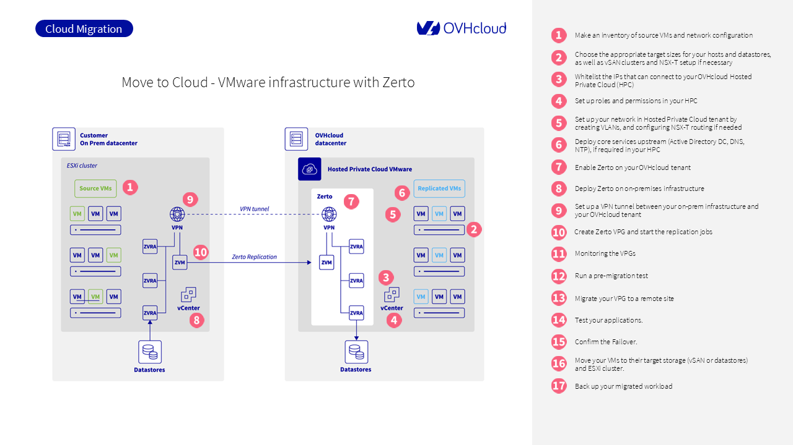

## Objectif

Ce guide explique comment migrer vos charges de travail VMware on-premises vers un **Hosted Private Cloud (HPC) d’OVHcloud** en utilisant **Zerto Virtual Replication**.

> [!primary]
> **Ce guide s’applique aux environnements Hosted Private Cloud standards (hors SecNumCloud, PCI-DSS ou HDS).**
> Si vous utilisez un environnement SecNumCloud, certaines fonctionnalités décrites ici comme **OVHcloud IAM**, le **vRack**, ou les **segments adossés à des VLAN** peuvent ne pas être disponibles.
> Pour ce cas, consultez le guide suivant :
> [Move2Cloud - Migration de charges de travail VMware vers le Hosted Private Cloud SecNumCloud avec Zerto](/pages/hosted_private_cloud/hosted_private_cloud_powered_by_vmware/vmware_migration_zerto_secnumcloud)

## Prérequis

Avant de commencer, assurez-vous d'avoir :

- Un inventaire complet de vos machines virtuelles (VM) : FQDN, adresse IP, version du système d'exploitation, dépendances applicatives
- Un plan de migration par lots regroupés par pile applicative
- Une liste complète des VLAN, sous-réseaux et segments du réseau cible
- Un environnement HPC correctement dimensionné (hosts, datastores, vSAN, NSX-T)
- Un tunnel VPN IPsec fonctionnel entre votre infrastructure sur site et OVHcloud
- Un accès à la console Zerto et aux interfaces vCenter sur les deux environnements

> [!warning]
> Depuis mai 2025, **Zerto ne prend pas en charge la réplication des VM avec le chiffrement VMEncrypt activé**.
> Le chiffrement au repos de vSAN est pris en charge. Vous pouvez également chiffrer vos VM après la migration.

## En pratique

{.thumbnail}

## Étape 1 : Définir votre périmètre de migration

À la fin de cette étape, vous aurez une liste structurée des charges de travail à migrer et la conception du réseau associée.

### Étape 1.1 : Créer un inventaire des VM sources

Répertoriez toutes les machines virtuelles à migrer avec les informations suivantes :

- FQDN et adresse IP
- Système d’exploitation et sa version
- Application ou service associé
- Dépendances entre les VM (ex. : web/app/db)

Cet inventaire vous permet de regrouper les machines virtuelles en piles d'applications cohérentes pour la migration par lots.

### Étape 1.2 : Regrouper les VM en lots de migration

Organisez vos VMs en lots applicatifs cohérents.

Chaque lot doit contenir toutes les machines virtuelles nécessaires à la migration et à l’exploitation d’une seule application, comme :

- VM frontend web
- VM applicative
- VM backend de base de données

### Étape 1.3 : Documenter la configuration réseau existante

Notez la configuration réseau complète utilisée par vos VM sources :

- Les sous-réseaux et VLAN utilisés
- Les plages IP à conserver
- Les flux autorisés (IP source/destination, ports, protocoles)

Cette structure réseau sera répliquée dans votre Hosted Private Cloud à l'aide de « vRack » et de NSX-T.

Vous pouvez en savoir plus sur la planification du réseau dans [NSX-T - Premières étapes](/pages/hosted_private_cloud/hosted_private_cloud_powered_by_vmware/nsx-01-first-steps).

Pour obtenir des conseils supplémentaires de Zerto, référez-vous à [Planification de votre installation](https://help.zerto.com/bundle/Install.VC.HTML/page/Planning_Your_Installation.htm){.external}.

## Étape 2 : Planifier les ressources de votre Hosted Private Cloud

Cette étape vous aide à déterminer les ressources de calcul, de stockage et de réseau requises pour votre environnement HPC.

### Étape 2.2 : Définir la capacité de stockage

En fonction de vos charges de travail, sélectionnez le type de stockage le plus approprié :

- `Datastores NFS`{.action} pour les charges de travail générales
- `vSAN`{.action} pour les applications exigeantes en performances

Estimez l'espace disque total nécessaire, plus la redondance le cas échéant.
Si vos charges de travail nécessitent des IOPS élevées, vSAN est l'option privilégiée.

### Étape 2.3 : Planifier le réseau cible

Planifiez la recréation de votre réseau virtuel à l'aide de NSX-T :

- Décidez quels segments seront de type VLAN ou Overlay
- Identifier les besoins en matière de passerelle (Tier-0 et Tier-1)
- Évaluer les règles de pare-feu et le trafic nord/sud

Si vous devez exposer des services sur Internet, vous pouvez :

- Demandez des IP publiques via votre `Hosted Private Cloud`{.action}
- Migrer vos plages d'IP existantes grâce à la fonctionnalité [Bring Your Own IP (BYOIP)](/links/network/byoip)

## Étape 3 : Activer l'accès au vCenter

L'accès au vCenter est restreint par défaut dans tous les environnements HPC OVHcloud.

Vous devez explicitement autoriser vos IP d'administration à atteindre le point de terminaison `vCenter`{.action}.

Pour ce faire :

1. Connectez-vous à [votre espace client OVHcloud](/links/manager)
2. Sélectionnez votre `Hosted Private Cloud`{.action}
3. Rendez-vous dans l'onglet `Secure SSL Gateway`{.action}
4. Ajoutez vos IP d’infrastructure source et vos composants Zerto à la liste blanche

Pour des instructions détaillées, reportez-vous à [Autoriser les IP à se connecter au vCenter](/pages/hosted_private_cloud/hosted_private_cloud_powered_by_vmware/autoriser_des_ip_a_se_connecter_au_vcenter).

## Étape 4 : Configurer les rôles et les permissions

Cette étape garantit que les administrateurs et les outils comme Zerto ont un accès correct aux ressources vSphere au sein de votre Hosted Private Cloud d’OVHcloud.

### Étape 4.1 : Utiliser la solution IAM d’OVHcloud

La solution IAM d’OVHcloud est la méthode recommandée pour gérer l’accès dans les environnements Hosted Private Cloud standard.

Pour configurer l'accès :

1. Connectez-vous à [votre espace client OVHcloud](/links/manager)
2. Allez dans `Hosted Private Cloud`{.action}
3. Ouvrez la section `Utilisateurs et rôles`{.action}
4. Attribuez des rôles en fonction de votre stratégie de sécurité (par exemple, Lecture seule, Administrateur)

Vous pouvez définir des utilisateurs, des groupes et leurs autorisations à l'aide du service OVHcloud Identity and Access Management.

Pour une procédure pas à pas complète, consultez [Getting Started with IAM](/pages/hosted_private_cloud/hosted_private_cloud_powered_by_vmware/vmware_iam_getting_started).

> [!warning]
> La solution IAM d’OVHcloud n’est pas disponible dans les environnements qualifiés SecNumCloud, PCI-DSS ou HDS.

### Étape 4.2 : Connecter votre propre solution IAM

Si vous préférez utiliser votre identity provider existant (comme Active Directory ou Okta), déployez un service d'annuaire directement dans votre locataire OVHcloud.

Vous pouvez également associer la solution IAM d’OVHcloud à votre serveur ADFS existant pour activer l’authentification unique basée sur SAML.

Pour cela, suivez [Connect OVHcloud IAM to ADFS](/pages/account_and_service_management/account_information/ovhcloud-account-connect-saml-adfs).

### Étape 4.3 : Comptes de service Zerto

Les composants Zerto nécessitent des rôles et des autorisations vSphere spécifiques pour fonctionner. Vous pouvez :

- Créer un compte dédié « zerto-admin » dans vSphere
- Attribuez les privilèges nécessaires pour gérer la réplication et la restauration

Les détails sur les autorisations requises sont disponibles dans la documentation de Zerto :
[Zerto User Permissions](https://help.zerto.com/bundle/Admin.VC.HTML.10.0_U3/page/User_Permissions.htm){.external}

## Étape 5 : Construire le réseau cible

Avant de commencer tout test de réplication ou de basculement de VM, votre réseau Hosted Private Cloud doit être prêt à recevoir les charges de travail. Il s’agit notamment de répliquer la structure source, de créer les bons segments et de préparer des règles de pare-feu.

### Étape 5.1 : Recréer vos VLAN et segments

Lorsque votre HPC est livré, il est livré avec un commutateur virtuel distribué par défaut et au moins un VLAN. Vous pouvez ajouter vos propres VLAN via le `vRack`{.action}.

Si vous utilisez NSX-T, planifiez votre segmentation comme suit :

- Définissez vos segments (VLAN-Backed ou overlay)
- Affectez chaque application à un lot d'applications ou à une zone de service correspondant
- Reproduire les plans d’adressage IP définis dans votre inventaire

Référez-vous à [NSX-T - Premières étapes](/pages/hosted_private_cloud/hosted_private_cloud_powered_by_vmware/nsx-01-first-steps) pour plus de détails sur la création de segments et leur affectation aux machines virtuelles.

### Étape 5.2 : Configurer le routage et les passerelles NSX-T

Si vous utilisez NSX-T, vous devez définir comment le trafic sera routé entre les segments et vers Internet :

- Une **Gateway Tier-1** gère le routage interne
- Une **Gateway Tier-0** relie votre environnement à des services en amont ou à des réseaux externes

Ces passerelles sont automatiquement déployées lorsque NSX-T est activé. Vous pouvez les consulter et les modifier depuis l'interface `NSX Manager`{.action}.

Paramétrez des routages et des services basés sur votre matrice de flux définie à l'étape 1.

### Étape 5.3 : Préparation des règles de firewall

NSX-T fournit un **pare-feu distribué** qui contrôle le trafic est-ouest entre les machines virtuelles. Vous devez définir des règles pour :

- Ports spécifiques aux applications (par exemple, web → app, app → db)
- Accès management aux composants vCenter et Zerto
- Facultatif : zones de quarantaine ou d'isolement pour les VM de test

Si vous n'utilisez pas NSX-T, mettez en œuvre des règles similaires à l'aide du pare-feu de votre appliance virtuelle préférée (par exemple, FortiVM, Stormshield, Palo Alto VM-Series).

Vous pouvez trouver un aperçu de la façon dont NSX gère ces fonctionnalités dans [NSX-T - Premières étapes](/pages/hosted_private_cloud/hosted_private_cloud_powered_by_vmware/nsx-01-first-steps).

## Étape 6 : Déployer les services core dans le HPC cible

Vos charges de travail migrées nécessiteront des services d'infrastructure de base pour fonctionner correctement une fois qu'elles seront en cours d'exécution dans votre Hosted Private Cloud.

### Étape 6.1 : Déployer NTP

Assurez-vous que toutes les machines virtuelles et tous les services utilisent une source de temps cohérente. Vous pouvez configurer vos charges de travail HPC pour utiliser `ntp.ovh.net` comme serveur de temps fiable.

### Étape 6.2 : Déployer DNS

Si vos applications s'appuient sur la résolution DNS interne, déployez un contrôleur de domaine ou un serveur DNS dédié au sein de votre environnement HPC. Il peut s’agir d’un clone de votre serveur on-premises ou d’une nouvelle instance.

### Étape 6.3 : Mise en place des services d'authentification

Si votre authentification est basée sur Active Directory, déployez un contrôleur de domaine réplica dans le HPC.

Vous pouvez également établir une communication sécurisée entre AD on-premises et le client pour éviter la duplication des identités.

## Étape 7 : Installer et activer Zerto sur le locataire OVHcloud

Zerto est installé et géré par site. Côté OVHcloud, les composants sont déployés automatiquement lors de l’activation de Zerto.

Dans votre interface `Hosted Private Cloud`{.action} :

1. Accédez à `Reprise d'activité`{.action}
2. Sélectionnez `Activer la réplication virtuelle Zerto`{.action}
3. Confirmez et attendez le déploiement

OVHcloud déploiera les éléments suivants :

- Un ZVM dédié (Zerto Virtual Manager)
- Un ZVRA (Zerto Virtual Replication Appliance) sur chaque hôte ESXi
- Un firewall NSX-T géré par OVH avec des règles préconfigurées pour les ports Zerto

Tous les détails sont disponibles dans [Zerto Virtual Replication on OVHcloud](/pages/hosted_private_cloud/hosted_private_cloud_powered_by_vmware/vmware_zerto_virtual_replication_customer_to_ovh).

## Étape 8 : Installer Zerto sur le site source

Vous devez installer manuellement les composants Zerto sur votre infrastructure on-premises.

Suivez la procédure décrite dans [Installer Zerto sur le site source](https://help.zerto.com/bundle/Install.VC.HTML/page/Performing_an_Express_Installation.htm){.external}.

Les principaux composants sont les suivants :

- ZVM : installé sur un serveur Windows avec accès vSphere
- ZVRA : Déployé sur chaque hôte ESXi hébergeant des VM protégées

Assurez-vous que :

- Les ports TCP 9071, 9081 sont ouverts entre les ZVM
- Les ports TCP 4007, 4008 sont ouverts entre les ZVRA

## Étape 9 : Configurer le tunnel VPN IPsec

Zerto nécessite **une communication directe** entre les ZVM et les ZVRA. NAT non pris en charge.

Mettez en place un tunnel IPsec de site à site entre votre pare-feu local et le l'environnement OVHcloud.

Vous pouvez utiliser n'importe quel périphérique compatible (par exemple, Fortinet, Palo Alto, OPNsense).

Les détails et les paramètres sont disponibles dans [Zerto VPN Setup on OVHcloud](/pages/hosted_private_cloud/hosted_private_cloud_powered_by_vmware/vmware_zerto_virtual_replication_customer_to_ovh).

## Étape 10 : Coupler les sites et créer des VPG

Une fois les ZVM en ligne et la communication validée :

1. Utilisez la console Zerto pour **coupler les deux sites**
2. Créez votre premier **Virtual Protection Group (VPG)**

Un VPG regroupe toutes les VM qui doivent être répliquées et basculées ensemble.

Plus d'informations dans [Créer un VPG](https://help.zerto.com/bundle/Admin.ZSSP.HTML.10.0_U3/page/Creating_a_VPG.htm){.external}

## Étape 11 : Surveiller l'état de la réplication

Surveillez chaque VPG depuis l'interface utilisateur Zerto :

- Confirmer que la réplication est active
- Vérifier le RPO (Recovery Point Objective)
- Résoudre les alertes avant d'exécuter un test ou un basculement

Si besoin, consultez le guide [Monitoring Virtual Protection Groups](https://help.zerto.com/bundle/Admin.ZSSP.HTML.10.0_U3/page/Monitoring_Virtual_Protection_Groups.htm){.external}

## Étape 12 : Exécuter un test de basculement

Avant de migrer les charges de travail de production, testez le comportement de vos VM dans le locataire OVHcloud.

Utilisez l'option `Failover Test` dans l'interface utilisateur Zerto. Cela permet de mettre sous tension les machines virtuelles répliquées sans impacter la production.

Instructions :

- [Démarrer un test de basculement](https://help.zerto.com/bundle/Admin.VC.HTML.10.0_U3/page/StartingFailoverTest.htm){.external}
- [Arrêter un test de basculement](https://help.zerto.com/bundle/Admin.VC.HTML.10.0_U3/page/What_Happens_After_Starting_a_Test.htm){.external}

## Étape 13 : Exécuter la migration prévue

Lorsque vous êtes prêt à migrer :

1. Utilisez l'opération **Move** à Zerto pour migrer chaque VPG
2. Choisissez la stratégie de validation (manuelle, automatique, annulation)

Voir [The Move Process](https://help.zerto.com/bundle/Admin.ZSSP.HTML.10.0_U3/page/The_Move_Process.htm){.external} pour des instructions complètes.

## Étape 14 : Valider la disponibilité de l'application

Après le déplacement :

- Vérifier que toutes les VM sont sous tension
- Tester la connectivité (AD, DNS, Bastion, Internet)
- Valider chaque application et service

## Étape 15 : Valider ou annuler la migration

Si tous les tests réussissent, validez l'opération dans Zerto.

Si quelque chose ne fonctionne pas, vous pouvez annuler le déplacement et revenir à votre environnement local.

Voir [Déplacement des machines virtuelles protégées vers le site distant](https://help.zerto.com/bundle/Admin.ZSSP.HTML.10.0_U3/page/Moving_Protected_Virtual_Machines_to_the_Remote_Site.htm){.external}

## Étape 16 : Utiliser Storage vMotion pour placer les VM sur le stockage cible

Après la migration, vous pouvez souhaiter déplacer certaines machines virtuelles vers un autre datastore ou une autre stratégie vSAN.

Utiliser `Storage vMotion`{.action} via `vSphere Client`{.action}:

1. Faites un clic droit sur la VM > `Migrer`{.action}
2. Sélectionnez `Modifier le stockage uniquement`{.action}
3. Choisissez le datastore de destination ou la stratégie vSAN

Voir [VMware Storage vMotion](/pages/hosted_private_cloud/hosted_private_cloud_powered_by_vmware/vmware_storage_vmotion) pour plus de détails.

## Étape 17 : Sauvegarder vos charges de travail

Une fois vos VM en production, sécurisez-les avec un plan de sauvegarde.

### Option 1 : Veeam Backup as a Service

Utilisez [Veeam Backup as a Service](/pages/storage_and_backup/backup_and_disaster_recovery_solutions/veeam/vmware_veeam_backup_as_a_service) si vous souhaitez une solution de sauvegarde managée intégrée à votre HPC.

### Option 2 : Veeam autogéré avec licence Enterprise

Déployez votre propre serveur Veeam Backup et utilisez [Veeam Backup & Replication for Public Cloud](/pages/storage_and_backup/backup_and_disaster_recovery_solutions/veeam/public_cloud_storage_veeam_backup_replication).

## Aller plus loin

Si vous avez besoin d'une formation ou d'une assistance technique pour la mise en œuvre de nos solutions, contactez votre Technical Account Manager ou demandez une analyse personnalisée de votre projet à nos experts de l’équipe [Professional Services](/links/professional-services).

Posez des questions, donnez votre avis et interagissez directement avec l’équipe qui construit nos services Hosted Private Cloud sur le canal [Discord](https://discord.gg/ovhcloud){.external} dédié.

Échangez avec notre [communauté d'utilisateurs](/links/community).