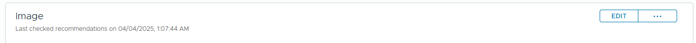
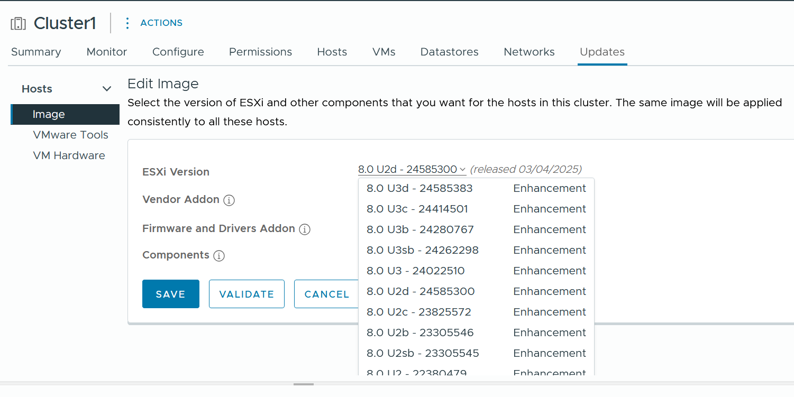
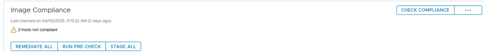
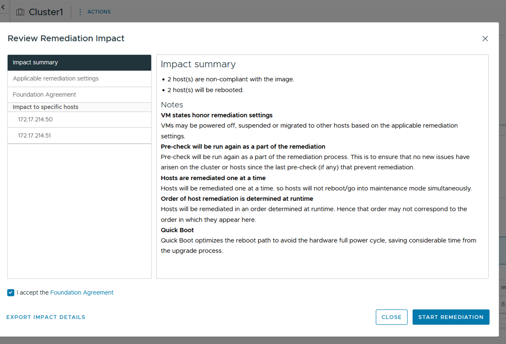
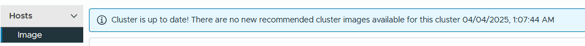

## Objectif

Découvrez comment mettre à jour vos hôtes ESXi avec vSphere Lifecycle Management (vLCM), directement depuis l’interface vSphere.

## Prérequis

- Votre vCenter doit être en version **vSphere 8** pour accéder à la fonctionnalité vLCM.
- Assurez-vous que la fonctionnalité **DRS (Distributed Resource Scheduler)** est activée en mode automatique.
- Vérifiez que vos fichiers `.iso` ou `.vmdk` ne sont pas stockés localement sur les hôtes.

## En pratique

### Étape 1 : Se connecter à vSphere

Connectez-vous à votre interface vSphere, puis sélectionnez le **cluster d’hôtes** à mettre à jour.

### Étape 2 : Choisir une nouvelle image

Accédez au menu `Updates > Hosts > Image` pour consulter l’image actuelle.

{.thumbnail}

Cliquez sur **Edit** pour modifier l’image.

{.thumbnail}

Dans la liste déroulante, sélectionnez la version ESXi souhaitée. La première option correspond généralement à la dernière version publiée par Broadcom.

{.thumbnail}

> **OVHcloud recommande** de toujours utiliser la version préconisée. Évitez toute mise à jour vers une version antérieure.

Cliquez sur **Save** pour valider et enregistrer l’image sélectionnée.

{.thumbnail}

Votre image est maintenant chargée.

### Étape 3 : Lancer la mise à jour

Cliquez sur **Remediate All** pour appliquer l’image à l’ensemble des hôtes du cluster.

{.thumbnail}

Cette action déclenche la mise en maintenance des hôtes concernés. Les machines virtuelles sont automatiquement déplacées via **vMotion**.

> Avant de lancer la mise à jour, assurez-vous que :
> - La fonction **DRS** est activée en mode automatique ;
> - Aucune règle d’anti-affinité n’empêche le déplacement des machines virtuelles ;
> - Aucun fichier `.iso` ou `.vmdk` n’est stocké localement sur les hôtes.

Cliquez sur **Start Remediation** pour démarrer le processus.

{.thumbnail}

Le processus de mise à jour est lancé. Il peut durer plusieurs minutes par hôte.

## Aller plus loin

Échangez avec notre [communauté d’utilisateurs](/links/community).
