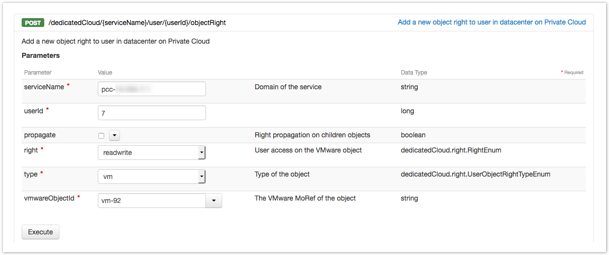
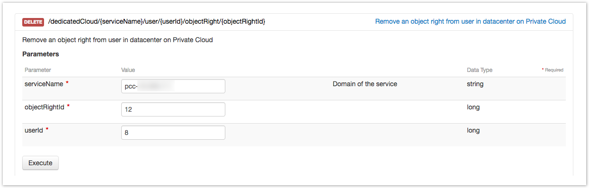
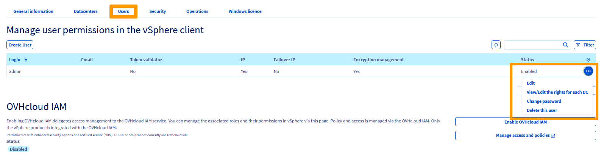
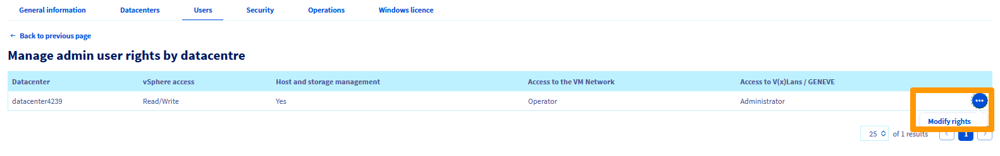
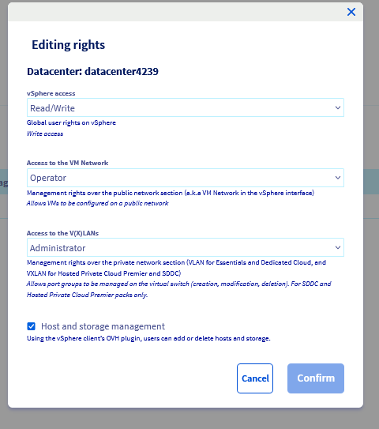

## Objective

In addition to global datacenter rights, you can assign granular rights to users on specific objects in your Hosted Private Cloud vSphere inventory (for example, a VM or datastore). This guide explains how to add and remove these rights through the OVHcloud API.

## Prerequisites

- A [Hosted Private Cloud service](/links/hosted-private-cloud) with vSphere version 6.5 or higher
- Access to the [OVHcloud API](/links/api)
- A user already created in your Hosted Private Cloud service ([see the user management guide](/pages/hosted_private_cloud/hosted_private_cloud_powered_by_vmware/manage_users))

## Instructions

### Add rights to a vSphere object

1. Call the following API endpoint:

    > [!api]
    >
    > @api {v1} /order POST /dedicatedCloud/{serviceName}/user/{userId}/objectRight

2. Fill in the request body with the object and user you want to grant access to.

    You can choose whether or not to propagate the right to child objects, similar to vSphere native rights.

3. Confirm the request. A task of type `addUserObjectRight` is created and applied on the vSphere object.

    {.thumbnail}

### Remove rights from a vSphere object

1. Call the following API endpoint:

    > [!api]
    >
    > @api {v1} /domain DELETE /dedicatedCloud/{serviceName}/user/{userId}/objectRight/{objectRightId}
    >

2. Fill in the fields with the `objectRightId` corresponding to the right you want to remove.

3. Confirm the request. A task of type `removeUserObjectRight` is created and removes the user right from the vSphere object.

    {.thumbnail}

### Viewing rights in the OVHcloud Control Panel

1. Open the [OVHcloud Control Panel](/links/manager). Click `Hosted Private Cloud`{.action} in the top bar, then `Managed VMware vSphere`{.action} in the left menu, and select your PCC service.

2. Go to the `Users`{.action} tab. On the desired user row, open the `…`{.action} menu and click `View/Edit the rights for each DC`{.action}.

    {.thumbnail}

3. On the **Manage admin user rights by datacentre** page, locate the datacenter row. Click the `…`{.action} menu (or `Modify rights`{.action}) to edit the rights.

    {.thumbnail}

4. In the **Editing rights** window, set the rights and confirm.

    {.thumbnail}

#### Rights reference

**vSphere access** — global user rights on vSphere.

| Right       | Description                    |
|-------------|--------------------------------|
| Provider    | Reserved for OVHcloud admins   |
| None        | No access                      |
| Read-only   | Read-only access               |
| Read/Write  | Read and write access          |

**Access to the VM Network** — management rights over the public network section (“VM Network” in vSphere).

| Right       | Description                                                   |
|-------------|---------------------------------------------------------------|
| Provider    | Allows VMs to be configured on a public network               |
| Operator    | Allows VMs to be configured on a public network               |
| None        | No access                                                     |
| Read-only   | Read access only                                              |

**Access to V(X)LANs / GENEVE** — management rights over the private network section (VXLAN/GENEVE for Hosted Private Cloud, VLAN for SDDC).

| Right         | Description                                                                                           |
|---------------|-------------------------------------------------------------------------------------------------------|
| Provider      | Allows VMs to be configured on a private network                                                      |
| Administrator | Allows port groups to be managed on the virtual switch (create, modify, delete). SDDC and Premier only |
| None          | No access                                                                                             |
| Read-only     | Read access only                                                                                      |

**Host and storage management** — when enabled, the user can add or delete hosts and storage via the OVHcloud plugin in the vSphere client.

## Go further

If you need training or technical assistance to implement our solutions, please contact your sales representative or click [this link](/links/professional-services) to get a quote and request a personalised analysis of your project from our Professional Services team.

Join our [community of users](/links/community).