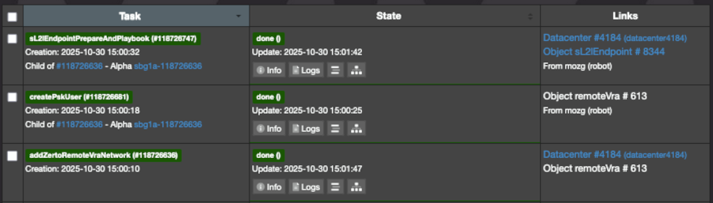

## Objective

The purpose of this guide is to provide step-by-step instructions to connect multiple on-premise Zerto deployments to an OVH Private Cloud (PCC) instance. By following this guide, users will be able to establish secure multi-site replication, ensure disaster recovery readiness, and manage data protection across different sites.

**Discover how to set up Zerto Virtual Replication between your Hosted Private Cloud platforms.**

## Requirements 

- **PCC Setup:** A PCC environment with Zerto already deployed.
- **On-Premise Zerto:** Zerto installed and configured on your local infrastructure.
- **VPN Information:** All necessary VPN credentials, IP addresses, and keys for both on-premise and PCC environments.

> [!primary]
>
> Appropriate administrative access to Zerto Manager on both PCC and on-premise sites.
>

## Instructions

1. Access Zerto Manager on PCC

Go to the [OVHcloud Control Panel](/links/manager), log in to your `PCC Manager` and navigate to the `Zerto` tab.

{.thumbnail}

2. Add your On-Premise Zerto Site

Click the `Add a site`{.action} button, enter your VPN information (IP addresses, keys, ...), enter the details of your on-premise Zerto deployment. Refer to our example screenshot for guidance:

{.thumbnail}

3. Start VPN Configuration

Submit your information, the PCC will automatically start the VPN setup, allowing secure access to your on-premise Zerto.

{.thumbnail}

4. Let Automated Processes Run

PCC will run automated tasks to configure multi-site connectivity.

{.thumbnail}

Wait until the status shows `Configuration deployed`.

{.thumbnail}

5. Connect the VPN

Connect your on-premise VPN to the PCC’s Zerto VPN, verify that the connection is active.

6. Pair the Zerto Sites

- On PCC Zerto, go to `Sites` and get the token:

{.thumbnail}

- On your on-premise Zerto, choose `Pair to a site` and enter the PCC Zerto IP and token.

{.thumbnail}

Once paired, your multi-site replication setup is complete.

## Network Diagram

The following diagram illustrates the connectivity setup for multi-site Zerto replication between the customer site and OVH Private Cloud (PCC):

{.thumbnail}

Diagram Explanation:

- OPNSense Public IP – The public IP of the customer firewall/router.
- OPNSense Private IP – The internal IP address of the customer firewall.
- ZVM Private IP – The internal IP of the customer Zerto Virtual Manager.
- Internal ZVM Network – The LAN connecting customer ZVM and vRAs.
- OVH Cloud Public IP – Public-facing IP for the OVH Private Cloud.
- OVHCloud ZVM Network /23 – Private network within the hosted PCC.
- ZVM Private IP (PCC) – Private IP addresses of Zerto VMs (ZVM and vRAs) hosted in OVH Private Cloud.

This setup ensures secure VPN connectivity between on-premise Zerto and OVHcloud PCC, allowing multi-site replication and disaster recovery.

## Troubleshooting Tips

- **VPN issues:** Check credentials, firewall, and network settings.
- **Status not updating:** Check PCC logs and robot processes.
- **Token/site pairing:** Verify token, ZVM IP, and license.

## Security Considerations

- Use strong encryption for all VPN connections.
- Ensure secure authentication methods are in place.
- Limit access to Zerto and PCC management interfaces.
- Regularly review logs and monitor for suspicious activity.
- Keep Zerto and PCC software up to date with security patches.

## Go further 

If you need training or technical assistance to implement our solutions, contact your sales representative or click on [this link](/links/professional-services) to get a quote and ask our Professional Services experts for a custom analysis of your project.

Ask questions, give your feedback and interact directly with the team building our Hosted Private Cloud services on the dedicated [Discord](https://discord.gg/ovhcloud) channel.

Join our [community of users](/links/community).
