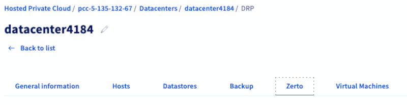
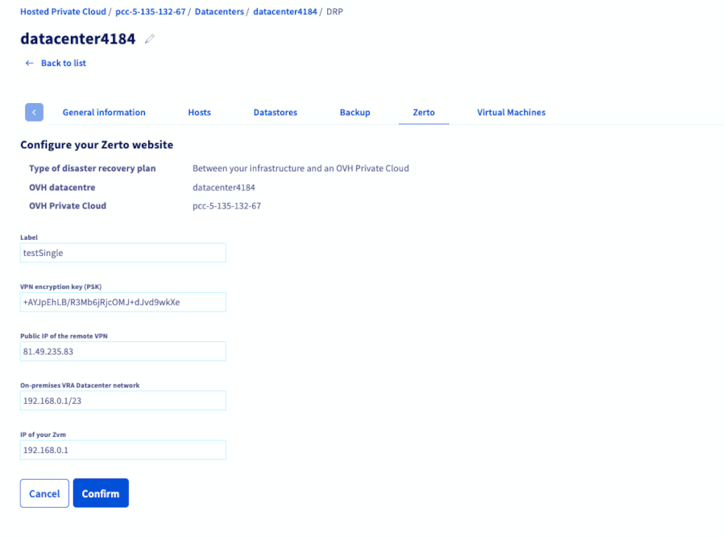
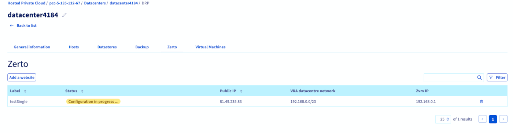
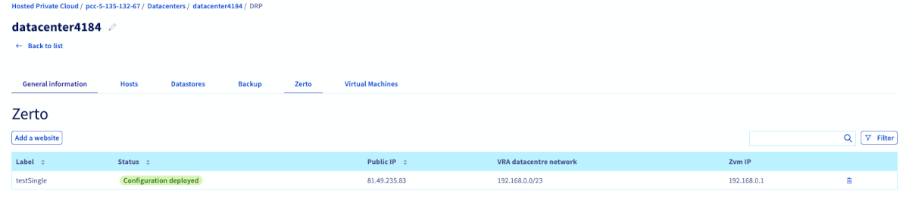
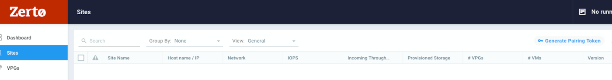
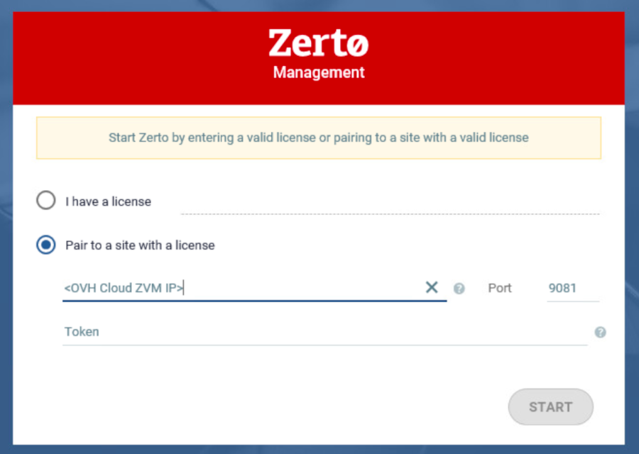
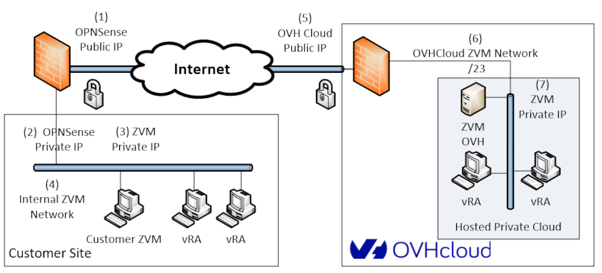

## Objectif

L’objectif de ce guide est de fournir des instructions détaillées pour connecter plusieurs déploiements Zerto on-premises à une instance Managed vSphere. En suivant ce guide, les utilisateurs pourront mettre en place une réplication multi-site sécurisée, garantir leur capacité de reprise après sinistre et gérer la protection des données entre différents sites.

**Découvrez comment configurer Zerto Virtual Replication entre vos plateformes Hosted Private Cloud.**

## Prérequis 

- **Environnement Managed vSphere** : Un environnement Managed vSphere avec Zerto déjà déployé.
- **Zerto on-premises** : Zerto est installé et configuré sur votre infrastructure locale.
- **Informations VPN** : L’ensemble des informations VPN nécessaires (identifiants, adresses IP et clés) pour les environnements on-premises et Managed vSphere.

> [!primary]
>
> Des droits d’administration appropriés sur Zerto Manager sont requis, à la fois sur Managed vSphere et sur les sites on-premises.
>

## En pratique

### 1 - Accéder à Zerto Manager sur Managed vSphere

- Connectez-vous à votre [espace client OVHcloud](/links/manager), puis accédez à la section `Hosted Private Cloud`{.action}.
- Cliquez sur le menu `Managed VMware vSphere`{.action} et sélectionnez l’infrastructure concernée.
- Accédez à l’onglet `Datacentres`{.action} et sélectionnez le datacentre.
- Accédez à l’onglet `Zerto`{.action}.

{.thumbnail}

### 2 - Ajouter votre site Zerto on-premises

Cliquez sur le bouton `Ajouter un site`{.action}, renseignez vos informations VPN (adresse IP et clé de chiffrement), puis saisissez les informations relatives à votre déploiement Zerto on-premises. Référez-vous à la capture d’écran ci-dessous pour vous guider :

{.thumbnail}

### 3 - Lancer la configuration VPN

Validez les informations saisies. Managed vSphere démarre automatiquement la configuration du VPN afin de permettre un accès sécurisé à votre site Zerto on-premises.

{.thumbnail}

### 4 - Laisser les processus automatisés s’exécuter

Managed vSphere exécute automatiquement les tâches nécessaires pour configurer la connectivité multi-site.

Attendez que le statut indique `Configuration déployée`.

{.thumbnail}

### 5 - Connecter le VPN

Connectez votre VPN on-premises au VPN Zerto du Managed vSphere et vérifiez que la connexion est bien active.

### 6 - Appairer les sites Zerto

- Sur Zerto Managed vSphere, accédez à l'onglet `Sites`{.action} et récupérez le jeton (token) :

    {.thumbnail}

- Sur votre Zerto on-premises, sélectionnez `Associer à un site`{.action}, puis saisissez l’adresse IP Zerto du Managed vSphere ainsi que le jeton :

    {.thumbnail}

Une fois l’appairage terminé, la configuration de la réplication multi-site est complète.

## Schéma réseau

Le schéma ci-dessous illustre la connectivité mise en place pour la réplication Zerto multi-site entre le site client et le Managed vSphere :

{.thumbnail}

Explication du schéma :

- **IP publique OPNSense** : Adresse IP publique du pare-feu / routeur client.
- **IP privée OPNSense** : Adresse IP interne du pare-feu client.
- **IP privée ZVM** : Adresse IP interne du Zerto Virtual Manager côté client.
- **Réseau interne ZVM** : Réseau LAN reliant le ZVM client et les vRA.
- **IP publique OVHcloud** : Adresse IP publique exposée du Managed vSphere.
- **Réseau ZVM OVHcloud /23** : Réseau privé au sein du Managed vSphere hébergé.
- **IP privée ZVM (Managed vSphere)** : Adresses IP privées des machines virtuelles Zerto (ZVM et vRA) hébergées sur Managed vSphere.

Cette configuration garantit une connectivité VPN sécurisée entre Zerto on-premises et OVHcloud Managed vSphere, permettant la réplication multi-site et la reprise après sinistre.

## Conseils de dépannage

- **Problèmes VPN** : Vérifiez les identifiants, les règles de pare-feu et la configuration réseau.
- **Appairage par jeton / site** : Vérifiez le jeton, l’adresse IP du ZVM et la licence Zerto.

## Considérations de sécurité

- Utilisez un chiffrement fort pour toutes les connexions VPN.
- Assurez-vous que des méthodes d’authentification sécurisées sont en place.
- Limitez l’accès aux interfaces de gestion Zerto et Managed vSphere.
- Consultez régulièrement les journaux et surveillez toute activité suspecte.
- Maintenez Zerto et Managed vSphere à jour avec les derniers correctifs de sécurité.

## Aller plus loin

Si vous avez besoin d'une formation ou d'une assistance technique pour la mise en œuvre de nos solutions, contactez votre Technical Account Manager ou demandez une analyse personnalisée de votre projet à nos experts de l’équipe [Professional Services](/links/professional-services).

Posez des questions, donnez votre avis et interagissez directement avec l’équipe qui construit nos services Hosted Private Cloud sur le canal [Discord](https://discord.gg/ovhcloud) dédié.

Échangez avec notre [communauté d'utilisateurs](/links/community).