## Objective

Nutanix clusters on OVHcloud are scalable. You can now **add (scale out)** or **remove (scale in)** nodes directly from the OVHcloud Control Panel or the OVHcloud API.

> [!warning]
> OVHcloud provides services for which you are responsible, with regard to their configuration and management. You are therefore responsible for ensuring they function correctly.
>
> This guide is designed to assist you in common tasks as much as possible. Nevertheless, we recommend that you contact the [OVHcloud Professional Services team](/links/professional-services) or a [specialist service provider](/links/partner) if you have difficulties or doubts concerning the administration, usage or implementation of services on a server.

## Requirements

- A Nutanix cluster hosted in your OVHcloud account
- Access to the [OVHcloud Control Panel](/links/manager)
- Access to the Prism Central administration interface
- Access to the [OVHcloud API](/links/api).

## Technical Information

- Your cluster must have between **3 and 32 nodes**
- All new nodes must run the **same AOS version** as the existing cluster

## Instructions

### Scale Out (add a node)

#### Add a node

1. From the [OVHcloud Control Panel](/links/manager), navigate to your Nutanix cluster via the `Hosted Private Cloud`{.action} and `Nutanix`{.action} menus.

    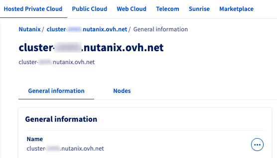{.thumbnail}

2. In the **General information** tab, you can see the **Number of nodes**. Click `Manage my nodes`{.action}.

    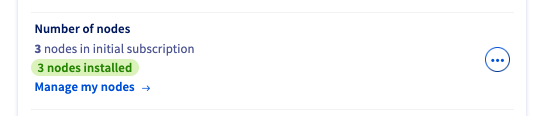{.thumbnail}

3. In the **Nodes** tab, select `Add nodes`{.action}.

    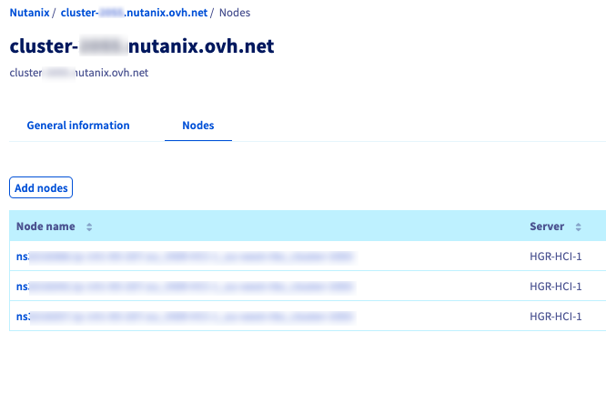{.thumbnail}

4. Review the configuration and pricing in the pop-up window, then click `Order`{.action} to add the node(s).

    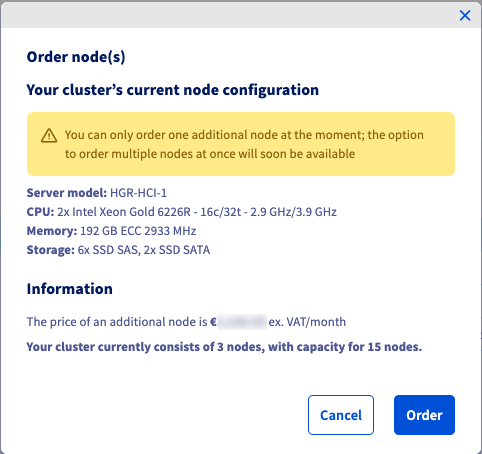{.thumbnail}

Once the node is delivered, you can see the status in the **General information** tab.

The **Number of nodes** area will show a new node to install.

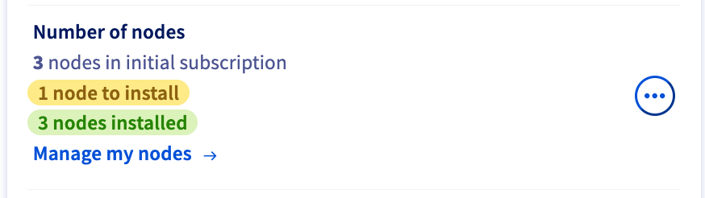{.thumbnail}

#### Install an OS

> [!tabs]
> OVHcloud Control Panel
>> If you click `Manage my nodes`{.action} again, you will see a list of your nodes. For any node with an **OS not installed** status, click the *more options* `...`{.action} button and select `Install`{.action}.
>>
>> 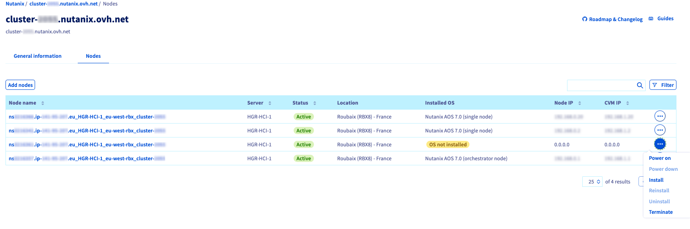{.thumbnail}
>>
>> Enter the configuration details for your node. Be sure to install the same AOS version as your cluster.
>>
>> Click  `Install`{.action}.
>>
>> 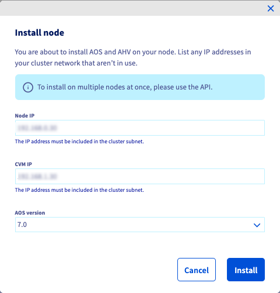{.thumbnail}
>>
>> A confirmation banner will appear.
>>
>> 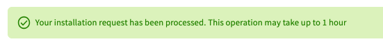{.thumbnail}
>>
> OVHcloud API
>> To install your node via the [OVHcloud API](/links/api), use this call:
>>
>> > [!api]
>> > @api {v1} /nutanix PUT /nutanix/{serviceName}/nodes/{server}/deploy
>> >
>>

Once the node has been installed, you can connect to Prism Central/Element and expand your cluster. 

Please refer to the documentation below: 

- [Expanding a Cluster through Prism Central](https://portal.nutanix.com/page/documents/details?targetId=Prism-Central-Guide-vpc_2024_3_1:mul-node-add-pc-t.html)
- [Expanding a Cluster](https://portal.nutanix.com/page/documents/details?targetId=Web-Console-Guide-Prism-v7_0:wc-cluster-expand-wc-t.html)

### Scale In (remove a node)

#### Power down a node

1. From the [OVHcloud Control Panel](/links/manager), navigate to your Nutanix cluster via the `Hosted Private Cloud`{.action} and `Nutanix`{.action} menus.

    {.thumbnail}

2. In the **General information** tab, you can see the Number of nodes. Click `Manage my nodes`{.action}.

    {.thumbnail}

3. Here, you have 2 options:

> [!tabs]
> OVHcloud Control Panel
>> For the node you wish to remove, click the *more options* `...`{.action} button and select `Power down`{.action}.
>>
>> 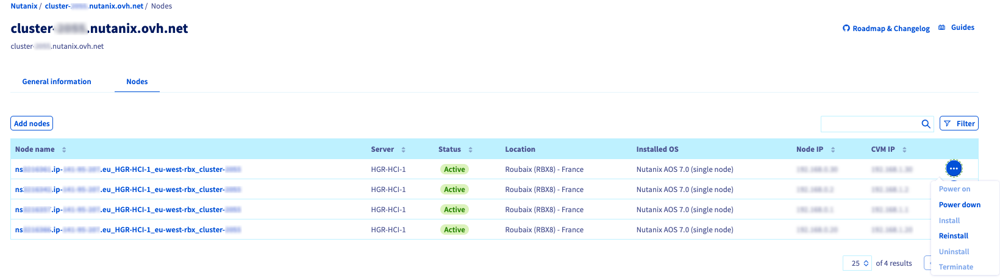{.thumbnail}
>>
>> A warning pop-up will appear. Type the required term and click `Power down`{.action}.
>>
>> > [!primary]
>> > Powering down a Nutanix node may impact your cluster. Please check the [requirements on the Nutanix portal](https://portal.nutanix.com/page/documents/list?type=software) to complete this action.
>> >
>>
>> 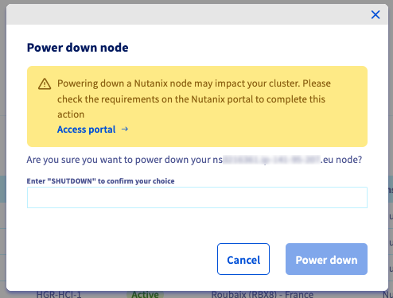{.thumbnail}
>>
>> A confirmation banner will appear.
>>
>> 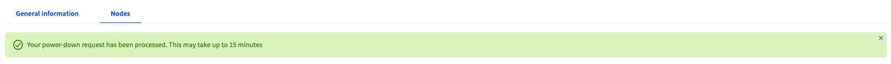{.thumbnail}
>>
> OVHcloud API
>> You can also power down your node via the [OVHcloud API](/links/api).
>>
>> - Get the Boot ID (enter *power* as the **bootType**):
>>
>> > [!api]
>> > @api {v1} /dedicated/server GET /dedicated/server/{serviceName}/boot
>> >
>>
>> - Set the Boot ID: 
>>
>> > [!api]
>> > @api {v1} /dedicated/server PUT /dedicated/server/{serviceName}
>> >
>>
>> - Power down the node:
>>
>> > [!api]
>> > @api {v1} /dedicated/server POST /dedicated/server/{serviceName}/reboot
>> >
>>

#### Uninstall the node

> [!tabs]
> OVHcloud Control Panel
>> Once the node is powered down, click the *more options* `...`{.action} button and select `Uninstall`{.action}.
>>
>> 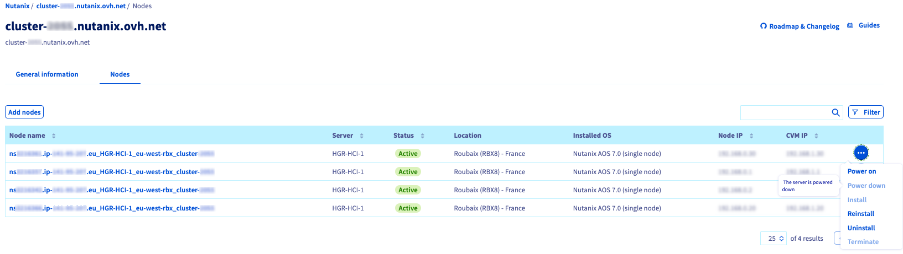{.thumbnail}
>>
>> A warning pop-up will appear. Type the required term and click `Uninstall`{.action}.
>>
>> > [!primary]
>> > Uninstalling a Nutanix node may impact your cluster. Please check the [requirements on the Nutanix portal](https://portal.nutanix.com/page/documents/list?type=software) to complete this action.
>> >
>>
>> 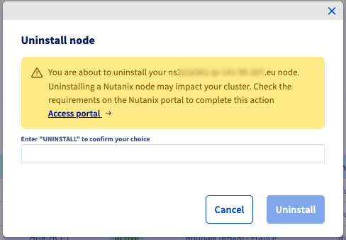{.thumbnail}
>>
>> A confirmation banner will appear.
>>
>> 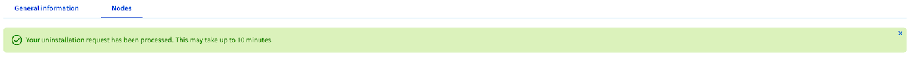{.thumbnail}
>>
> OVHcloud API
>> To uninstall your node via the [OVHcloud API](/links/api), use this call:
>>
>> > [!api]
>> > @api {v1} /nutanix POST /nutanix/{serviceName}/node/{server}/terminate
>> >
>>

#### Remove the node

Once the node is uninstalled, click the *more options* `...`{.action} button and select `Terminate`{.action}.

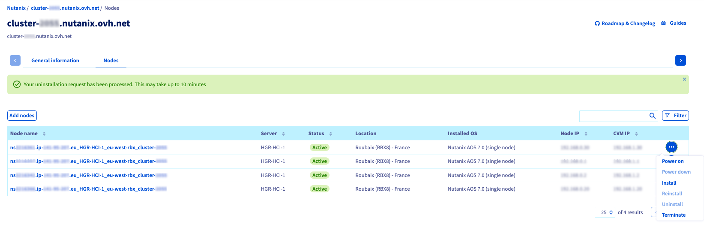{.thumbnail}

A warning pop-up will appear. Type the required term and click `Confirm`{.action}.

> [!primary]
> Your suspended service will appear in your nodes list for approximately one week before being permanently deleted. This allows you to reactivate the service if you need to reverse the deletion.

## Go further

You can go even further by reading these guides:

[Nutanix Hyperconvergence](/pages/hosted_private_cloud/nutanix_on_ovhcloud/03-nutanix-hci)

[Nutanix Node Addition Guide](https://portal.nutanix.com/page/documents/details?targetId=Web-Console-Guide-Prism-v7_0:wc-cluster-expand-wc-t.html)

If you need training or technical assistance to implement our solutions, please contact your Technical Account Manager or click on [this link](/links/professional-services) to get a quote and ask our Professional Services experts for a custom analysis of your project.

Ask questions, give your feedback and interact directly with the team building our Hosted Private Cloud services on the dedicated [Discord](https://discord.gg/ovhcloud) channel.

Join our [community of users](/links/community).