## Objectif

Ce guide décrit comment déployer et configurer **Multicloud Snapshot Technology (MST)** sur une infrastructure Nutanix on OVHcloud avec OVHcloud object storage.  
MST permet de **répliquer les snapshots** (UVM / Volume Groups) vers des stockages **S3-compatibles** pour optimiser le TCO, améliorer la mobilité des données et simplifier la reprise après sinistre (DR) via un modèle **zero-compute**.

---

## 1. Vue d'ensemble & avantages

**Fonctionnalités principales :**
- Réplication périodique de snapshots vers des buckets S3 (RPO typique : 1 heure via l’infrastructure Nutanix DR).
- Modèle **Zero-Compute** : pas besoin de maintenir des nœuds compute standby.
- Stockage des snapshots récents sur le cluster principal ; offload des snapshots plus anciens vers stockage objet.
- Restauration possible partout où tourne **Nutanix Cloud Platform (NCP)** : cloud, edge, on-prem.
- Intégration native avec **Prism Central** et les workflows DR existants.

**Bénéfices :**
- Réduction du TCO (réduction/no standby compute, stockage objet moins cher).
- Mobilité : récupération des workloads sur différents environnements NCP.
- Simplicité d’administration via Prism.

---

## 2. Prérequis

### Cluster Nutanix
- AOS 7.3 minimum 
- Prism Central 7.3 minimum

### Réseau
- Créer un **subnet dédié MST** dans Prism Element (réseau interne).
- **3 adresses IP statiques** réservées (hors plage DHCP du subnet MST).
- **4 adresses IP** depuis la plage DHCP du subnet MST (consommées par les 4 VMs MST).

### Ressources VM (typique — Instance *Small*)
- 3 × **MSP Controller VMs** : 10 vCPU / 24 GiB RAM chacune.  
- 1 × **MSP Load Balancer VM** : 2 vCPU / 4 GiB RAM.  
- **Total** : 32 vCPU et 76 GiB RAM.  

### Comptes / Accès
- Compte **administrateur** Prism Central (seul un admin peut déployer MST).  
- Accès API / credentials pour le bucket S3 avec permissions d’écriture/liste/suppression.  

### Limites fonctionnelles (Instance Small)
- Jusqu'à **2000 entités** protégées.  
- **75 Recovery Points** par entité.  
- **300 To** de données actives supportées.

---

## 3. Procédure de déploiement (pas à pas)

### Préparer l’environnement
#### Créer le container Object Storage (Bucket)
   
   Pour créer le container vous devez dans un premier temps créer un projet : [Créer votre premier projet Public Cloud - OVHcloud](https://help.ovhcloud.com/csm/fr-public-cloud-compute-create-project?id=kb_article_view&sysparm_article=KB0050614)
   
   Dans l'univers Public Cloud 
   
   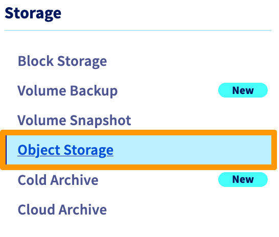{.thumbnail}
   
   créez un utilisateur, par exemple *admin-mst-gra* :

   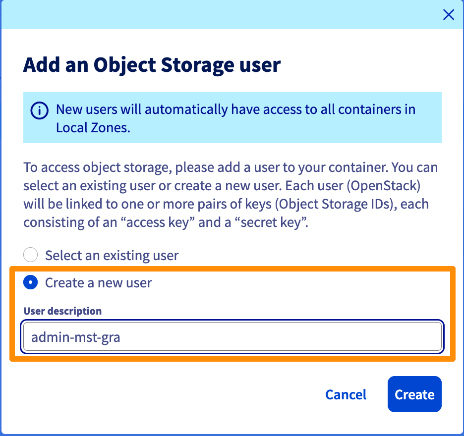{.thumbnail} 

   Notez bien les informations suivantes : 

   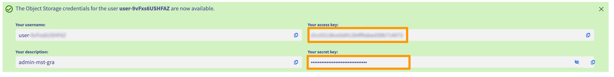{.thumbnail} 

   Créez ensuite un container (bucket) : [Object Storage - Premiers pas avec Object Storage - OVHcloud](https://help.ovhcloud.com/csm/fr-public-cloud-storage-s3-getting-started-object-storage?id=kb_article_view&sysparm_article=KB0047354)

   Dans cet exemple j'ai choisi de créer un container nommé : mst-dr-gra à Gravelines, puisque mon cluster est Roubaix. Ceci permet d'améliorer la résilience des données.

   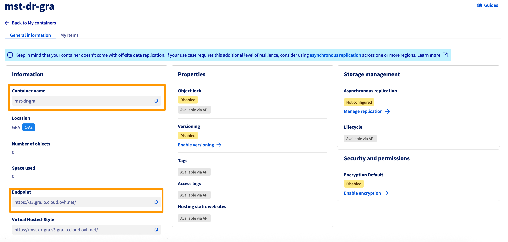{.thumbnail} 

   >Après avoir crée le container et l'utilisateur vous devez être en possession de plusieurs informations importantes pour la suite :
   >- nom de votre container : mst-dr-gra 
   >- url de l'endpoint du container : [https://s3.gra.io.cloud.ovh.net/](https://s3.gra.io.cloud.ovh.net/)
   >- l'**access key**
   >- la **secret key**

#### Activer la Market Place 

   Connectez-vous à Prism Central, puis allez dans l'admin center, cliquez ensuite sur Enable Maket Place

   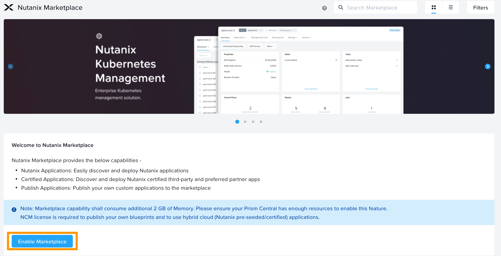{.thumbnail} 

#### Activer le _Network Controller_
   
   Dans _Infrastructure_ allez dans _Prism Central Settings_, puis _Network Controller_ 

   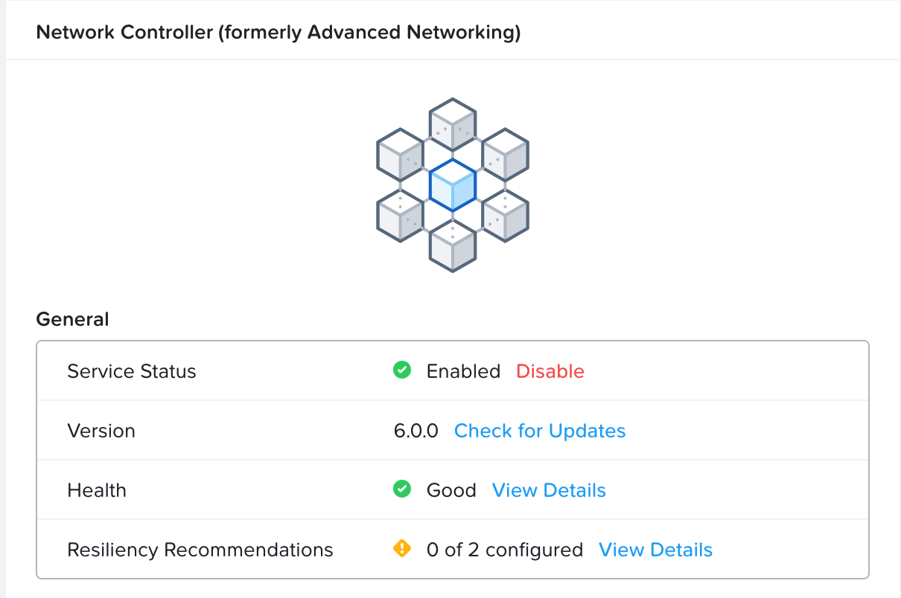{.thumbnail}
   
#### Créer un Subnet dédié à MST

   Nous allons créer un subnet de type IPAM avec un DHCP pour l'utilisation de MST.

   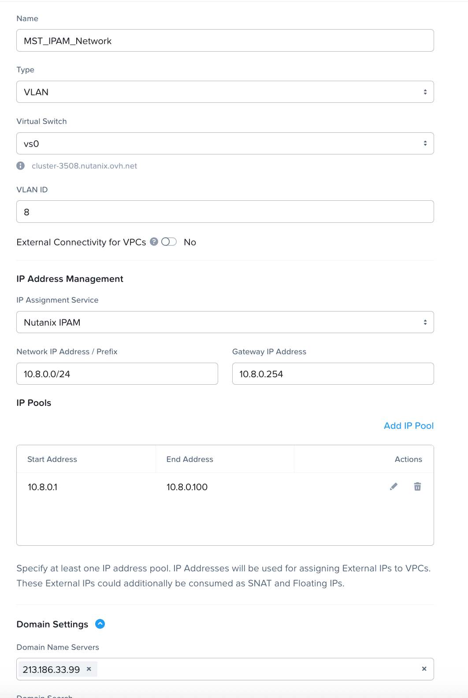{.thumbnail}

#### Reconfigurer la Gateway 

   Il est nécessaire de reconfigurer la gateway avec le nouveau réseau.

   Ajoutez un NIC à votre VM :

   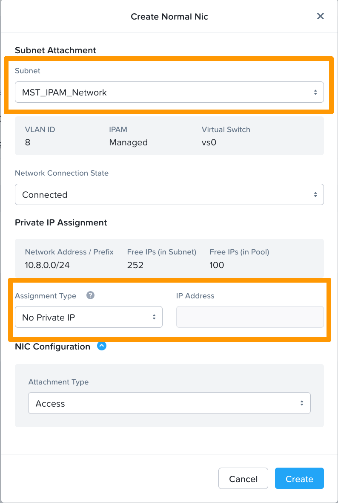{.thumbnail}

   Reconfigurez ensuite votre gateway avec l'ip définie dans la création du réseau IPAM.
   Sur ma vm alpine :

   {.thumbnail}

   j'ajoute :

   ```bash
   auto eth3
   iface eth3 inet static
   address 10.8.0.254
   netmask 255.255.255.0
   ```

   redémarrage des services réseau :

   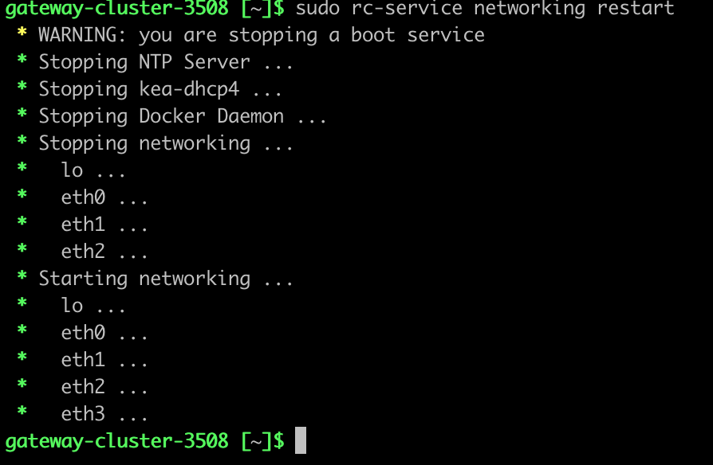{.thumbnail} 

### Déployer Multicloud Snapshot Technology

   Se connecter à *Prism Central* en tant qu’**administrateur**.  
   Aller dans **Admin Center → Marketplace**.
   Dans *Nutanix Apps*, cliquer sur **Get** pour *Multicloud Snapshot Technology*.

   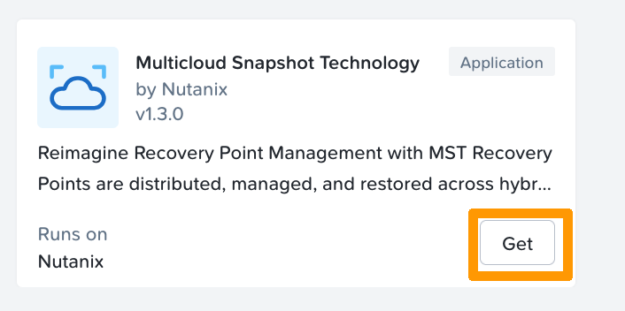{.thumbnail}  
   
   Sur la page d’introduction, cliquer **Deploy**.

   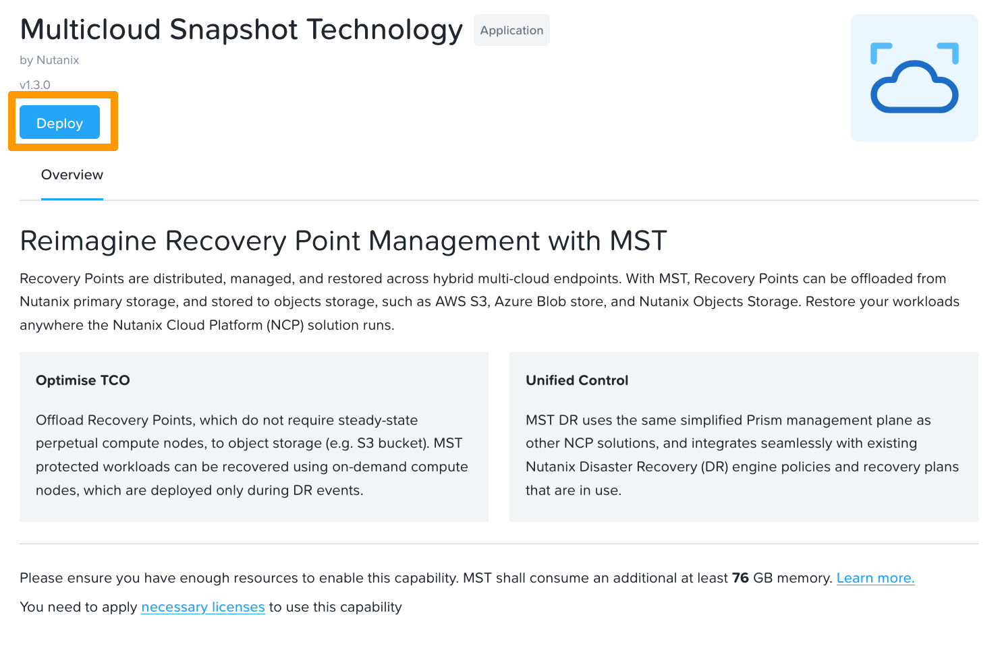{.thumbnail} 

   Configurer ensuite l’instance MST :
   - **MST Instance Size** : sélectionner `Small` (ou autre taille si disponible).  
   - **Cluster Details** : choisir le Prism Element cluster cible.  
   - **Network Configuration** : sélectionner le subnet MST créé.  
   - **Entrer les 3 IP statiques** réservées (champs prévus).  

   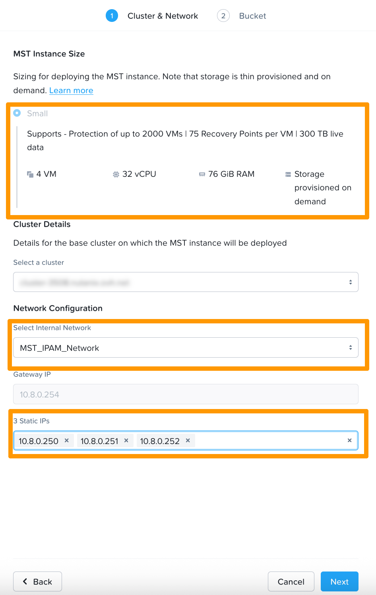{.thumbnail}

   - **Object Store Provider** : sélectionner `Nutanix Object Store`
   - **Object Store Endpoint** : indiquer le endpoint url de votre container, dans notre exemple [https://s3.gra.io.cloud.ovh.net/](https://s3.gra.io.cloud.ovh.net/) 
   - **Bucket Name** : indiquer le nom de votre container, dans notre exemple mst-dr-gra
   - **Access Key** : indiquer l'`Access Key` de votre container
   - **Secret Key** : indiquer la`Secret Key` de votre container

  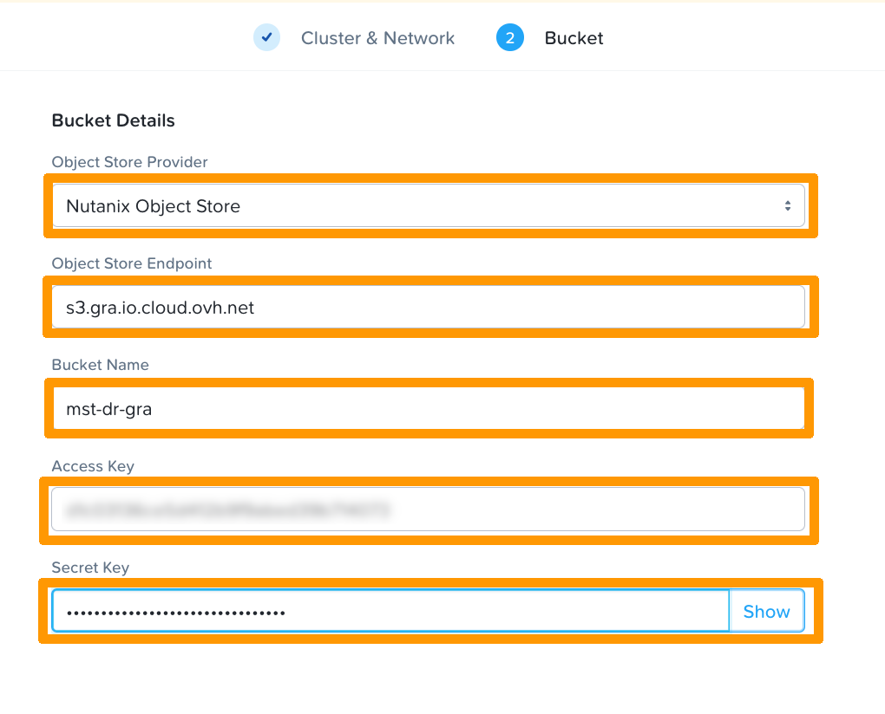{.thumbnail} 

  Lancer le déploiement.  

  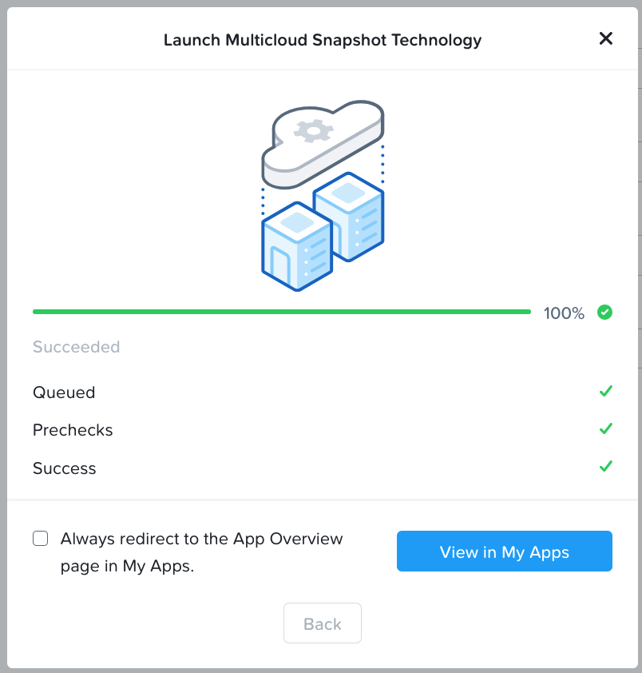{.thumbnail} 

## 4. Disaster Recovery : utilisation et configuration
Une fois MST déployé et connecté à votre bucket Object Storage, vous pouvez configurer la protection et la restauration de vos workloads.

### Protection des entités
- **Étapes :**
  1. Depuis **Prism Central**, accéder à **Protection Policies**, puis créer une politique de protection.

  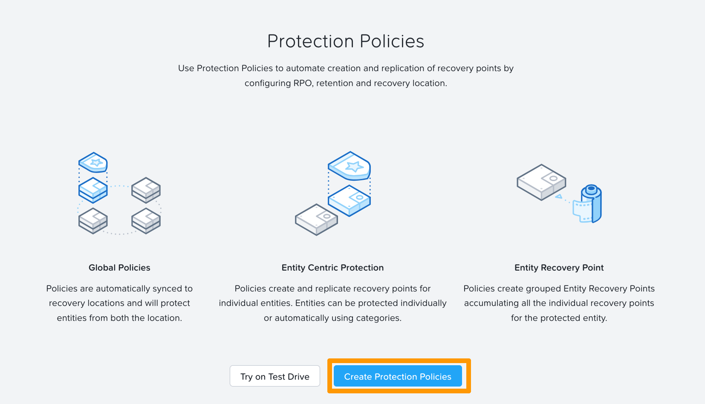{.thumbnail} 

  2. Définissez le policy name, le primary location : votre cluster, dans le Recovery Location gardez Local AZ et sélectionnez le container (Bucket) précédemment configuré.

  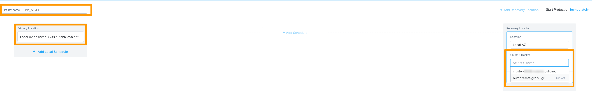{.thumbnail} 
   
  3. Définissez une planification (Add Schedule)  :
     - fréquence de création de snapshots (par défaut toutes les heures).
     - Le nombre de Recovery Points à conserver localement.
     - Le nombre de Recovery Points à conserver sur le **container S3 OVHcloud**.

  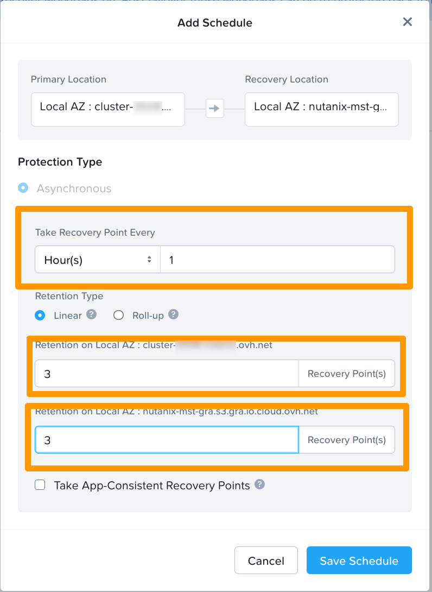{.thumbnail} 

  4. Protéger les vms
     - Selectionnez les vms à protéger puis dans action, data protection cliquez sur _Protect_

     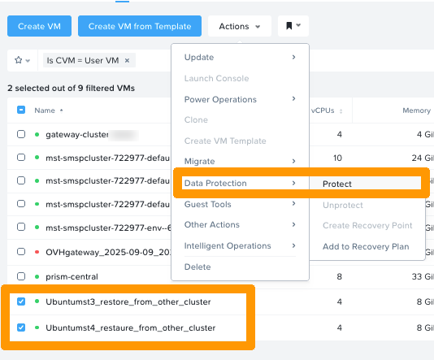{.thumbnail}

     - selectionnez ensuite la _Protection policy_ précédement crée

     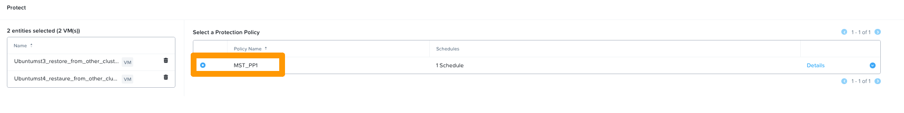{.thumbnail}

### Restauration
- Depuis **Prism Central, Data Protection, VM Recovery Points **, choisir un **Recovery Point** disponible dans le bucket.

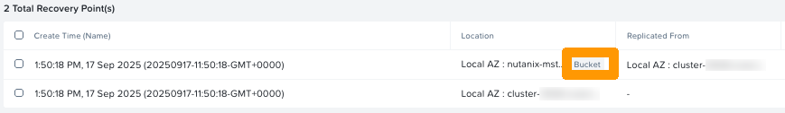{.thumbnail}

### Cas d’usage typiques
- **Reprise après sinistre (DR)** : perte totale du cluster source → déploiement des VMs sur un autre cluster Nutanix relié au même bucket OVHcloud.  
- **Migration de workloads** : déplacer une application vers un autre site (edge ou cloud) en important les snapshots depuis le bucket.  

---


## Aller plus loin <a name="gofurther"></a>

Si vous avez besoin d'une formation ou d'une assistance technique pour la mise en oeuvre de nos solutions, contactez votre commercial ou cliquez sur [ce lien](/links/professional-services) pour obtenir un devis et demander une analyse personnalisée de votre projet à nos experts de l’équipe Professional Services.

Échangez avec notre [communauté d'utilisateurs](/links/community).

[Nutanix Reimagines Business Continuity for Hybrid Multicloud Users](https://www.nutanix.com/blog/nutanix-reimagines-business-continuity-for-hybrid-multicloud-users)
[Cloud Clusters (NC2) Hosted - Deploying Multicloud Snapshot Technology](https://portal.nutanix.com/page/documents/details?targetId=Nutanix-Clusters-AWS:aws-cluster-protect-deploying-mst-t.html)
