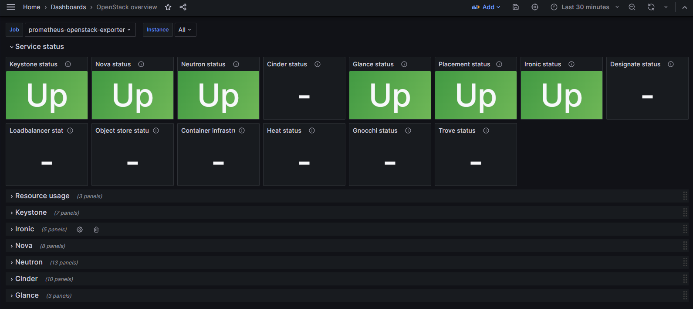
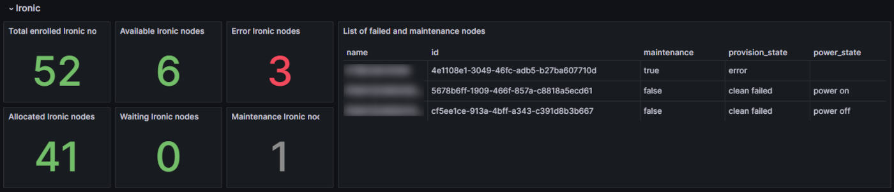
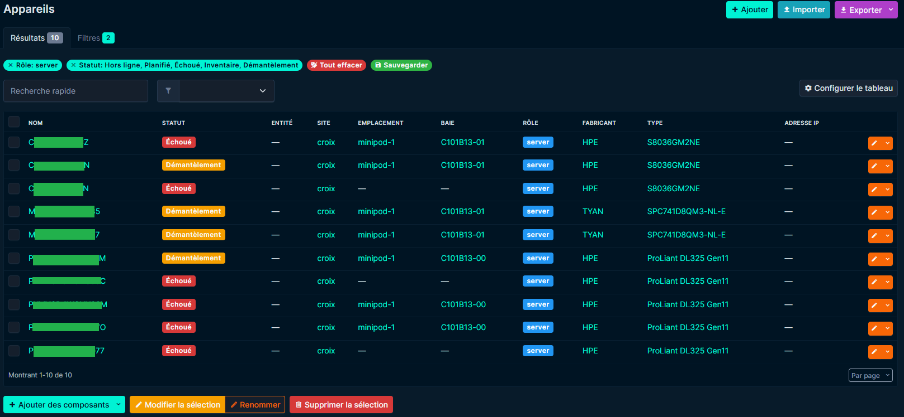
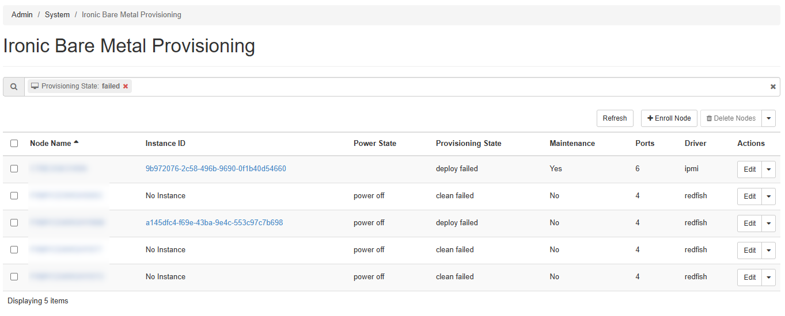

## Objective

This guide explains how to view the hardware inventory, consumed resources, and available resources on an **OVHcloud On-Prem Cloud Platform (OPCP)** using:

- **Grafana**: real-time infrastructure monitoring
- **NetBox**: physical and logical inventory
- **OpenStack Horizon**: Ironic inventory via Horizon
- **OpenStack CLI**: Ironic inventory via CLI

> [!primary]
> 
> In OpenStack, a node corresponds to a physical server in the OPCP rack.
>
> In this guide, the term **node** is therefore used to refer to a physical server.

## Prerequisites

- Be an administrator of the [OPCP](/links/hosted-private-cloud/onprem-cloud-platform) infrastructure and have access to the administration interface `admin.dashboard`.
- Have **[OpenStack CLI configured](/pages/hosted_private_cloud/opcp/how-to-use-api-and-get-credentials)** with the required permissions (`clouds.yaml` or environment variables).

## Instructions

### 1. Inventory and monitoring via Grafana

Grafana provides a real-time monitoring view and allows you to easily track changes in your OPCP infrastructure.

#### 1.1 Access the Home dashboard

1. Log in to the administration URL `admin.dashboard`.
2. Click **Grafana**.
3. Click **Dashboards** and search for the **OpenStack overview** dashboard.

You should see a dashboard similar to the following image:

{.thumbnail}

#### 1.2 Understanding the OpenStack overview dashboard

The dashboard allows you to visualize:

- OpenStack service status: **Service status**
- Resource usage: **Resource usage**
- A detailed view of the Keystone service: **Keystone**
- A detailed view of the Ironic service: **Ironic**
- A detailed view of the Nova service: **Nova**
- A detailed view of the Neutron service: **Neutron**
- A detailed view of the Cinder service: **Cinder**
- A detailed view of the Glance service: **Glance**

#### 1.3 Understanding and using the Ironic section

We will focus on the "Ironic" section, as this is where you can see the status of the different nodes.

{.thumbnail}

This section allows you to view:

- Total number of nodes: **Total enrolled Ironic nodes**
- Number of available nodes not in maintenance: **Available Ironic nodes**
- Number of nodes in error: **Error Ironic nodes**
- List of nodes in error or maintenance: **List of failed and maintenance nodes**
- Number of allocated nodes: **Allocated Ironic nodes**
- Number of waiting nodes: **Waiting Ironic nodes**
- Number of nodes in maintenance: **Maintenance Ironic nodes**

### 2. Hardware and logical inventory with NetBox

NetBox is the reference tool for managing the physical, network, and logical inventory of your infrastructure.

The NetBox inventory is automatically populated; no manual action is required to add or modify nodes.

#### 2.1 Access NetBox

1. Log in to the administration URL `admin.dashboard`.
2. Click **NetBox**.

#### 2.2 View the node inventory

In **Devices**, you can see the complete list of equipment in your OPCP rack (nodes, network equipment, etc.).

You can:

- use the quick search to find an item by name;
- use **Filters** for advanced searches.

For example, you can list all non-production nodes by applying the following filters:

- **Status**: Decommissioned, Inventory, Failed, Planned
- **Role**: server

{.thumbnail}

You can save the search to reuse it later.

### 3. OpenStack Horizon – Ironic UI

#### 3.1 Access the Ironic interface

1. Log in to the administration URL `admin.dashboard`
2. Click **Horizon**
3. Click **Admin**
4. Click **System**, then **Ironic Bare Metal Provisioning**

#### 3.2 List all nodes

In **Ironic Bare Metal Provisioning**, you can see all nodes.

You can filter nodes by their status, for example: `Provisioning State = failed`.

{.thumbnail}

### 4. Resource status via OpenStack CLI

The OpenStack CLI allows you to obtain the **real-time** status of allocated and available resources.

#### 4.1 List all nodes

```bash
openstack baremetal node list
```

**Example output:**

```bash
+--------------------------------------+----------------+--------------------------------------+-------------+--------------------+-------------+
| UUID                                 | Name           | Instance UUID                        | Power State | Provisioning State | Maintenance |
+--------------------------------------+----------------+--------------------------------------+-------------+--------------------+-------------+
| 88830859-5b16-4935-8f41-d381b754cbe5 | SERVER-1       | None                                 | power off   | available          | False       |
| 726bb7e9-3b20-4a44-99d7-2af747983781 | SERVER-2       | None                                 | power off   | available          | False       |
| af711edf-a579-491e-b474-3c03639ed99b | SERVER-3       | 83b7083b-bbdd-4327-941c-ee91197818c5 | power on    | active             | False       |
+--------------------------------------+----------------+--------------------------------------+-------------+--------------------+-------------+
```

#### 4.2 Filter nodes

You can filter results using **--provision-state** to view nodes in a specific state, or **--maintenance** to view nodes in maintenance.

All available filters can be found using `--help`.

**Example output:**

```bash
$ openstack baremetal node list --provision-state "clean failed"
+--------------------------------------+----------------+---------------+-------------+--------------------+-------------+
| UUID                                 | Name           | Instance UUID | Power State | Provisioning State | Maintenance |
+--------------------------------------+----------------+---------------+-------------+--------------------+-------------+
| 37f96160-16cf-47e6-8bee-0ee42a59fafe | SERVER-1       | None          | power off   | clean failed       | False       |
| 5678b6ff-1909-466f-857a-c8818a5ecd61 | SERVER-2       | None          | power off   | clean failed       | False       |
| cf5ee1ce-913a-4bff-a343-c391d8b3b667 | SERVER-3       | None          | power off   | clean failed       | False       |
+--------------------------------------+----------------+---------------+-------------+--------------------+-------------+
```

```bash
$ openstack baremetal node list --maintenance
+--------------------------------------+--------------+--------------------------------------+-------------+--------------------+-------------+
| UUID                                 | Name         | Instance UUID                        | Power State | Provisioning State | Maintenance |
+--------------------------------------+--------------+--------------------------------------+-------------+--------------------+-------------+
| 4e1108e1-3049-46fc-adb5-b27ba607710d | SERVER-4     | 9b972076-2c58-496b-9690-0f1b40d54660 | None        | deploy failed      | True        |
+--------------------------------------+--------------+--------------------------------------+-------------+--------------------+-------------+
```

#### 4.3 Node details

To retrieve all information about a node, for example to identify the last error and understand why the deployment failed:

```bash
openstack baremetal node show <node-id>
```

## Go further

If you need training or technical assistance for the implementation of our solutions, contact your sales representative or click [this link](/links/professional-services) to request a quote and have your project analyzed by our Professional Services team experts.

Join our [community of users](/links/community).