## Objectif

Avant de pouvoir déployer des services sur vos baies **OPCP**, il est nécessaire de disposer d’une instance installée et active.

**Ce guide détaille les étapes à suivre pour installer une instance OPCP à partir de l’interface Horizon**.

## Prérequis

- Disposer d'un service [OPCP](/links/hosted-private-cloud/onprem-cloud-platform) actif.
- Posséder un **compte utilisateur** avec les droits suffisants pour se connecter à Horizon sur l’offre OPCP.

## En pratique

### 1. Connexion à Horizon

Connectez-vous à l’interface **Horizon** de votre environnement OPCP.  
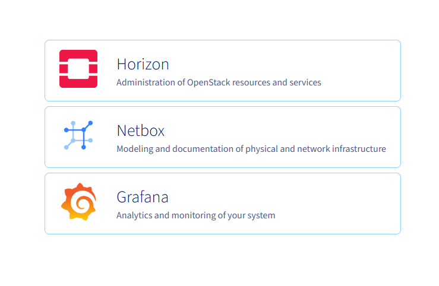{.thumbnail}

Une fois connecté, sélectionnez le **projet** dans lequel vous souhaitez installer votre instance.  
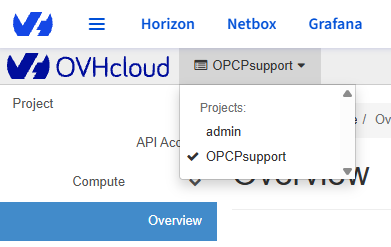{.thumbnail}

### 2. Création d’un réseau privé

Avant de déployer votre instance, il est généralement nécessaire de créer un **réseau privé** afin qu’il soit accessible au sein de votre infrastructure locale.

Dans le menu de gauche, cliquez sur `Network`{.action}, puis sur `Networks`{.action}.  
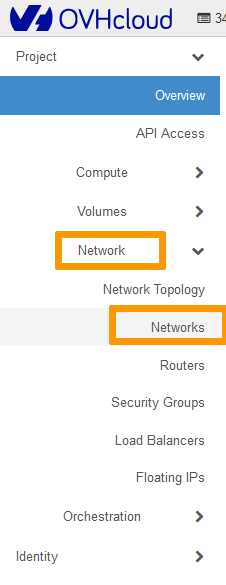{.thumbnail}

Cliquez sur `Create Network`{.action}.  
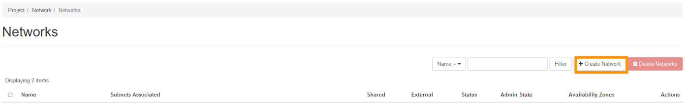{.thumbnail}

> [!tabs]
> **Network**
>>
>> 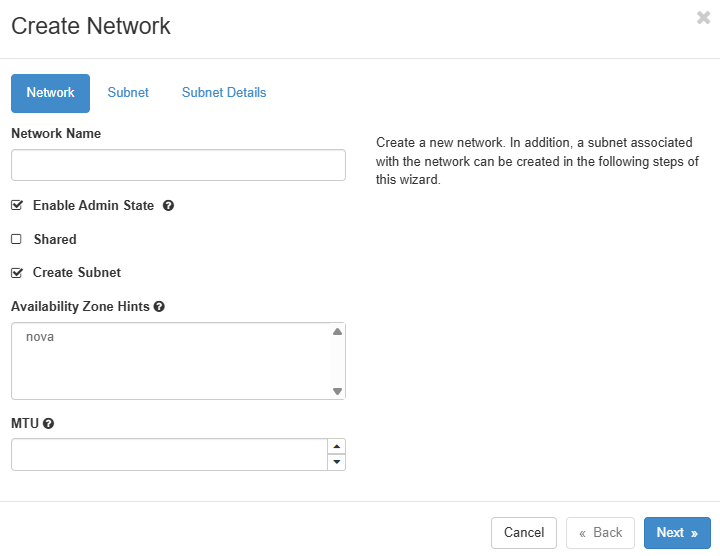{.thumbnail}
>>
>> | Champ | Description |
>> |--------|--------------|
>> |**Network Name**|Saisissez un nom pour votre réseau.|
>> |**Enable Admin State**|Laissez cette option cochée pour activer le réseau.|
>> |**Shared**|Cochez cette case si vous souhaitez rendre le réseau disponible pour plusieurs projets.|
>> |**Create Subnet**|Laissez cette option cochée pour créer un sous-réseau.|
>> |**Availability Zone Hints**|Laissez la valeur par défaut.|
>>
> **Subnet**
>>
>> 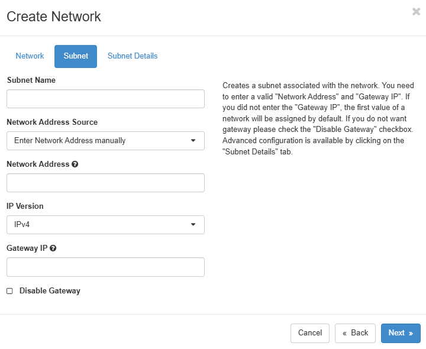{.thumbnail}
>>
>> > [!primary]
>> >  Bien qu’il soit possible de créer un réseau sans sous-réseau, celui-ci ne pourra pas être attaché à une instance s'il n'a pas de sous-réseau.
>> >
>>
>> | Champ | Description |
>> |--------|--------------|
>> |**Subnet Name**|Entrez un nom pour votre sous-réseau.|
>> |**Network Address**|Définissez une plage d’adresses privées, par exemple `192.168.100.0/24`.|
>> |**IP Version**|Laissez la valeur par défaut **IPv4**.|
>> |**Gateway IP**|Optionnel. Si non renseignée, une adresse sera sélectionnée automatiquement.|
>> |**Disable Gateway**|Cochez cette case pour ne pas attribuer d’adresse passerelle.|
>>
> **Subnet Details**
>>
>> 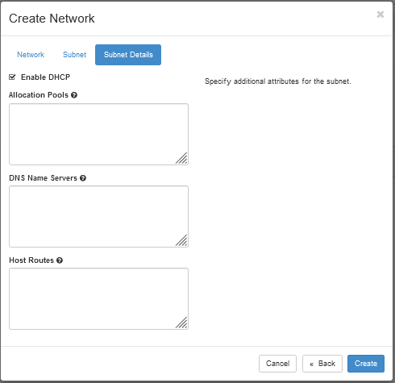{.thumbnail}
>>
>> | Champ | Description |
>> |--------|--------------|
>> |**Enable DHCP** |Laissez activé si vous souhaitez que les adresses IP soient attribuées automatiquement.|
>> |**Allocation Pools** |Optionnel. Permet de définir une plage d’adresses IP spécifique.|
>> |**DNS Name Servers** |Optionnel. Permet de spécifier un ou plusieurs serveurs DNS.|
>> |**Host Routes** |Optionnel. Permet d’ajouter des routes statiques.|

### 3. Création d’une instance

Dans le menu de gauche, cliquez sur `Compute`{.action}, puis sur `Instances`{.action}.  
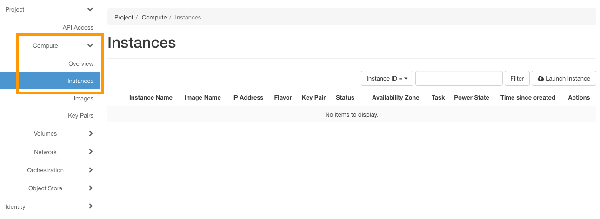{.thumbnail}

Cliquez sur `Launch Instance`{.action} pour lancer la création d’une nouvelle instance.  
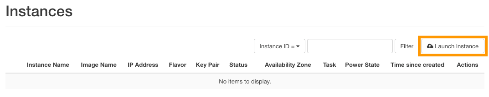{.thumbnail}

#### Onglet : Details

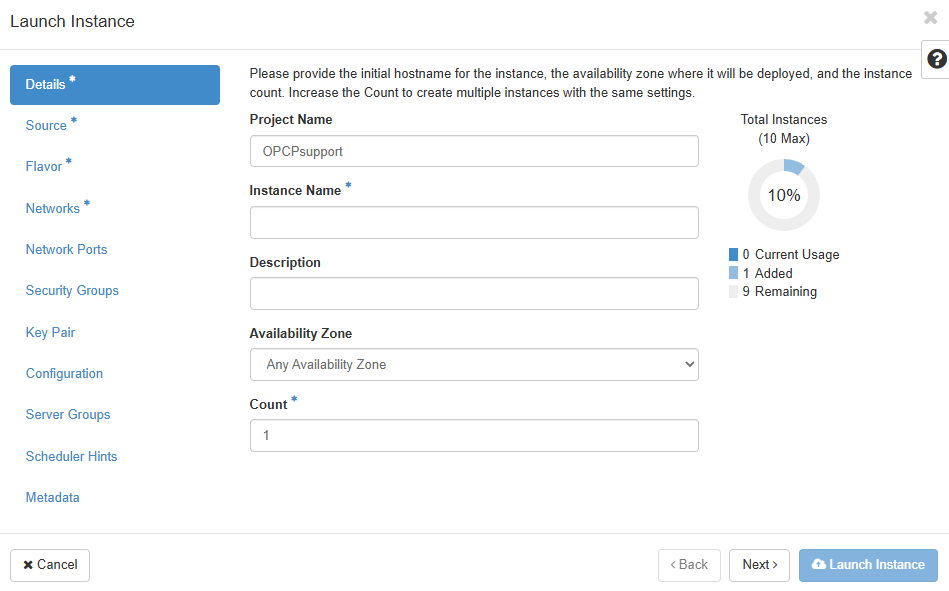{.thumbnail}

| Champ | Description |
|--------|--------------|
|**Instance Name**|Saisissez le nom de l'instance à créer.|
|**Description** |Optionnel. Ajoutez une description si nécessaire.|
|**Availability Zone** |Laissez la valeur par défaut **nova**.|
|**Count**|Indiquez le nombre d'instances à déployer.|

#### Onglet : Source

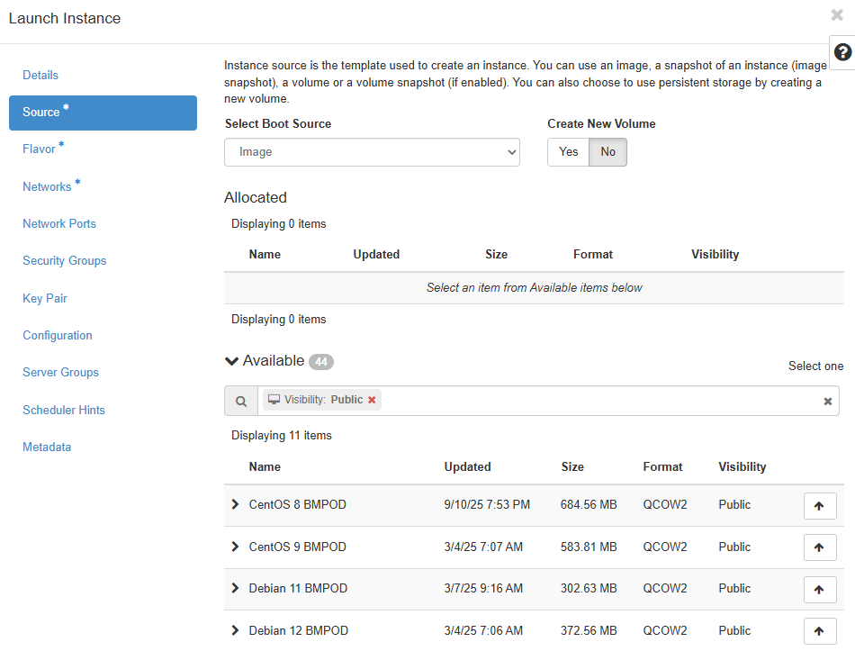{.thumbnail}

| Champ | Description |
|--------|--------------|
|**Boot Source**|Sélectionnez la source de démarrage : *Image* ou *Instance Snapshot*.|
|**Image Name**|Choisissez l’image à utiliser (ex. : *Debian 12 BMPOD*).|

#### Onglet : Flavor

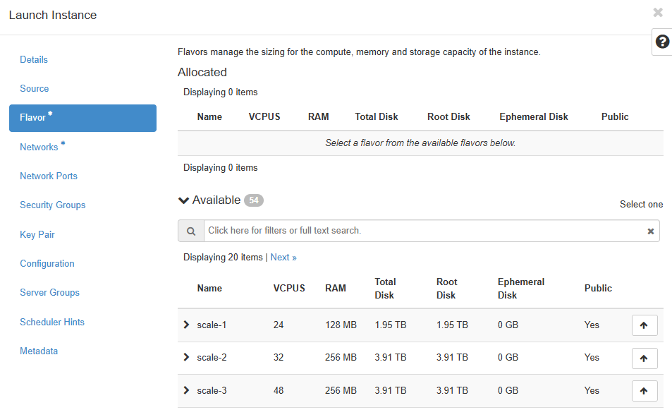{.thumbnail}

Sélectionnez la **configuration matérielle** adaptée (vCPU, mémoire, stockage).

#### Onglet : Networks

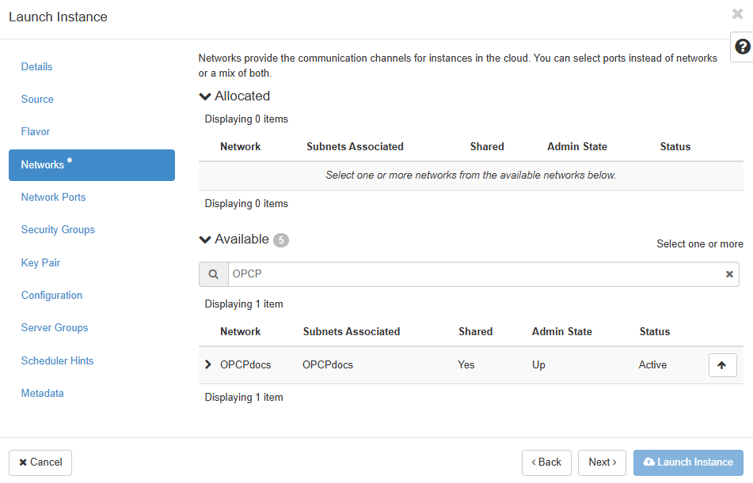{.thumbnail}

Sélectionnez le **réseau privé** précédemment créé. Vous pouvez également attacher un **port réseau** existant depuis l’onglet *Network Ports*.

### 4. Gestion des paires de clés SSH

> [!warning]
> Bien que la sélection d’une clé SSH ne soit pas obligatoire dans Horizon, elle est **indispensable pour se connecter à l'instance** une fois celui-ci créé.  

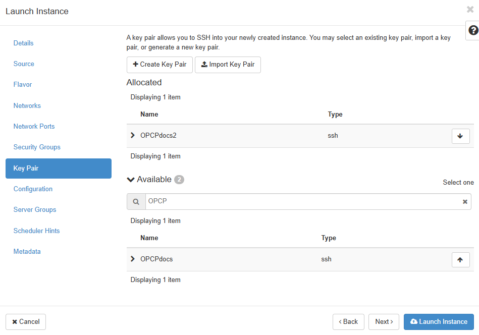{.thumbnail}

> [!tabs]
> **Créer une nouvelle paire de clés**
>>
>> Cliquez sur `+ Create Key Pair`{.action} et renseignez les champs suivants :
>>
>> | Champ | Description |
>> |--------|--------------|
>> |**Key Pair Name**| Saisissez un nom pour la clé.|
>> |**Key Type**| Sélectionnez **SSH Key**.|
>>
>> Cliquez sur `Create Keypair`{.action}.  
>> Copiez la clé privée avec **Copy Private Key to Clipboard**, puis cliquez sur `Done`{.action}.  
>> 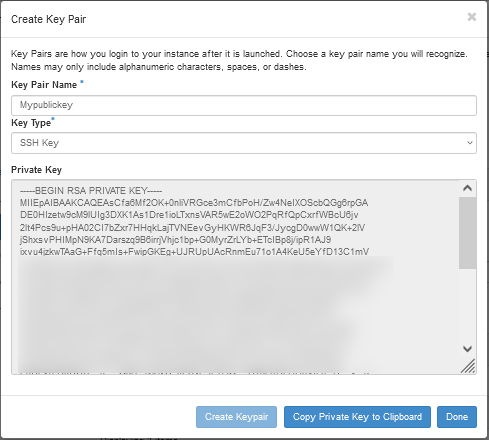{.thumbnail}
>>
>> La clé est désormais sélectionnée par défaut. Cliquez sur `Launch Instance`{.action} pour démarrer la création de l'instance.  
>> {.thumbnail}
>>
> **Importer une clé existante**
>>
>> Cliquez sur `Import Key Pair`{.action} et renseignez les champs suivants :
>>
>> | Champ | Description |
>> |--------|--------------|
>> |**Key Pair Name**|Nom de la clé.|
>> |**Key Type**|Sélectionnez **SSH Key**.|
>> |**Public Key**|Collez votre clé publique ou importez le fichier correspondant.|
>>
>> Cliquez sur `Import Key Pair`{.action}.   
>> 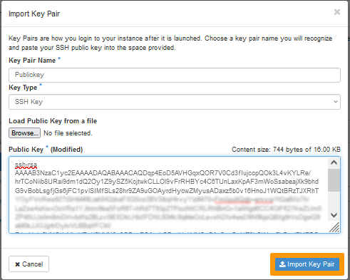{.thumbnail}
>>
>> La clé est désormais sélectionnée par défaut. Cliquez sur `Launch Instance`{.action} pour démarrer la création de l'instance.  
>> 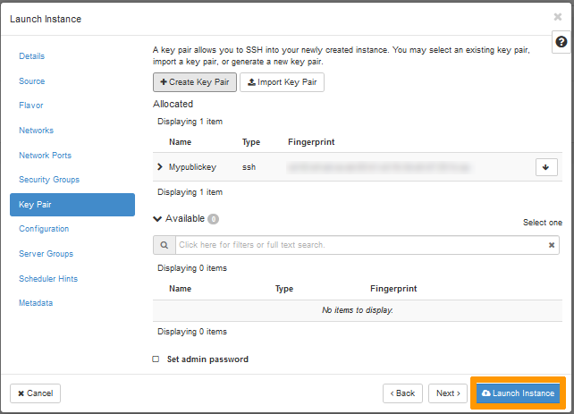{.thumbnail}
>>

### 5. Autres options

Les autres onglets de configuration (Security Groups, Configuration, Metadata, etc.) ne sont pas nécessaires pour une installation standard. 
Pour aller plus loin, consultez la [documentation officielle OpenStack](https://docs.openstack.org/).

### 6. Références

- [OpenStack Official Documentation – Horizon](https://docs.openstack.org/horizon/latest/)
- [OpenStack Networking Guide (Neutron)](https://docs.openstack.org/neutron/latest/)
- [OpenStack Compute Guide (Nova)](https://docs.openstack.org/nova/latest/)
- [OpenStack Key Pairs](https://docs.openstack.org/nova/latest/user/ssh-keys.html)
- [Debian 12 Official Site](https://www.debian.org/releases/book/)

## Aller plus loin

Échangez avec notre [communauté d'utilisateurs](/links/community).