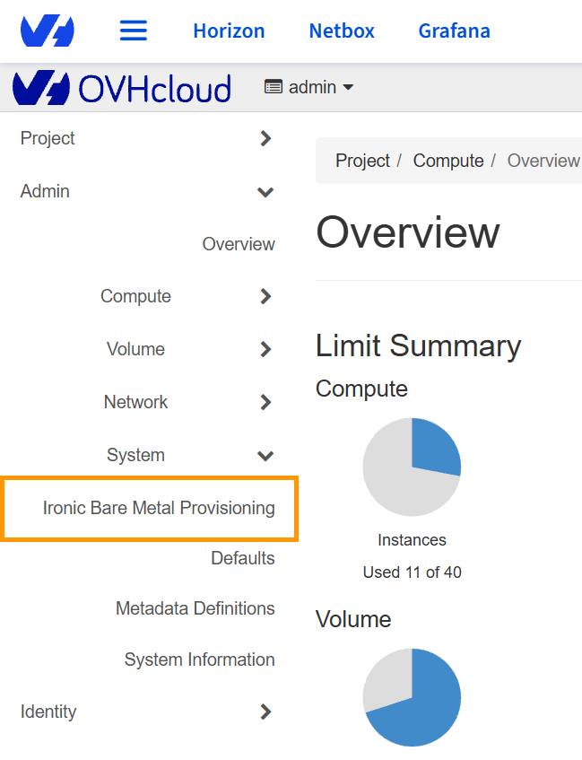
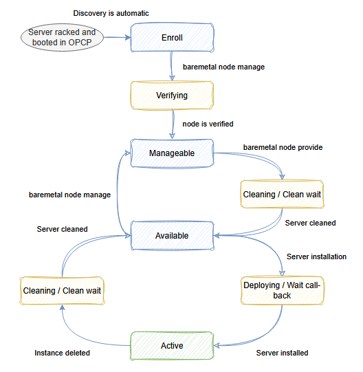
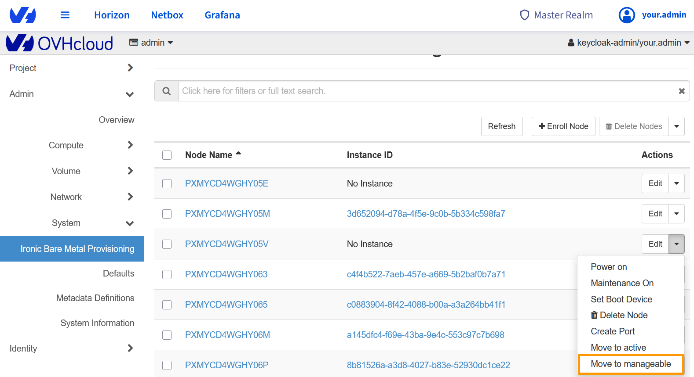
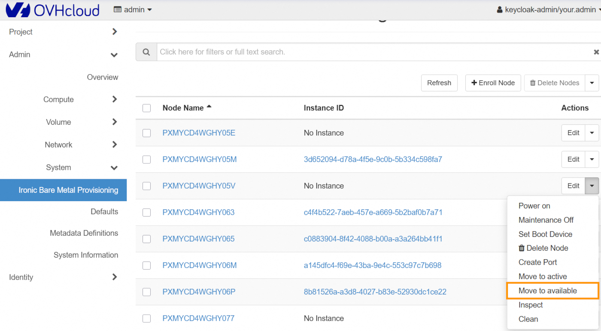
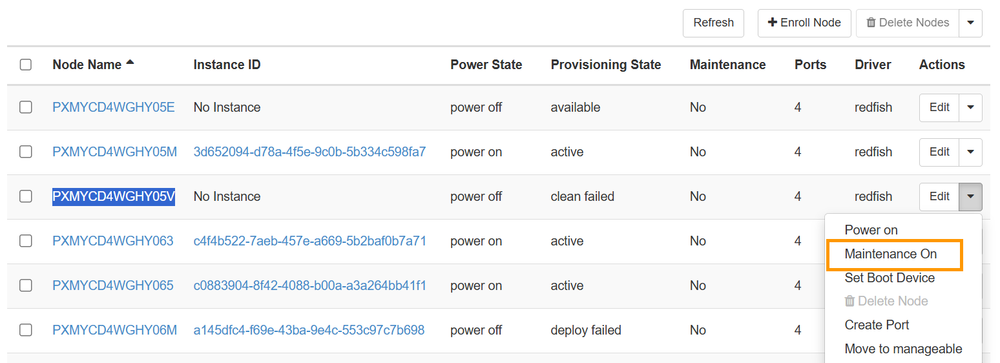
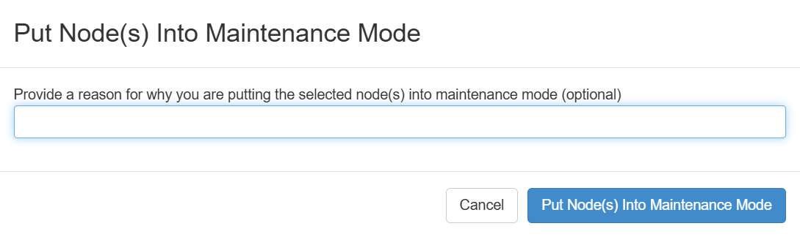
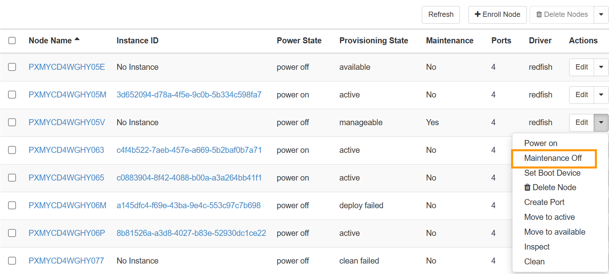

## Objective

This guide details the different statuses of a node in an OPCP rack and how to modify them.  
A node in OpenStack represents the configuration of a physical server in the OPCP rack. It must be distinguished from instances, which represent the operating system running on a node.

## Prerequisites

- Have an active [OPCP](/links/hosted-private-cloud/onprem-cloud-platform) service.
- Have a user account with admin rights to log in to Horizon on the OPCP offering.
- (Optional) Have access to the OpenStack APIs for your project.
- (Optional) Have installed the Ironic client.

## In practice

Log in to the Horizon interface of your OPCP on the admin project.

{.thumbnail}

If you want to follow the OpenStack API section, you will need to install the Ironic packages on your environment:

```bash
pip install python-ironicclient
```

### Check the status of a node

You can check the status of a node directly from Horizon via the `Admin` > `System` > `Ironic Bare Metal Provisioning` tab:

{.thumbnail}

You will find the list of your nodes and their various statuses.

From the OpenStack APIs, you can retrieve the same list using the following command:

```bash
baremetal node list
```

You can also check the status of a specific node:

```bash
baremetal node show $BAREMETAL_NODE_ID
```

### Possible statuses

|Status|Description|
|---|---|
|Enroll|First state of the node when it has been automatically discovered by OPCP. The server has not yet been validated and must be manually transitioned to `Manageable`.|
|Manageable|The node has been verified and is managed by Ironic, but it is not yet installable. The node must be moved to the `Available` state before it can be deployed.|
|Available|The node is available and can be installed.|
|Active|The node is installed and has an active instance on it.|
|Verifying|Transitional state when a node moves from `Enroll` to `Manageable`. Ironic verifies it can manage the node using the drivers and hardware properties configured during control-plane discovery.|
|Cleaning / Clean-wait|Transitional state when an instance is deleted or when leaving the `Manageable` state before becoming `Available` again. Disks are wiped during this step.|
|Deploying / Wait call-back|Transitional state when the node is being deployed.|

You can find detailed explanations for the different statuses in the [official OpenStack documentation](https://docs.openstack.org/ironic/7.0.1/api/ironic.common.states.html).

### Node lifecycle

{.thumbnail}

When a node is installed and booted in an OPCP rack, its discovery is automatically performed by the control plane. At this moment, the node retrieves its properties and **traits** based on its hardware profile.

Once the node is in the `Enroll` state, you can change its state so that it is managed by Ironic.

*From the Horizon interface:*

{.thumbnail}

*From the OpenStack APIs:*

```bash
baremetal node manage $BAREMETAL_NODE_ID
```

To make the node available for installation, it must then be transitioned to the `Available` state:

*From the Horizon interface:*

{.thumbnail}

*From the OpenStack APIs:*

```bash
baremetal node provide $BAREMETAL_NODE_ID
```

The node then transitions to the `Cleaning` state before reaching `Available`, making it deployable by the various projects in your OPCP environment.

### Maintenance mode

This mode can be enabled to ensure a node cannot be used for installation, even if it is in the `Available` state.

*From the Horizon interface:*

{.thumbnail}

When enabling maintenance, you may specify a reason so that the team responsible for the nodes has the information. This reason is optional.

{.thumbnail}

Once your maintenance operations are complete, you can disable maintenance:

{.thumbnail}

*From the OpenStack APIs:*

```bash
baremetal node maintenance set $BAREMETAL_NODE_ID --reason "Maintenance reason"
```

You can then retrieve the maintenance status and the reason using the following command:

```bash
baremetal node show $BAREMETAL_NODE_ID
```

You will find the following lines:

```bash
| maintenance              | True
| maintenance_reason       | "Maintenance reason"
```

To remove the node from maintenance, use the command:

```bash
baremetal node maintenance unset $BAREMETAL_NODE_ID
```

### References

- [OpenStack Official Documentation - Horizon](https://docs.openstack.org/horizon/latest/)
- [OpenStack Ironic States](https://docs.openstack.org/ironic/7.0.1/api/ironic.common.states.html)
- [OpenStack Ironic Troubleshooting - Maintenance](https://docs.openstack.org/ironic/latest/install/troubleshooting.html)
