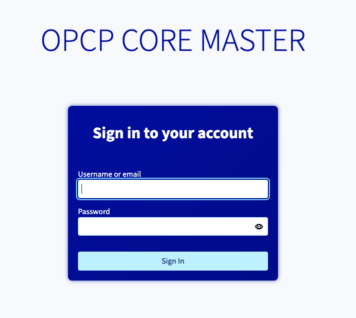
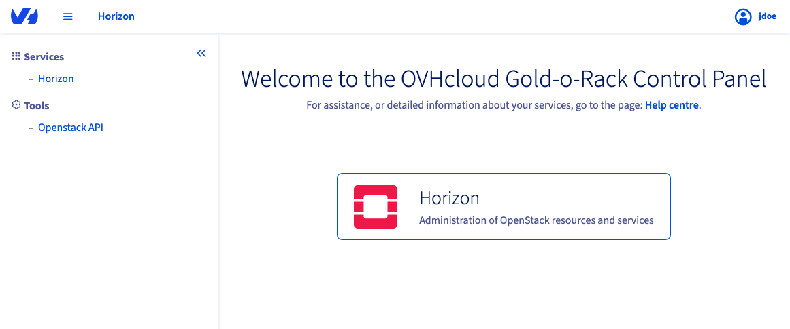
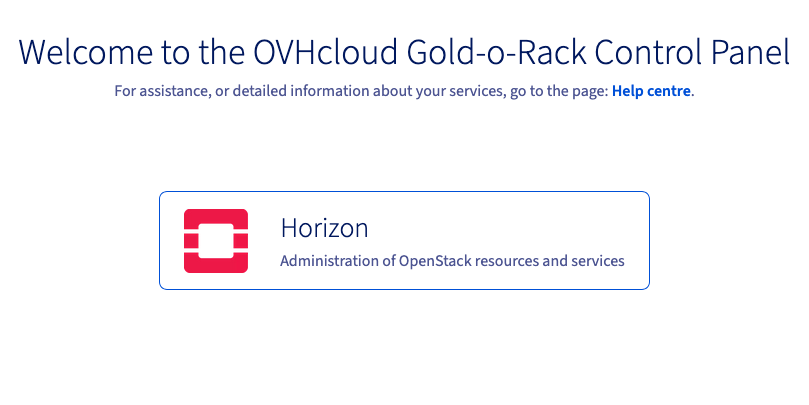
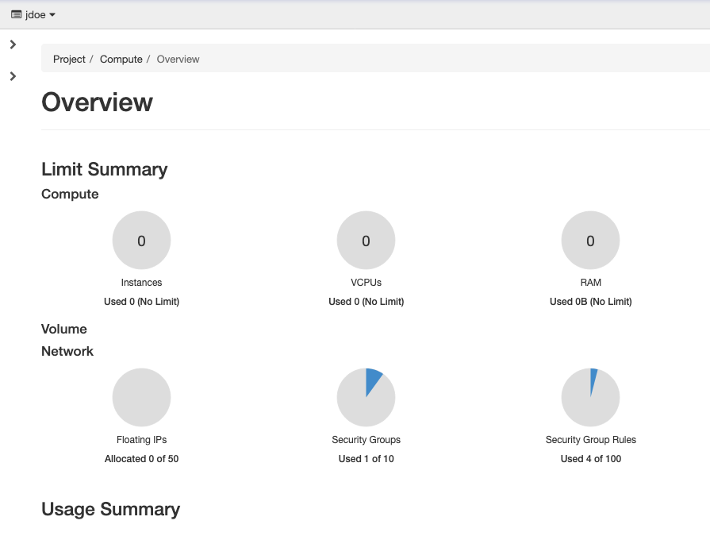
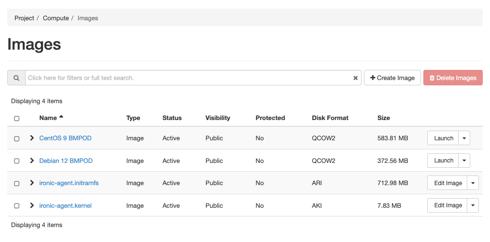
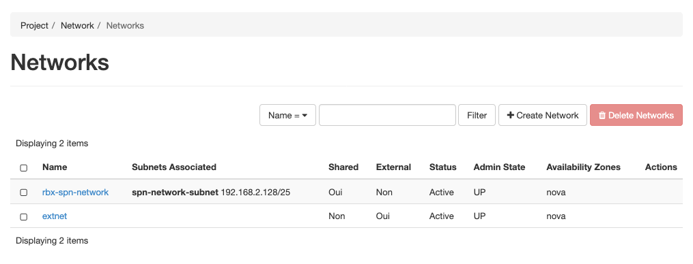

## Objective

This guide has been designed to show you how to log in to the graphical interfaces of your **OPCP** as an administrator of this service.

## Requirements

To follow this guide, you will need the following information

- The **url** address of the management interface defined for service delivery.
- Login and password details provided when the service was delivered.

## Instructions

### User interface composition

The **url** address provided allows you to access the **OPCP** user interface.

{.thumbnail}

Once you have used your login details to register, you will have access to the product dashboard.

{.thumbnail}

Your interface allows you to access:

- The configuration of users within *Keycloak* via the IAM link under your login.
- The OpenStack management interface, *Horizon*. It is a graphical web interface for managing the entire OpenStack infrastructure. It allows the user to make use of the machine resources provided by the administrators. You can do this by creating, launching and stopping instances, configuring networks, and managing instance accessibility.

The **OPCP** administration interface also groups together access to various APIs such as Keystone (authentication and identity management), Glance (image management), Nova (computing service), Neutron (network management), Ironic (bare metal hardware management), which can be used within your automations.

### Introduction to the OpenStack Horizon Interface

The OpenStack Horizon graphical interface allows you to perform different actions depending on their permissions and the project they belong to. Some of the main features available to an end user include instance management, network management, and resource tracking.

#### Access to the OpenStack Horizon administration interface

From the **OPCP** user interface, the OpenStack Horizon interface is accessible via the link in the dashboard.

{.thumbnail}

Once you have logged in, the Horizon OpenStack interface looks like this:

{.thumbnail}

The side menu to the left of the interface provides access to the various interface elements. There are two parent entries in this menu:

{.thumbnail}

- **Project** which includes four elements: Overview, API Access, Compute and Network. These elements bring together all the management features of dedicated servers and their networks, within defined quota limits.
- **Identity** which includes Projects, Users, and Application ID elements that contain user management functionality.

#### Project view

The main *Project* element is made up of various sub-elements that provide access to all resource management functionality. The first sub-element, called *Overview*, provides a global overview of the project’s allocated resource quotas, as well as a visual tracking of overall resource consumption.

##### Overview section

{.thumbnail}

The *Overview* section is divided into two main parts:

- ***Limit Summary**: The quota limits assigned to the project for each resource type. You can also view resource consumption in relation to available capacity.

    Quotas are grouped into two categories, as shown in the image below:

    {.thumbnail}

- ***Compute** which includes instance limits, vCPUs and RAM.
    - **Network** that monitors network resource quotas: Floating IPs, security groups, group security rules, networks, and ports.
    - **Usage Summary**: A history of resource usage over a period of time that allows you to see how resource usage has changed over time

    {.thumbnail}

##### API Access section

The **API-Access** tab groups together the 10 services available via the API, such as Bare-Metal, Compute, identity, image and network, as well as their access point URLs.

{.thumbnail}

With these *Endpoints*, you can communicate directly with OpenStack components using API requests. You will need this information if you need to implement HTTP requests yourself using the OpenStack APIs.

If you are using existing OpenStack integrations, they will retrieve this information the first time you log in to the OpenStack Keystone component. It is responsible for providing this information automatically.

#### Compute section

The **Compute** section provides features for configuring your product’s dedicated servers. This section is divided into different sections:

##### Instances section

An interface for listing and managing dedicated servers that have already been configured. An *Instance* corresponds to a dedicated server.

{.thumbnail}

##### Images section

You can manage images of the OS available for creating instances. You can also download new images, or select from images already available, to set up instances. This way, you can generate your own images to manage additional operating systems.

> [!warning]
>
> The images must take into account the hardware drivers delivered in your product. Many images available for Glance are only available for virtual environments based on qemu or kvm drivers.
>

{.thumbnail}

##### Key Pairs section

To authenticate yourself via SSH on your machines after installation, you will need to use asymmetric encryption keys. This interface allows you to import the public keys or create a keypair that will be deployed during the installation of the dedicated servers to ensure an SSH connection.

{.thumbnail}

#### Network View

The Network View allows you to view and manage the networks of your **OPCP** service. This interface allows you to create shared or separate networks between your dedicated servers.

> [!primary]
>
> Your entire network configuration is managed via this graphical interface or via the **OpenStack** APIs with the network component named **Neutron**. The switches in your infrastructure will be automatically configured using OpenStack information.
>

##### Network Topology section

This section shows you all the networks created on this OPCP via a vertical line of color. The squares correspond to services or dedicated servers connected to one or more of these networks.

{.thumbnail}

##### Networks section

This section contains the list of networks available for dedicated servers on your **OPCP**.

{.thumbnail}

To find out more about how networks work with OpenStack, we recommend reading the [OpenStack Networking](https://docs.openstack.org/neutron/2024.1/admin/intro-os-networking.html) documentation.

## Go further

If you need training or technical assistance for the implementation of our solutions, contact your sales representative or click [this link](/links/professional-services) to request a quote and have your project analyzed by our Professional Services team experts.

Join our [community of users](/links/community).
