## Introduction

L'assistant de pré-installation SAP proposé par OVHcloud facilite le déploiement d'un système SAP sur votre service VMware on OVHcloud déjà configuré dans votre compte client. Il vous permet de mettre en place des environnements SAP NetWeaver 7.50 ou S/4HANA, que ce soit en configuration ABAP ou Java, et selon des schémas standard, distribué ou hautement disponible.

> [!primary]
>
> Il est important de noter que le terme « pré-installation » désigne ici l'installation de la couche technique uniquement. Cela inclut la base de données SAP HANA ainsi que la couche technique SAP NetWeaver 7.50 ou S/4HANA. Après cette phase de pré-installation, il vous faudra installer le module SAP spécifique à vos besoins et finaliser les configurations dans le cadre d'une post-installation.

## Premiers pas

Pour accéder à notre assistant de pré-installation SAP, rendez-vous dans la section `SAP Features Hub`{.action} du menu `Hosted Private Cloud`{.action}, disponible depuis [l'espace client](/links/manager) de votre compte OVHcloud.

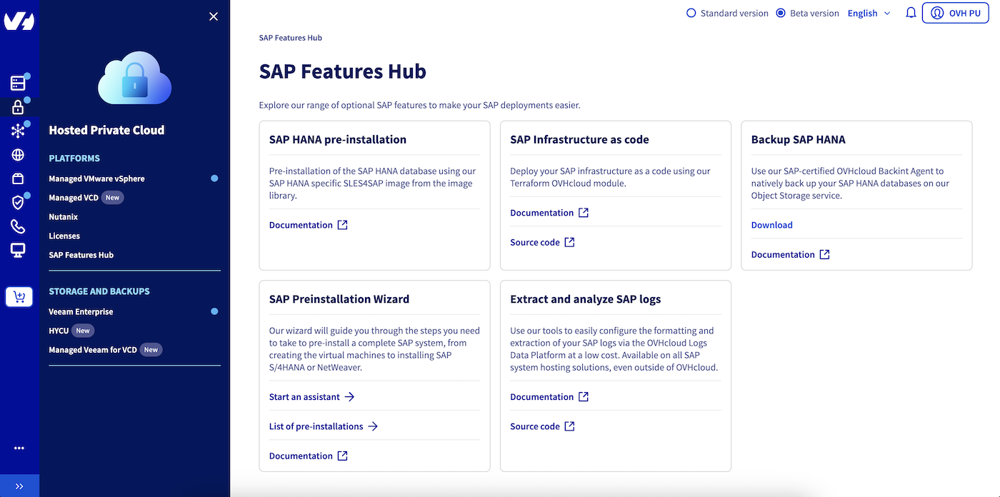{.thumbnail}

Vous avez deux options : démarrer un assistant vierge pour saisir manuellement toutes les informations nécessaires, ou bien importer un fichier JSON préalablement créé. Ce fichier peut être généré à partir du schéma de notre API ou provenir d'une précédente installation, permettant ainsi de pré-remplir les informations et d'accélérer le processus.

> [!api]
>
> @api {v1} /dedicatedCloud POST /dedicatedCloud/{serviceName}/sap

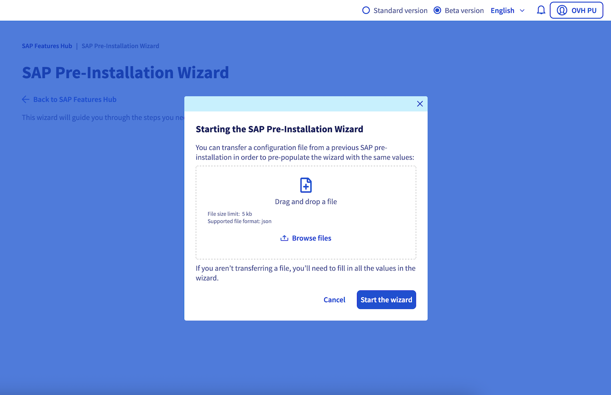{.thumbnail}

**Prérequis**

- Vous devez disposer d'un service VMware on OVHcloud1 déjà déployé dans votre compte client.
- Un projet Public Cloud doit être créé dans votre compte OVHcloud.
    - Dans ce projet Public Cloud, un conteneur Object Storage doit être créé pour y stocker vos sources SAP2.
- Un serveur DHCP doit être configuré dans le réseau où vous souhaitez déployer votre système SAP pour la machine virtuelle OVHcloud3 qui sera déployée le temps du processus d'installation.

Il est important de noter que notre assistant de pré-installation SAP prend uniquement en charge les installations utilisant la base de données SAP HANA. Par conséquent, seules les sources SAPEXEDB pour SAP HANA sont prises en charge. Tous les autres fichiers SAPEXEDB doivent être supprimés de votre conteneur Object Storage s'ils ont été sélectionnés via le SAP Maintenance Planner.

En cas d'installation SAP S/4HANA Java, téléchargez et déposez également dans votre conteneur Object Storage les fichiers DATA_UNITS (accessibles via Software Center > INSTALLATIONS & UPGRADES > By Alphabetical Index (A-Z) > S > SAP S/4HANA > \<VERSION\> > INSTALLATION AND UPGRADE > 5XXXXX.ZIP).

1 *Si vous souhaitez déployer un système SAP de production, nous recommandons fortement d'utiliser notre gamme SAP HANA on Private Cloud. Cette solution est spécifiquement conçue et certifiée pour héberger des systèmes SAP avec une base de données SAP HANA.*

2 *OVHcloud n'est pas autorisé à fournir les sources SAP requises pour une installation. Par conséquent, nous vous demandons de stocker vos sources SAP dans un conteneur Object Storage OVHcloud. Pour cela, utilisez l'outil SAP Maintenance Planner afin de générer la liste et de télécharger l'ensemble des sources SAP nécessaires à votre installation souhaitée. N'oubliez pas de déposer l'exécutable SAPCAR dans votre conteneur Object Storage.*

3 *Lors du déploiement de votre système SAP, une machine virtuelle dédiée nommée « ovhcloud-sap-wizard » sera déployée dans votre service VMware on OVHcloud. Cette machine virtuelle est essentielle pour orchestrer l'ensemble du processus d'installation. Elle est équipée de 2 vCPUs, 1 Go de RAM et 30 Go de stockage. À la fin du processus d'installation, qu'il ait réussi ou échoué, cette machine virtuelle sera automatiquement supprimée.*

## Étape par étape

### Étape 1

Dans cette première étape, sélectionnez le service VMware on OVHcloud que vous souhaitez utiliser pour votre installation SAP. Choisissez le datacentre, ainsi que le cluster qui hébergera vos machines virtuelles SAP.

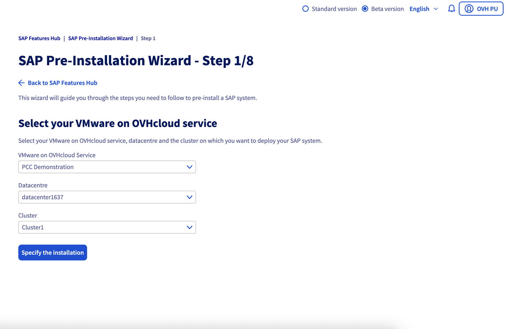{.thumbnail}

### Étape 2

Choisissez le type d'installation SAP que vous souhaitez réaliser : SAP NetWeaver 7.50 ou S/4HANA, en configuration ABAP ou Java, et en déploiement standard, distribué ou hautement disponible. Le choix du type de déploiement déterminera le nombre de machines virtuelles minimum à créer lors de l'étape suivante de l'assistant. Vous ne pourrez pas supprimer ces machines virtuelles dans l'assistant.

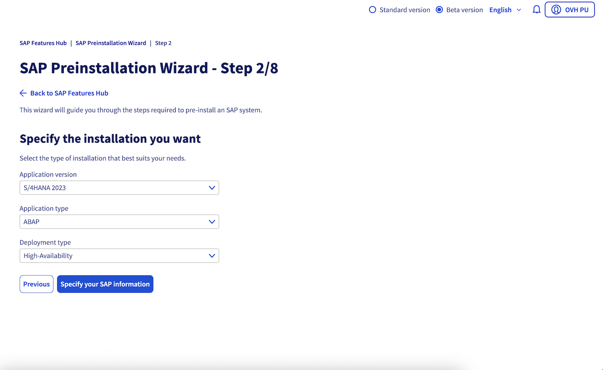{.thumbnail}

### Étape 3

Fournissez les identifiants système (SIDs) SAP ainsi que les mots de passe qui seront utilisés lors de l'installation.

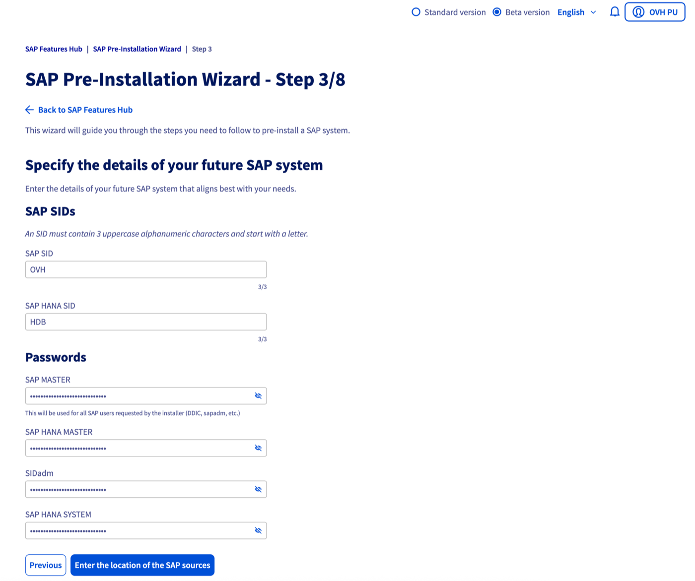{.thumbnail}

### Étape 4

Renseignez les informations du conteneur Object Storage OVHcloud qui héberge les sources SAP nécessaires pour cette installation. Assurez-vous que le conteneur ne contient que le contenu généré par le SAP Maintenance Planner correspondant à la version (NetWeaver 7.50 ou S/4HANA) et au type d'application (ABAP ou Java) sélectionné. Les champs de la clé d'accès et de la clé secrète font référence aux informations d'authentification de l'utilisateur Object Storage ayant les droits de lecture sur ce conteneur.

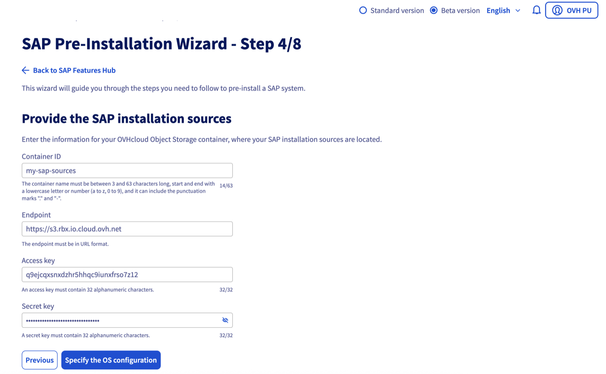{.thumbnail}

### Étape 5

Renseignez les paramètres du système d'exploitation pour vos machines virtuelles. Vous pouvez choisir de mettre à jour les paquets du système d'exploitation avant l'installation. Si cette option est activée, veuillez fournir la clé de licence SUSE nécessaire pour effectuer les mises à jour.

Vous avez la possibilité d'activer le firewall au niveau du système d'exploitation de vos machines virtuelles. En cas d'activation, une zone « SAP » est créée dans le service « firewalld » autorisant les communications réseau sélectionnées.

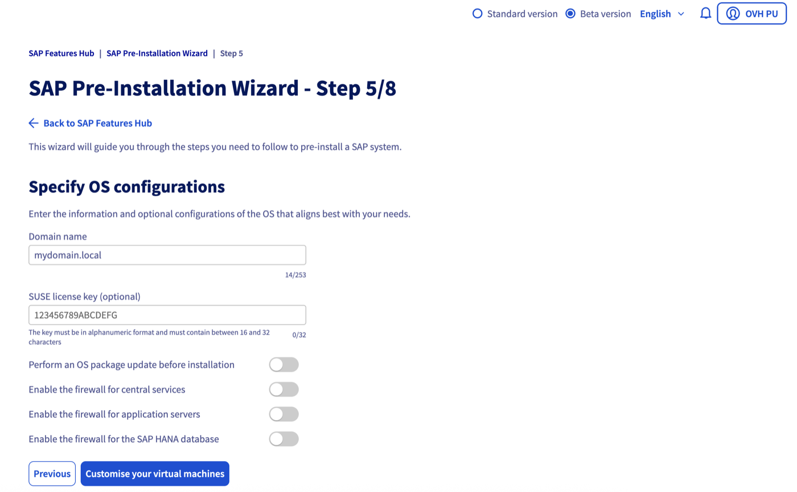{.thumbnail}

### Étape 6

Renseignez les informations pour la configuration et le dimensionnement de vos machines virtuelles.

Nous recommandons vivement d'utiliser le datastore vSAN pour la machine virtuelle hébergeant la base de données SAP HANA, offrant des performances optimisées. Pour les serveurs d'application SAP, vous avez cependant la possibilité d'utiliser un datastore NFS (ssd-XXXXXX).

Il est également recommandé de créer et de sélectionner votre politique de stockage Thick pour votre machine virtuelle SAP HANA. Vous pouvez retrouver les informations relatives à cette politique de stockage dans notre [documentation](/pages/hosted_private_cloud/sap_on_ovhcloud/cookbook_sap_hana_template_vmware) au chapitre « Configuration des paramètres avancés », point 5.

> [!warning]
> Il n'est pas possible d'appliquer une politique de stockage Thick sur les datastores NFS (ssd-XXXXXX). Par conséquent, si vous sélectionnez un datastore NFS pour votre machine SAP HANA, la politique de stockage Thin sera utilisée.

Toutes les machines virtuelles doivent être déployées dans le même sous-réseau. Ce sous-réseau doit avoir un accès à Internet afin de permettre le téléchargement des sources SAP depuis votre conteneur Object Storage OVHcloud, ainsi que la mise à jour des paquets du système d'exploitation si vous avez activé cette option.

Notre assistant vous offre la possibilité de choisir un modèle OVA/OVF de machine virtuelle différent pour votre base de données SAP HANA et pour vos serveurs d'application SAP , ainsi que pour le choix du datastore. Cependant, il n'est pas possible de déployer vos serveurs d'application SAP sur différents modèles OVA/OVF de machine virtuelle et datastores.  
De plus, si vous décidez de déployer vos machines virtuelles avec différents modèles OVA/OVF, la fonctionnalité d'activation de la license n'est actuellement pas compatible.

> [!tabs]
> Paramètres réseaux
>> 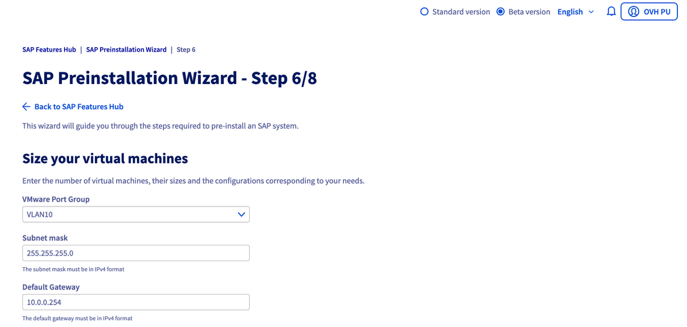{.thumbnail}
> SAP HANA
>> 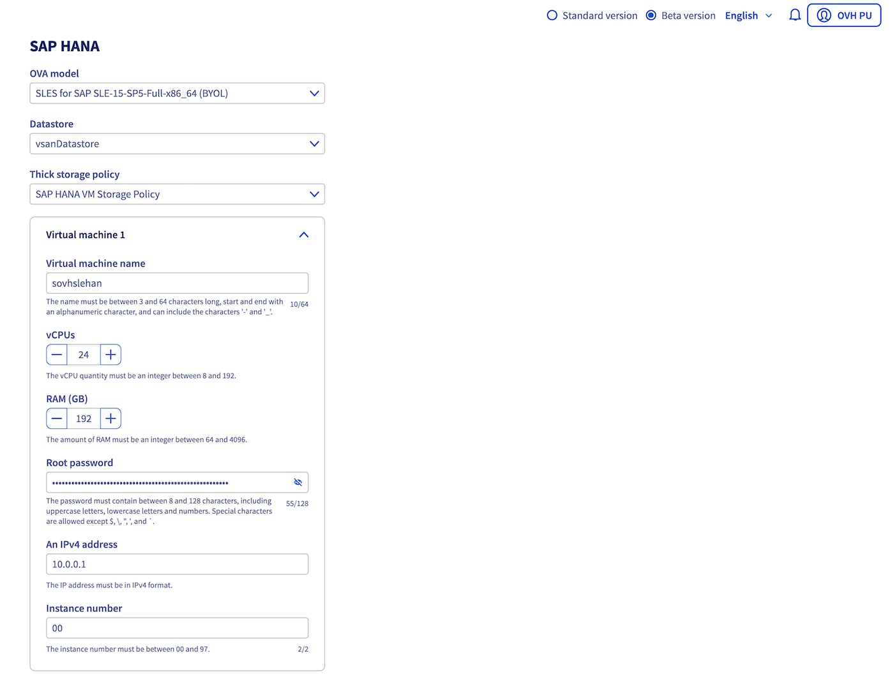{.thumbnail}
> Serveurs d'application SAP
>> 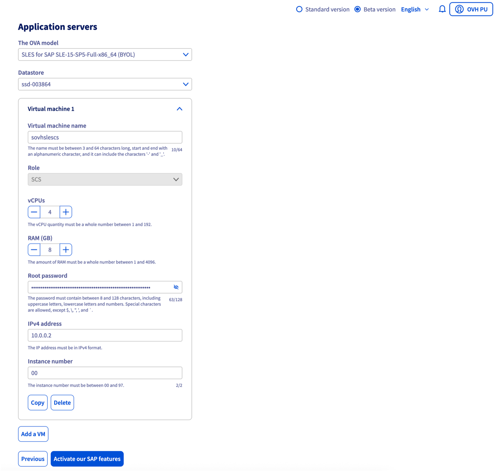{.thumbnail}

### Étape 7

Notre assistant vous permet d'activer nos fonctionnalités comme notre agent de sauvegarde pour SAP HANA ou encore d'export des logs SAP dans notre Logs Data Platform.

**OVHcloud Backint Agent** 

Nous vous invitons à prendre connaissance des prérequis dans notre [documentation](/pages/hosted_private_cloud/sap_on_ovhcloud/cookbook_install_ovhcloud_backint_agent).

**SAP logs on Logs Data Platform**  

Nous vous invitons à prendre connaissance des chapitres Logs Data Platform, Data stream et outils de collecte dans notre [documentation](/pages/hosted_private_cloud/sap_on_ovhcloud/cookbook_sap_logs_on_ovhcloud_logs_data_platform_solution_setup).

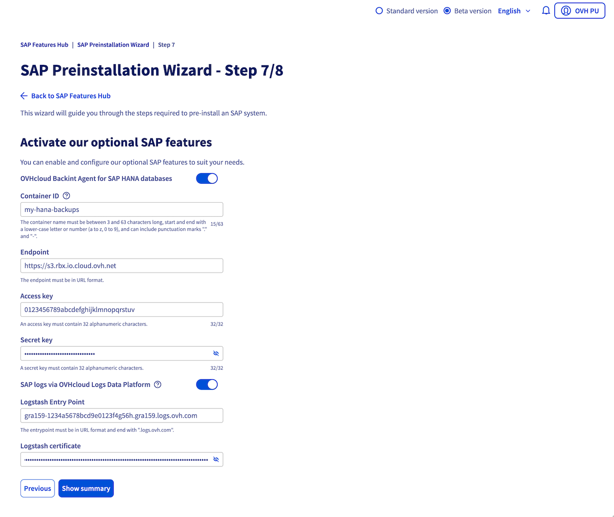{.thumbnail}

### Étape 8

Vérifiez l'exactitude des informations précédemment renseignées pour éviter tout problème lors de l'exécution de l'assistant.

Une fois que vous êtes satisfait des informations fournies, vous avez la possibilité de télécharger cette configuration au format JSON. Cette action vous permettra de l'importer dans un nouvel assistant ultérieurement, pré-remplissant ainsi les informations.

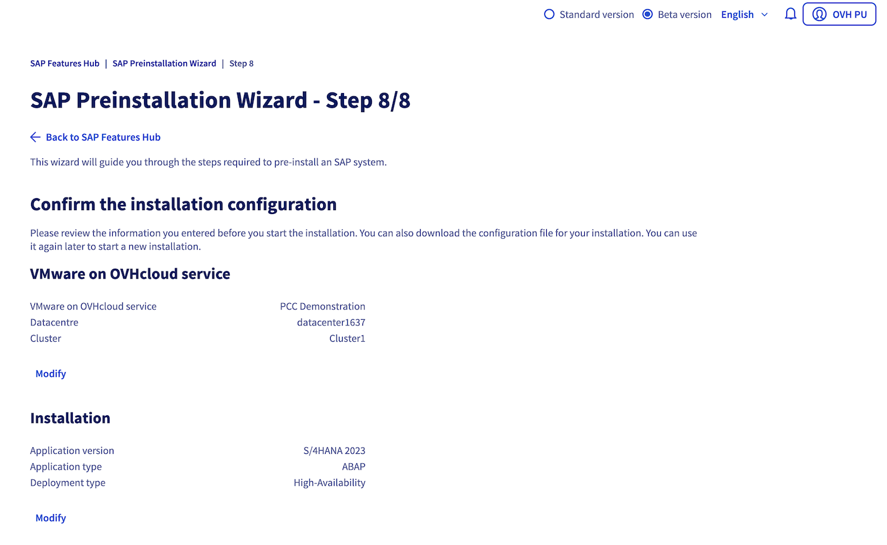{.thumbnail}

Suite à la validation des informations, vous serez redirigé vers la page de suivi de votre pré-installation. Vous pouvez également retrouver la liste de l'ensemble de vos tâches de pré-installation et leurs détails dans la section `SAP Feature Hub`{.action} dans le menu `Hosted Private Cloud`{.action}, `Liste des pré-installations`{.action}.

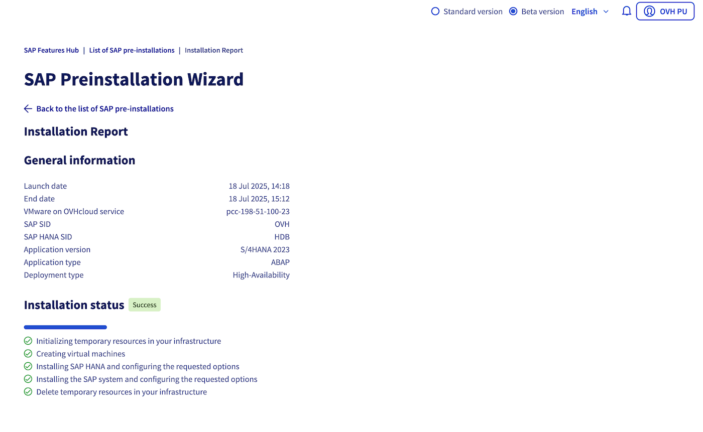{.thumbnail}

## Résolution des problèmes courants

> [!faq]
> **Le message d'erreur indique que la configuration demandée dépasse les capacités de mon datacentre.**
>>
>> Si vous avez récemment supprimé des machines virtuelles pour libérer de la capacité au sein de votre datacentre, il se peut que les informations de capacité ne soient pas encore mises à jour. Veuillez patienter quelques minutes avant de réessayer. Si le problème persiste, n'hésitez pas à contacter le support OVHcloud pour obtenir de l'aide.
>>
> **Le fichier JSON importé contient des erreurs de syntaxe.**
>>
>> Assurez-vous que le fichier JSON est correctement formaté. Vous pouvez utiliser un validateur JSON pour vérifier la validité du fichier avant de l'importer dans l'assistant.
>>
> **Les sources SAP ne sont pas accessibles depuis le conteneur Object Storage.**
>>
>> Vérifiez que le conteneur Object Storage est correctement configuré et que les permissions d'accès sont appropriées. Un utilisateur Object Storage ayant les droits de lecture est nécessaire pour le téléchargement des sources sur vos machines virtuelles.
>>
> **Les paramètres de mémoire alloués aux machines virtuelles sont insuffisants.**
>>
>> Augmentez la quantité de mémoire RAM allouée aux machines virtuelles en fonction des exigences de SAP pour votre configuration. Consultez la documentation SAP pour obtenir des recommandations sur la mémoire.
>>
> **Un message d'erreur indique qu'une erreur interne s'est produite lors de l'installation et je ne peux pas démarrer une nouvelle installation car une tâche précédente est toujours en cours.**
>>
>> Si une erreur interne survient et que le statut de la tâche n'a pas correctement été mis à jour, veuillez supprimer la tâche en question via notre API.
>> > [!api]
>> >
>> > @api {v1} /dedicatedCloud POST /dedicatedCloud/{serviceName}/sap/{taskId}
>>
>> Cette action permettra de supprimer la tâche en erreur bloquant les nouvelles installations. Veuillez également supprimer les machines virtuelles qui ont été créées par la tâche d'installation en erreur.
>>
> **L'installation SAP tombe en erreur car des paquets sont dans une version inférieure à celles exigées par SAP.**
>>
>> Vérifiez que le modèle OVA/OVF de machine virtuelle utilisé est conforme aux exigences de SAP pour la version que vous souhaitez installer. Si le modèle est supporté mais que certaines versions de paquets sont obsolètes, effectuez une mise à jour système en utilisant l'option disponible dans l'assistant. Vous devrez fournir une licence SUSE pour cette opération. Si le modèle OVA/OVF est trop ancien, envisagez de sélectionner un modèle plus récent.

## Questions fréquentes (FAQ)

> [!faq]
> **Puis-je utiliser un service VMware on OVHcloud autre que celui de la gamme SAP HANA on Private Cloud ?**
>>
>> Bien que notre assistant de pré-installation SAP soit optimisé pour la gamme SAP HANA on Private Cloud, il est possible d'utiliser un service VMware on OVHcloud d'une autre gamme. Cependant, nous recommandons vivement la gamme SAP HANA on Private Cloud pour bénéficier d'une solution spécifiquement conçue et certifiée pour héberger des systèmes SAP avec une base de données SAP HANA.
>>
> **Puis-je utiliser mes modèles OVA/OVF de machines virtuelles pour déployer le système SAP ?**
>>
>> Vous ne pouvez pour le moment pas utiliser vos modèles OVA/OVF de machines virtuelles pour déployer votre système SAP via notre assistant.
>>
> **Puis-je reprendre mon installation si celle-ci a échoué ?**
>>
>> En cas d'échec de l'installation, vous ne pourrez pas reprendre l'installation. Il faudra supprimer le système SAP construit et lancer une nouvelle installation. Si nécessaire, vous pouvez également contacter le [support OVHcloud](https://help.ovhcloud.com/csm?id=csm_get_help) pour obtenir de l'aide.
>>
> **Puis-je ajouter un serveur d'application SAP à un système SAP existant ?**
>>
>> L'assistant de pré-installation SAP d'OVHcloud ne prend pas en charge l'ajout de composants supplémentaires à un système SAP déjà existant.

## Aller plus loin

Si vous avez besoin d'une formation ou d'une assistance technique pour la mise en oeuvre de nos solutions, contactez votre commercial ou cliquez sur [ce lien](/links/professional-services) pour obtenir un devis et demander une analyse personnalisée de votre projet à nos experts de l’équipe Professional Services.

Échangez avec notre [communauté d'utilisateurs](/links/community).
