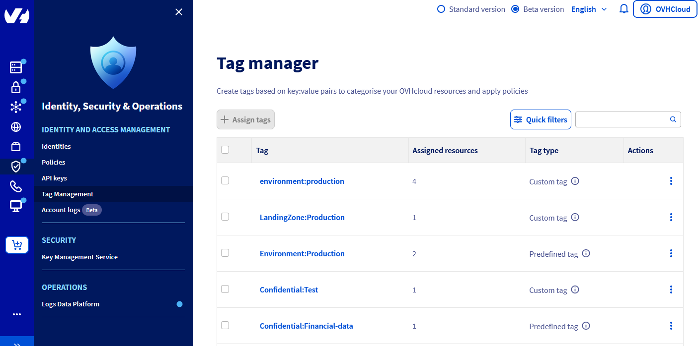
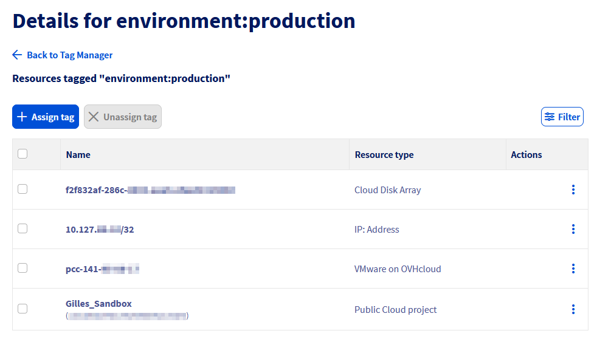
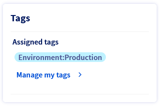
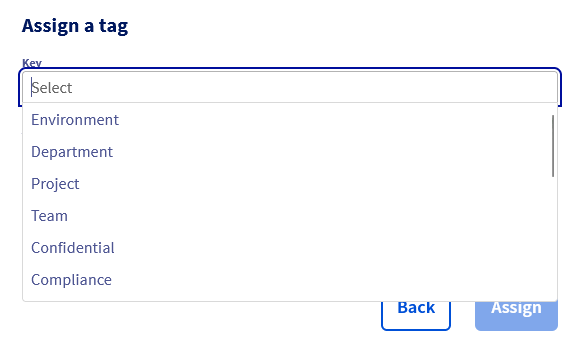

## Objective

In this guide, you will learn how to assign and manage tags on your OVHcloud products and how to use them in IAM policies.

## Requirements

- An [OVHcloud customer account](/pages/account_and_service_management/account_information/ovhcloud-account-creation).

## Instructions

### Managing Tags via the Control Panel

You can manage your OVHcloud product tags either through the general tag management interface or through dedicated interfaces within the products.
Tags are metadata in the form of key-value pairs added to OVHcloud resources, which can be used in IAM policies or for resource categorization.

#### Tag Manager

The Tag Manager is the menu that allows you to manage your tags across all your OVHcloud products in a transverse manner.
This menu is accessible in the `Identity, Security & Operations`{.action} menu and the `Identity and Access Management`{.action} section.

The menu displays all the tags currently placed on your resources.

{.thumbnail}

For each tag, the dashboard lists the number of resources associated with this tag as well as the type of tag.

There are three types of tags:

- Custom tag: Created and managed by you
- Predefined tag: Created by OVHcloud, assigned to resources by you
- System tag: Created and automatically assigned by OVHcloud to your resources (cannot be deleted)

Unassigned predefined tags and system tags do not appear by default and must be displayed via the `Quick Filters` button.

By clicking on the tag, you can access the tag details with the list of concerned resources.

{.thumbnail}

It is then possible to assign this tag to other resources via the `Assign Tag` button.
The list of all resources in the account is then displayed, allowing multiple selections.
A filter field is present on the right to facilitate searching for resources.

At the opposite, by selecting resources in the tag details, it is possible to remove the tag from them via the `Unassign Tag` button.

#### Product dashboard

In some OVHcloud products, a menu has been added to manage tags directly from the resource management dashboard.

{.thumbnail}

The tag management menu allows you to add or remove tags from the resource.

{.thumbnail}

It is possible to either select from the list of predefined tags or enter your own tags by typing the keys and values directly into the fields.

### Managing Tags via API

Tag management is centralized in a single API for all OVHcloud products:

| **Method** |               **Path**                |       **Description**        |
| :--------: | :-----------------------------------: | :--------------------------: |
|    POST    |    /iam/resource/{resourceURN}/tag    |   Add a tag to a resource    |
|    DEL     | /iam/resource/{resourceURN}/tag/{key} | Remove a tag from a resource |

The tag must be specified in the following format:

```json
{
  "key": "environment",
  "value": "production"
}
```

### Using Tags in IAM Policies

Tags can be used as conditions in IAM policies using the `resource.Tag(tag_key)` condition.

For example, the following policy grants rights to all VPS with the tag `Environment:Production`:

```json
{
  "conditions": {
    "conditions": [
      {
        "operator": "MATCH",
        "values": {
          "resource.Tag(Environment)": "Production"
        }
      }
    ],
    "operator": "AND"
  },
  "description": "Give access to VPS with tag Environment:Production",
  "identities": [
    "urn:v1:eu:identity:group:aa1-ovh/devs"
  ],
  "name": "vps-production",
  "permissions": {
    "allow": [
      {
        "action": "vps:apiovh:*"
      }
    ]
  },
  "resources": [
    {
      "urn": "urn:v1:eu:resource:vps:*"
    }
  ]
}
```

## Go further

Join our [community of users](/links/community).
