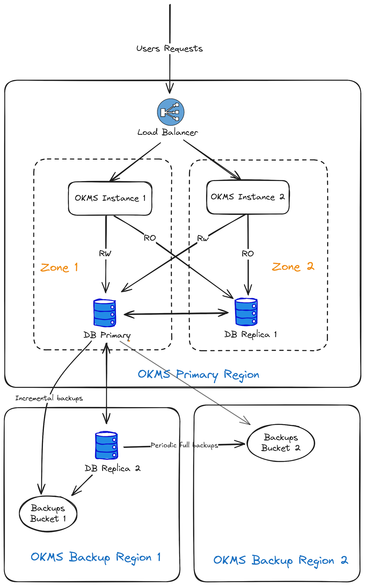
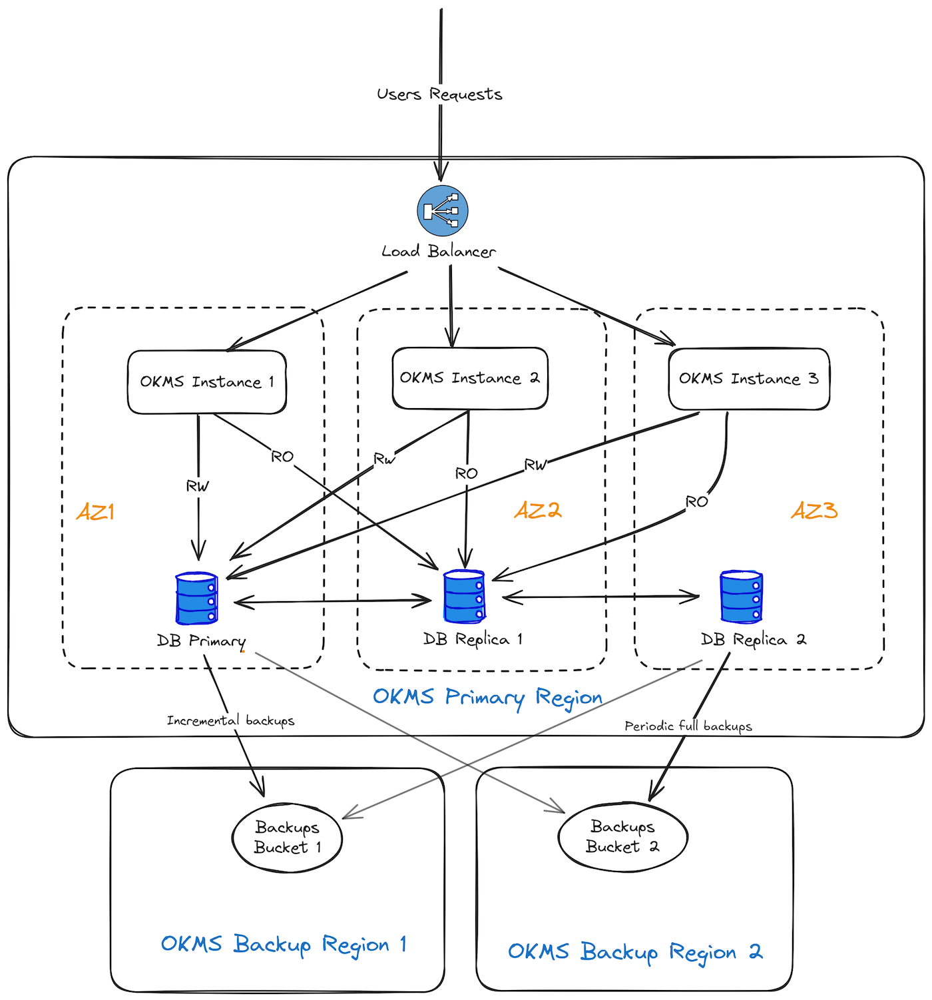

## Objective

This guide explains how we handle the resilience of the OKMS infrastructure used for OVHcloud KMS (Key Management Service) and Secret Manager.

## Instructions

The OKMS architecture has three main objectives:

- **Confidentiality**: Assure that no one except you can access your key.
- **Availability**: Offering a high level of resilience and therefore high availability.
- **Integrity**: Making sure that keys cannot be lost or altered.

### Access Management

Access to the keys is controlled by the [OVHcloud IAM](/pages/account_and_service_management/account_information/iam-policy-ui).
Only the users allowed by an IAM policy can manage the keys or use them to encrypt or sign data.

Even the OVHcloud employees cannot access your keys.

### OKMS architecture

Each OKMS region is fully independent from the others and uses dedicated hosts.

#### 1-AZ regions

The architecture of a single-AZ region is based on two zones located in distinct buildings within one or more datacenters of the same region, where the servers are spread.

To increase resilience in 1-AZ regions, a database replica server is deployed in a distinct nearby region. Replication to the remote region may take a few seconds longer than replication to the main region.

{.thumbnail}

#### 3-AZ regions

On 3-AZ regions, mono-AZ architecture is duplicated across 3 Availability Zones.

{.thumbnail}

### KMS components location

Each OKMS Region consists of several hosts in a single OVHcloud Region.

These hosts are partitioned into two different zones so that any single hardware failure is as unlikely as possible to take out both zones at once.

#### Data resilience

- **DB Replication**

The KMS will not return a success status for write operations (e.g. creation or import of key material) unless the data has been successfully replicated to at least 2 database hosts (the primary and the synchronous replica). This is to ensure that if one of the databases hosts is lost, no data will be lost.

An auto-failover mechanism in also in place to automatically reassign the database hosts roles in case the current primary or synchronous replica becomes unavailable. This means that if any of the 3 database hosts becomes unavailable, there will be no service interruption, except during the short failover phase (approximately one minute).

However, if 2 zones or 2 databases hosts become unavailable simultaneously, the OKMS will switch to read-only mode and write operations will fail (creation of new keys, secrets management, metadata updates, etc.). Existing keys will still be available to perform any cryptographic operations, and existing secrets will remain readable.

- **DB Backups**

Incremental backups are taken every 5 minutes at most, and a full backup is taken daily. Each backup is stored in two different regions.
These backups are kept for 30 days.

#### Data security

All customer data is always stored encrypted in the databases, and the database backups themselves are encrypted.

#### Backup location

The backup location depends on the location of the OKMS.

- **EU-WEST-RBX**
    - KMS Backup Region 1 : EU-WEST-SBG
    - KMS Backup Region 2 : EU-WEST-GRA
- **EU-WEST-SBG**
    - KMS Backup Region 1 : EU-WEST-RBX
    - KMS Backup Region 2 : EU-WEST-GRA
- **EU-WEST-PAR**
    - KMS Backup Region 1 : EU-WEST-GRA
    - KMS Backup Region 2 : EU-WEST-SBG
- **EU-WEST-GRA**
    - KMS Backup Region 1 : EU-WEST-GRA
    - KMS Backup Region 2 : EU-WEST-RBX
- **EU-WEST-LIM**
    - KMS Backup Region 1 : EU-WEST-LIM
    - KMS Backup Region 2 : EU-WEST-SBG
- **EU-SOUTH-MIL**
    - KMS Backup Region 1 : EU-WEST-GRA
    - KMS Backup Region 2 : EU-WEST-SBG
- **CA-EAST-BHS**
    - KMS Backup Region 1 : CA-EAST-BHS
    - KMS Backup Region 2 : CA-EAST-TOR
- **CA-EAST-TOR**
    - KMS Backup Region 1 : CA-EAST-BHS
    - KMS Backup Region 2 : CA-EAST-TOR
- **AP-SOUTHEAST-SGP**
    - KMS Backup Region 1 : AP-SOUTHEAST-SGP
    - KMS Backup Region 2 : AP-SOUTHEAST-SYD
- **AP-SOUTHEAST-SYD**
    - KMS Backup Region 1 : AP-SOUTHEAST-SGP
    - KMS Backup Region 2 : AP-SOUTHEAST-SYD

### Disaster scenarios

#### What happens if one host in a zone is lost?

Keys remain available and traffic is redirected to another zone.
Requests in flight can timeout or return errors, depending on which host is affected.

#### What happens if one zone is lost?

Keys remain available and traffic is redirected to another zone.
Requests in flight can timeout or return errors.

#### What happens if a whole region is lost?

3-AZ regions are designed to prevent this scenario, however it could occur on 1-AZ regions.

In that case, the keys created in the last seconds can be lost and the OKMS becomes unavailable.
Database replica will be used at the region and rebuilt to retrieve stored keys.

## PCI-DSS certification

Regions available for PCI-DSS certification:

- EU-WEST-RBX
- EU-WEST-SBG
- EU-WEST-GRA
- EU-WEST-LIM
- CA-EAST-BHS

## Go further

Join our [community of users](/links/community).