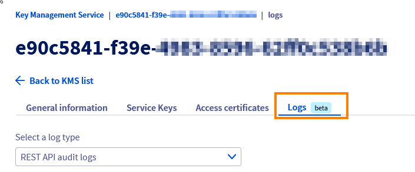
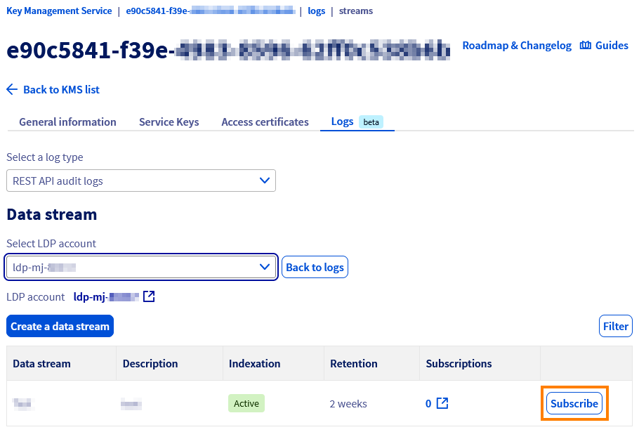

## Objectif

L'objectif de ce guide est de présenter les logs générés par le KMS OVHcloud et la manière dont ils sont gérés depuis Logs Data Platform.

## Prérequis

- Disposer d'un [compte client OVHcloud](/pages/account_and_service_management/account_information/ovhcloud-account-creation).
- Avoir [commandé un KMS OVHcloud et créé un certificat d'accès](/pages/manage_and_operate/kms/quick-start).

## En pratique

### Description

Le KMS OVHcloud dispose d'une intégration native avec [Logs Data Platform](/pages/manage_and_operate/observability/logs_data_platform/introduction_to_services_logs) pour la gestion des logs.

### Accès aux logs en direct

Les logs du KMS sont accessibles depuis l'onglet `Logs`{.action} d'un KMS.

{.thumbnail}

Cet onglet affiche en temps réel les logs du KMS.
Le sélecteur permet de choisir le type de logs affichés :

- REST API audit logs.
- KMIP audit logs.

### Accès aux logs via LDP

Depuis l'onglet `Logs`{.action} il est possible de s'abonner à un flux LDP.
Une fois l'abonnement actif, l'ensemble des logs seront transmis à [Logs Data Platform](/links/manage-operate/ldp) pour retrouver l'historique des logs générés et la possiblité de faire des recherches plus avancées, créer des alertes et des visualisations.

{.thumbnail}

Pour plus d'informations, veuillez consulter notre guide « [Quick start for Logs Data Platform](/pages/manage_and_operate/observability/logs_data_platform/getting_started_quick_start) ».

### Liste des logs générés

Les logs du KMS comportent les informations suivantes :

- API REST

Les logs sont sous le format suivant :

```bash
{{ http_method }} {{ http_path }} - {{ http_status }} - identity: {{ iam_identities }} - operation: {{ iam_operation }} on {{ res_urn }} - from {{ip}} with certificate {{cert_id}} - request id: {{ request_id }}
```

**Exemple :**

```console
INFO | GET /v1/servicekey/77f0a3f6-c2ef-4e76-xxxx-xxxxxxxxxxxx - 200 - identity: urn:v1:eu:identity:group:xx1111-ovh/john.smith - operation: okms:apiovh:serviceKey/get on urn:v1:eu:resource:okms:8d1c84cc-1128-4629-xxxx-xxxxxxxxxx/serviceKey/77f0a3f6-c2ef-4e76-xxxx-xxxxxxxxxxxx - from Manager/APIv2 - request id: EU.manager-5.684c3abe.3880620.2080cff16eaa5539bf92cxxxxxxxx
```

Les éléments pouvant être transmis à Logs Data Platform sont :

|**Champ**|**Description**|
| :-: | :-: |
|domain_id|ID du domaine OKMS|
|request_id|ID de la requête|
|type||
|log_level|Niveau de priorité du log|
|client_ip|IP du client réalisant la requête|
|tls_cert_id|ID du certificat utilisé pour l'authentification|
|res_urn|URN de la ressource ciblé|
|region|Région du domaine OKMS|
|iam_operation|Action IAM évaluée|
|iam_identities|Identitée IAM utilisé pour l'évaluation des droits|
|http_path|Chemin de la requête|
|http_status|Status de la réponse HTTP|
|http_method|Methode de la requête|
|err_category|Catégorie de l'erreur|

- KMIP

Les logs sont sous le format suivant :

```bash
{{ http_method }} {{ http_path }} - {{ http_status }} - identity: {{ iam_identities }} - operation: {{ iam_operation }} on {{ res_urn }} - from {{ip}} with certificate {{cert_id}} - request id: {{ request_id }}
```

**Exemple :**

```console
INFO | GET on urn:v1:eu:resource:okms:8d1c84cc-1128-4629-xxxx-xxxxxxxxxxx/kmip/ff55638c-3e86-4cb3-xxxx-xxxxxxxx - identity: urn:v1:eu:identity:account:xx1111-ovh - operation: okms:kmip:get - from XXX.XXX.XXX.XXX with certificate e7850a19-a5de-4527-xxxx-xxxxxxxxx - request id: OKMS.db61c455-abfa-4a66-xxxx-xxxxxxxxxxx"
```

Les éléments pouvant être transmis à Logs Data Platform étant :

|**Champ**|**Description**|
| :-: | :-: |
|domain_id|ID du domaine OKMS|
|request_id|ID de la requête|
|type||
|log_level|Niveau de priorité du log|
|client_ip|IP du client réalisant la requête|
|tls_cert_id|ID du certificat utilisé pour l'authentification|
|res_urn|URN de la ressource ciblée|
|region|Région du domaine OKMS|
|iam_operation|Action IAM évaluée|
|iam_identities|Identitée IAM utilisé pour l'évaluation des droits|
|kmip_operation|Opération KMIP utilisée|
|kmip_reason|[code d'erreur KMIP](https://docs.oasis-open.org/kmip/spec/v1.4/kmip-spec-v1.4.pdf#%5B%7B%22num%22%3A484%2C%22gen%22%3A0%7D%2C%7B%22name%22%3A%22XYZ%22%7D%2C69%2C720%2C0%5D)|

## Aller plus loin

Échangez avec notre [communauté d'utilisateurs](/links/community).