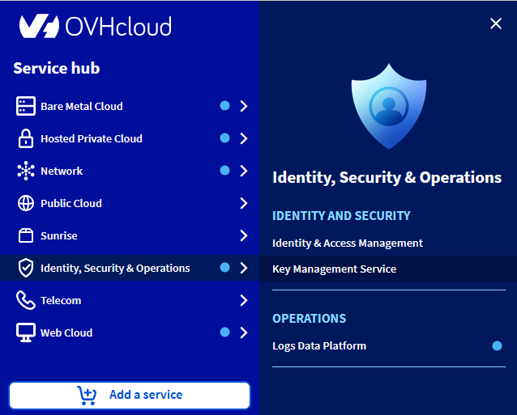
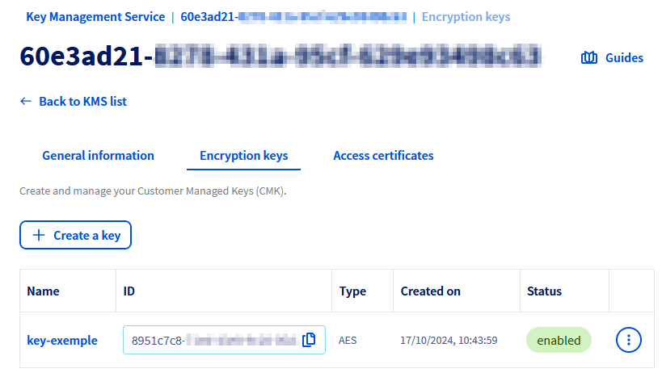
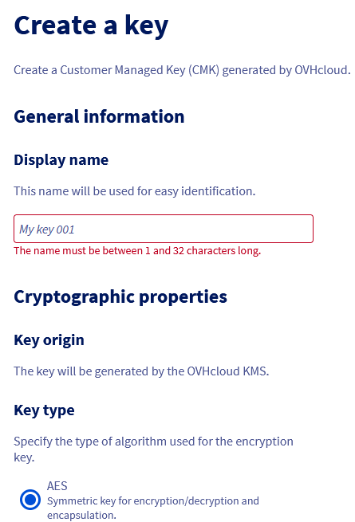
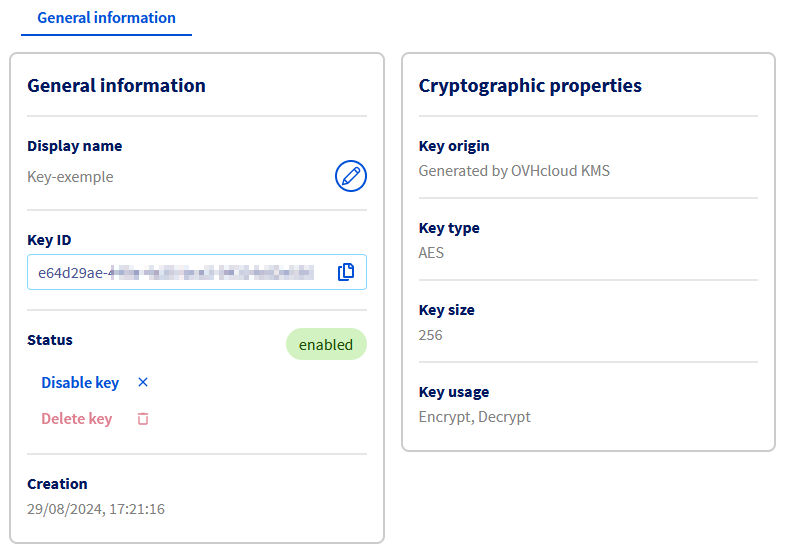

## Objectif

L'objectif de ce guide est de présenter les différentes étapes pour mettre en place votre premier KMS (Key Management Service), créer une clé et un certificat d'accès.

## Prérequis

- Disposer d'un [compte client OVHcloud](/pages/account_and_service_management/account_information/ovhcloud-account-creation).

## En pratique

### Commander votre KMS

Chaque KMS est associé à une région, ainsi les clés qui y sont stockées ont la garantie de rester dans cette région.

Il est possible de commander plusieurs KMS, que ce soit dans des régions différentes ou dans une même région.

La facturation d'un KMS étant basée sur le nombre de clés y étant stockées, la commande d'un KMS ne génère pas de facturation en elle-même.

Vous pouvez commander un KMS depuis [l'espace client OVHcloud](/links/manager) en vous rendant dans le menu `Identité, Sécurité & Opérations`{.action} puis `Key Management Service`{.action}. Cliquez alors sur le bouton `Commander un KMS`{.action}.

{.thumbnail}

Indiquez la région de votre KMS.

{.thumbnail}

La commande est ensuite à finaliser dans un autre onglet. Si celui-ci ne s'est pas ouvert automatiquement, le lien de commande est affiché :

{.thumbnail}

Après quelques secondes, le KMS est bien disponible dans votre espace client.

{.thumbnail}

### Via la console d'administration

#### Créer une clé de chiffrement

Vous pouvez créer une clé de chiffrement depuis le menu dédié de la console d'administration, en cliquant sur le bouton `Créer une clé`{.action}.

{.thumbnail}

Un formulaire permet alors de configurer la clé en sélectionnant le type de la clé, sa taille et ses usages.

{.thumbnail}

Une fois la clé créée, cliquez dessus pour accéder à ses détails.

Le tableau de bord présente les propriétés cryptographiques de la clé, ainsi que les actions permettant de la renommer, la désactiver ou la supprimer.

Afin de limiter les risques de suppression accidentelle, il est nécessaire de désactiver la clé avant de la supprimer.

> [!warning]
>
> Il n'existe aucun moyen de récupérer une clé supprimée et sa suppression entraine la perte des données chiffrés avec celle-ci. Aussi, toute suppression doit être envisagée avec la plus grande précaution.

{.thumbnail}

#### Créer un certificat d'accès

Afin de communiquer avec votre KMS, il est nécessaire de créer un certificat d'accès.
Celui-ci sera utilisé pour toute interaction avec le KMS, que ce soit pour créer des clés de chiffrement ou effectuer des opérations avec celles-ci.

Les étapes nécessaires pour créer votre certificat d'accès sont disponibles dans la [documentation associée](/pages/manage_and_operate/kms/okms-certificate-management)

### Via les API

#### Créer une clé de chiffrement

La création d'une clé se fait par l'API suivante :

|**Méthode**|**Chemin**|**Description**|
| :-: | :-: | :-: |
|POST|/okms/resource/{okmsId}/serviceKey|Créer ou importer une CMK|

L'API attend les valeurs suivantes :

|**Champ**|**Valeur**|**Description**|
| :-: | :-: | :-: |
|name|string|Nom de la clé|
|context|string|Donnée d'identification complémentaire permettant de vérifier l'authenticité de la clé|
|type|oct, RSA, EC|Type de la clé : Octet sequence (oct) for symmetric keys, RSA (RSA), Elliptic Curve (EC)|
|size|Integer|Taille de la clé - voir table de correspondance ci-dessous|
|operations|Array|Usage de la clé - voir table de correspondance ci-dessous|
|curve|P-256, P-384, P-521|(optionnel) Courbe cryptographique pour les clés de type EC|

**Exemple de création de clé symétrique :**

```json
{
  "name": "My first AES key",
  "context": "project A",
  "type": "oct",
  "size": 256,
  "operations": [
    "encrypt",
    "decrypt"
  ]
}
```

**Exemple de création de clé asymétrique :**

```json
{
  "name": "My first RSA key",
  "context": "project A",
  "type": "RSA",
  "size": 4096,
  "operations": [
    "sign",
    "verify"
  ]
}
```

**Exemple de création de clé EC :**

```json
{
  "name": "My first EC key",
  "context": "project A",
  "type": "EC",
  "operations": [
    "sign",
    "verify"
  ],
  "curve": "P-256"
}
```

Les tailles et opérations possibles en fonction du type de clé sont les suivantes :

- **oct** :
  - taille : 128, 192, 256
  - opérations :
    - encrypt, decrypt
    - wrapKey, unwrapKey
- **RSA** :
  - taille : 2048, 3072, 4096
  - opérations : sign, verify
- **EC** :
  - taille : ne pas spécifier
  - curve : P-256, P-384, P-521
  - opérations : sign, verify

#### Créer un certificat d'accès

Afin de communiquer avec votre KMS, il est nécessaire de créer un certificat d'accès.
Celui-ci sera utilisé pour toute interaction avec le KMS, que ce soit pour créer des clés de chiffrement ou effectuer des opérations avec celles-ci.

Les étapes nécessaires pour créer votre certificat d'accès sont disponibles dans la [documentation associée](/pages/manage_and_operate/kms/okms-certificate-management)

### Utiliser le KMS OVHcloud

Une fois votre KMS OVHcloud initialisé, il est possible de l'utiliser de deux manières différentes :

- En utilisant les [API Rest](/pages/manage_and_operate/kms/kms-usage), si vous souhaitez utiliser manuellement les API pour chiffrer ou signer vos données.
- En utilisant le [protocole KMIP](/pages/manage_and_operate/kms/kms-kmip), si vous souhaitez connecter n'importe quel produit compatible KMIP avec le KMS OVHcloud.

## Aller plus loin

[Utiliser le KMS OVHcloud avec vos données](/pages/manage_and_operate/kms/kms-usage)
Échangez avec notre [communauté d'utilisateurs](/links/community).
