## Objective

Welcome to the quick start tutorial of the Logs Data Platform. This Quick start guide will help you to understand the core concepts behind the Logs Data Platform and how to send your first logs to the engine.

## Instructions

### Welcome to Logs Data Platform

First, you will have to create a new account on [the Logs Data Platform page](https://www.ovh.com/fr/data-platforms/logs). Creating an account is totally free. With the pay-as-you-go pricing model of Logs Data Platform you pay only for what you use.

- Log in to the [OVHcloud Control Panel](/links/manager), and navigate to the Bare Metal Cloud section located at the top left in the header.

To configure your account you will have two choices:

- Use a username/password pair
- Use OVHcloud IAM to enable [IAM identities](/pages/account_and_service_management/account_information/ovhcloud-users-management) and [IAM policies](/pages/manage_and_operate/observability/logs_data_platform/iam_access_management).

IAM is the preferred and recommended way to manage all security aspects of Logs Data Platform. Thus, this guide will only describe how to interact with Logs Data Platform when IAM is enabled.
Once IAM is enabled you will land on the Logs Data Platform control panel:

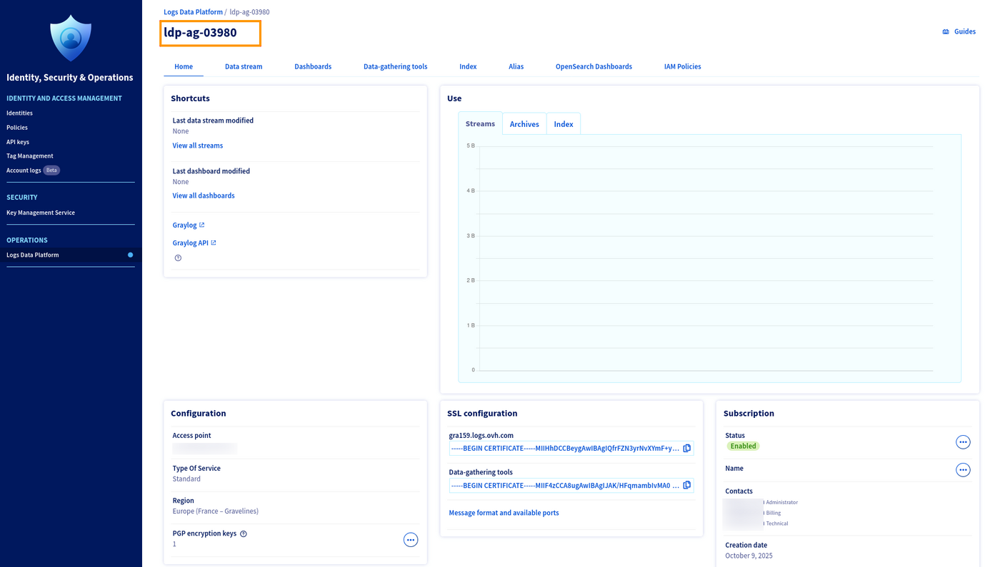{.thumbnail}

Your Logs Data Platform service name is located on the top left of the page (as shown in the orange square on the capture). This service name is used in the IAM URN of the Logs Data Platform service like this:


```urn:v1:eu:resource:ldp:ldp-ag-03980```


In the configuration section, you can:

1. Identify your assigned access point for this account and your type of service.
2. Identify the region of your service.
3. List your number of PGP encryption keys for [cold storage archive](/pages/manage_and_operate/observability/logs_data_platform/archive_cold_storage) and edit them. More on that in the [dedicated documentation](/pages/manage_and_operate/observability/logs_data_platform/archive_cold_storage_encryption).


The main page also allows you to consult the SSL certificates used on your access point in the **SSL Configuration panel**, and to review the available ports and supported formats
The **Subscription panel** allows you to change the displayed name of your account which can be useful in the case you have multiple accounts tied to the same OVHcloud nic.

At the top of the page, you can see the configuration menu of the two main items:

1. The **Data streams** are the recipients of your logs. When you send a log with the correct stream token, it arrives automatically in your stream in a powerful software named Graylog. When you access your stream in Graylog you will be able to search your logs and immediately analyze them.
2. The **Dashboard** is the global view of your logs. A Dashboard provides a global view of your logs. It is an efficient way to analyse your logs and to view high‑level metrics and trends without being overwhelmed by the log details
Below them, you have access to different sections:

3. The **Data-gathering tools** tab allows you to request OVHcloud to host your own dedicated collector such as Logstash or Flowgger.
4. The **Index** tab allows you to create your dedicated OpenSearch Index or retrieve the ones used to store your OpenSearch Dashboards settings.
5. The **Aliases** tab provides access to your data directly from your OpenSearch Dashboards or using an OpenSearch query.
6. The **OpenSearch Dashboards** tab creates your personal OpenSearch Dashboards instance, in order to exploit the aliases and index from the powerful OpenSearch Dashboards interface.
7. The **IAM Policies** tab allows you to modify access rights for your content.

### Let's send some logs!

- First, create a stream in order to get your token using: `Add data stream`{.action} in the data stream panel. You will be redirected to a page where one can add a name and a description for the stream:

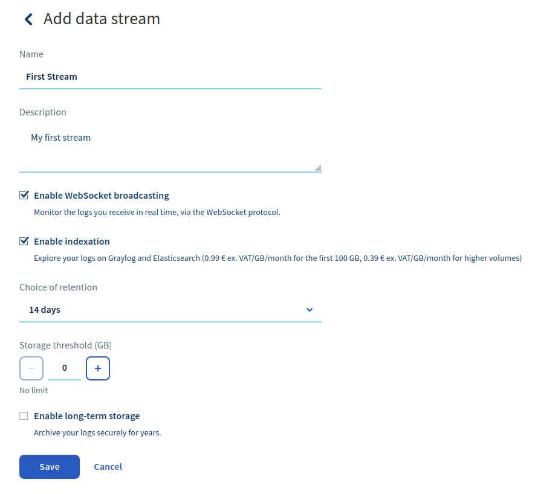{.thumbnail}

On the same page, you can enable the live-tail websocket feature. Doing so allows the indexation of your logs to explore them in Graylog, choose the retention of the data in this stream, and limit the amount of logs stored in this stream to control your budget.

- Once you have done this, click on the blue button `Save`{.action} and that's it! You have created your first stream. The button will redirect you to the stream page where you will be able to copy the X-OVH-TOKEN token. This value is the only token you will need to route logs to your stream. Under this token, you will have a list of your created streams.

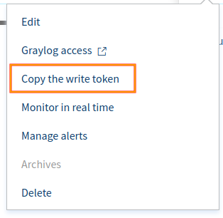{.thumbnail}

The menu **"..."** at the right gives you several features:

- **Edit** allows you to edit the name and the description of your Stream.
- **Graylog access** gives you direct access to your stream and its logs.
- **Copy the write token** retrieves your token and lets you use it in your various log collectors.
- **Monitor in real-time** allows you to see the logs incoming into your stream in real-time. Note that Graylog also provides this functionality. On this page you can also **Test** different log formats from your computer to your stream. [More about](/pages/manage_and_operate/observability/logs_data_platform/cli_ldp_tail)
- **Manage alerts** allows you to define your alert conditions on the logs routed to the stream. [More about](/pages/manage_and_operate/observability/logs_data_platform/alerting_stream)
- **Archives** allows you to download the cold stored archives. [More about](/pages/manage_and_operate/observability/logs_data_platform/archive_cold_storage)
- **Delete** removes your stream from the system and all related content.

Logs Data Platform supports several logs formats, each one of them has its own advantages and disadvantages. Here are the different formats available

- **GELF**: This is the native format of logs used by Graylog. This JSON format will allow you to send logs very easily. See: [https://go2docs.graylog.org/4-x/getting_in_log_data/gelf.html?tocpath=Getting%20in%20Log%20Data%7CLog%20Sources%7CGELF%7C_____0#GELFPayloadSpecification](https://go2docs.graylog.org/4-x/getting_in_log_data/gelf.html?tocpath=Getting%20in%20Log%20Data%7CLog%20Sources%7CGELF%7C_____0#GELFPayloadSpecification). The GELF input only accepts a null (`\0`) delimiter.
- **LTSV**: This simple format is very efficient and is still human readable. You can learn more about it [here](http://ltsv.org). LTSV has two inputs that accept a line delimiter or a null delimiter.
- **RFC 5424**: This format is commonly used by logs utilities such as syslog. It is extensible enough to allow you to send all your data. More information about it can be found at this link: [RFC 5424](https://tools.ietf.org/html/rfc5424).
- **Cap'n'Proto**: The most efficient log format. This is a binary format that allows you to maintain a low footprint and high speed performance. For more information, check out the official website: [Cap'n'Proto](https://capnproto.org/).
- **Beats**: A secure and reliable protocol used by the beats family in the Elasticsearch ecosystem (Ex: [Filebeat](/pages/manage_and_operate/observability/logs_data_platform/ingestion_filebeat), [Metricbeat](https://www.elastic.co/beats/metricbeat), [Winlogbeat](https://www.elastic.co/beats/winlogbeat)).

Here are the ports you can use on your cluster to send your logs. You can either use the secured ones with SSL Enabled (TLS >= 1.2) or use the plain unsecured ones if you can't use an SSL transport.

||Syslog RFC5424|Gelf|LTSV line|LTSV nul|Cap’n’Proto|Beats|
|---|---|---|---|---|---|---|
|TCP/TLS|6514|12202|12201|12200|12204|5044|
|TCP|514|2202|2201|2200|2204|---|
|UDP|514|2202|2201|2200|2204|---|

As said before, you can retrieve the ports and the address of your cluster at the **Home** page (in the **SSL Configuration** panel).

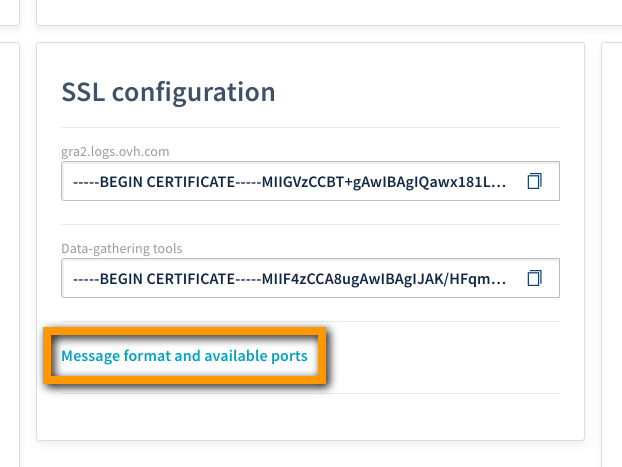{.thumbnail}

To send your logs to Logs Data Platform you can easily test your stream by doing, for example, a simple `echo` followed by an `openssl` command. Here are 3 examples, choose the format you like the most with your preferred terminal:  Note that each format has its own timestamp format: GELF uses [seconds from epoch](https://en.wikipedia.org/wiki/Unix_time), RFC 5424 and LTSV use the [RFC 3339](https://tools.ietf.org/html/rfc3339). Don't forget to change the **timestamp** to your current time to see your logs (by default Graylog displays recent logs; you can change the search scope using the top‑left time picker. Also, ensure you replace the **token** with the correct one.

*GELF*:

```shell-session
$ ubuntu@server:~$ echo -e '{"version":"1.1",  "_X-OVH-TOKEN":"d93eee2a-697f-4bac-a452-705416b98a04", "host": "example.org", "short_message": "A short message that helps you identify what is going on", "full_message": "Backtrace here\n\nmore stuff", "timestamp": 1385053862.3072, "level": 1, "_user_id": 9001, "_some_info": "foo", "some_metric_num": 42.0 }\0' | \
openssl s_client -quiet -no_ign_eof -connect <your_cluster>.logs.ovh.com:12202
```

For this format, the time is in seconds, with optional milliseconds as decimals.

*LTSV*:

```shell-session
$ ubuntu@server:~$ echo -e 'X-OVH-TOKEN:d93eee2a-697f-4bac-a452-705416b98a04\thost:example.org\ttime:2016-03-08T14:44:01+01:00\tmessage:A short message that helps you identify what is going on\tfull_message:Backtrace here\n\nmore stuff\tlevel:1\tuser_id:9001\tsome_info:foo\tsome_metric_num:42.0\0'| \
openssl s_client -quiet -no_ign_eof -connect <your_cluster>.logs.ovh.com:12200
```

For this format the time is in the RFC 3339 format.

*RFC 5424*:

```shell-session
$ ubuntu@server:~$ echo -e '<6>1 2016-03-08T14:44:01+01:00 149.202.165.20 example.org - - [exampleSDID@8485 X-OVH-TOKEN="d93eee2a-697f-4bac-a452-705416b98a04" user_id="9001"  some_info="foo" some_metric_num="42.0" ] A short message that helps you identify what is going on\n' | \
openssl s_client -quiet -no_ign_eof -connect <your_cluster>.logs.ovh.com:6514
```

For this format the time is in the RFC 3339 format.

- To see your logs in Graylog, click on the Menu button `...`{.action} located at the right of your stream in the stream list. Click on the **Graylog access** link to jump straight to Graylog.

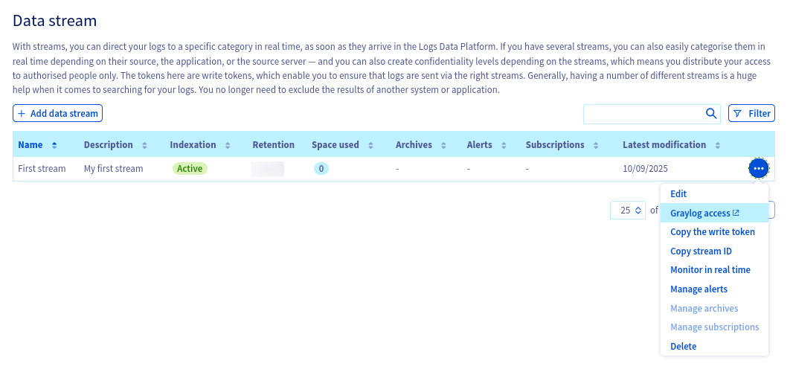{.thumbnail}

The Graylog login page looks like this:

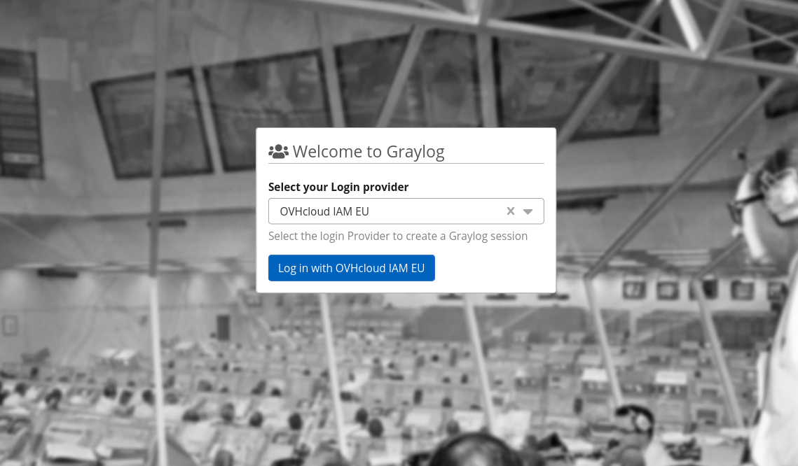{.thumbnail}

On this page you can select the Identity Provider available to this cluster. Select the right provider for your service and you will be redirected to the OVHcloud login page or, if you are already logged, you will land on the confirmation page.

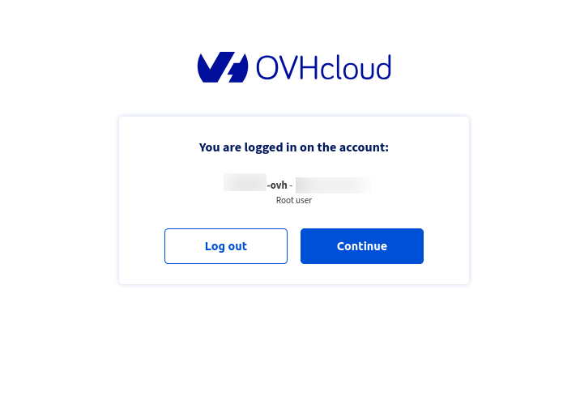{.thumbnail}

Once logged, you will be redirected to this page:

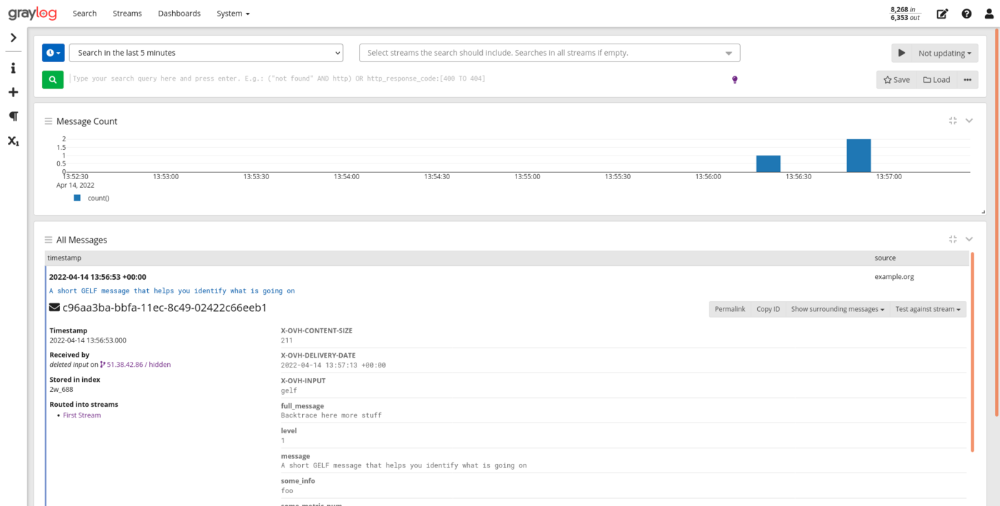{.thumbnail}

On this page you can already search for the different values present in the logs by using the search bar (at the top of the page). You can also select the time range of your search by playing with time picker at the top left of the page.
For example to search all the logs in the last 5 minutes that contain `42` for the value `some_metric_num` you can enter in the search bar after you have select **Last 5 minutes** in the time picker combobox at the top:

```
some_metric_num:42
```

Press `Enter`{.action} or click on the Green button to launch the search and wait for your results.

It's possible to search some part of your message by entering:

```
helps going
```

Giving you all the messages that contains the terms `helps` and `going`.

Graylog allows you to extensively search through your logs without compromising usability. For more information about how to craft relevant searches on Graylog, please visit [Graylog Search Documentation](https://go2docs.graylog.org/4-x/making_sense_of_your_log_data/writing_search_queries.html).

Send several logs with different values for `user_id`, for example. At the left of the page you will see the fields present in your stream, you can click on the `user_id` checkbox to display all the values for this field along the logs.

### Let's create a Dashboard

Let's go back to the Logs Data Platform control panel, we will now create a Dashboard that will allow you to explore your data in a graphical manner. It is even simpler to create a Dashboard, just click on the `Add a dashboard`{.action} button and on the next page, add a description and a title for your Dashboard. Once created, you can use the `...`{.action} menu to access it immediately.

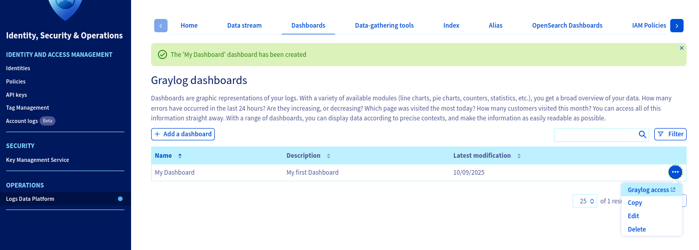{.thumbnail}

At first, your dashboard is empty but we will fill it really soon with some awesome widgets ;-). To do that, get back to your stream: you can use the link on graylog (under the Stream tab) or the link on your console as you wish. Let's say you want all the user Ids for which the value `some_metric_num` is above `30`, first. You search for this data:

- In the search bar, enter the following: `some_metric_num:>30`
- Above the search bar, select the relative time range you want to use in your widgets. If you want the widget to display the last hour, select  **Search in the last Hour**
- On the left panel, click on the button that looks like an "X" to open the fields menu.
- Unroll the `user_id` menu by clicking on the value and select  **Show top values**. It will then display a nice widget with the distribution of the most frequent `user_ids`.

You can `edit`{.action} the widget by using its top right menu arrow. For example you can change the visualization type by choosing **Pie Chart** in the top left _Visualization Type_ option.

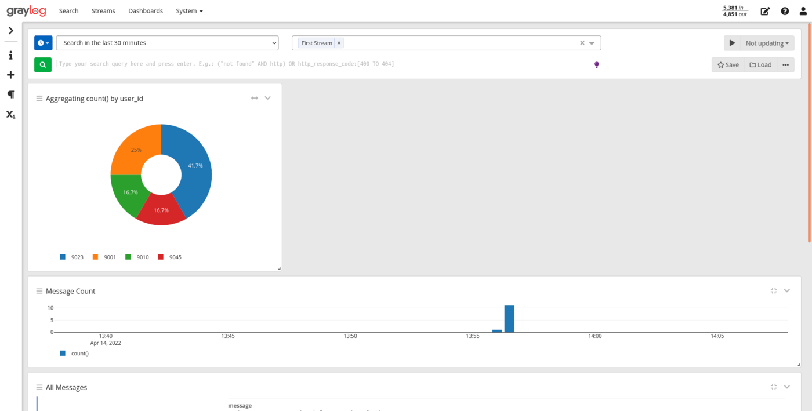

This widget gives you the most frequent `user_id` in the logs of the last hour that have a `some_metric_num` value above `30`.

- To add this really critical information to your dashboard, click on the `Copy to Dashboard`{.action} menu button and select your newly created Dashboard. After that, you will be redirected to the Dashboard with your newly created widget in it.

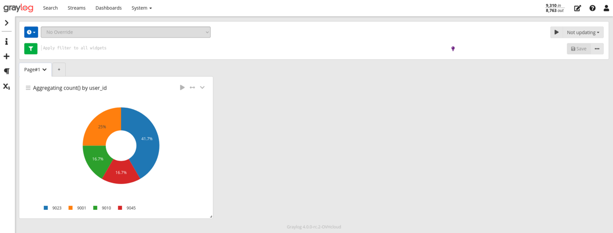

Mixing various widgets on the same dashboard gives this feature all its sense. To add a widget in this Dashboard you can also directly use the "+" button on the left panel. This button will ask you the type of widget you want to create (Aggregation or Message Count or Message Table). The Aggregation option allows you to create various visualization types for your data.

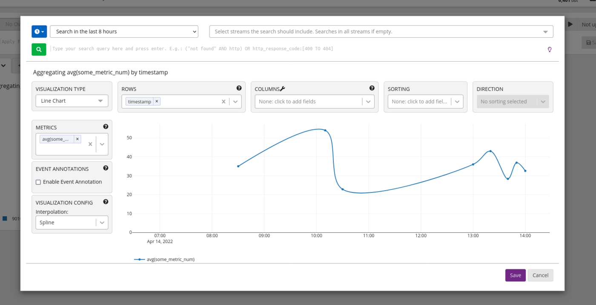

In this screenshot, you can see that we added a widget that represents the mean values for some_metric_num (by using generate chart instead of quick values for the field some_metric in the stream tab).

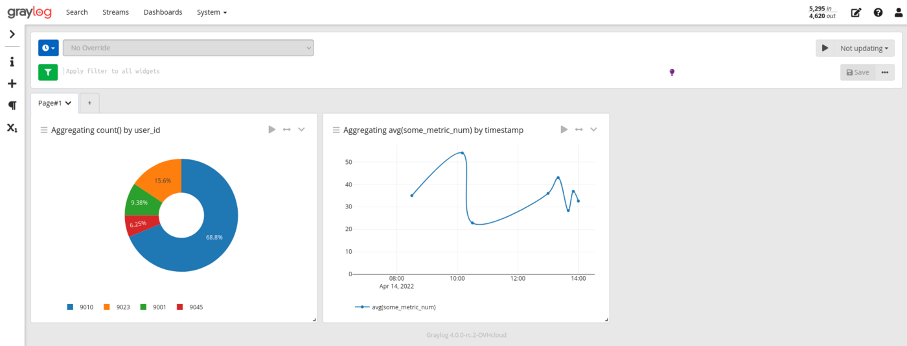

Note that dashboards are interactive and you can use the top search bar and the date picker to only display the widgets for a particular type of event. Try it ;-).

## Go further

You have only scratched the surface of what Logs Data Platform can do for you. you will soon find how to:

- [Send correctly formatted logs](/pages/manage_and_operate/observability/logs_data_platform/getting_started_field_naming_convention) to use custom types as number, boolean and other stuff.
- [Configure your syslog-ng](/pages/manage_and_operate/observability/logs_data_platform/ingestion_syslog_ng) to send your Linux logs to Logs Data Platform.
- [Manage IAM Policies](/pages/manage_and_operate/observability/logs_data_platform/iam_access_management) to allow other users of the platform to see your beautiful Dashboards or let them explore your Streams instead of doing it for them.
- [Using OpenSearch Dashboards and aliases to unleash the power of OpenSearch](/pages/manage_and_operate/observability/logs_data_platform/visualization_opensearch_dashboards)
- If you want to master Graylog, this is the place to go: [Graylog documentation](https://docs.graylog.org/docs/queries)
- Documentation: [Guides](/products/observability-logs-data-platform)
- Create an account: [Try it!](https://www.ovh.com/fr/order/express/#/express/review?products=~(~(planCode~'logs-account~productId~'logs)))
- Join our community of users on [OVHcloud community](https://community.ovh.com/en/c/Platform/data-platforms) or on our [Discord channel](https://discord.com/channels/850031577277792286/1043179486776152147)