> ![primary]
> IAM for Logs Data Platform will be available starting **17th September 2025**.
> The content of this documentation will be valid from this date.
>

## Overview

This guide provides instructions for configuring access rights on OVHcloud IAM to manage permissions for various components of Logs Data Platform. It will give you the best practices to handle the rights given to your users and will ensure that you can replicate the functionnality of roles and permissions with the more advanced system of policies. This guide will use features explained in the [IAM documentation](/pages/account_and_service_management/account_information/iam-policy-ui). It is therefore recommended to read it before reading this guide. 

## Requirements

- An [OVHcloud account](/pages/account_and_service_management/account_information/ovhcloud-account-creation)
- Access to the [OVHcloud Control Panel](/links/manager)
- A Logs Data Platform Account With [IAM enabled](/pages/manage_and_operate/observability/logs_data_platform/iam_presentation_faq).

## Policies and identities

This guide leverages [local users](/pages/account_and_service_management/account_information/ovhcloud-users-management) to explain how you can share resources to another user. This choice has been done to illustrate through captures how it works inside the OVHcloud Control Panel. The policies created can be applied to any OVHcloud identities through the OVHcloud API. You can use these policies to share data with a local user, another OVHcloud user account or an OAuth client. You can refer to the specific [IAM Policies with API guide](/pages/account_and_service_management/account_information/iam-policies-api) to recreate all these policies with the API.

The identity will see a new service listed in their Logs Data Platform. This service contains the shared Logs Data Platform items. To ensure the recipient can see the shared items, we must share a view of the service with them.

## Access Rights Management

This section details how to configure local user/identity groups and policies to replicate the behavior of the legacy role system.

### Create a group for local users

By default, the least privileged group available for local users is read-only over all the products of your account. If you would like to have an even more restricted account able to read only shared data from your Logs Data Platform, we advise you to create a group with the role **None** and attach your local users to it. In the OVHcloud Control Panel, navigate to `IAM`{.action} {.action} > `Identities`{.action} > `User groups` to create such a group. 

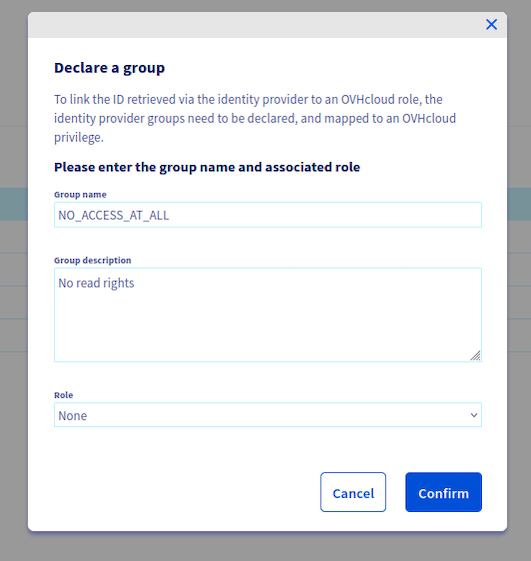{.thumbnail}

You can then create a policy with the basic rights to access the OVHcloud Control Panel and attach it to the group. All your local users will be able to connect to the OVHcloud Control Panel. Navigate to `IAM`{.action} > `Policies`{.action} > `My Policies`{.action} to create this policy and attach it to the user group.

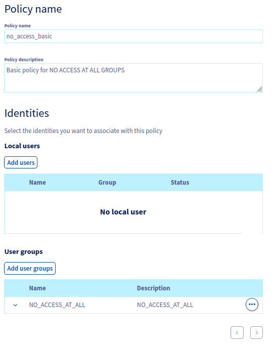{.thumbnail}

After attaching the group, you can add the **controlPanelAccess** right to it.

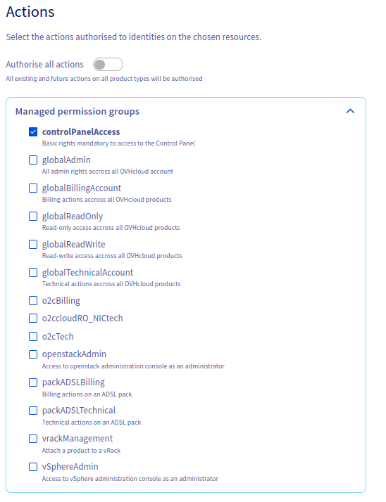{.thumbnail}

The group is now configured, you can then create the local users.

### Create a local user

Creating a local user is fully documented in the [dedicated documentation](/pages/account_and_service_management/account_information/ovhcloud-users-management). Remember to attach the user to the group.

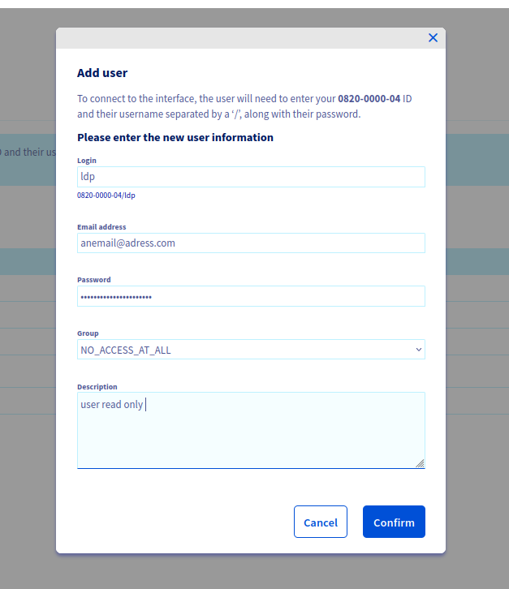{.thumbnail}

### Create a policy for the service

You now need to create a policy in order to allow the local user to see the Logs Data Platform service inside the OVHcloud Control Panel. The goal here is to have access to the service only but without any sub resources visible (ie no streams, dashboards, indices, aliases or OpenSearch Dashboards instances). Navigate to `IAM`{.action} > `Policies`{.action} > `My Policies`{.action} to create this policy. Add the local user to your policy and select the **Logs Data Platform: service** product type to list your services in the *Resources* dropdown list and enable the panel of the *Actions* related to Logs Data Service. 

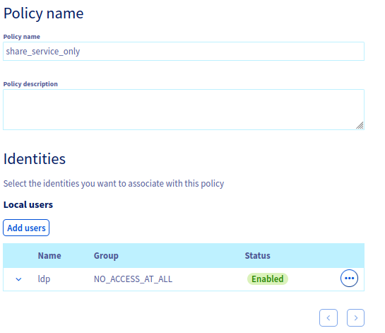{.thumbnail}

The policy can then allow the service with read only access on the choosen service. Some mandatory actions need to be given for users to be able to see the Logs Data Platform control panel without error. The minimal set of actions are listed below: 

```yaml
- ldp:apiovh:cluster/get
- ldp:apiovh:cluster/retention/get
- ldp:apiovh:encryptionKey/get
- ldp:apiovh:get
- ldp:apiovh:input/get
- ldp:apiovh:metrics/get
- ldp:apiovh:role/get
- ldp:apiovh:service/get 
- ldp:apiovh:serviceInfos/get
- ldp:apiovh:services/form/get
- ldp:apiovh:services/get
- ldp:apiovh:token/get
- ldp:apiovh:url/get
```

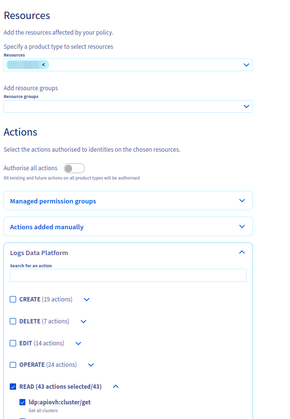{.thumbnail}

Once the policy is attached to the identity, the users will see the new service in their control panel, but with no items available.

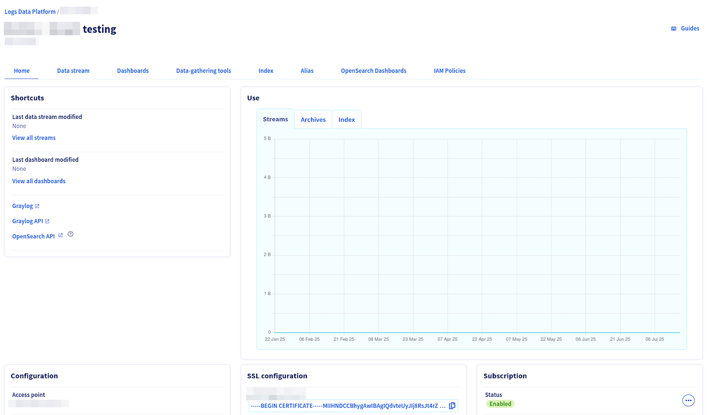{.thumbnail}

### Create a sub resources group

All the items created by a Logs Data Platform (ie streams, dashboards etc) are materialized as sub-resources of the LDP service.
One of the new feature available thanks to IAM is the ability to group sub-resources in a **Resource group**. A Resource group can be used to share related resources together and are a convenient way to groups items which are supposed to be used together. For example: a stream and its related dashboard, an alias and a OpenSearch Dashboard to explore it, an alias with all the streams attached to it. This feature is a good way to completely isolate sub-resources and make sure you don't have to handle them one by one over all your policies. 

To create a resource group, navigate to `IAM`{.action} > `Policies`{.action} > `Resource Groups`{.action}.

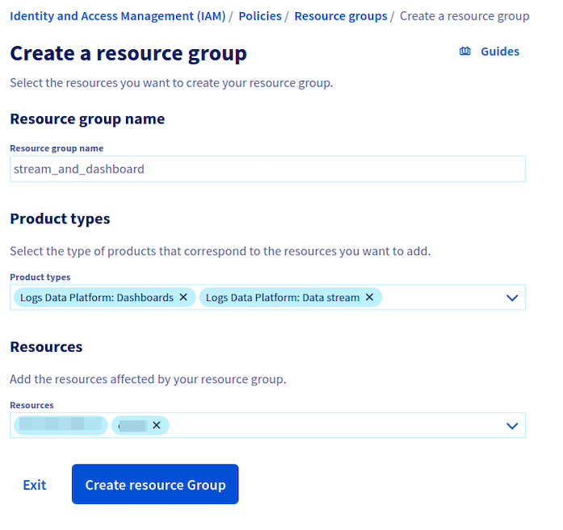{.thumbnail}

You need to select the product type (Dashboards, Streams, Alias, Index, OpenSearch Dashboards) and then select the specific resource you want to share. 

### Create a policy for the sub resources

This policy is the one you need to effectively replicate the [legacy roles permissions](/pages/manage_and_operate/observability/logs_data_platform/getting_started_roles_permission). You will attach OVHcloud APIs rights and backend (Graylog, OpenSearch) rights to allow identities to see the items in their shared service and interact with them in the corresponding Web UIs and APIs. Again navigate to `IAM`{.action} > `Policies`{.action} > `My Policies`{.action} to create a policy. 

Similarly to the previous policy, you need to add your local user and you need to select the product type of your ressource or sub-resource if you want to enable the actions selection panel for these specific sub-resources. 

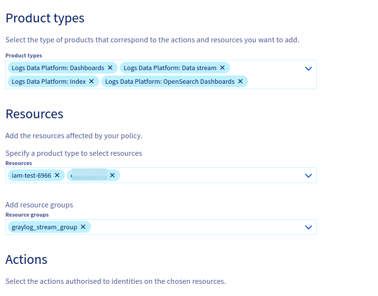{.thumbnail}

> ![warning]
> Do not add a Logs Data Platform service to this policy. If you do so it will transitively give access to all sub-resources of this service (ie all LDP items) to the local users/identities or groups attached to the policy. The previous service policy has been created to prevent this behaviour.

You can mix Resource Groups and specific resources in the same policy. All actions attached to the policy will be then be attached to all related sub-resources.  
You have several actions for each sub-resource type. For brevity, this guide will not detail all the actions available for all the items.

Here are some use cases of several rights which can all be together in one policy showcasing the complexity enabled by IAM policies. Actions starting with **ldp:apiovh** are actions related to OVHcloud APIs (thus the control panel UI). The other actions are related to their specific backend: Graylog or OpenSearch. 

- These actions give an access in read-only to one or several indices:
    ```yaml
    - ldp:apiovh:output/opensearch/index/get
    - ldp:apiovh:output/opensearch/index/url/get
    - ldp:opensearch:index/read
    ```

    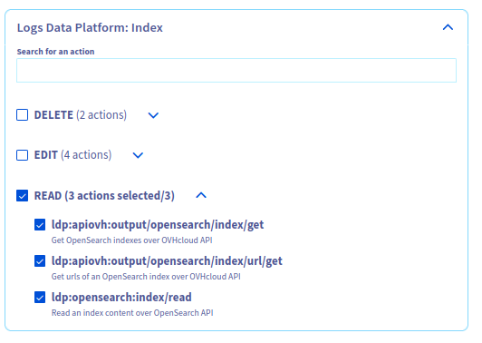

- These actions allow to read and modify a Graylog Dashboard:
    ```yaml
    - ldp:graylog:dashboard/update
    - ldp:apiovh:output/graylog/dashboard/get
    - ldp:apiovh:output/graylog/dashboard/url/get
    - ldp:graylog:dashboard/read
    ```

    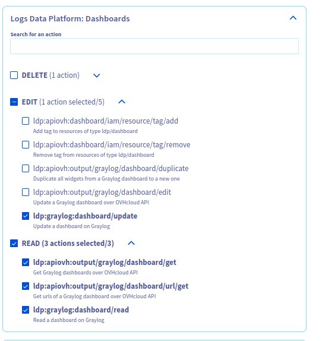

- These actions allow to consult and create visualizations in one or several OpenSearch Dashboard instances:
    ```yaml
    - ldp:opensearch:osd/update 
    - ldp:apiovh:output/opensearch/osd/get
    - ldp:apiovh:output/opensearch/osd/url/get
    - ldp:opensearch:osd/get 
    ```

    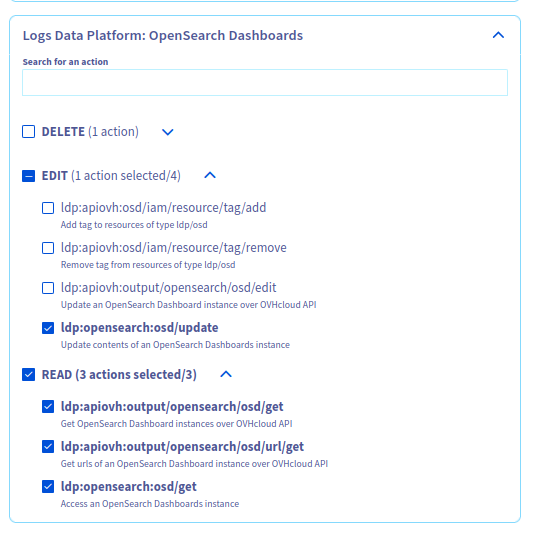
 
- These actions give a read-only access in both Graylog and the control panel to one or several streams:
    ```yaml
    - ldp:apiovh:output/graylog/stream/get
    - ldp:apiovh:output/graylog/stream/url/get 
    - ldp:graylog:stream/read  
    ```

    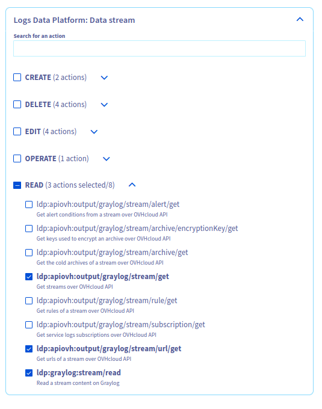

Once the policy is created, the local user/identity will only see the related sub resource of the policy in its own control panel. 

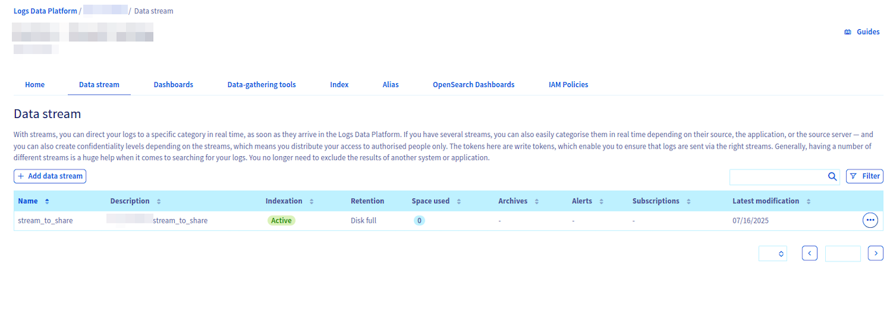{.thumbnail}

### Analyse your policy results

You can verify the accuracy of your policies using [the IAM troubleshooting guide](/pages/manage_and_operate/iam/iam-troubleshooting).

### Going further with local users

Local users are useful for generating Personal Access Tokens (PATs). These tokens have a configurable expiration date and can be used to interact with both the OVHcloud APIs and the Logs Data Platform backends.

> [!api]
>
> @api {v1} /me POST /me/identity/user/{user}/token
>

Thanks to OVHcloud IAM, you can then delegates the creation rights of sub-resources (indices, aliases) to your local user and interact with the backend APIs directly with these Personal Access Tokens. 

The actions related to create items are part of the service actions. You will need to add them to a policy to allow a user to create items with their PAT.

> ![info]
> You don't need to allow any OVHcloud APIs action to allow a local user to interact with the Logs Data Platform backends (OpenSearch, Graylog, OpenSearch Dashboards) APIs.
> Local users allow you to generate tokens which can only interact with the backend similarly to legacy Logs Data Platform tokens. 

For example, these two rights allow a local user to create indices/aliases directly on OpenSearch without having any other rights on the OVHcloud APIs. 

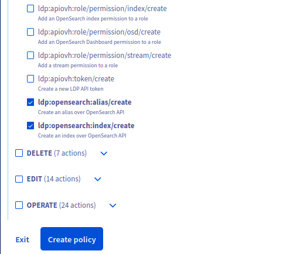{.thumbnail}

## Go further

- [Introduction to Logs Data Platform](/pages/manage_and_operate/observability/logs_data_platform/getting_started_introduction_to_LDP)
- [IAM for Logs Data Platform - Presentation and FAQ](/pages/manage_and_operate/observability/logs_data_platform/iam_presentation_faq)
- [Our documentation](/products/observability-logs-data-platform)
- Join our [community of users](/links/community)
- Create an account: [Try it!](/links/manage-operate/ldp)
