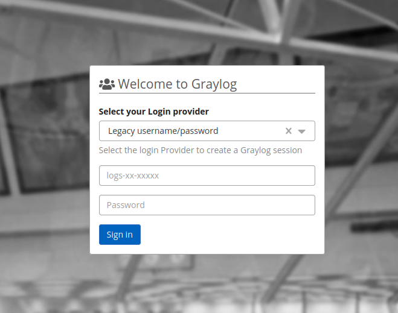

> [!primary]
> IAM for Logs Data Platform will be available starting **17th September 2025**.
> The content of this documentation should be read to prepare this migration.
>

## Objective 

This guide explains the breaking changes resulting from the IAM migration and provides guidance on how to take advantage of the new IAM integration.

## Requirements

- An [OVHcloud account](/pages/account_and_service_management/account_information/ovhcloud-account-creation)
- Access to the [OVHcloud Control Panel](/links/manager)
- A Logs Data Platform service

## Instructions

### What is IAM? 

IAM stands for **Identity and Access Management**. It is a system of policies and processes that enable organizations or users to manage digital identities and control access to sensitive resources, such as applications, data, systems, and in the case of Logs Data Platform: logs.

- **Security**: IAM ensures that only authorized individuals or systems can access your logs. Authentication methods include two-factor authentication or federation systems.
- **Convenience**: IAM simplifies user management as it is unified across all OVHcloud products, allowing individuals to access all their products with one set of credentials.
- **Flexibility**: IAM allows you to create sophisticated policies for sharing resources in a robust way.

### IAM Migration for Logs Data Platform

The IAM Migration for Logs Data Platform is scheduled for 17 September 2025. A scheduled maintenance will enable IAM for all Logs Data Platform customers, introducing new features and allowing full migration to IAM.

#### Breaking Changes

##### Roles and Permissions

If you use the [role and permission system](/pages/manage_and_operate/observability/logs_data_platform/getting_started_roles_permission), please note that members of your roles will no longer see shared items in their own service when connecting to the Logs Data Platform control panel.

However, they will still be able to access these items when using their credentials on the relevant backends (Graylog, OpenSearch Dashboards, Grafana).

If you use the role and permission system, we strongly recommend [migrating to IAM policies](/pages/manage_and_operate/observability/logs_data_platform/iam_access_management).

##### Web UIs

The Graylog Web UI will now display an Identity Provider selector. You can find the username/password authenticator by selecting **Legacy username/password**. You can also try the OVHcloud IAM authenticator by selecting the appropriate provider (EU or CA).

### Deprecated Features

The IAM migration allows us to deprecate some Logs Data Platform features that have IAM replacements:

- [Roles and permissions](/pages/manage_and_operate/observability/logs_data_platform/getting_started_roles_permission/)
- [Legacy tokens](/pages/manage_and_operate/observability/logs_data_platform/security_tokens/)

These features are replaced by [access management policies](/pages/manage_and_operate/observability/logs_data_platform/iam_access_management) and by either [Local Users Personal Access Tokens](/pages/account_and_service_management/account_information/ovhcloud-users-management) or [Service account tokens](/pages/account_and_service_management/account_information/authenticate-api-with-service-account).

### Useful Documentation 

#### IAM Resources

- [OVHcloud identities](/pages/manage_and_operate/iam/identities-management)
- [Local users management](/pages/account_and_service_management/account_information/ovhcloud-users-management)
- [Service accounts](/pages/account_and_service_management/account_information/authenticate-api-with-service-account)
- [Policies UI](/pages/account_and_service_management/account_information/iam-policy-ui)
- [Policies API](/pages/account_and_service_management/account_information/iam-policies-api)

#### IAM for Logs Data Platform

- [Presentation and FAQ](/pages/manage_and_operate/observability/logs_data_platform/iam_presentation_faq)
- [Access Management](/pages/manage_and_operate/observability/logs_data_platform/iam_access_management)

## Go further

- [Introduction to Logs Data Platform](/pages/manage_and_operate/observability/logs_data_platform/getting_started_introduction_to_LDP)
- [IAM for Logs Data Platform - Presentation and FAQ](/pages/manage_and_operate/observability/logs_data_platform/iam_presentation_faq)
- [Our documentation](/products/public-cloud-data-platforms-logs-data-platform)
- Community hub: [https://community.ovh.com](https://community.ovh.com/en/c/Platform/data-platforms){.external}
- Create an account: [Try it!](https://www.ovh.com/fr/order/express/#/express/review?products=~(~(planCode~'logs-account~productId~'logs))){.external}
