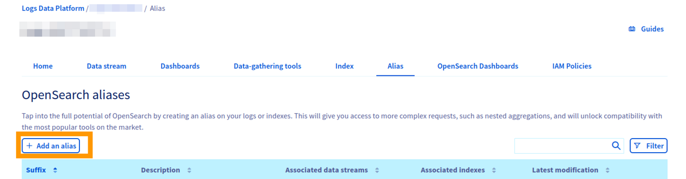
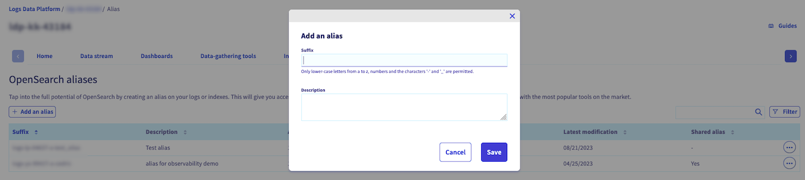
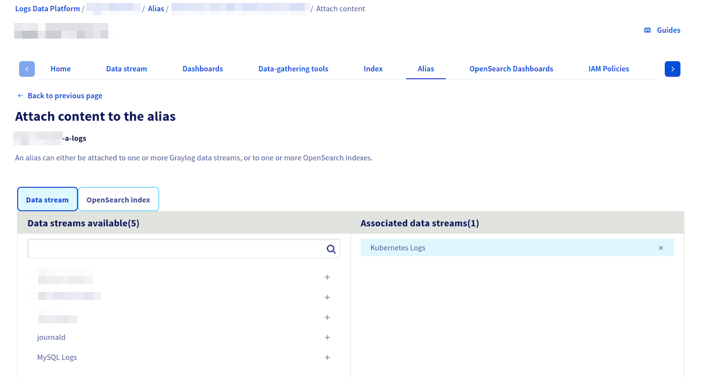

## Objective

As explained in our [introductory documentation](/pages/manage_and_operate/observability/logs_data_platform/getting_started_introduction_to_LDP), Logs Data Platform heavily relies on [OpenSearch](https://github.com/opensearch-project/OpenSearch) to work. OpenSearch has a rich ecosystem and allows very complex queries.

**This documentation explains how to use third‑party softwares that integrate with OpenSearch by using aliases.**

## Requirements

- Access to the [OVHcloud Control Panel](/links/manager)
- A [Logs Data Platform account](/links/manage-operate/ldp)

## Instructions

### What is a Logs Data Platform alias?

As explained in the documentation mentioned above, a Logs Data Platform *alias* is a virtual OpenSearch *index*. You can attach multiple *indices* **or** multiple log *streams* to an *alias* (but not a mix of *indices* and *streams*). In both cases, *aliases* are read‑only.

### Alias configuration

When attached to *streams* or *indices*, an *alias* allows you to expose the content of your *streams* exactly as if they were stored in a single OpenSearch *index*. This feature can be used only for read/query purposes.

> [!primary]
> If you want to ingest logs to a *stream* using the OpenSearch API, we provide a shared input that works as a special *index* pre‑configured for this purpose and accessible to any Logs Data Platform user.
> You can follow [this documentation](/pages/manage_and_operate/observability/logs_data_platform/ingestion_opensearch_api_mutualized_input) to use it.

#### Creating an alias

To create an *alias* in the management interface, go to the `Alias`{.action} section of your Logs Data Platform account as shown in this picture:

{.thumbnail}

It should look like this:

{.thumbnail}

In this section, you can:

- Create a new alias by clicking on the `Add an alias`{.action} button.

{.thumbnail}

- Once created, you can edit the description, access the alias via the OpenSearch web UI or delete the alias via the `...`{.action} button.

#### Attach an alias to a stream

- Attach and detach *streams* and/or *indices* to an alias by clicking the `...`{.action} button and then on the `Attach content to the alias`{.action} button.
- Then you choose the stream you want to attach to the alias.

{.thumbnail}

#### Attach an alias to an index

If you use the [managed OpenSearch index as a service feature](/pages/manage_and_operate/observability/logs_data_platform/opensearch_index), you can also attach multiple *indices* to an *alias*. In that case, attach the alias and configure it as described below.

- Attach and detach *streams* and/or *indices* to an alias by clicking  the `...`{.action} button and then on the `Attach content to the alias`{.action} button.
- Then you choose the indices tab you want to attach to the alias.
- Finally you select the indices you want to attach to the alias.

#### Retrieving credentials

**IAM‑enabled accounts**

[IAM enabled accounts](/pages/manage_and_operate/observability/logs_data_platform/iam_presentation_faq) have two ways to obtain credentials for both OVHcloud APIs and Logs Data Platform data planes APIs:

- **Personal Access Token (PAT)** for a local user: [generate a token](/pages/manage_and_operate/observability/logs_data_platform/security_tokens) via the IAM console or API.
- **Service account token**: obtained by first creating a [service account](/pages/manage_and_operate/api/manage-service-account) and using the OAuth2 client‑credentials flow.

Both tokens can be used as a **bearer token** or with a **basic authentication scheme** by using `pat_jwt_<your_suffix>` as a username. Replace `<your_suffix>` with any ASCII string of your choosing.

**Legacy (non‑IAM) accounts**

- Use the traditional `<username>` and `<password>` or a legacy token generated from the Logs Data Platform UI.

### Alias access management

Like all features of Logs Data Platform, with IAM enabled, aliases can be shared with other OVHcloud identities. If you are not familiar with IAM, we encourage you to read the [IAM documentation](/pages/account_and_service_management/account_information/iam-policy-ui) and the specific Logs Data Platform [IAM access management](/pages/manage_and_operate/observability/logs_data_platform/iam_access_management).

The rights relative to the management of OpenSearch aliases through the **OVHcloud APIs** are:

|Rights                                             |LDP product types|Description|
|---------------------------------------------------|-----------------|-----------|
|ldp:apiovh:url/get                                 |service          |Get Logs Data Platform service useful urls|
|ldp:apiovh:output/opensearch/alias/create          |service          |Create a new OpenSearch alias over OVHcloud API|
 ldp:apiovh:output/opensearch/alias/url/get         |alias            |Get urls of an OpenSearch alias over OVHcloud API|
|ldp:apiovh:output/opensearch/alias/get             |alias            |Get OpenSearch aliases over OVHcloud API|
|ldp:apiovh:output/opensearch/alias/edit            |alias            |Update an OpenSearch alias over OVHcloud API|
|ldp:apiovh:output/opensearch/alias/index/get       |alias            |Get OpenSearch indexes attached to an OpenSearch alias over OVHcloud API|
|ldp:apiovh:output/opensearch/alias/index/attach    |alias            |Attach an OpenSearch index to an OpenSearch alias over OVHcloud API|
|ldp:apiovh:output/opensearch/alias/index/detach    |alias            |Detach an OpenSearch index from an OpenSearch alias over OVHcloud API|
|ldp:apiovh:output/opensearch/alias/stream/get      |alias            |Get streams attached to an OpenSearch alias over OVHcloud API|
|ldp:apiovh:output/opensearch/alias/stream/attach   |alias            |Attach a stream to an OpenSearch alias over OVHcloud API|
|ldp:apiovh:output/opensearch/alias/stream/detach   |alias            |Detach a stream from an OpenSearch alias over OVHcloud API|
|ldp:apiovh:output/opensearch/alias/delete          |alias            |Delete an OpenSearch alias over OVHcloud API|

The rights relative to the management of OpenSearch aliases through the **OpenSearch API** are:

|Rights                                             |LDP product types|Description|
|---------------------------------------------------|-----------------|-----------|
|ldp:opensearch:alias/delete                        |alias            |Delete an alias over OpenSearch API|
|ldp:opensearch:alias/create                        |alias            |Create an alias over OpenSearch API|
|ldp:opensearch:alias/read                          |alias            |Read an alias's contents over OpenSearch API|

There is no write related right because aliases are **read-only**.

Legacy users can use [this documentation](/pages/manage_and_operate/observability/logs_data_platform/getting_started_roles_permission).

### Quick recap guide to configure alias access

1\. **Create a local user**

To create a local user, log in to your [OVHcloud Control Panel](/links/manager). In the sidebar, click on `Identity, Security & Operations`{.action}, then on `Identities`{.action}. A window will pop up, and you will need to complete the required fields. Click `Confirm`{.action} to create the user.

Navigate to the [dedicated documentation](/pages/account_and_service_management/account_information/ovhcloud-users-management) for more information about users.

2\. **Generate a PAT**

A [Personal Access Token](/pages/manage_and_operate/observability/logs_data_platform/security_tokens) is needed to interact with the Logs Data Platform or OVHcloud API when using a local user. As said in the corresponding guide, you can create one by using the API:

> [!api]
>
> @api {v1} /me POST /me/identity/user/{user}/token
>

The response contains an `access_token` field which is your PAT.


3\. **Create the IAM Policy**

[IAM policies](/pages/manage_and_operate/observability/logs_data_platform/iam_access_management) allow an identity to interact with Logs Data Platform resources. Create or modify an existing policy and add the corresponding rights for your local user. 

Read the guide or the IAM documentation for detailed information on this feature. Don't forget to add your new alias as a resource managed by this IAM policy.

Make sure to separate service rights and specific aliases rights in different policies if needed since all aliases inherit the rights put on a Logs Data Service (ie: putting `ldp:opensearch:alias/read` on a service policy gives read rights to **all aliases of this service**).

4\. **Query the alias** using the bearer token:

```bash
curl -H "Authorization: Bearer <access_token>" \
    "https://<your_cluster>.logs.ovh.com:9200/<service_name>-a-<alias>/_search?pretty"
```

Or alternatively use the hybrid authentication mechanism:

```bash
curl -u "pat_jwt_<any_suffix>:<access_token>" \
    "https://<your_cluster>.logs.ovh.com:9200/<service_name>-a-<alias>/_search?pretty"
```

**Legacy user example (for reference only)**

```bash
curl -u logs-ab-12345:<password> \
     "https://<your_cluster>.logs.ovh.com:9200/<username>-a-<alias>/_search?pretty"
```

### Third-party tool configuration

To connect to your alias as if it were an OpenSearch index, third-party tools usually require some information:

- A URL/Port: this is your cluster's URL, found on your Logs Data Platform account homepage under the "Access point" name in the "Configuration" section. The port is **9200** for OpenSearch. The resulting URL should be `https://<your_cluster>.logs.ovh.com:9200`.
- An index name. This is your alias name, found on the left column of your alias homepage like in the following picture. It should look like this: `<ldp_service_name>-a-<alias_name>`.

{.thumbnail}

- A user: `pat_jwt_<your_suffix>` a string starting with `pat_jwt_` as the username.
- A password: the `access_token` obtained via local users or via OAuth2 flow.

### Use cases

We currently have specific documentation illustrating the usage of *aliases* in three cases:

- Using our managed OpenSearch Dashboards instances to visualize logs: [here](/pages/manage_and_operate/observability/logs_data_platform/visualization_opensearch_dashboards).
- Using Grafana to visualize logs: [here](/pages/manage_and_operate/observability/logs_data_platform/visualization_grafana).
- Using ElastAlert to set up alerting on logs: [here](/pages/manage_and_operate/observability/logs_data_platform/alerting_elastalert).


## Go further

- [Introduction to Logs Data Platform](/pages/manage_and_operate/observability/logs_data_platform/getting_started_introduction_to_LDP)
- [Getting Started with Logs Data Platform](/pages/manage_and_operate/observability/logs_data_platform/getting_started_quick_start)
- [Our documentation](/products/public-cloud-data-platforms-logs-data-platform)
- Community hub: [https://community.ovh.com](https://community.ovh.com/en/c/Platform/data-platforms)
- Create an account: [Try it!](/links/manage-operate/ldp)
