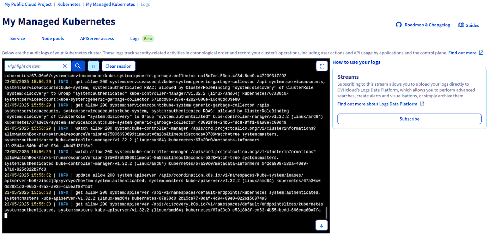
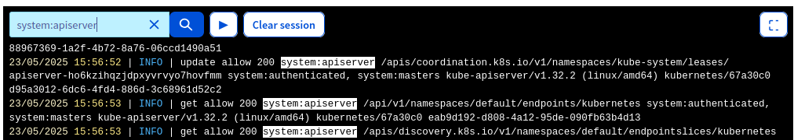
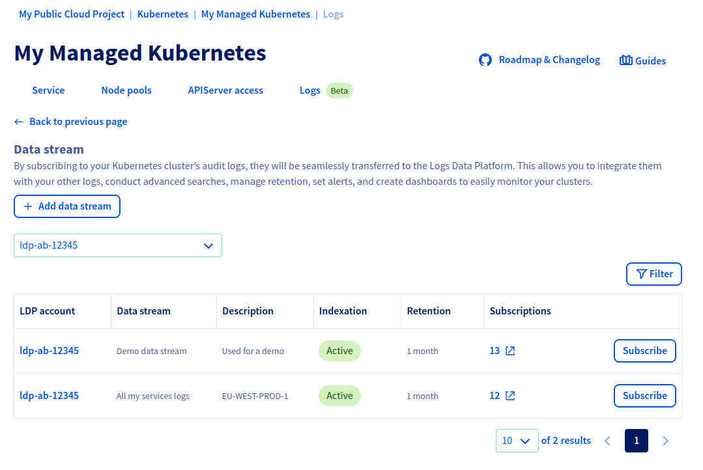
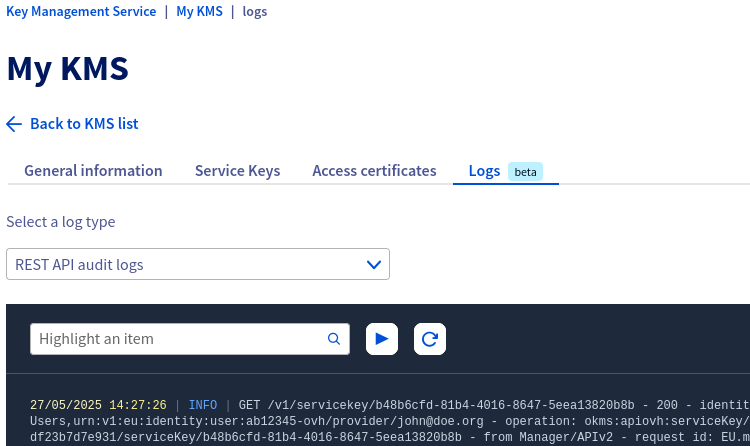
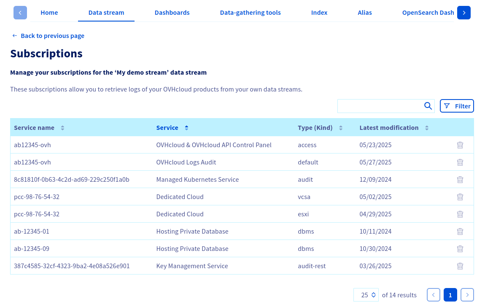
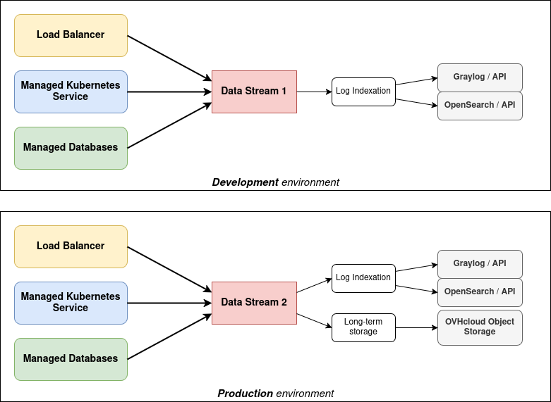
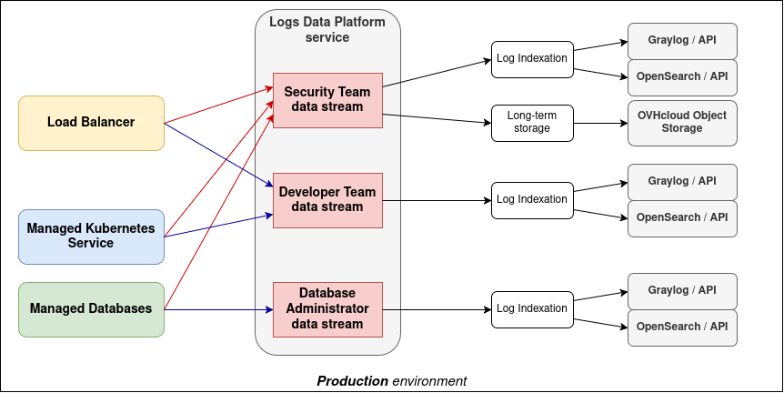

## Objective

This guide will help you to understand the concepts and usage of OVHcloud Service Logs: how to retrieve and use your OVHcloud services logs.

### What is OVHcloud Service Logs?

OVHcloud Service Logs is a solution that allows you to retrieve your OVHcloud products logs inside Logs Data Platform. It let you transform these logs into actionable data through the Logs Data Platform feature set:

- **Indexation**: make your logs searchable and query them using powerful search engines such as OpenSearch and Graylog
- **Dashboards**: visualize your logs in real-time or historically using advanced dashboards
- **Alerts**: get notified when specific conditions are met
- **Cold storage**: store your logs for long-term in a cost-effective way

Thanks to these features you can orchestrate these logs as you wish to create your own observability experience, with reversible open-source solutions, pay-as-you-go and cost control.

## Requirements

- A [Logs Data Platform](/links/manage-operate/ldp) account
- [At least one Stream](/pages/manage_and_operate/observability/logs_data_platform/getting_started_quick_start) created inside this account
- At least one instance of a product compatible with OVHcloud Service Logs (see the [list below](#compatible-ovhcloud-products)).

### Use cases

#### Application troubleshooting

OVHcloud Service Logs can be used to troubleshoot application and infrastructure issues by providing real-time access to logs from various sources. You can filter and search in these logs to identify annomalies and errors, which can help you diagnose and resolve problems more efficiently. In distributed cloud architectures, this can be particularly efficient as it allows you to correlate logs from different services in a single place.

#### Security and data compliance

OVHcloud Service Logs helps you to detect security threats early, comply with certifications and regulations, and efficiently archive your logs for years in a cost-effective way.

Combined with fine-grained access policies, you get precise control over who accesses specific data streams. Having this detailed level of control strengthens your security framework and improves your data management strategies.

#### Infrastructure monitoring

With OVHcloud Service Logs, you can closely monitor the overall health and performance of your infrastructure. You can set up alerts to automatically notify you when any anomalies are detected in your logs, allowing you to take proactive or even automatic measures to address them before they impact your users.

Get the most out of the Graylog UI and OpenSearch Dashboards by building easy-to-understand dashboards that can be shared accross your teams.

## Compatible OVHcloud products

Here is the list of compatible products with OVHcloud Service Logs so far.
Our ambition is to make all OVHcloud products compatible with OVHcloud Service Logs. We will endeavor to update this table as new availability evolves.

| Product name | Availability | Status | Guide link |
| :----------- | :----------- | :----: | :--------- |
| Security & Identity - OVHcloud Account - Activity | API only | Beta | [Generating OVHcloud account logs with Logs Data Platform](/pages/manage_and_operate/iam/iam-logs-forwarding) |
| Security & Identity - OVHcloud Account - Audit | API only | Beta | [Generating OVHcloud account logs with Logs Data Platform](/pages/manage_and_operate/iam/iam-logs-forwarding) |
| Security & Identity - OVHcloud Account - IAM | OVHcloud Control Panel & API | Beta | [Generating OVHcloud account logs with Logs Data Platform](/pages/manage_and_operate/iam/iam-logs-forwarding) |
| Security & Identity - Key Management Service | OVHcloud Control Panel & API | Beta | - |
| Public Cloud - Managed Kubernetes Service | OVHcloud Control Panel & API | Beta | [Managed Kubernetes Service Audit Logs Forwarding](/pages/public_cloud/containers_orchestration/managed_kubernetes/forwarding-audit-logs-to-logs-data-platform) |
| Public Cloud - Load Balancer | OVHcloud Control Panel & API | Beta | [Public Cloud Load Balancer TCP / HTTP / HTTPS Logs Forwarding](/pages/public_cloud/public_cloud_network_services/technical-resources-05-lb_logs_2_customers) |
| Public Cloud - Managed Databases | OVHcloud Control Panel & API | Beta | [Public Cloud Databases - How to setup logs forwarding](/pages/public_cloud/public_cloud_databases/databases_16_logs_to_customer) |
| Hosted Private Cloud - Managed VMware vSphere | API only | Beta | - |
| Hosting & Collaboration - Web Cloud Databases | OVHcloud Control Panel & API | Beta | [Web Cloud Databases - How to manage logs](/pages/web_cloud/web_cloud_databases/retrieve-logs) |
| Hosting & Collaboration - Microsoft Private Exchange | API only | Beta | - |
| Hosting & Collaboration - Microsoft Trusted Exchange | API only | Beta | - |
| Infrastucture solutions - OVHcloud Connect | API only | Beta | - |
| Infrastucture solutions - OVHcloud Load Balancer | API only | Beta | - |

## Instructions

### On the product side

On every product compatible with OVHcloud Service Logs you will find a `Logs`{.action} tab in the OVHcloud Control Panel. Once you click this tab, you will see the two main components of OVHcloud Service Logs: a **live-tail** panel and a **subscription** panel.

{.thumbnail}

#### Live-tail panel

On the left side, the live-tail panel lets you see the logs of this service in **real time**. It is useful to have a quick overview of the ongoing activity on this service.

It lets you pause/play the live-tail, clear the current session, scroll, and also includes a basic search:

{.thumbnail}

#### Subscription panel

On the right side, the subscription panel let you **subscribe** to this service's logs to make them available in your Logs Data Platform account, in the data stream(s) of your choice. This panel displays all your active log subscriptions for this service, and let you create new ones.

If you click on the `Subscribe`{.action} button (or `Subscribe to another data stream`{.action} if you already have some existing subscriptions), you will land on this page:

{.thumbnail}

This is where you have to select in which of your Logs Data Platform data streams you want this service logs to be available. Using the top left dropdown list, select your Logs Data Platform account. The datagrid in the center displays all the data streams in the selected Logs Data Platform account and shows you information about each data streams: its name/description, its retention and if indexing is enabled. It also shows you if this data stream already has some other active logs subscriptions.

The last column contains the `Subscribe`{.action} and `Unsubscribe`{.action} buttons. Clicking on `Subscribe`{.action} will start sending your service logs in the selected data stream, while clicking on `Unsubscribe`{.action} will stop sending them.

You can choose to create multiple subscription for a given service, to have this service logs available in multiple data streams. This can be useful for use cases which will be detailed further down this guide.

> [!primary]
>
> - Only the service logs generated **after** the subscription creation will be available in your data stream.
> - If you choose to unsubscribe, the logs already sent to your data stream will stay: they will only be deleted when they will reach you stream's configured retention. You just won't see newly generated logs.
> - Logs Data Platform is pay-as-you-go: you pay for the amount of logs sent in your data stream. If you subscribed to a product that generates no logs (because it has no activity), you won't pay anything.

#### Logs kinds

A given OVHcloud product can offer different type of logs you can subscribe to. These different types of logs are named "`kinds`". When a product has more than one log kind, the live-tail & subscriptions panels become contextualized to the selected kind:

{.thumbnail}

In this example the live-tail only display logs about the "`REST API audit logs`" and the subscriptions listed on the right panel are only the ones about "`REST API audit logs`". Selecting another kind in the top dropdown list will display a different live-tail content and different subscriptions.

This division of a product logs into several kinds is here to give you more flexibility. For example if a product has many kinds (e.g. `access`, `audit`, `error` and `ssh`) and you are only interested in `audit` logs, you can choose to subscribe only to this `audit` and not to the others. Another example: you are interested in `audit` logs and `error` logs, but you want to send these logs in two different data streams: that's possible by creating two subscriptions based on two different kinds targeting two different data streams.

We will dig this use case later in this guide.

### On the Logs Data Platform side

Now that you have created logs subscription(s), you can consume these logs the way you want in your Logs Data Platform data stream. Depending on your needs you can configure your data stream in different (non-exclusive) ways. For instance:

- Enabling indexation to benefit from the OpenSearch/Graylog feature set.
- Enabling [long-term storage](/pages/manage_and_operate/observability/logs_data_platform/archive_cold_storage) to safely keep your logs for years.
- Enabling web-socket to consume your logs from a third-party software such as [ldp-tail](/pages/manage_and_operate/observability/logs_data_platform/cli_ldp_tail).

All the possible ways to consume your logs are summarized in the [Introduction to Logs Data Platform](/pages/manage_and_operate/observability/logs_data_platform/getting_started_introduction_to_LDP).

> [!primary]
>
> In the case of OVHcloud Service Logs, all the "Log Generation" and "Log Ingestion" are managed by OVHcloud. You only have to care about the "Storage" and "Query and visualization" parts.

You can also manage your logs subscription from a data stream point of view. To do so, go to the Logs Data Platform section of the [OVHcloud Control Panel](/links/manager), select a service and click on the `Data stream`{.action} tab. In the table listing your streams you can see a `Subscriptions` column displaying you how many logs subscriptions target a given stream.

In this table, click the `...`{.action} button then click `Manage subscriptions`{.action}. The next page will list all the logs subscriptions targeting this data stream:

{.thumbnail}

For each subscription you can see the type of service it comes from, the service name and the subscribed logs kind.

You can also delete a logs subscription from this view by clicking the corresponding bin icon.

### Working with the API

To ease your integration jobs with OVHcloud Service Logs, we made the related API endpoints consistent across all OVHcloud products. This means all compatible products expose the **same** set of API endpoints, with the **same** suffixes, the **same** payloads and the **same** responses. The available endpoints are the following:

| **Method** | **Path**                                               | **Description**                                                   |
| :--------: | :----------------------------------------------------- | :---------------------------------------------------------------- |
| `GET`      | `/xxx/{serviceName}/log/kind`                          | List product's log kinds                                          |
| `GET`      | `/xxx/{serviceName}/log/kind/{name}`                   | Get the detail of a log kind                                      |
| `GET`      | `/xxx/{serviceName}/log/subscription`                  | List existing log subscription from this product instance         |
| `POST`     | `/xxx/{serviceName}/log/subscription`                  | Create a new log subscription from this product instance          |
| `GET`      | `/xxx/{serviceName}/log/subscription/{subscriptionId}` | Get the detail of a log subscription                              |
| `DELETE`   | `/xxx/{serviceName}/log/subscription/{subscriptionId}` | Delete a log subscription                                         |
| `POST`     | `/xxx/{serviceName}/log/url`                           | Generate a temporary URL to retrieve logs (used by the live-tail) |

#### OVHcloud Service Logs and the IAM cross-identity service delegation

You can face use cases where the product you want logs from and the Logs Data Platform service are not owned by the same OVHcloud account. Example:

- Alice is the  owner of a Managed Kubernetes Service instance.
- Bob is the owner of a Logs Data Platform instance.
- Alice wants her Managed Kubernetes Services logs to be available in Bob's Logs Data Platform data stream.

This is possible thanks to OVHcloud IAM:

- Bob needs to create an IAM policy to allow Alice's identity to use the `ldp:apiovh:output/graylog/stream/forwardTo` IAM action on his Logs Data Platform data stream.
- Then Alice will be able to use the `POST /cloud/project/{serviceName}/kube/{kubeId}/log/subscription` API endpoint, and give Bob's `streamId` in this endpoint payload.

You can find more information about IAM policies in the [How to use IAM policies using the OVHcloud Control Panel](/pages/account_and_service_management/account_information/iam-policy-ui) guide.

### Interesting strategies

As explained earlier, the model of OVHcloud Service Logs gives you a lot of flexibility regarding how you want to gather/isolate/consume your logs. In this section we will see some common patterns. These are just examples, they aren't an exhaustive list of all the OVHcloud Service Logs configuration possibilites.

#### Many products to One data stream, per environment

In this example let say you have a tech stack composed of many OVHcloud products. This stack is deployed on multiple environments (development, production). One interesting strategy could be to send each environment's logs to a different data stream, and configure these 2 data streams in a different way:

{.thumbnail}

In the configuration above:

- All the logs of your development environment are available in a data stream. Only the indexation feature is enabled on this data stream.
- All the logs of your production environment are available in another data stream. The indexation and long-term storage feature are both enabled.

This means that:

- your development environment logs won't be long-term stored, as you probably don't need it and don't want to pay for it.
- your production environment logs will be stored in a dedidated data stream, making it easier for you to configure some alerting or dashboarding based on this stream.

### Many products to Many data streams

Lets take the same example again, where you have a tech stack made of several OVHcloud products. But in this case you have multiple teams, each one working on a different component. For security reasons you want the team `A` to access the Load Balancer logs but not the Managed Databases logs.
Also you have a Security team that needs to access all the audit logs of each component. We can imagine a setup such as the following one:

{.thumbnail}

In the configuration above:

- All the Load Balancer & Managed Kubernetes *applicative* logs are sent to a data stream (blue arrow).
- All the Managed Databases *applicative* logs are sent to another data stream (blue arrow).
- All their *audit* logs are sent to another data stream (red arrow).

This means that:

- you can grant your Security Team to see only the data stream containing all the audit logs of all the components of your tech stack.
- you can grant your Developer Team to see only the data stream containing the Load Balancer / Managed Kubernetes logs.
- you can grant your Database Administrator Team to see only the data stream contaning your Managed Database logs/
- you can configure the indexation/long-term storage/etc. as you wish on each of these streams. You can also set different retentions for each stream.

## Go further

- Getting Started: [Quick Start](/pages/manage_and_operate/observability/logs_data_platform/getting_started_quick_start)
- Documentation: [Guides](/products/observability-logs-data-platform)
- Create an account: [Try it!](https://www.ovh.com/en/order/express/#/express/review?products=~(~(planCode~'logs-account~productId~'logs))){.external}

Join our [community of users](/links/community).