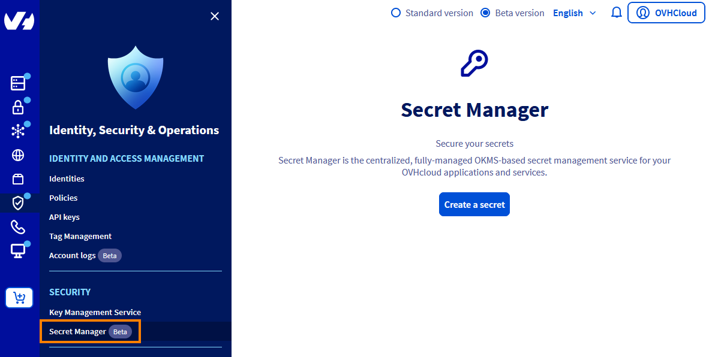
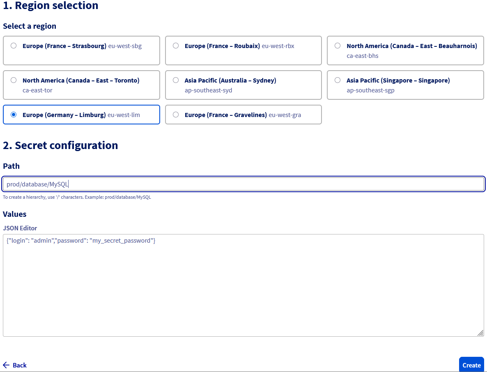
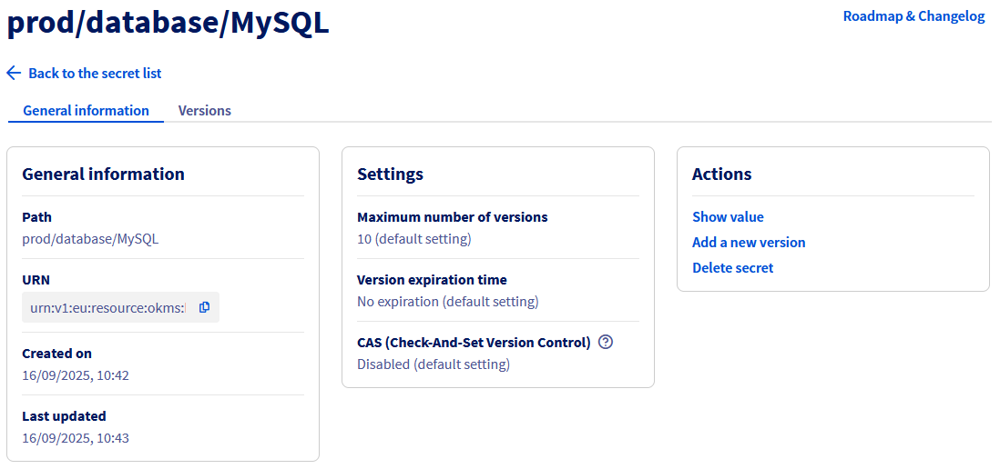
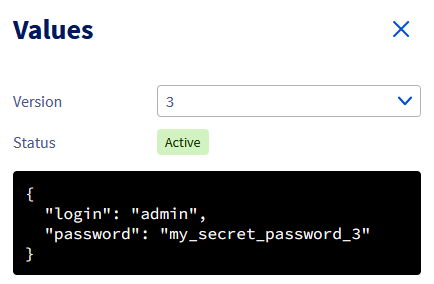
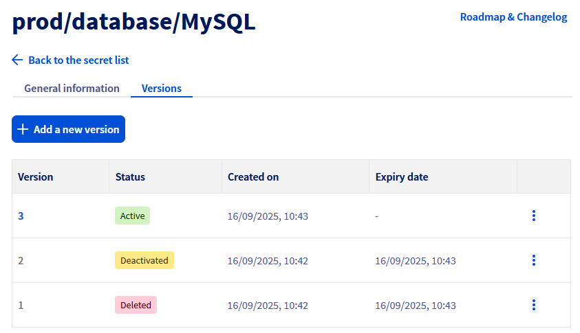
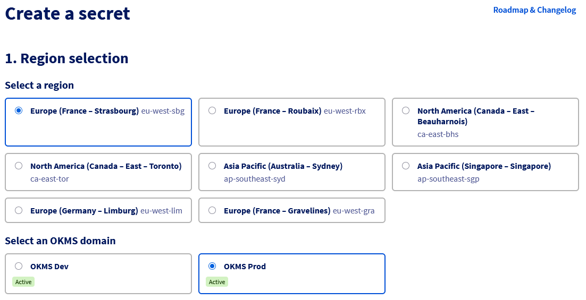
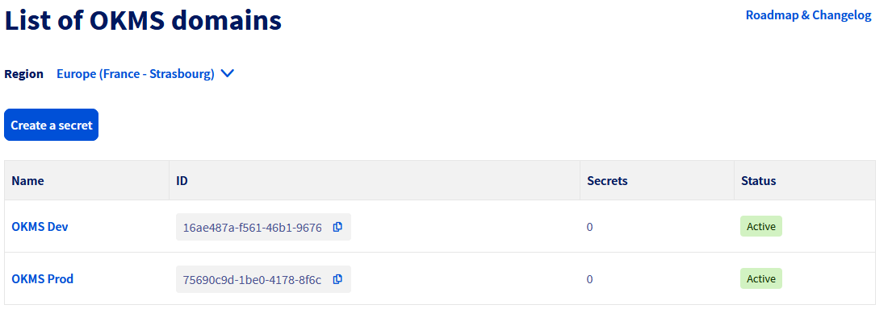

> [!primary]
> Secret Manager is currently in beta phase. This guide can be updated in the future with the advances of our teams in charge of this product.

## Objective

The objective of this guide is to present the use of the Secret Manager through the OVHcloud Control Panel.

## Requirements

- An [OVHcloud customer account](/pages/account_and_service_management/account_information/ovhcloud-account-creation).

## Instructions

### Description

The Secret Manager is a product that allows you to securely store credentials, API keys, SSH keys, or any other type of secret necessary for the operation of your applications.

A secret is a collection of one or more key-value pairs grouped within a version.
Each modification of a secret creates a new version of that secret, allowing you to go back in the history of changes to the secret.

### Creating a Secret

The Secret Manager is accessible from the `Identity, Security & Operations`{.action} menu in the `Security`{.action} section.

{.thumbnail}

To create a secret, click directly on the `Create a secret`{.action} button.

Then select the region where you want to create the secret.

> [!primary]
>
> When creating a secret for the first time in a new region, a prior activation step is necessary by clicking on the Activate button to create an OKMS domain in the selected region.
> This activation may take a few minutes to take effect.

Indicate the `Path` of the secret, for example **prod/database/MySQL**. This path will serve to hierarchize the secrets among themselves.

Then indicate the content of the secret. The secret must contain a list of key-value pairs entered in JSON format:

```json
{
    "login": "admin",
    "password": "my_secret_password"
}
```

{.thumbnail}

> [!primary]
>
> There is no limit to the number of key-value pairs in a secret, however the total data size must not exceed 64KB.

Once the secret is created, it appears in the list of secrets in the Secret Manager.

### Managing Secrets

Once a secret is created, the list of secrets is displayed in the Control Panel.
A selector is present to navigate between the different regions where a secret is present.

It is possible to access the configuration of the secret by clicking on it in the list of secrets to display its content, create a new version, or delete it.

The secret dashboard displays several pieces of information, such as general information and parameters applying to the secret:

- Maximum number of versions: Beyond the indicated value, the oldest version is deleted.
- Expiration period of a version: Beyond the indicated period, the version is disabled.
- CAS: If activated, it is necessary to systematically specify the current version number when making changes.

{.thumbnail}

#### Accessing the Content of a Secret

A user with the necessary IAM rights can access the content of a secret.

> [!primary]
>
> The rights to list a version (**okms:apiovh:secret/get**) are different from the right to retrieve the content of this version (**okms:apiovh:secret/version/getData**).

To do this, click on `Display the value`{.action} in the secret dashboard.

A side panel opens with the content of the most recent version of the secret.

{.thumbnail}

A selector allows you to navigate between different versions of the secret, and view the status of the selected version.
If the version is disabled or deleted, no value is displayed.

#### Managing Versions

To access the versions of a secret, a `Versions` tab takes you to the table listing all versions of a secret.
Each modification of a secret creates a new version.

{.thumbnail}

A version can be either:

- Active: The value of this version is accessible.
- Disabled: The value of this version is still present in the system but is no longer accessible until the version is reactivated.
- Deleted: The value of this version is no longer present in the system and cannot be restored.

The action buttons for each version allow you to display the value, disable or reactivate the version, or delete it.

A version deleted by the **Maximum number of versions** parameter no longer appears in the list of versions.

### Managing the OKMS Domain

The OKMS domain of the Secret Manager is shared with the OKMS domain of the Key Management Service.
Creating or deleting an OKMS domain therefore has consequences for both products.

In the context of the Secret Manager beta, it is not yet possible to modify the OKMS domain configuration via the graphical interface.

#### Multi-OKMS Domain Case

In the case where at least two OKMS domains are already present in a region, an additional selection step appears when creating a secret.

{.thumbnail}

Furthermore, in the list of secrets, if a region contains multiple OKMS domains, an intermediate table is present to select the target OKMS domain.

{.thumbnail}

In the context of the Secret Manager beta, it is not yet possible to add an OKMS domain in a region via the graphical interface.

### Using the Secret Manager via API

The Secret Manager is accessible via two different API sets:

- A [REST API](/pages/manage_and_operate/secret_manager/secret_manager-rest-api) similar to OVHcloud's standard APIs.
- A [Hashicorp Vault KV2 compliant API](/pages/manage_and_operate/secret_manager/secret_manager-kv2-api) providing compatibility with applications already compatible with Hashicorp Vault KV2.

Both APIs manipulate the same objects. A secret created by one method is accessible by the other method.

## Go further

Join our [community of users](/links/community).