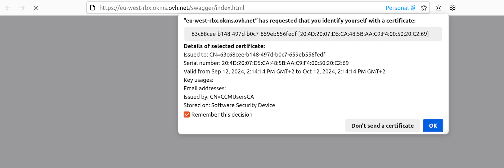

## Objectif

L'objectif de ce guide est de présenter l'usage de l'API compatible Hashicorp Vault KV2 pour le Secret Manager.

## Prérequis

- Disposer d'un [compte client OVHcloud](/pages/account_and_service_management/account_information/ovhcloud-account-creation).
- Avoir [commandé un domaine OKMS](/pages/manage_and_operate/kms/quick-start) ou [créé un premier secret](/pages/manage_and_operate/secret_manager/secret-manager-ui).

## En pratique

### Description

Le Secret Manager est un produit vous permettant de stocker de manière sécurisée les credentials, clés d'API, clés SSH ou tout autre type de secret nécessaire au fonctionnement de vos applications.

Un secret est une collection d'une ou plusieurs clés/valeurs regroupées au sein d'une version.
Chaque modification d'un secret amène la création d'une nouvelle version de ce secret, permettant de remonter dans l'historique des modifications du secret.

Les API compatibles Hashicorp Vault KV2 sont l'un des deux jeux d'API offerts par le Secret Manager avec les [API REST](/pages/manage_and_operate/secret_manager/secret_manager-rest-api).
Elles sont conçues pour être similaires aux API Hashicorp Vault afin d'assurer une compatibilité avec les applications déjà compatibles avec Hashicorp Vault.

### Communiquer avec le domaine OKMS

La communication avec le domaine OKMS pour les actions de chiffrement et de signature est disponible via l'API.

Le domaine OKMS étant régionalisé, l'accès à l'API se fait directement sur la région de celui-ci : `https://my-region.okms.ovh.net`.

Par exemple, pour un domaine OKMS créé sur la région **eu-west-rbx** : <https://eu-west-rbx.okms.ovh.net>.

Il est possible de communiquer avec le domaine OKMS en utilisant :

- L'interface utilisateur Swagger
- La CLI OKMS : <https://github.com/ovh/okms-cli>
- Le SDK Golang : <https://pkg.go.dev/github.com/ovh/okms-sdk-go>

### Utilisation de l'API OKMS via l'interface utilisateur Swagger

Il est possible d'accéder au Swagger correspondant à votre domaine OKMS en cliquant sur le lien présent dans [l'espace client OVHcloud](/links/manager) au niveau du dashboard de votre domaine OKMS.

{.thumbnail}

Vous êtes alors redirigé sur la version non authentifiée de l'interface utilisateur Swagger, qui est destinée à la documentation de l'API. Si vous souhaitez utiliser l'interface utilisateur Swagger pour effectuer des requêtes sur votre propre domaine OKMS, vous devez basculer vers la version authentifiée, dont le lien se trouve dans la section description :

{.thumbnail}

Les étapes suivantes vous guideront sur la façon de vous authentifier.

#### Import de vos informations d'identification OKMS dans le navigateur

Pour accéder à l'interface utilisateur Swagger authentifiée, vous devez charger votre [certificat d'accès OKMS](/pages/manage_and_operate/kms/okms-certificate-management) dans le gestionnaire de certificats du navigateur.

Pour cela, il faut le convertir au format PKCS#12. PKCS#12 est un format binaire permettant de stocker une chaîne de certificats et une clé privée dans un seul fichier chiffré. Il est couramment utilisé pour importer et exporter des certificats et des clés privées, en particulier dans les environnements qui nécessitent un transport sécurisé de ces éléments, tels que les serveurs web et les applications clientes.

Pour convertir vos informations d'identification au domaine OKMS (normalement nommés `ID_certificate.pem` et `ID_privatekey.pem`) en PKCS#12 avec la CLI openssl, utilisez la commande suivante :

```bash
openssl pkcs12 -export -in ID_certificate.pem  -inkey ID_privatekey.pem -out client.p12
```

Vous serez invité à entrer un mot de passe qui sera utilisé pour le chiffrement symétrique du contenu du fichier.
Vous devez ensuite l'importer dans votre navigateur web.

##### Sur Firefox

- Tapez `about:preferences#privacy` dans la barre d'adresse.
- Faites défiler vers le bas jusqu'à atteindre une section intitulée `Certificats`{.action}.

{.thumbnail}

- Cliquez sur `Afficher les Certificats...`{.action} pour ouvrir le gestionnaire de certificats.
- Accédez à l'onglet intitulé `Vos Certificats`{.action}, puis cliquez sur `Importer...`{.action} et sélectionnez l'emplacement de votre fichier `client.p12`.
- Vous serez invité à entrer le mot de passe que vous avez utilisé lors de la création du fichier PKCS#12.
- Après avoir entré le mot de passe, votre certificat sera importé et prêt à l'emploi.

##### Sur Chrome/Chromium

- Tapez `chrome://settings/certificates` dans la barre d'adresse.
- Accédez à l'onglet `Vos certificats`{.action}. Cliquez sur `Importer`{.action} et sélectionnez votre fichier `client.p12`.
- Vous serez invité à entrer le mot de passe que vous avez utilisé lors de la création du fichier PKCS#12.
- Après avoir entré le mot de passe, votre certificat sera importé et prêt à l'emploi.

{.thumbnail}

#### Accès à l'interface utilisateur Swagger authentifiée

Une fois votre certificat chargé dans votre navigateur, vous pouvez accéder à l'interface utilisateur Swagger authentifiée.

Vous serez invité à vous identifier avec un certificat. Sélectionnez le certificat PKCS#12 précédemment importé dans la liste déroulante.

{.thumbnail}

Vous pouvez maintenant utiliser l'interface utilisateur Swagger de manière interactive.

### Créer un secret

Pour créer un secret, il est possible d'utiliser l'API suivante :

| **Méthode** |             **Chemin**              | **Description** |
| :---------: | :---------------------------------: | :-------------: |
|    POST     | /api/{okmsId}/v1/secret/data/{path} | Créer un secret |

Le chemin du secret devant être indiqué dans le chemin de l'API.

L'API attend les valeurs suivantes :

| **Champ** | **Valeur** |                        **Description**                        |
| :-------: | :--------: | :-----------------------------------------------------------: |
|   data    |    Json    | Contenu du secret. Il est possible d'avoir des JSON imbriqués |
|    cas    |  Integer   |            (optionnel) Version actuelle du secret             |

Par exemple :

```json
{
  "data": {
      "login": "admin",
      "password": "my_secret_password",
      "address": {
        "ip": "1.1.1.1"
      },
      "ports": [
        "30",
        "31"
      ]
  },
  "options": {
      "cas": 0
  }
}
```

Il est aussi possible d'ajouter des métadonnées au secret par l'API :

| **Méthode** |               **Chemin**                |            **Description**             |
| :---------: | :-------------------------------------: | :------------------------------------: |
|    POST     | /api/{okmsId}/v1/secret/metadata/{path} | Mettre à jour les métadonnées d'un secret |

L'API attend les valeurs suivantes :

|        **Champ**         |                                       **Valeur**                                       |                                                **Description**                                                 |
| :----------------------: | :------------------------------------------------------------------------------------: | :------------------------------------------------------------------------------------------------------------: |
|       cas_required       |                                         booléen                                         | Si activé, il est nécessaire de systématiquement préciser le numéro de version actuelle lors des modifications |
|     custom_metadata      |                                          Json                                          |          Données complémentaires associées au secret. Ces données ne sont pas protégées par le secret          |
| deactivate_version_after | [Duration String](https://developer.hashicorp.com/vault/docs/concepts/duration-format) |                               Durée après laquelle les versions sont désactivées                                |
|       max_versions       |                                        Integer                                         |                                   Nombre maximal de versions pour le secret                                    |

Par exemple :

```json
{
  "cas_required": true,
  "custom_metadata": {
    "project": "A",
    "team": "X"
  },
  "deactivate_version_after": "10h30m10s",
  "max_versions": 5
}
```

### Gérer les secrets

#### Mettre à jour les métadonnées et la configuration

Une fois le secret créé, il est possible de mettre à jour les métadonnées du secret ainsi que sa configuration.

| **Méthode** |               **Chemin**                |            **Description**             |
| :---------: | :-------------------------------------: | :------------------------------------: |
|    PATCH    | /api/{okmsId}/v1/secret/metadata/{path} | Mettre à jour les métadonnées d'un secret |

L'API attend les valeurs suivantes :

|        **Champ**         |                                       **Valeur**                                       |                                                **Description**                                                 |
| :----------------------: | :------------------------------------------------------------------------------------: | :------------------------------------------------------------------------------------------------------------: |
|       cas_required       |                                         booléen                                         | Si activé, il est nécessaire de systématiquement préciser le numéro de version actuelle lors des modifications |
|     custom_metadata      |                                          Json                                          |          Données complémentaires associées au secret. Ces données ne sont pas protégées par le secret          |
| deactivate_version_after | [Duration String](https://developer.hashicorp.com/vault/docs/concepts/duration-format) |                               Durée après laquelle les versions sont désactivées                                |
|       max_versions       |                                        Integer                                         |                                   Nombre maximal de versions pour le secret                                    |

Il est aussi possible de changer la configuration par défaut du domaine OKMS pour les valeurs **cas_required**, **deactivate_version_after** et **max_versions** par l'API :

| **Méthode** |           **Chemin**           |                   **Description**                    |
| :---------: | :----------------------------: | :--------------------------------------------------: |
|    POST     | /api/{okmsId}/v1/secret/config | Configurer la configuration par défaut du domaine OKMS |

#### Créer une nouvelle version

Il est aussi possible de modifier le contenu du secret, ce qui implique la création d'une nouvelle version pour ce secret.
Les nouvelles versions peuvent être créées par l'API :

| **Méthode** |             **Chemin**              |     **Description**     |
| :---------: | :---------------------------------: | :---------------------: |
|    PATCH    | /api/{okmsId}/v1/secret/data/{path} | Mettre à jour un secret |

Un secret peut contenir autant de versions que souhaitées dans la limite maximale du paramètre **max_versions**
Si le maximum de version est atteint, la plus ancienne version est automatiquement supprimée.

#### Gérer les versions

Il est possible de gérer les différentes versions du secret par plusieurs API :

| **Méthode** |              **Chemin**               |               **Description**               |
| :---------: | :-----------------------------------: | :-----------------------------------------: |
|    POST     | /api/{okmsId}/v1/secret/delete/{path} | Désactive les versions spécifiées du secret |
|   DELETE    |  /api/{okmsId}/v1/secret/data/{path}  |   Désactive la dernière version du secret   |

Les versions désactivées d'un secret sont encore présentes dans le Secret Manager mais leur contenu n'est plus accessible.

Il est possible de réactiver une version par l'API :

| **Méthode** |               **Chemin**                |               **Description**               |
| :---------: | :-------------------------------------: | :-----------------------------------------: |
|    POST     | /api/{okmsId}/v1/secret/undelete/{path} | Réactive les versions spécifiées du secret |

Enfin il est possible de supprimer définitivement une version par l'API :

| **Méthode** |               **Chemin**               |               **Description**               |
| :---------: | :------------------------------------: | :-----------------------------------------: |
|     PUT     | /api/{okmsId}/v1/secret/destroy/{path} | Supprime les versions spécifiées du secret |

Il est aussi possible de supprimer définitivement l'intégralité du secret avec toutes ses versions :

| **Méthode** |               **Chemin**               |               **Description**               |
| :---------: | :------------------------------------: | :-----------------------------------------: |
|     DELETE     | /api/{okmsId}/v1/secret/metadata/{path} | Supprime le secret et ses versions |

> [!warning]
> Une version supprimée n'est plus présente dans le Secret Manager et ne peut plus être réactivée.

## Aller plus loin

Échangez avec notre [communauté d'utilisateurs](/links/community).