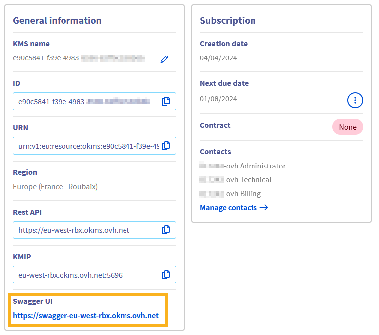
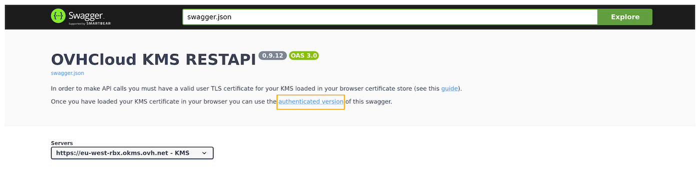
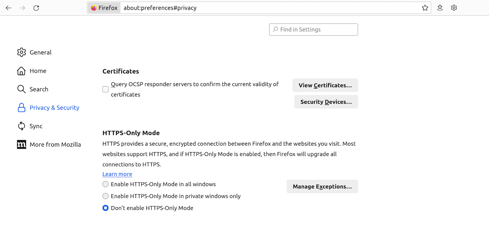
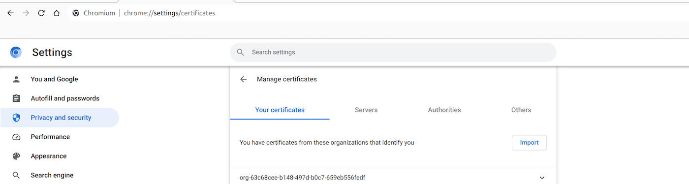

## Objective

The objective of this guide is to present the use of the REST API for the Secret Manager.

## Requirements

- An [OVHcloud customer account](/pages/account_and_service_management/account_information/ovhcloud-account-creation).
- Have [ordered an OKMS domain](/pages/manage_and_operate/kms/quick-start) or [created a first secret](/pages/manage_and_operate/secret_manager/secret-manager-ui).

## Instructions

### Description

The Secret Manager is a product that allows you to securely store credentials, API keys, SSH keys, or any other type of secret necessary for the operation of your applications.

A secret is a collection of one or more key-value pairs grouped within a version.
Each modification of a secret creates a new version of that secret, allowing you to go back in the history of changes to the secret.

The REST APIs are one of the two API sets offered by the Secret Manager, along with the [Hashicorp Vault KV2 compliant API](/pages/manage_and_operate/secret_manager/secret_manager-kv2-api).
These APIs are designed to be similar to the OVHcloud API set and the OKMS APIs for the Key Management Service.

The REST APIs can be used either through the [centralized OVHcloud API](/pages/manage_and_operate/api/apiv2) or directly on the OKMS domain in the region.
The only difference lies in the exact API path:

- Centralized OVHcloud API: /v2/okms/resource/{okmsId}/secret/{path}
- Regionalized OKMS API: /api/{okmsId}/v2/secret/{path}

This documentation will focus on the APIs of the OKMS domain in the region.

### Contacting the OKMS domain

Communication with the OKMS domain for encryption and signature actions is available via APIs.

Since the OKMS domain is regionalized, you can access the API directly in its region: `https://my-region.ovh.com.net`.

For example, for a OKMS domain created in the **eu-west-rbx** region: <https://eu-west-rbx.okms.ovh.net>.

It's possible to communicate with the OKMS domain using:

- The Swagger UI
- The OMKS CLI: <https://github.com/ovh/okms-cli>
- The Golang SDK: <https://pkg.go.dev/github.com/ovh/okms-sdk-go>

### Using the OKMS API via the Swagger UI

You can access the OKMS Swagger UI by clicking on the link in the [OVHcloud Control Panel](/links/manager), in your OKMS domain dashboard.

{.thumbnail}

You will land on the non-authenticated version of the Swagger UI, that is meant for API documentation purposes. If you want to use the Swagger UI to make requests on your own OKMS domain, you will need to switch to the authenticated version, whose link is in the description section:

{.thumbnail}

The next steps will guide you on how to authenticate.

#### Importing your OKMS credentials into the browser

To access the authenticated Swagger UI, you need to load your [OKMS access certificate](/pages/manage_and_operate/kms/okms-certificate-management) into the browser Certificate Manager.

For that, it is required to convert it to PKCS#12 format. PKCS#12 is a binary format for storing a certificate chain and private key in a single, encrypted file. It is commonly used for importing and exporting certificates and private keys, especially in environments that require secure transport of these items, such as web servers and client applications.

To convert your OKMS domain credentials (assuming you saved them into files named `ID_certificate.pem` and `ID_privatekey.pem`) to PKCS#12 with the openssl Command Line Interface, use the following command:

```bash
openssl pkcs12 -export -in ID_certificate.pem  -inkey ID_privatekey.pem -out client.p12
```

You will be prompted to enter a password that will be used for the symmetrical encryption of the file content.
Then, you need to import it into your web browser.

##### On Firefox

- Type `about:preferences#privacy` into the address bar.
- Scroll down until reaching a section named `Certificates`{.action}.

{.thumbnail}

- Click `View Certificates...`{.action} to open the Certificate Manager.
- Go to the tab named `My Certificates`{.action}, then `Import...`{.action} and select the location of your `client.p12` file.
- You will be prompted to enter the password you used during the PKCS#12 file creation.
- After entering the password, your certificate will be imported and ready for use.

##### On Chrome/Chromium

- Type `chrome://settings/certificates` into the address bar.
- Go to the `Your certificates`{.action} tab. Click `Import`{.action} and select your `client.p12` file.
- You will be prompted to enter the password you used during the PKCS#12 file creation.
- After entering the password, your certificate will be imported and ready for use.

{.thumbnail}

#### Accessing the authenticated Swagger UI

Once your certificate is loaded into your browser, you can go to the authenticated Swagger UI.

You will be prompted to identify yourself with a certificate. Select the previously imported PKCS#12 certificate in the drop-down list.

{.thumbnail}

You can now use the Swagger UI interactively.

### Create a Secret

To create a secret, you can use the following API:

| **Method** |         **Path**         | **Description** |
| :--------: | :----------------------: | :-------------: |
|    POST    | /api/{okmsId}/v2/secret/ | Create a Secret |

The API expects the following values:

|        **Field**         |                                       **Value**                                        |                                           **Description**                                            |
| :----------------------: | :------------------------------------------------------------------------------------: | :--------------------------------------------------------------------------------------------------: |
|       cas_required       |                                        boolean                                         | If enabled, it is necessary to systematically specify the current version number when making changes |
|     custom_metadata      |                                          Json                                          |         Additional data associated with the secret. This data is not protected by the secret         |
| deactivate_version_after | [Duration String](https://developer.hashicorp.com/vault/docs/concepts/duration-format) |                            Duration after which versions are deactivated                             |
|       max_versions       |                                        Integer                                         |                              Maximum number of versions for the secret                               |
|           path           |                                         String                                         |                                             Secret path                                              |
|         version          |                                          Json                                          |                          Secret content. It is possible to have nested JSON                          |

For example:

```json
{
  "metadata": {
    "cas_required": true,
    "custom_metadata": {
      "project": "A",
      "team": "X"
    },
    "deactivate_version_after": "10h30m10s",
    "max_versions": 5
  },
  "path": "prod/database/MySQL",
  "version": {
    "data": {
      "login": "admin",
      "password": "my_secret_password",
      "address": {
        "ip": "1.1.1.1"
      },
      "ports": [
        "30",
        "31"
      ]
    }
  }
}
```

### Manage Secrets

#### Update Metadata and configuration

Once the secret is created, it is possible to update the secret's metadata or configuration.

| **Method** |     **Path**      | **Description** |
| :--------: | :---------------: | :-------------: |
|    PUT     | /v2/secret/{path} | Update a secret |

The API expects the following values:

|        **Field**         |                                       **Value**                                        |                                           **Description**                                            |
| :----------------------: | :------------------------------------------------------------------------------------: | :--------------------------------------------------------------------------------------------------: |
|       cas_required       |                                        boolean                                         | If enabled, it is necessary to systematically specify the current version number when making changes |
|     custom_metadata      |                                          Json                                          |         Additional data associated with the secret. This data is not protected by the secret         |
| deactivate_version_after | [Duration String](https://developer.hashicorp.com/vault/docs/concepts/duration-format) |                            Duration after which versions are deactivated                             |
|       max_versions       |                                        Integer                                         |                              Maximum number of versions for the secret                               |

It is also possible to change the default configuration of the OKMS domain for the values **cas_required**, **deactivate_version_after**, and **max_versions** using the API:

| **Method** |     **Path**     |                 **Description**                  |
| :--------: | :--------------: | :----------------------------------------------: |
|    PUT     | /v2/secretConfig | Set the default configuration of the OKMS domain |

#### Create a new version

It is also possible to modify the secret's content, which implies creating a new version for the secret.
New versions can be created using the API:

| **Method** |         **Path**          |         **Description**          |
| :--------: | :-----------------------: | :------------------------------: |
|    PUT     |     /v2/secret/{path}     |         Update a secret          |
|    PUT     | /v2/secret/{path}/version | Create a new version of a secret |

Whether the modification of the **data** of the secret is done using the general API for updating the secret or the specific API, a new version of the secret is created.

A secret can contain as many versions as desired, up to the maximum limit of the **max_versions** parameter.
If the maximum number of versions is reached, the oldest version is automatically deleted.

#### Manage versions

It is possible to manage the different versions of the secret using the API:

| **Method** |              **Path**               |        **Description**         |
| :--------: | :---------------------------------: | :----------------------------: |
|    PUT     | /v2/secret/{path}/version/{version} | Update the version of a secret |

The API expects the unique value:

| **Field** |           **Value**           |                                                                                                                                       **Description**                                                                                                                                       |
| :-------: | :---------------------------: | :-----------------------------------------------------------------------------------------------------------------------------------------------------------------------------------------------------------------------------------------------------------------------------------------: |
|   state   | active , deactivated, deleted | active: The value of this version is accessible <br>deactivated: The value of this version is still present in the system but is no longer accessible until the version is reactivated <br>deleted: The value of this version is no longer present in the system and cannot be restored. |

## Go further

Join our [community of users](/links/community).