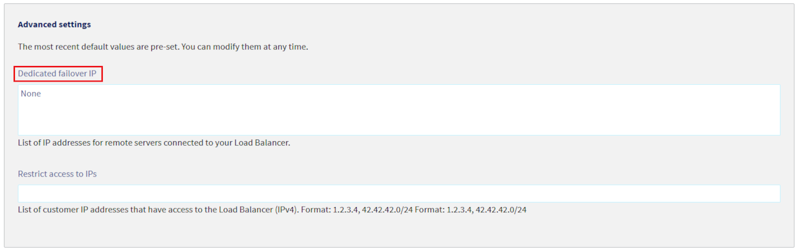

## Objectif

Une Additional IP est une adresse IP basculable d'un service à l'autre. Elle offre donc la possibilité de disposer d'une infrastructure résistant à une grande diversité de problèmes (pannes matérielles, surcharges de vos services, maintenance...).

Pour plus d'informations sur l'Additional IP, nous vous recommandons la lecture du [document de présentation](/links/bare-metal/ip).

Le service OVHcloud Load Balancer offre quant à lui des fonctionnalités de répartition de charge sur différents protocoles : HTTP, HTTPS, TCP et UDP. Associé à une Additional IP, il devient possible de basculer votre infrastructure existante vers un Load Balancer sans perturber ou interrompre les services de vos clients. En effet il n'y aura désormais plus de changement d'adresse IP dans la mesure où vous utiliserez toujours l'Additional IP, donc pas de délai de propagation des DNS.

Pour plus d'informations sur la solution Load Balancer OVHcloud, veuillez lire notre [Introduction à Load Balancer OVHcloud](/pages/network/load_balancer/use_presentation).

**Ce guide explique comment utiliser une Additional IP avec le service Load Balancer OVHcloud.**

## Prérequis

- Un [Load Balancer OVHcloud](/links/network/load-balancer) configuré
- Une [Additional IP](/links/bare-metal/ip)
- Accès à [l'espace client OVHcloud](/links/manager)
- Accès à [l'API OVHcloud](/links/api)

> [!primary]
>
> **Configuration requise du Load Balancer**
>
> Une fois que vous confirmez les modifications dans la liste des Additional IPs associées au Load Balancer, la configuration doit être rafraîchie. Plusieurs conditions doivent être remplies pour que cela fonctionne :
> 
> - **Configuration vRack :** Si le Load Balancer est dans un vRack, toutes les fermes doivent également être dans le vRack, et le Load Balancer doit avoir son vLAN défini. Sinon, il ne doit pas y avoir de fermes dans un vRack.
>
> - **Validité du frontend :** Il doit exister au moins un frontend, et tous les frontends doivent être valides. Ils peuvent être activés ou désactivés, mais doivent avoir soit :
>    - une route valide (avec des règles de routage)
>    - une redirection (`redirectLocation`{.action})
>    - une ferme par défaut
>
> - **État de la configuration :** Le Load Balancer ne doit pas être en cours de rafraîchissement. Un Load Balancer ne peut pas être rafraîchi plusieurs fois en même temps, car cela empêcherait les modifications d'être appliquées à la configuration résultante.
>

## En pratique

Dans ce document, nous aborderons deux cas d'utilisation distincts :

- lier une Additional IP à l'ensemble du service Load Balancer OVHcloud
- lier une Additional IP à un seul frontend du service Load Balancer OVHcloud

### Ajouter une Additional IP au Load Balancer OVHcloud

Vous pouvez lier ces adresses IP à votre Load Balancer OVHcloud via l'[API OVHcloud](https://api.ovh.com).
L'appel API correspondant est le suivant :

> [!api]
>
> @api {v1} /ip POST /ip/{ip}/move
> 

Vous pouvez ensuite lister les Additional IPs liées à votre Load Balancer OVHcloud avec l'appel API suivant :

> [!api]
>
> @api {v1} /ipLoadbalancing GET /ipLoadbalancing/{serviceName}/failover
>

Les Additional IPs liées de cette manière sont disponibles pour **tous** vos frontends. Cela diffère du cas suivant, où une Additional IP est liée à un seul frontend.

### Ajouter une Additional IP dédiée à un frontend

Quel que soit le type de frontend, vous pouvez définir une liste d'Additional IPs qui y seront liées. Dans ce cas précis, votre Additional IP sera attachée à **un seul** frontend. En conséquence, elle n'accordera l'accès qu'au service fourni par ce frontend. Les services de vos autres frontends resteront accessibles via l'adresse IP principale de votre Load Balancer.

#### Via l'API

**Si vous créez un frontend :**

Depuis l'[API OVHcloud](https://api.ovh.com), vous pouvez utiliser les appels suivants pour définir une ou plusieurs Additional IPs sur un frontend lors de sa création :

- Protocole HTTP

> [!api]
>
> @api {v1} /ipLoadbalancing POST /ipLoadbalancing/{serviceName}/http/frontend
> 

- Protocole TCP

> [!api]
>
> @api {v1} /ipLoadbalancing POST /ipLoadbalancing/{serviceName}/tcp/frontend
> 

- Protocole UDP

> [!api]
>
> @api {v1} /ipLoadbalancing POST /ipLoadbalancing/{serviceName}/udp/frontend
> 

**Si vous mettez à jour un frontend existant :**

Depuis l'[API OVHcloud](https://api.ovh.com), vous pouvez utiliser les appels suivants pour définir une ou plusieurs Additional IPs sur un frontend existant :

- Protocole HTTP

> [!api]
>
> @api {v1} /ipLoadbalancing PUT /ipLoadbalancing/{serviceName}/http/frontend/{frontendId}
> 

- Protocole TCP

> [!api]
>
> @api {v1} /ipLoadbalancing PUT /ipLoadbalancing/{serviceName}/tcp/frontend/{frontendId}
> 

- Protocole UDP

> [!api]
>
> @api {v1} /ipLoadbalancing PUT /ipLoadbalancing/{serviceName}/udp/frontend/{frontendId}
> 

#### Via l'espace client OVHcloud

Vous pouvez définir des Additional IPs dédiées via l'[espace client OVHcloud](/links/manager) en accédant à la section `Réseau`{.action}, puis à `Load Balancer`{.action}.

Une fois que vous avez sélectionné le Load Balancer que vous souhaitez modifier, accédez à l'onglet `frontends`{.action}, où vous pouvez créer un nouveau frontend ou modifier un frontend existant.

Dans `Paramètres avancés`{.action}, vous pouvez sélectionner les Additional IPs que vous souhaitez associer à votre frontend.

{.thumbnail}

Une fois le frontend configuré, cliquez sur `Ajouter`{.action} ou `Mettre à jour`{.action}, selon que vous configurez un nouveau frontend ou un frontend existant.

N’oubliez pas de déployer la configuration. Il existe deux façons de le faire :

- via la section `Statut`{.action} de l’onglet `Accueil`{.action} de votre espace client OVHcloud, en cliquant sur le bouton `(...)`{.action} à côté de l’ID de votre Load Balancer et en sélectionnant `Appliquer la configuration`{.action}

- via la bannière dans l’espace client OVHcloud, qui vous informe que la configuration n’a pas été appliquée, en cliquant sur `Appliquer la configuration`{.action}.

{.thumbnail}

## Aller plus loin

Rejoignez notre [communauté d'utilisateurs](/links/community).