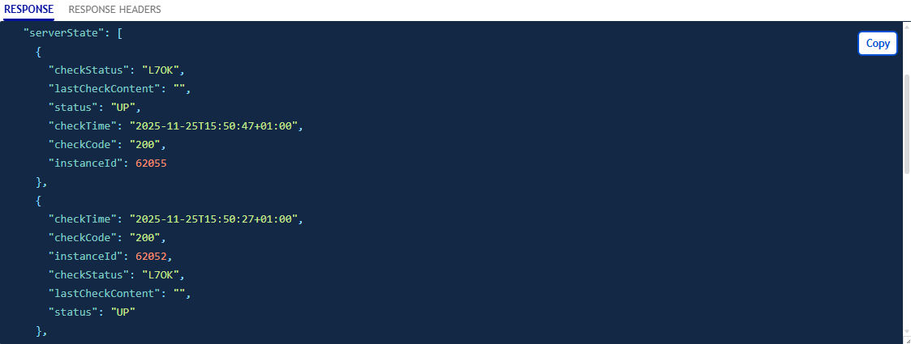

## Objective

The **OVHcloud Load Balancer** service acts by default as a proxy. It distributes the load (requests) it receives among all the servers in the desired farm.

Each server can be configured for the load balancer to check its status frequently.

As soon as a server is detected as "unavailable" (unhealthy), the load balancer stops sending it data and distributes the load among the remaining servers.

This functionality is useful in the event of scheduled maintenance: the server is "taken out" of the farm, maintenance is performed, and then it is reintegrated into the farm.

However, when a server is "taken out" of the farm by the load balancer independently of our will, it is important to be informed and to know the reason.

This tutorial explains how to find out the health status of each server for each instance of your **OVHcloud Load Balancer**.

## Requirements

- Possess an [OVHcloud Load Balancer](/links/network/load-balancer) offer in your OVHcloud account.
- Be logged into your [OVHcloud customer space](/links/manager).
- Be connected to the [OVHcloud API](/links/api).
- Possess a configured farm
- Possess a configured *frontend*

## Instructions

### From the OVHcloud API

In the API, the health status of the servers is available in the `serverState` table:

> [!api]
>
> @api {v1} /ipLoadbalancing GET /ipLoadbalancing/{serviceName}/http/farm/{farmId}/server/{serverId}
> 

> [!api]
>
> @api {v1} /ipLoadbalancing GET /ipLoadbalancing/{serviceName}/tcp/farm/{farmId}/server/{serverId}
> 

#### Result

{.thumbnail}

The image above illustrates the result of the command in the API.

### From the OVHcloud customer space

In the `Server farms`{.action} tab, after selecting one of them, the status of each of its servers is displayed on the corresponding line.

#### Result

{.thumbnail}

To obtain details on the health status of a server, simply click on the pictogram in the "**Status**" column.

{.thumbnail}

### Explanations of the details obtained

As explained previously, we have retrieved the server health status for each instance of your **OVHcloud Load Balancer**.

For each instance, we have the following information:

|Field|Description|
|---|---|
|Status|Server status|
|Check code|Return code of the health check probe|
|Check status|Status of the health check probe|
|Last check content|Content of the probe's return|
|Check time|Date and time the probe was executed|

## Appendix

### Retrieving the list of instances of your OVHcloud Load Balancer

> [!api]
>
> @api {v1} /ipLoadbalancing GET /ipLoadbalancing/{serviceName}/instancesState
> 

## Go further

Discuss with our [user community](/links/community).