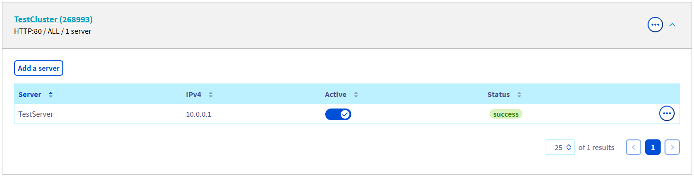
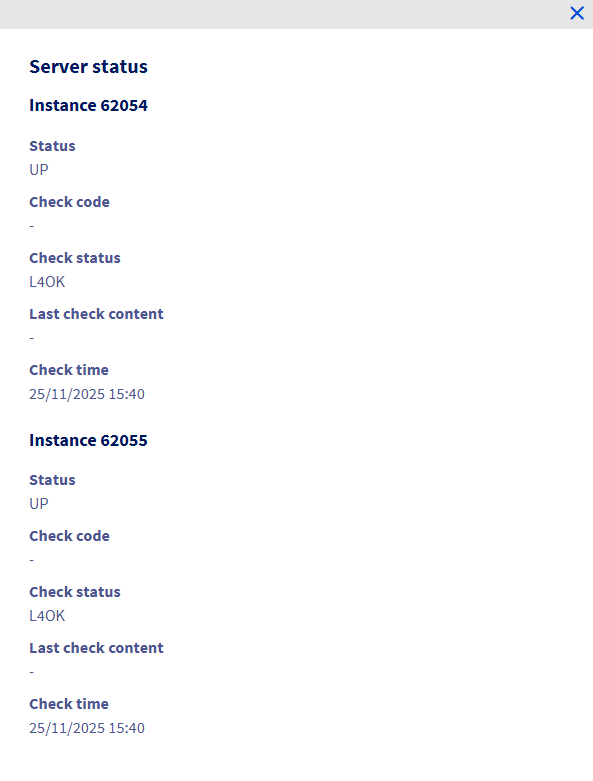

## Objectif

Le service **Load Balancer OVHcloud** agit par défaut en tant que proxy. Il répartit la charge (les requêtes) qu'il reçoit entre tous les serveurs de la ferme souhaitée.

Chaque serveur peut être configuré pour que le Load Balancer vérifie régulièrement son état.

Dès qu'un serveur est détecté comme "down", le Load Balancer cesse d'envoyer des données vers celui-ci et répartit la charge entre les autres serveurs restants.

Cette fonctionnalité est utile en cas de maintenance planifiée : vous pouvez retirer le serveur de la ferme, effectuer la maintenance, puis le réintégrer dans la ferme.

Cependant, lorsque le serveur est retiré de la ferme par le Load Balancer de manière indépendante de votre volonté, il est important d'être informé et de connaître la raison.

Ce tutoriel explique comment connaître l'état de santé de chaque serveur pour chaque instance de votre **Load Balancer OVHcloud**.

## Prérequis

- Une offre [Load Balancer OVHcloud](/links/network/load-balancer) dans votre compte OVHcloud.
- Un accès à l'[espace client OVHcloud](/links/manager).
- Un accès à l'[API OVHcloud](/links/api).
- Une ferme configurée
- Un front-end configuré

## En pratique

>[!primary]
>
> Afin d'avoir des vérifications d'état des serveurs valides, vous devez disposer d'une sonde configurée sur votre ferme, et de serveurs autorisant l'accès à cette sonde.
>
> Si vous avez besoin de configurer des sondes sur votre Load Balancer, veuillez vous référer à [ce guide](/pages/network/load_balancer/create_probes).
>

### Depuis l'OVHcloud API

Dans l'API, l'état de santé du serveur est disponible dans le tableau `serverState` :

> [!api]
>
> @api {v1} /ipLoadbalancing GET /ipLoadbalancing/{serviceName}/http/farm/{farmId}/server/{serverId}
> 

> [!api]
>
> @api {v1} /ipLoadbalancing GET /ipLoadbalancing/{serviceName}/tcp/farm/{farmId}/server/{serverId}
> 

#### Résultat

{.thumbnail}

*L'image ci-dessus illustre le résultat de la commande dans l'API.*

### Depuis l'espace client OVHcloud

Dans l'onglet `Fermes de serveurs`{.action}, après avoir sélectionné l'une d'elles, l'état de chacun de ses serveurs est affiché sur la ligne correspondante.

#### Résultat

{.thumbnail}

Pour obtenir des détails sur l'état de santé d'un serveur, cliquez sur le texte dans la colonne "**Status**", ou bien cliquez sur le bouton `(...)`{.action} et sélectionnez `Voir le statut`{.action}.

{.thumbnail}

### Explication des détails d'état du serveur

Comme expliqué précédemment, nous avons récupéré l'état de santé du serveur pour chaque instance de votre **Load Balancer OVHcloud**.

Pour chaque instance, nous disposons des informations suivantes :

|Champ|Description|
|---|---|
|Status|État du serveur|
|Check code|Code de retour de la sonde de vérification|
|Check status|État de la sonde de vérification|
|Last check content|Contenu du retour de la sonde|
|Check time|Date et heure d'exécution de la sonde|

## Aller plus loin

Échangez avec notre [communauté d'utilisateurs](/links/community).