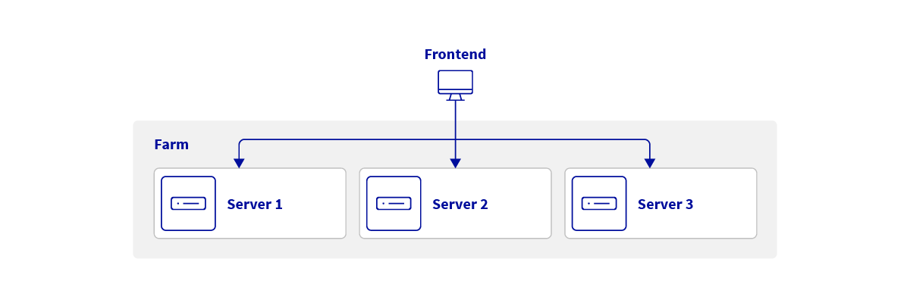
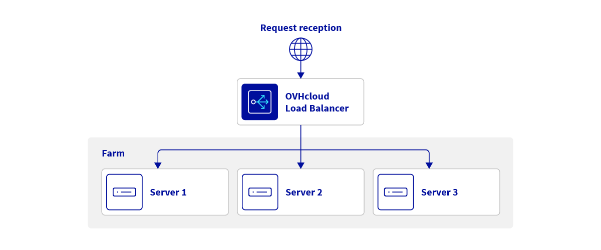
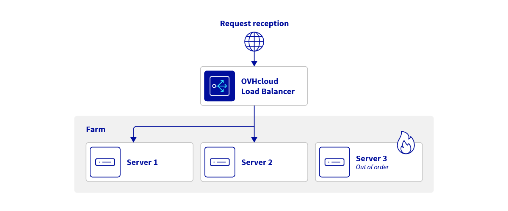
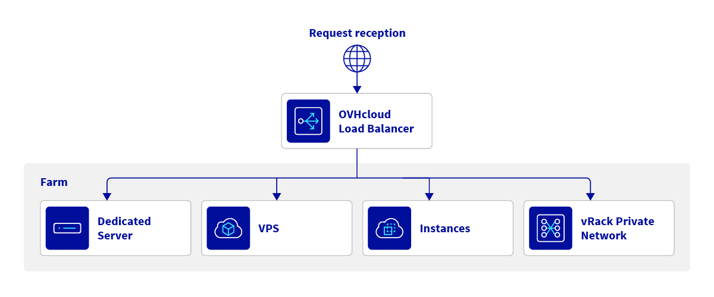
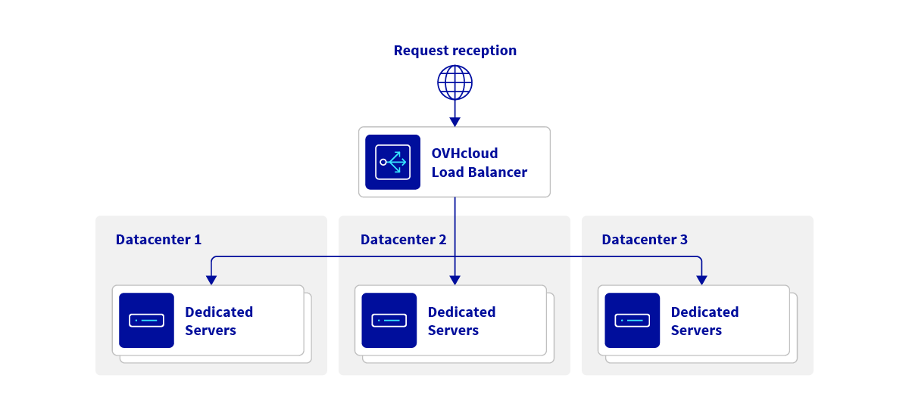
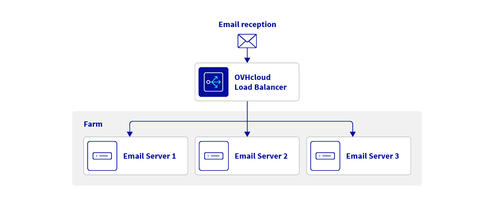
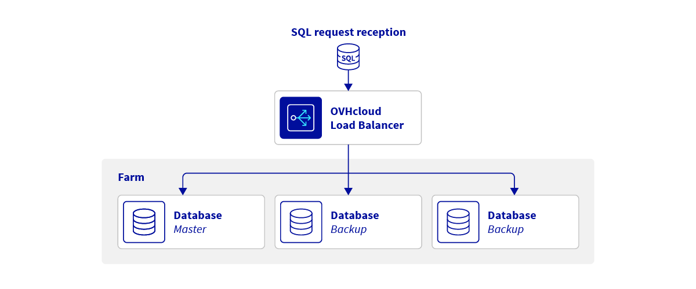

## Objective

The **OVHcloud Load Balancer** is a fully managed service designed to ensure high availability, performance, and scalability for your applications.
Its main role is to distribute workloads across several servers or applications.
Simply configure your services behind the Load Balancer — OVHcloud handles redundancy, security, and global traffic distribution.

## Requirements

- Access to the [OVHcloud Control Panel](/links/manager)
- At least one service to balance (Dedicated Server, VPS, Public Cloud instance, etc.)

## Instructions

The Load Balancer leverages **industry-standard open-source technologies** to handle different traffic types:

| Type | Description | Advantages | Technology |
|---|---|---|---|
| HTTP/HTTPS | All web services and APIs | Optimized for L7 (application layer) processing, URL redirection, headers, ACLs | HAProxy |
| TCP | Non-HTTP network services | Supports all TCP applications | HAProxy |
| UDP | All UDP traffic | Supports all UDP applications | Nginx |

### Key Features

- **Built-in DDoS protection** across all traffic types
- **Global Anycast network** for optimal latency and failover
- **Advanced HTTP/HTTPS support**: redirections, headers, ACLs, etc.
- **Additional IP and vRack compatibility**: improve availability and performance with advanced networking
- **High availability**: isolated redundant instances ensure resilience
- **Scalability**: add or remove servers and farms without downtime

### Architecture Overview

The Load Balancer consists of three main components:

| Component | Function |
|---|---|
| **Front-end** | Defines the entry protocol (HTTP/TCP/UDP) and listening port |
| **Farm** | Distributes traffic from the front-end across servers |
| **Server** | Handles inbound and outbound application traffic |

{.thumbnail}

## Benefits

### Balance and Scale Seamlessly

Distribute workloads across multiple servers and scale horizontally without service interruption.

{.thumbnail}

### High Availability and Uptime

Automatic health checks detect unresponsive servers and reroute traffic instantly, minimizing downtime.

{.thumbnail}

### Simplified Maintenance

Place a farm or server in downtime mode for maintenance without impacting users, then reintegrate it seamlessly.

{.thumbnail}

### Service Integration

Easily combine with other OVHcloud services:

- Public Cloud instances
- VPS
- Dedicated Servers
- vRack private networking

{.thumbnail}

### Geographic Distribution (Anycast)

Serve users worldwide with low latency and resilient routing.

{.thumbnail}

### Versatile Use Cases

Support multiple services over HTTP(S), TCP, and UDP traffic.

#### Email server

Balance the load between your email servers.

{.thumbnail}

#### Databases

Balance your databases, and make them redundant.

{.thumbnail}

## Go Further

- [Find out more about load balancing (Wikipedia)](https://en.wikipedia.org/wiki/Load_balancing)
- [HAProxy official site](http://www.haproxy.org/#desc)
- [Nginx documentation](https://nginx.org/en/docs/)

Join our [community of users](/links/community).
