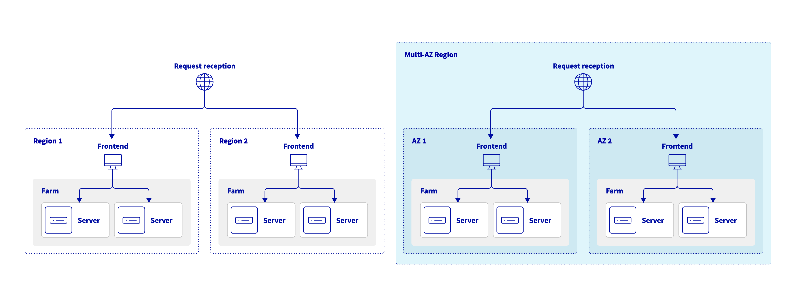

## Introduction

The OVHcloud Load Balancer is a critical component for distributing network traffic across your infrastructure. To ensure the highest level of service and optimal user experience, it is essential to deploy your Load Balancer across multiple availability zones (AZ). When subscribing to an OVHcloud Load Balancer service, **you may choose one or more availability zones** in which the service will be located. You also have the possibility to **order additional zones** for an existing service.

Configuring your OVHcloud Load Balancer in multiple availability zones will help you increase the reliability of your Load Balancer service in case a zone is unavailable, or minimize latency for your users by directing the traffic to the service nearest to them. Most regions only have one zone, but specific regions offer several availability zones (**Multi-AZ**), thus providing enhanced performance and availability for local users.

This guide details how to configure and utilize these multiple zones to leverage enhanced performance and resilience.

> [!primary]
>
> Due to technical restrictions, when configuring an OVHcloud Load Balancer with two zones, if one is located in an APAC region and the other is not, traffic will be preferentially routed through the non-APAC zone first, even when the Load Balancer service is out of order in that zone.
>
> This behavior is specific to cross-continent setups involving APAC zones. Therefore, we do not recommend configuring your Load Balancer in this manner.
>
> You may find a list of OVHcloud regions on [our website](https://www.ovhcloud.com/en/about-us/global-infrastructure/regions/).
>

## Instructions

### Add a zone

#### From the OVHcloud Control Panel

You can order an additional zone from the [OVHcloud Control Panel](/links/manager). In the `Bare Metal Cloud`{.action} section, click `Network`{.action}, then `Load Balancer`{.action}.

Select your Load Balancer, then in the `Home`{.action} tab and the `Configuration`{.action} menu, click `Add`{.action} in the "Availability zones" section.

{.thumbnail}

Then select the zone(s) you wish to order and click `Add`{.action}.
 
{.thumbnail}

A purchase order will be generated, which you'll need to pay.

{.thumbnail}

#### From the API

To order a zone via the API, you first need to create a cart.

> [!api]
>
> @api {v1} /order POST /order/cart
>

Please make a note of the cart number ("cart"), it will be useful for the rest.

Then you assign it via:

> [!api]
>
> @api {v1} /order POST /order/cart/{cartId}/assign
>

You can list the options available on your Load Balancer service via:

> [!api]
>
> @api {v1} /order GET /order/cartServiceOption/ipLoadbalancing/{serviceName}
>

When you have found the option corresponding to the desired area, you can add it to your shopping cart ("cart") via:

> [!api]
>
> @api {v1} /order POST /order/cartServiceOption/ipLoadbalancing/{serviceName}
>

Finally, you can validate your cart ("cart") via:

> [!api]
> @api {v1} /order POST /order/cart/{cartId}/checkout
>

Don't forget to pay the order form thus generated.

### Configure your frontend

Once your zone order is finalized, you can add it from your OVHcloud Control Panel.

Select the Load Balancer you wish to modify, then create a new frontend, or edit an existing one, via the `Frontends`{.action} tab.

In the `Datacenter`{.action} field, choose the zone you wish to associate with your frontend.

{.thumbnail}

Once the frontend is configured, click `Add`{.action} or `Modify`{.action} depending on whether you are configuring a new frontend or an existing one.

Don't forget to deploy the configuration. To do this, click `Apply configuration`{.action} in the reminder banner stating that the configuration is not applied.

{.thumbnail}

## Use multiple zones

### For high availability

If you want to use multiple zones to achieve high availability, you can use the special `all` zone when you declare a `frontend` and a `farm`.

This special `all` zone will allow you to deploy the same configuration on all zones subscribed to your Load Balancer service, and avoids you to duplicate the configuration for all zones.

### To reduce latency

If the goal is to reduce latency, we can imagine directing requests coming from the Zone 1 load balancer to backend servers geographically close to Zone 1, and similarly, directing requests coming from the Zone 2 load balancer to backend servers close to Zone 2.

To achieve this, you need to specify a frontend in each zone that uses a cluster in the same zone.
This will allow us to declare backend servers in different clusters per zone and to control which backend servers are used in which zone.

{.thumbnail}

For example, if we have backend servers in the data centers of Gravelines (gra) and Beauharnois (bhs),
you can order a Load Balancer service in the `gra` and `bhs` areas and configure :

- A frontend in the gra zone with as default cluster in the gra zone which contains servers in the Gravelines datacenter
- A frontend in the bhs zone with a default cluster in the bhs zone that contains servers in the Beauharnois datacenter

### Multi-AZ deployment

OVHcloud is currently rolling out its strategic plan for multi-Availability Zone (AZ) regions, beginning with the launch of Paris 3-AZ in April 2024.

Load balancing across multiple regions offers **maximum disaster recovery against widespread regional outages** and allows for worldwide entry points that significantly **reduce latency** by routing users to the **nearest server**. 

In contrast, load balancing across several Availability Zones (AZs) within the same region ensures **high availability**, **high performance** and **fault tolerance against local outages** using fast, **low-latency connections**.

{.thumbnail}

## Go further

Join our [community of users](/links/community).