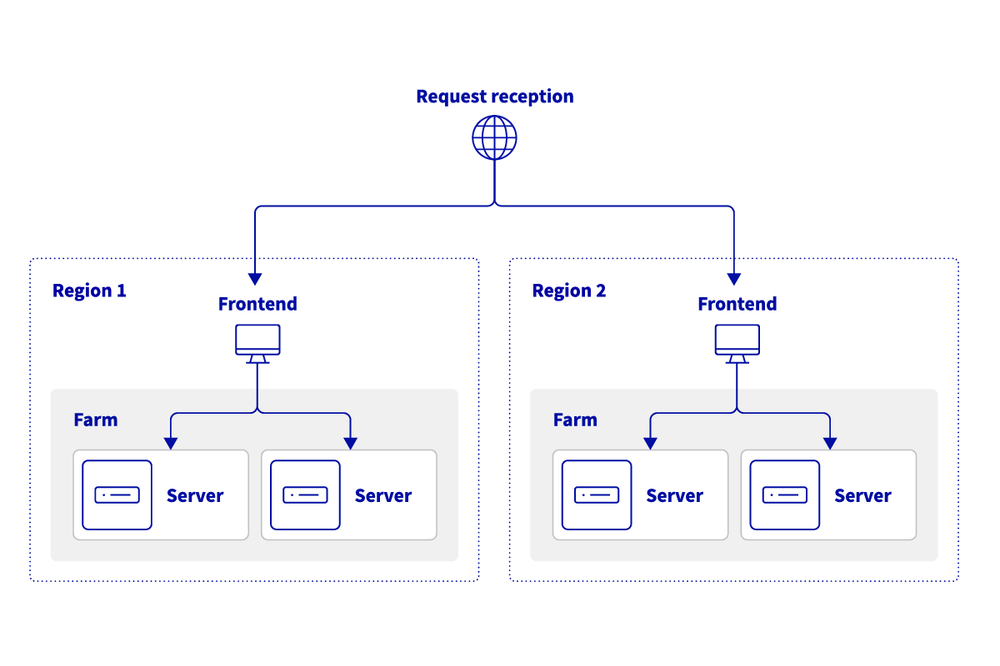
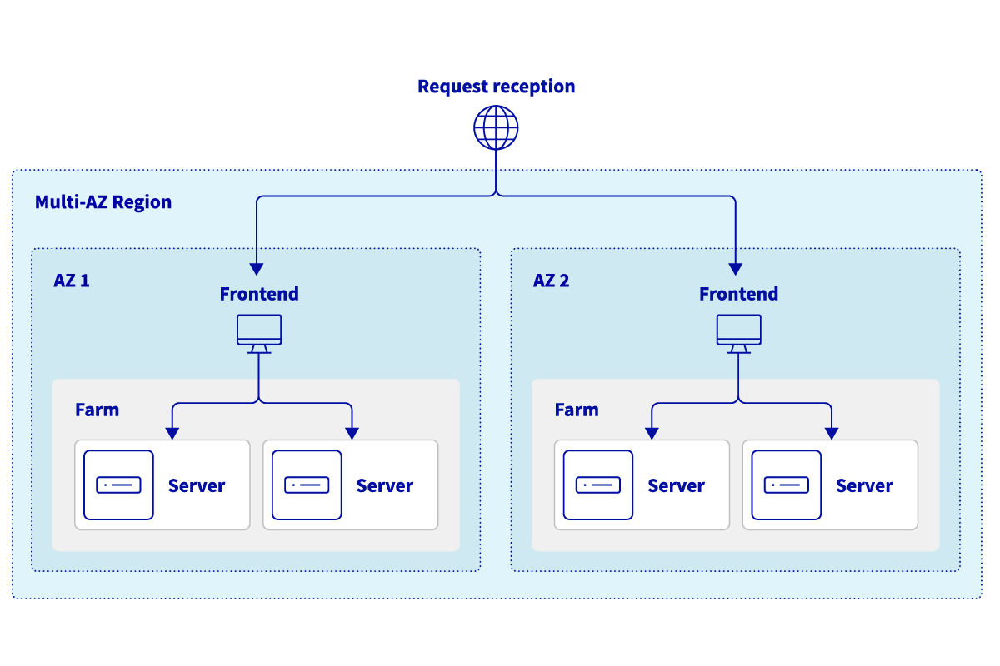

## Objective

The OVHcloud Load Balancer is a critical component for distributing network traffic across your infrastructure. To ensure the highest level of service and optimal user experience, it is essential to deploy your Load Balancer across multiple availability zones (AZ). When subscribing to an OVHcloud Load Balancer service, **you may choose one or more availability zones** in which the service will be located. You also have the possibility to **order additional zones** for an existing service.

Configuring your OVHcloud Load Balancer in multiple availability zones will help you **increase the reliability** of your Load Balancer service in case a zone is unavailable, or **minimize latency** for your users by directing the traffic to the service nearest to them.

This guide details how to configure and utilize these multiple zones to achieve enhanced performance and resilience.

> [!primary]
>
> Due to technical restrictions, when configuring an OVHcloud Load Balancer with two zones, if one is located in an APAC region and the other is not, traffic will be preferentially routed through the non-APAC zone first, even when the Load Balancer service is out of order in that zone.
>
> This behavior is specific to cross-continent setups involving APAC zones. Therefore, we do not recommend configuring your Load Balancer in this manner.
>
> You may find a list of OVHcloud regions on [our website](https://www.ovhcloud.com/en/about-us/global-infrastructure/regions/).
>

## Requirements

- An [OVHcloud Load Balancer](/links/network/load-balancer) service
- Access to the [OVHcloud Control Panel](/links/manager)

## Introduction to availability zones

### Multi-region configuration

Load balancing across multiple regions offers **maximum disaster recovery against widespread regional outages** and allows for worldwide entry points that significantly **reduce latency** by routing users to the **nearest server**. Most regions only have one availability zone, which means that working with several zones usually involves working with several regions.

By leveraging an **Anycast network**, the OVHcloud Load Balancer can redirect requests coming from a specific region to the geographically nearest backend servers.

To achieve this, you need to specify a frontend in each zone that uses a cluster in the same zone. This will allow you to declare backend servers in different clusters per zone and to control which backend servers are used in which zone.

{.thumbnail}
*Diagram representing a load balancer distributing traffic across two regions*

For example, if you have backend servers in the Gravelines (GRA) and Beauharnois (BHS) regions, you can order a Load Balancer service in the `GRA` and `BHS` zones and configure :

- A frontend in the GRA zone with as default cluster in the GRA zone which contains servers in the Gravelines datacenter
- A frontend in the BHS zone with a default cluster in the BHS zone that contains servers in the Beauharnois datacenter

### Multi-AZ regions

OVHcloud is currently rolling out its strategic plan for multi-Availability Zone (multi-AZ) regions, beginning with the launch of Paris 3-AZ in April 2024 and Milan 3-AZ in November 2025.

Load balancing across several Availability Zones (AZs) within the same region, in contrast to a multi-region configuration, ensures **high availability**, **high performance** and **fault tolerance against local outages**, using **low-latency connections** and **Anycast** to distribute traffic in the most efficient way.

{.thumbnail}
*Diagram representing a load balancer distributing traffic across the zones of a single multi-AZ region*

## Instructions

### Add a zone

#### From the OVHcloud Control Panel

You can order an additional zone from the [OVHcloud Control Panel](/links/manager). In the `Network`{.action} section, under `Network services`{.action,} select `Load Balancer`{.action}.

Select your Load Balancer, then in the `Home`{.action} tab and the `Configuration`{.action} menu, click `Add`{.action} in the "Availability zones" section.

{.thumbnail}

Then select the zone(s) you wish to order and click `Add`{.action}.

{.thumbnail}

A purchase order will be generated, which you'll need to pay.

{.thumbnail}

#### From the API

To order a zone via the API, you first need to create a cart.

> [!api]
>
> @api {v1} /order POST /order/cart
>

Please make a note of the cart ID ("cart"), it will be useful later in the order process.

Then, assign the cart to your OVHcloud account via:

> [!api]
>
> @api {v1} /order POST /order/cart/{cartId}/assign
>

You can list the options available on your Load Balancer service via:

> [!api]
>
> @api {v1} /order GET /order/cartServiceOption/ipLoadbalancing/{serviceName}
>

When you have found the option corresponding to the desired area, you can add it to your shopping cart ("cart") via:

> [!api]
>
> @api {v1} /order POST /order/cartServiceOption/ipLoadbalancing/{serviceName}
>

Finally, you can validate your cart ("cart") via:

> [!api]
> @api {v1} /order POST /order/cart/{cartId}/checkout
>

Don't forget to pay the order form thus generated.

### Configure your frontend

Once your zone order is finalized, you can add it to your Load Balancer from the OVHcloud Control Panel.

Select the Load Balancer you wish to modify, then create a new frontend, or edit an existing one, via the `Frontends`{.action} tab.

In the `Datacenter`{.action} field, choose the zone you wish to associate with your frontend. 

If you want to use multiple zones, you can choose the special `ALL` zone. This special zone will allow you to deploy the same configuration on all zones subscribed to your Load Balancer service, which spares you having to duplicate the configuration for all zones.

{.thumbnail}

Once the frontend is configured, click `Add`{.action} or `Modify`{.action} depending on whether you are configuring a new frontend or an existing one.

Don't forget to deploy the configuration. To do this, click `Apply configuration`{.action} in the reminder banner stating that the configuration is not applied.

{.thumbnail}

## Go further

Join our [community of users](/links/community).