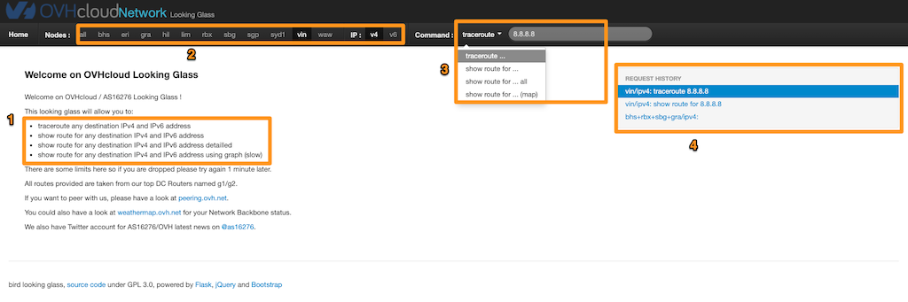
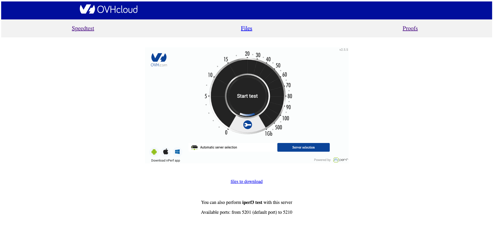
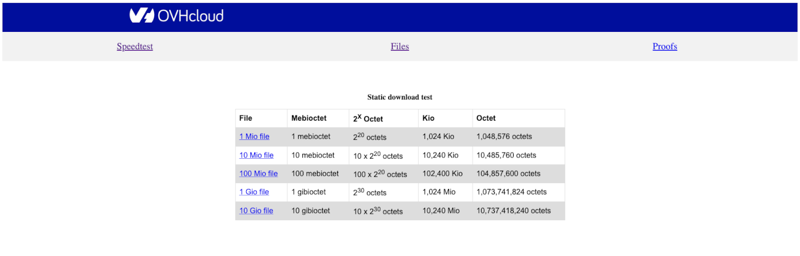
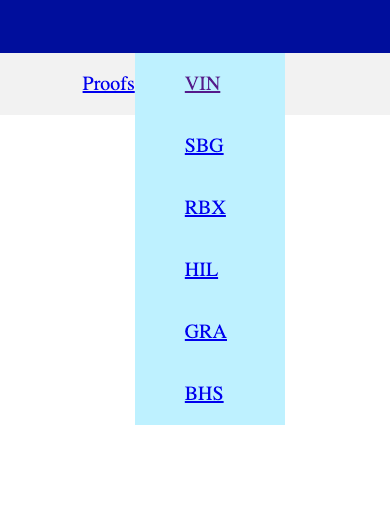
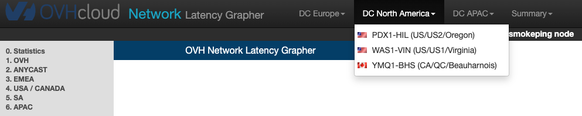
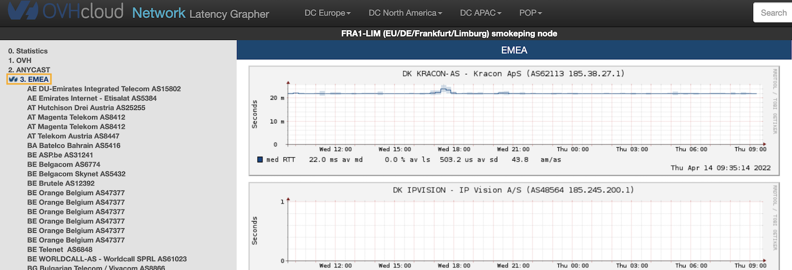
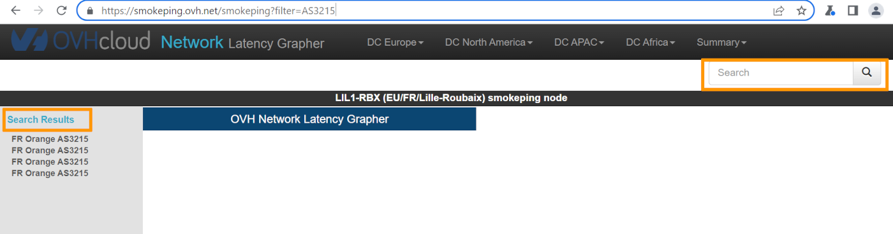
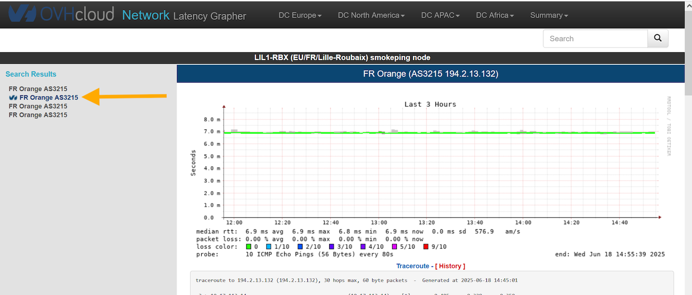
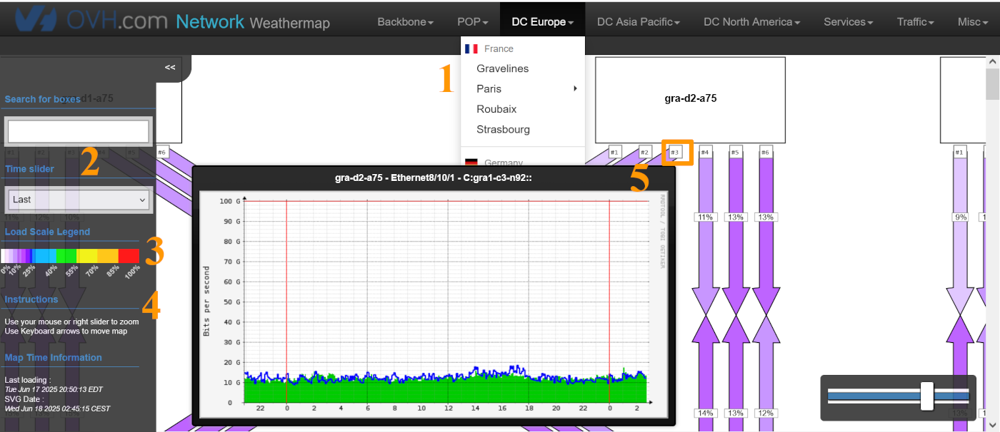

## Objective

OVHcloud provides several tools to customers and prospective customers to test and evaluate their network connectivity with OVHcloud services. In this article, we will cover how to use these tools.

## Instructions

Below is the list of network connectivity analysis tools offered by OVHcloud:

- [Looking Glass](#lookingglass)
- [Proof](#proof)
- [Smokeping](#smokeping)
- [Weathermap](#weathermap)

### Looking Glass 

[Looking Glass](https://lg.ovh.net/) is a tool that enables you to run a traceroute or see the routing table to any IP as if you were using a machine in an OVHcloud data centre. This tool is perfect if you are a prospective OVHcloud customer or considering expanding your presence to other data centres. It will ensure the networking is sufficient for your needs. The UI is very straightforward.

1. Instructions for the different commands you can run.
2. Select the data centre in which you wish to run the test.
3. Select the command you wish to run and the IP/URL to which you want the route.
4. Recent history of your requests to allow you to run them again quickly.

{.thumbnail}

### Proof 

[Proof](https://proof.ovh.net/) is a speed test for OVHcloud's network. Proof gives you three options: a generic speed test, arbitrary files to download to test speed, and a proof speed test (allowing you to choose the data centre).

When you first go to the site, you will be directed to the **Speedtest** tab. This is a normal speed test.

{.thumbnail}

If you click **Files**, you will be taken to the following page:

{.thumbnail}

Choose the file size you wish to test and download this file to test your download speed from OVHcloud's network.

The last tab, **Proofs**, allows you to select the data centre to test via a dropdown menu. You can then launch a speed test to this data centre.

{.thumbnail}

### Smokeping 

[Smokeping](https://smokeping.ovh.net/smokeping) is a monitoring tool to check ICMP reachability, latency, and change in traffic path (traceroute) for external AS/Internal OVH data centres, through FPing, using a sample IP/IPv6 address (added manually).

Smokeping Probe servers are installed in each OVH data centre to collect logs.

Once you access the Smokeping tool, you will see a top navigation menu (where a data centre can be selected) and a side navigation menu with the following options:

1. **OVH**: Monitors a specific IP address in OVH DC, POP, and OVH Anycast destinations.
2. **ANYCAST**: Global Anycast Destinations like Google DNS and CloudFlare DNS plus destinations from other CDN providers.
3. **EMEA**: Service, content, and/or cloud providers in Europe.
4. **USA / CANADA**: Service, content, and/or cloud providers in the US and Canada.
5. **SA**: Service, content, and/or cloud providers in South America
6. **APAC**: Service, content, and/or cloud providers in Asia / Oceania

{.thumbnail}

To view the results of the latency for an entire region, click on the area concerned, for example *3. EMEA*, then on the region name. You can view latency/ping loss for ASN monitored in that specific region.

{.thumbnail}

You can use the search box in the upper-right corner to check results for a specific AS/Name. Any results will be displayed on the left side of the page.

{.thumbnail}

If you click the name of the provider in the search results, you will see historical latency and traceroute results, for up to the last year.

{.thumbnail}

### Weathermap 

The [OVHcloud weathermap](https://weathermap.ovh.net/) is a way to view the network backbone. Here you can view the percentage of traffic load on each link.

1. Data centre selection.
2. Search boxes and adjust the time period.
3. Load scale legend.
4. Navigation tips.
5. See link details.

{.thumbnail}

For more information and tutorials, please see our other [Networking and Security support guides](/products/network) or explore the [guides for other OVHcloud products and services](/links/documentation).

## Go further

Join our [community of users](/links/community).