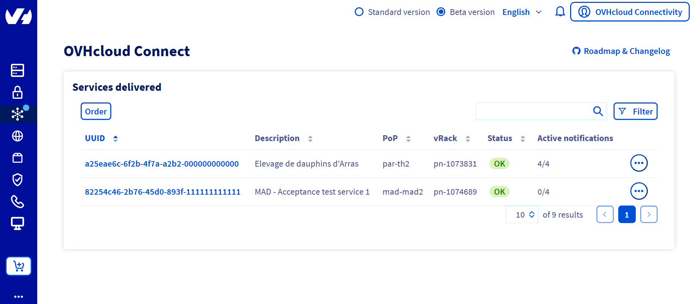
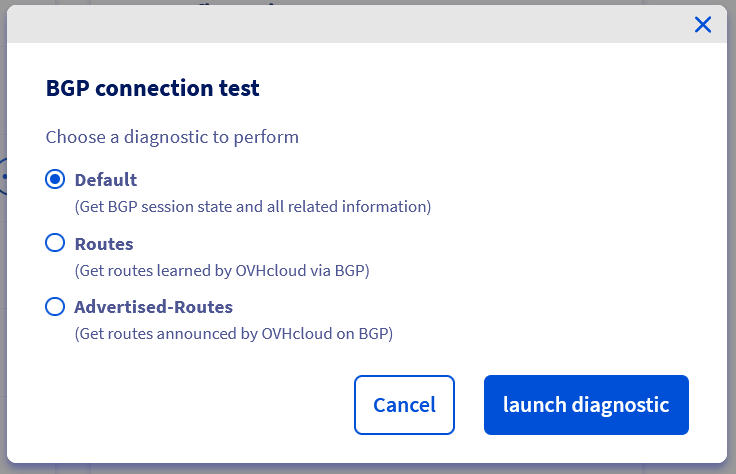

## Objective

With OVHcloud Connect, you can link your company network to your private OVHcloud vRack network, without creating a VPN tunnel through the internet. This will give you a quicker, more stable connection with guaranteed bandwidth. 

**This guide will show you how to get a status report of your OVHcloud Connect services via the OVHcloud Control Panel.**

## Requirements

- an [OVHcloud Connect solution](https://www.ovhcloud.com/en-gb/network-security/ovhcloud-connect/) with a valid POP configuration

## List of available diagnostics

### Layer 3 mode

- **Default**: Fetches the BGP session states and all related information
- **Routes**: Fetches the routing table learned by OVHcloud via BGP
- **Advertised-Routes**: Fetches the routing table advertised by OVHcloud via BGP

### Layer 2 mode

- ***Ask for access to an OCC service which can use layer 2 mode, or simply the list of available diagnostics on this mode***

## Instructions

In your OVHcloud Control Panel, in the Network section, you can find the list of your OVHcloud Connect services. 

{.thumbnail}

Open the service for which you want to get a diagnosis:

{.thumbnail}

At the bottom of the "POP Configuration" panel, you will find a segment named "Diagnostic POP", and an ellipsis **(...)** button. Click it, and then select "BGP Peering Test":

{.thumbnail}

A window will open. Select the type of diagnostics you wish to use, and click "launch diagnostic":

{.thumbnail}

You can now access the list of your diagnostics by opening the "Diagnostics" tab. 

{.thumbnail}

Each diagnostic is referred to using an ID and a timecode. 
You can read the contents of the diagnostics by clicking on the ellipsis located to the right of each one listed. You can select either "See result" to have a window open with the contents of the desired diagnostic, or "Download result" to get a *.txt* file with the same contents.

{.thumbnail}

## Limits

- **Retention time of diagnostics**: You can only view diagnostics you have initiated **during the past seven days.** We recommend you download them and properly archive them, in case you need future access.

- **Maximum number of diagnostics**: On a 24 hour period, you can initiate a maximum of 10 diagnostics per type of diagnostic, and per service. For example, if you have two OVHcloud Connect services configured on your OVHcloud Control Panel, both configured in Layer 3 mode, you can theoretically launch 10 of each diagnostic type per service, for a total of 60.
  ***Maybe remove this*** This limit has been set in order to restrict the amount of resources used by the OVHcloud infrastructures, as the diagnostics are launched in real-time.