> [!primary]
>
> AI Deploy is covered by **[OVHcloud Public Cloud Special Conditions](https://storage.gra.cloud.ovh.net/v1/AUTH_325716a587c64897acbef9a4a4726e38/contracts/d2a208c-Conditions_particulieres_OVH_Stack-WE-9.0.pdf)**.
>

## Objective

OVHcloud provides a set of managed AI tools designed for building your Machine Learning projects.

This guide explains how to get started with OVHcloud AI Deploy, covering the deployment of your first application using either the Control Panel (UI) or the [ovhai Command-Line Interface](/pages/public_cloud/ai_machine_learning/cli_10_howto_install_cli).

## Requirements

- Access to the [OVHcloud Control Panel](/links/manager)
- A [Public Cloud project](/links/public-cloud/public-cloud) in your OVHcloud account

## Instructions

### Subscribe to AI Deploy

Log in to the [OVHcloud Control Panel](/links/manager), navigate to the `Public Cloud`{.action} section, select your desired Public Cloud project, then go to the `AI & Machine Learning`{.action} category in the left menu and choose `AI Deploy`{.action}.

Click on the `Deploy an app`{.action} button and accept the terms and conditions if any.

Once clicked, you will be redirected to the creation process detailed below.

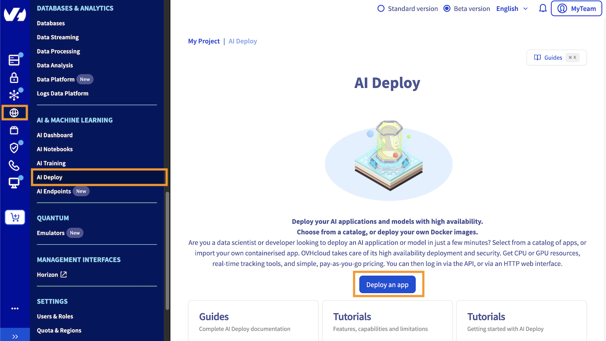{.thumbnail}

### Deploying your first application

#### Step 1: Name your application

First, choose a name for your AI Deploy app, or accept the automatically generated name if it meets your needs, to make it easier to manage all your apps.

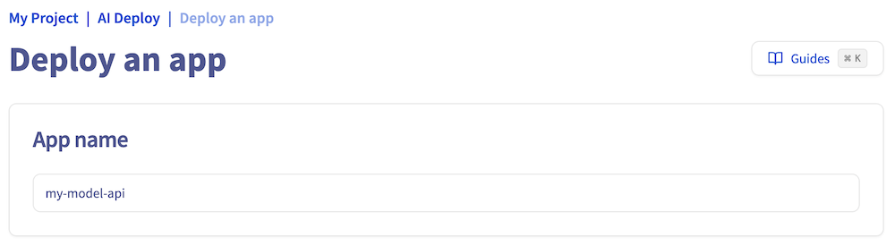{.thumbnail}

#### Step 2: Select the location

Select where your AI Deploy app will be hosted, meaning the physical location.

> [!primary]
>
> OVHcloud provides multiple datacenters. You can find the capabilities for AI Deploy in the guide [AI Deploy capabilities](/pages/public_cloud/ai_machine_learning/deploy_guide_01_capabilities).
>

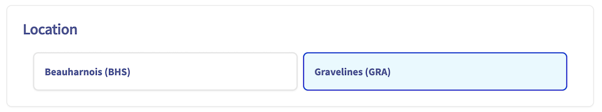{.thumbnail}

#### Step 3: Assign compute resources and specify scaling strategy

To deploy an AI Deploy app, you must allocate compute resources. The app supports a range of resource configurations:

- **GPU Resources**: 1 to 4 GPUs
- **CPU Resources**: 1 to 12 CPUs

Note that each instance is billed based on its running time.

Each compute resource includes:

- **CPU or GPU cores**: Processing power for your app
- **RAM**: Memory of your app
- **Local Storage**: Storage space for your app

You can adjust the **Resource Size** to customize the allocation of CPU or GPU cores, RAM, and local storage to meet your app's specific needs.

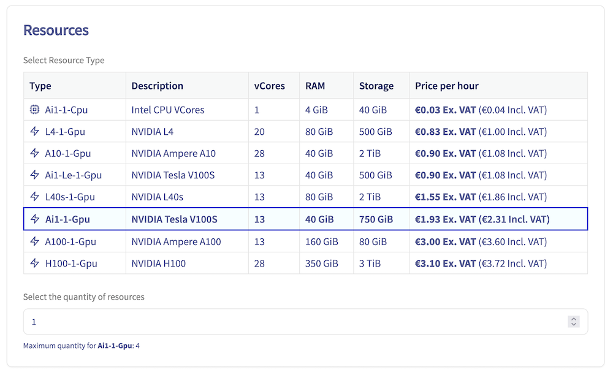{.thumbnail}

#### Step 4: Select the application to deploy

AI Deploy allows a user to deploy applications from two sources:

- From your own Docker image, giving you the full flexibility to deploy what you want. This image can be stored on many types of registry ([OVHcloud Managed Private Registry](/links/public-cloud/managed-private-registry), [Docker Hub](https://hub.docker.com/), [GitHub packages](https://github.com/features/packages), ...) and the expected format is `<registry-address>/<image-identifier>:<tag-name>`.
- From an OVHcloud catalog with already built-in AI models and applications.

In this tutorial, we will use a demonstration OVHcloud Docker image to deploy your first **AI Deploy app**. The objective is to deploy and call a simple **Flask API** which will welcome you by sending back `Hello` followed by the `name` you sent in your request. There is no web interface. What is given is an API endpoint that you can reach via HTTP.

> [!primary]
>
> If you want to deploy your own image, you need to comply with a few rules like adding a specific user. Follow our [Build and use custom images](/pages/public_cloud/ai_machine_learning/training_tuto_02_build_custom_image) guide. You might also be interested in [Using and managing your public and private registries](/pages/public_cloud/ai_machine_learning/gi_07_manage_registry).
>

To use this demonstration OVHcloud docker image, enter the following name as the Custom Docker image: `ovhcom/ai-deploy-hello-world`. Then click on the `+`{.action} button to confirm.

> [!primary]
>
> You can find this image on the [OVHcloud DockerHub](https://hub.docker.com/r/ovhcom/ai-deploy-hello-world). For more information about this Docker image, please check the [GitHub repository](https://github.com/ovh/ai-training-examples/blob/main/apps/getting-started/flask/hello-world-api/Dockerfile).
>

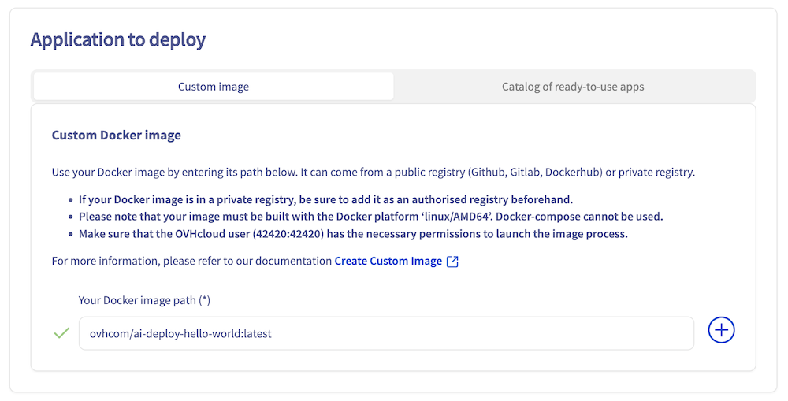{.thumbnail}

#### Step 5: Assign compute resources and specify scaling strategy

Then you can modify the **Number of replicas** on which your AI Deploy app will be deployed, according to the selected **scaling strategy**.

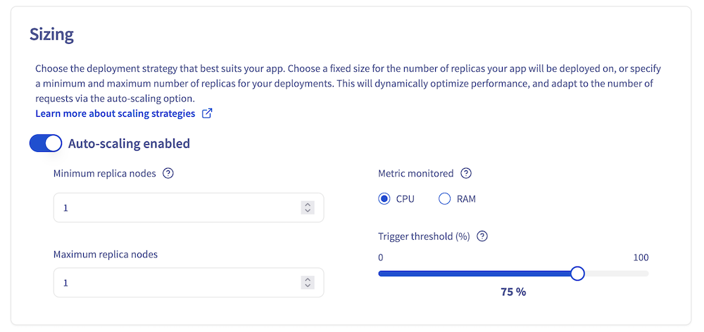{.thumbnail}

**When to choose static scaling?**

The **static scaling** strategy allows you to choose a fixed number of replicas on which the app will be deployed. For this method, the minimum number of replicas is **1** and the maximum is **10**.

- Static scaling can be used if you want to have fixed costs.
- This scaling strategy is also useful when your consumption or inference load is fixed.

**When to choose autoscaling?**

With the **autoscaling strategy**, it is possible to choose both the minimum number of replicas (1 by default) and the maximum number of replicas. **High availability** will measure the average resource usage across its replicas and add instances if this average exceeds the specified average usage percentage threshold. Conversely, it will remove instances when this average resource utilisation falls below the threshold. The monitored metric can either be `CPU` or `RAM` and the threshold is a percentage (integer between 1 and 100).

- You can use autoscaling if you have irregular or sawtooth inference loads.

More generally, a minimum of 2 instances are required to benefit from High Availability.

#### Step 6: HTTP default port

The default HTTP exposed port for your app's URL is `8080`. However, if you are using a specific framework that requires a different port, you can override the default port and configure your application to use the desired alternative port.

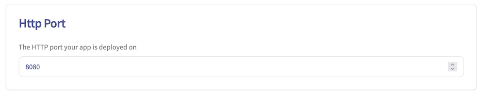{.thumbnail}

#### Step 7: Access rule

Next parameter to set is the **Confidentiality**. You can opt for **public access** (open to the internet) or **restricted access**.

Public access means that everyone is authorized. Use this option carefully. Usually public access is used for tests, but not in production since everyone will be able to use your app.

On the other hand, a secured access will require credentials to access the app. Two options are available in this case:

- An AI Platform user. It can be seen as a user and password restriction. Quite simple but not a lot of granularity.
- An AI token (preferred solution). A token is very effective since you can link them with labels. This will be explained in [Step 8](#step-8-advanced-configuration-optional).

We will select **Restricted Access** for this deployment.

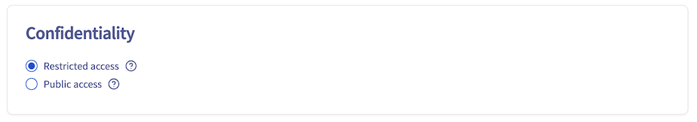{.thumbnail}

#### Step 8: Advanced configuration (optional)

This step allows you to customize your AI Deploy app with additional features. You can choose to configure one, several, or none of the options below.

**Commands**

You can override the default Docker command (entrypoint) with a custom command. This is useful if your Docker image has a specific entrypoint that you want to modify.

**Volumes**

If your application requires external data to work, such as scripts or models, you can upload this data to Swift, S3 compatible containers, or private/public Git repositories, and then mount these storage solutions on your app.

You can also mount an Object Storage as an output folder for example, to retrieve the data generated by your application.

You can attach as many volumes as you want to your app with various options.

In both cases, you will have to specify:

- `Storage container` or `Git repository URL`: The name of the container to synchronise, or the GitHub repository URL (the one that ends with `.git`).
- `Mount directory`: The location in the app where the synced data is mounted.

There are also optional parameters:

- `Authorisation`: The permission rights on the mounted data. Available rights are **Read Only (ro)**, **Read Write (rw)**. Default value is ro.
- `Cache`: Whether the synced data should be added to the project cache. Data in the cache can be used by other apps without additional synchronization. To benefit from the cache, the new apps also need to mount the data with the cache option.

To learn more about data, volumes and permissions, check out the [data page](/pages/public_cloud/ai_machine_learning/gi_02_concepts_data).

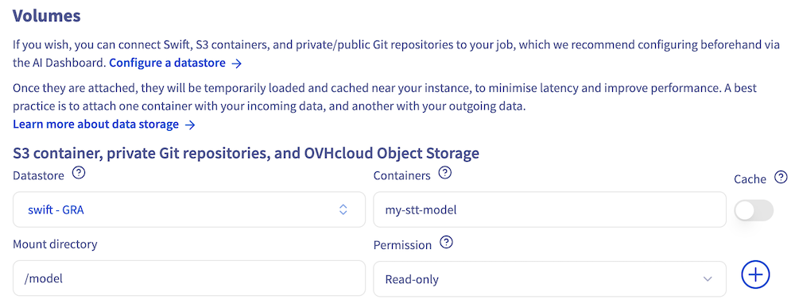{.thumbnail}

**Labels**

Then, you have the option to add some Key/Value labels to filter or organize access to your AI Deploy app.

As an example, add a label with **Key=owner** and **Value=elea**.

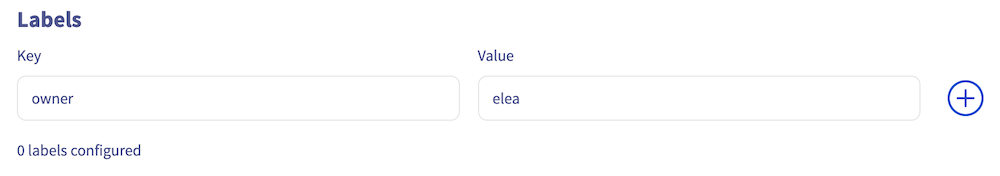{.thumbnail}

This will make the application accessible only to users who have the token associated with this label (key/value). This will restrict access to users with a token associated with this label (key-value).

Learn more about this feature in the [dedicated tutorial](/pages/public_cloud/ai_machine_learning/deploy_guide_03_tokens).

**Availability probe**

Finally, you can enable the `Readliness probe` feature. To do so, provide:
- **Probe API endpoint**: the `/health` endpoint of your app.
- **Probe port**: The port associated with the probe endpoint.

This allows you to monitor the health of your app and ensure it is ready to receive traffic.

#### Step 9: Review and launch your AI Deploy app

This final step provides a summary of your AI Deploy app deployment, allowing you to review the previously selected options and parameters.

You can also generate the equivalent `ovhai` CLI command, which enables you to deploy the same application using the command line interface. This CLI can be downloaded [here](/pages/public_cloud/ai_machine_learning/cli_10_howto_install_cli). For more information, consult the [CLI - Launch an AI Deploy app](/pages/public_cloud/ai_machine_learning/cli_18_howto_deploy_app) documentation.

To launch your AI Deploy app, click on `Order now`{.action}. Please note that your app will not be immediately available, as it requires some time to:

- Pull the Docker image
- Mount any configured data volumes 

Once the deployment is complete, your first AI Deploy app will be running on production and ready to be accessed.

### Connect to your AI Deploy app

#### Step 1: Check your AI Deploy app status

First, go check your app details and verify that your AI Deploy app has reached the **In service** status.

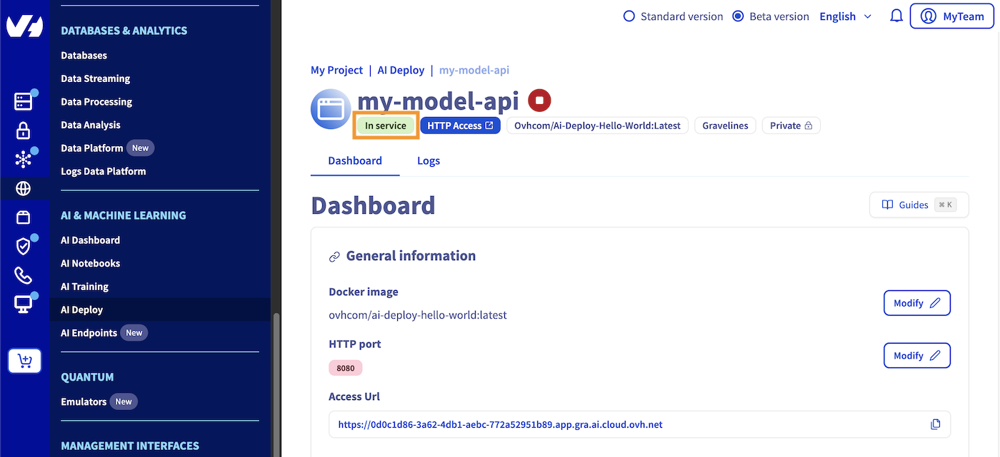{.thumbnail}

For your information, you can access your deployed application by clicking the `HTTP access`{.action} blue button, which will expose the default HTTP port of your app. However, since we have deployed a Flask API in this tutorial, you won't be able to access it through the `HTTP access`{.action} button as no interface was deployed.

#### Step 2: Generate a security token

During the AI Deploy apps deployment process, we selected `Restricted access`. To query your app, you first need a valid security token.

In your OVHcloud Control Panel left menu, go to the `AI Dashboard`{.action} in the `AI & Machine Learning`{.action} section. Select the `Tokens`{.action} tab.

Click on the `+ Create a token`{.action} button then fill in a name, a label selector, a role and region as below:

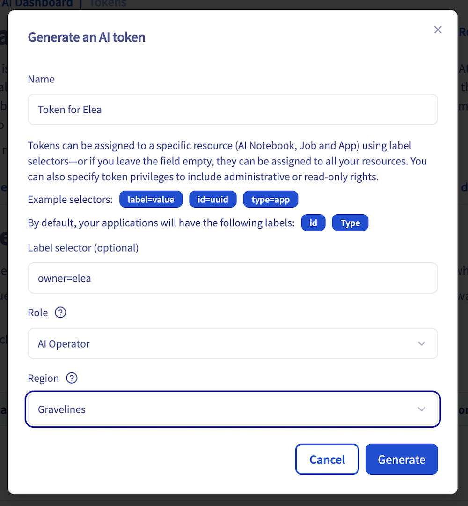{.thumbnail}

A few explanations:

- **Label selector**: you can restrict the token granted by labels. You can note a specific id, a type, or any previously created label such as **owner=elea** in our case.
- **Role**: *AI Platform Operator* can read and manage your AI Deploy app. *AI Platform Read only* can only read your AI Deploy app.
- **Region**: tokens are regionalized. Select the region related to your AI Deploy app.

#### Generate your first cURL query

Now that your AI Deploy app is running and token generated, you are ready for your first query.

Since we are on restricted access, you will need to specify the authentication token in the header following this format:

```bash
-H "Authorization: Bearer $YOURTOKENHERE"
```

In our case, the exact cURL code is:

```bash
 curl --request POST
    --url https://9b5b651e-8514-43d0-ae68-af801771542f.app.gra.ai.cloud.ovh.net
    -H "Authorization: Bearer $YOURTOKENHERE"
    --header 'Content-Type: application/json'
    --data ' "Elea" '
```

 Giving us

```bash
 "Hello Elea. Congratulations, you have launched your first AI App!"
```

If you see this message with the **name** you provided, you have successfully launched your first app!

#### Generate your first Python query

If you want to query this API with Python, this code sample with Python Request library may suit you:

```bash
export AI_APP_TOKEN=token_value
```

``` python
import requests
import json
import os
from requests.structures import CaseInsensitiveDict

url = "https://9b5b651e-8514-43d0-ae68-af801771542f.app.gra.ai.cloud.ovh.net"

headers = CaseInsensitiveDict()
headers = {'content-type': 'application/json',
           'Accept-Charset': 'UTF-8',
           'Authorization': f"Bearer {os.getenv('AI_APP_TOKEN')}
           }

data = "Elea"
j_data = json.dumps(data)

r = requests.post(url, data = j_data, headers = headers)

print(r.status_code)
print(r.text)
```

Result:

```bash
200
 "Hello Elea. Congratulations, you have launched your first AI App!"
```

That's it!

### Stop and delete your AI Deploy app

You have the flexibility to keep your AI Deploy app running for an indefinite period. At any time, you can easily stop your application, using either the UI (OVHcloud Control Panel) or the `ovhai` CLI.

> [!tabs]
> **Using the Control Panel (UI)**
>>
>> First, go to the `Public Cloud`{.action} section of the [OVHcloud Control Panel](/links/manager).
>>
>> Then, select the `AI Deploy`{.action} section, which allows you to manage and access all your created apps.
>> 
>> Locate the specific AI Deploy app you want to stop. Click the `...`{.action} button and stop your AI Deploy application by selecting `Stop`{.action} from the context menu.
>>
>> 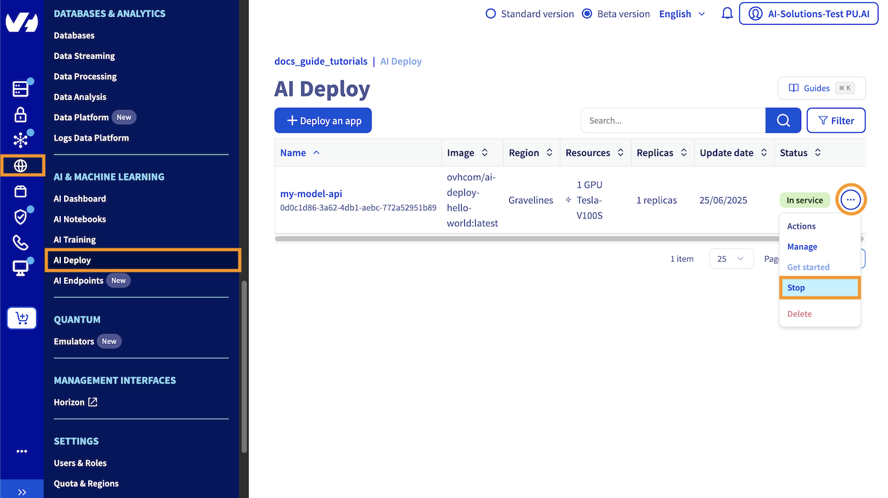{.thumbnail}
>>
>> Once stopped, your AI Deploy app will free up the previously allocated compute resources. Your endpoint is kept and if you restart your AI Deploy app, the same endpoint can be reused seamlessly.
>> Also, when you stop your app, you no longer book compute resources which means you don't have expenses for this part. Only expenses for attached storage may occur.
>>
>> If you want to completely **delete** your AI Deploy app, select the `Delete`{.action} action.
>> Be sure to also delete your Object Storage data if you don't need it anymore, by going in the `Object Storage`{.action} section (in the Storage category).
>>
> **Using ovhai CLI**
>>
>> To follow this part, make sure you have installed the [ovhai CLI](/pages/public_cloud/ai_machine_learning/cli_10_howto_install_cli) on your computer or on an instance.
>>
>> You can easily stop your AI Deploy application using the following command:
>>
>> ```bash
>> ovhai app stop <APP_UUID>
>> ```
>>
>> Once stopped, your AI Deploy app will free up the previously allocated compute resources. Your endpoint is kept and if you restart your AI Deploy app, the same endpoint can be reused seamlessly.
>>
>> ```bash
>> ovhai app start <APP_UUID>
>> ```
>>
>> Also, when you stop your app, you no longer book compute resources which means you don't have expenses for this part. Only expenses for attached storage may occur.
>>
>> If you want to completely **delete** your AI Deploy app, just run the following command:
>>
>> ```bash
>> ovhai app delete <APP_UUID>
>> ```
>> 
>> Be sure to also delete your Object Storage data if you don't need it anymore. To do this, you will need to empty it first, then delete it:
>>
>> ```bash
>> ovhai bucket object delete --all <object_storage_name>@<region>
>>
>> ovhai bucket delete <region> <object_storage_name>
>> ```

## Go further

- You can imagine deploying an AI model for sketch recognition thanks to **AI Deploy**. Refer to this [tutorial](/pages/public_cloud/ai_machine_learning/deploy_tuto_05_gradio_sketch_recognition).
- Do you want to use **Streamlit** in order to create an app? [Here it is](/pages/public_cloud/ai_machine_learning/deploy_tuto_02_flask).

If you need training or technical assistance to implement our solutions, contact your sales representative or click on [this link](/links/professional-services) to get a quote and ask our Professional Services experts for a custom analysis of your project.

## Feedback
Please feel free to send us your questions, feedback and suggestions to help our team improve the service on the OVHcloud [Discord server](https://discord.com/invite/KbrKSEettv)!
