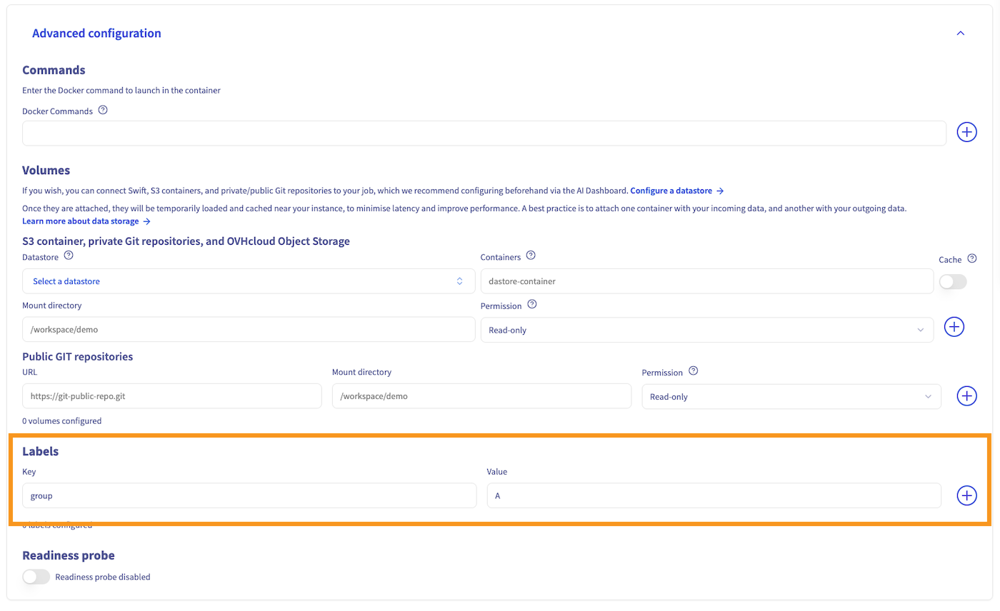
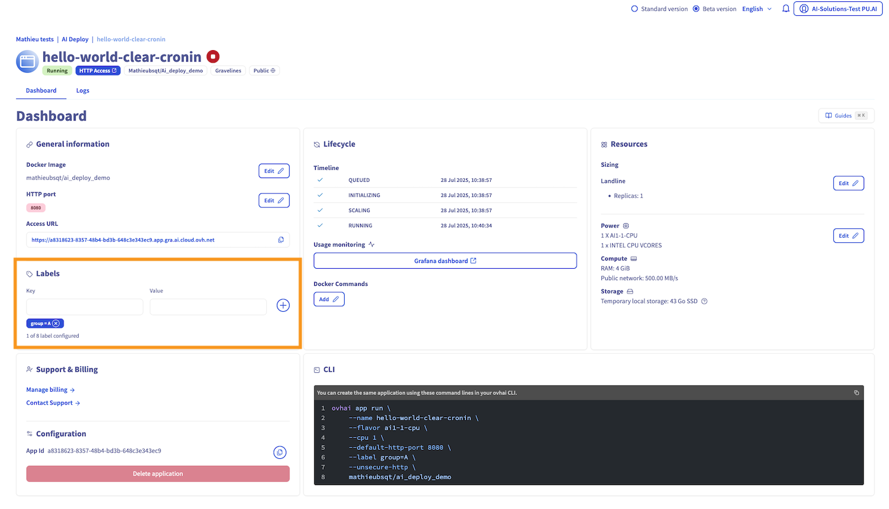
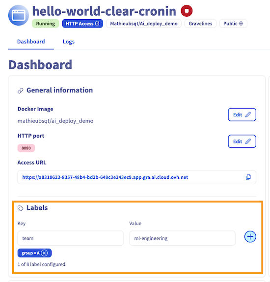
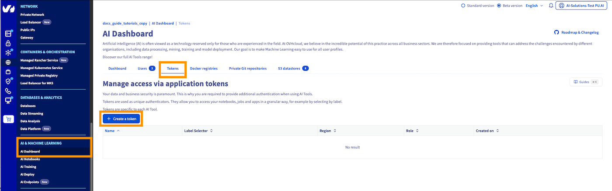
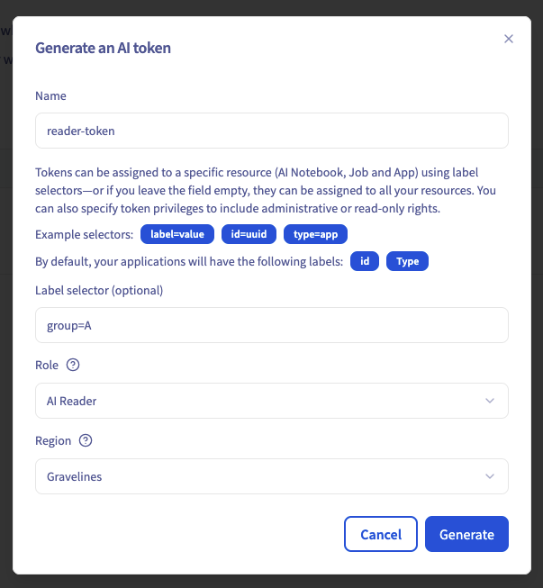
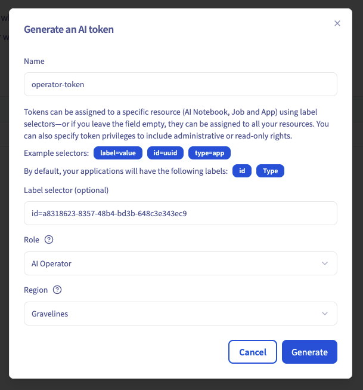
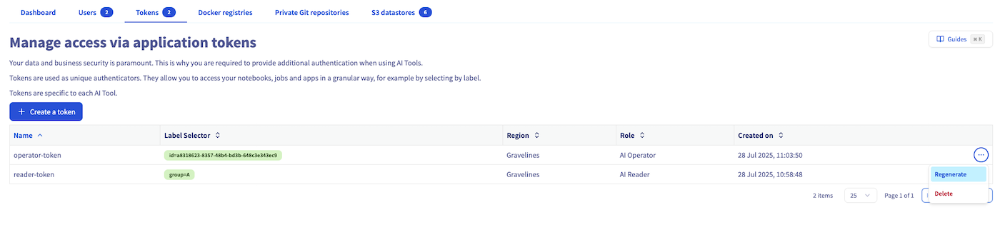
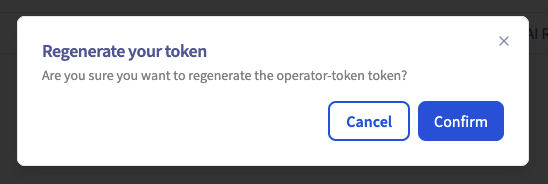
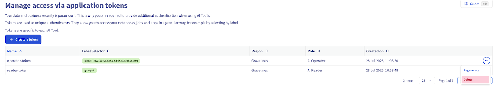

> [!primary]
>
> AI Deploy is covered by **[OVHcloud Public Cloud Special Conditions](https://storage.gra.cloud.ovh.net/v1/AUTH_325716a587c64897acbef9a4a4726e38/contracts/d2a208c-Conditions_particulieres_OVH_Stack-WE-9.0.pdf)**.
>

## Objective

This guide covers the creation of application tokens for AI Deploy.

This is particularly useful when you want to make your app accessible to others without sharing your username and password. Moreover, using tokens facilitates the integration of your app with other services or scripts, such as those using curl, allowing for a more automated and flexible interaction with your AI Deploy application.

In this tutorial, we will create and assign tokens to a basic AI Deploy app, running the [infrastructureascode/hello-world](https://hub.docker.com/r/infrastructureascode/hello-world) Docker image.

## Requirements

- a **Public cloud** project
- access to the [OVHcloud Control Panel](/links/manager)

## Instructions

By default, the following two labels are automatically added to each AI Deploy application:

- `ovh/id` whose value is the ID of the AI Deploy app
- `ovh/type` whose value is `app`, the type of AI resource

> [!primary]
> These labels are prefixed by `ovh/`, meaning these are reserved by the platform. These labels will be automatically overwritten by the platform if you attempt to redefine them during submission. They won't be displayed in the manager UI.
>

In addition to these default labels, you can **create new ones** to further customize and secure your application access.

### Adding labels to an app

Tokens are scoped based on labels added to your AI Deploy app. To scope a token, you must add a label to your AI Deploy app. This can be done either during the app creation process or after the app is deployed. You can add multiple labels by repeating the following process.

#### Adding label during app creation

To add a label when creating an AI Deploy app, access the `Advanced Configuration`{.action} step in the app creation process. This section allows you to specify a custom Docker command, the mounted volumes, and **the app labels**. 

From this last sub-section, you can add a key-value pair. The key is the label identifier (e.g., `group`), while the value is the corresponding value assigned to this key (e.g., `A`). In this tutorial, we use the example `group=A` as the label of the AI Deploy app:

{.thumbnail}

Once created, all the labels of an AI Deploy app are listed on the app details, under **Labels** field:

{.thumbnail}

#### Adding label to an existing app

If your app is already deployed, you can still add or update labels at any time using the Control Panel (UI) or the `ovhai` CLI.

> [!tabs]
> **Using the Control Panel (UI)**
>>
>> Navigate to the **AI Deploy** section where all your apps are listed. **Click the name of your app** to open its details page. Locate the **Labels** section. Enter the key-value pair and click `+`{.action} to add the label to your app.
>>
>> {.thumbnail}
>> 
>> After saving, the added label will be visible in the **Labels** section of the app details. 
>>
> **Using ovhai CLI**
>>
>> To follow this section, make sure you have installed the [ovhai CLI](/pages/public_cloud/ai_machine_learning/cli_10_howto_install_cli) on your computer or on an instance.
>>
>> You can also add labels to an existing app using the `ovhai` CLI. Run the following command:
>>
>> ```console
>> ovhai app set-label <app_id> <name> <value>
>> ```
>>
>> Replace <app_id> with the unique identifier of your app (found in the app details or by running `ovhai app ls`). And replace <name> and <value> with your desired key and value pair. For example:
>>
>> ```console
>> ovhai app set-label a8318623-8357-48b4-bd3b-648c3e343ec9 group A
>> ```
>>
>> This command adds the label `group=A` to the app with ID `a8318623-8357-48b4-bd3b-648c3e343ec9`.
>> 
>> You can verify app labels by running `ovhai app get <app_id>`. Labels will be displayed at the top of app details, in the *Labels* field.

### Generating tokens

From the **AI Dashboard** page, you can access the tokens management page by clicking on the `Tokens`{.action} tab. From there, you can click on the `+ Create a token`{.action} button to create a new token:

{.thumbnail}

There are two types of roles that can be assigned to a token:

- **AI Platform - Reader**: allows only querying the app
- **AI Platform - Operator**: allows querying and full lifecycle management (start/stop/delete)

#### Read token

Let's create a token for the AI Deploy apps matching the label `group=A` with read-only access in the GRA (Gravelines) cluster. To do this, we will need to fill 4 parameters:

{.thumbnail}

- **Token name**: used for token identification, management only.
- **Label selector**: determines which apps the token applies to (e.g., `group=A`).
- **Role**: choose from:
  - `AI Reader`: read-only
  - `AI Operator`: read & manage
- **Region**: e.g., `GRA` (for Gravelines)

After completing the form, click `Generate`{.action} to confirm the token creation. 

> [!warning]
> You will then receive the value of your new token, which you must **carefully save**, as its value is only displayed once. If you lose the token value, you will need to [regenerate it](#regenerating-a-token).

You will then be redirected to the token list, where the newly generated token will be displayed at the top:

{.thumbnail}

This newly generated token provides read access over all resources tagged with the label `group=A` including the ones submitted after the creation of the token.

If you prefer working from the command line, you can generate the same token using the `ovhai` CLI:

```console
ovhai token create reader-token --role read --label-selector group=A
```

#### Operator token

An operator token grants read access along with management access for the matching apps. This allows you to manage the AI Deploy app lifecycle (start/stop/delete) using either the CLI (more info [here](/pages/public_cloud/ai_machine_learning/cli_10_howto_install_cli)) or the [AI API](https://gra.ai.cloud.ovh.net/) by providing this token.

{.thumbnail}

Equivalent CLI command is:

```console
ovhai token create operator-token --role operator --label-selector group=A
```

You can also scope a token to a specific app using the `ovh/id` label and the app’s ID as its value. This label is added automatically by default as explained [above](#instructions) and, because it is reserved, it will uniquely match only one app.

### Using a token to query an AI Deploy app

With the token we generated in the previous step, we will now query the app. For this demonstration, we deployed a simple Hello World app that always responds `Hello, World!`.

You can get the access URL of your app in the details of the AI Deploy app, above the **Labels**.

#### Browser

When accessing the AI Deploy app via its URL in your browser, you will reach a Login page:

{.thumbnail}

To use the token to access this app, you can click on `Login with token`. Fill in your token in the dedicated field and click `Connect`{.action}.

You now land on the exposed AI Deploy app service:

{.thumbnail}

#### Code integration

You can also use CURL to directly query the AI Deploy app using the token as an `Authorization` header:

```bash
export TOKEN=<your-token>
curl "https://<your-app-id>.app.<your-app-region>.ai.cloud.ovh.net" -H "Authorization: Bearer $TOKEN"

> Hello, World!
```

### Token lifecycle

Once a token is created, you can either regenerate the token or delete it.

#### Regenerating a token

When creating a token, the actual token string is only displayed once upon creation. It is not possible to retrieve the actual token afterwards, so make sure to save it when creating a new one.

If you lost the token or if it leaked and you need to invalidate the token, you can generate it again. This causes the existing token to expire.

From the list of tokens, click on the action menu and select `Regenerate`{.action}:

{.thumbnail}

Then click on `Confirm`{.action}:

{.thumbnail}

#### Deleting a token

If you simply need to invalidate the token, you can delete it using the same action menu to regenerate a token. This will invalidate the existing token.



## Go further

Additional information about the use of a token to manage AI Solutions using `ovhai` CLI can be found [here](/pages/public_cloud/ai_machine_learning/cli_13_howto_app_token_cli).

## Feedback

Please feel free to send us your questions, feedback and suggestions to help our team improve the service on the OVHcloud [Discord server](https://discord.gg/ovhcloud)

If you need training or technical assistance to implement our solutions, contact your sales representative or click on [this link](/links/professional-services) to get a quote and ask our Professional Services experts for a custom analysis of your project.
