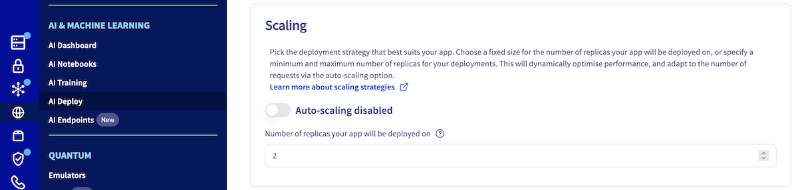
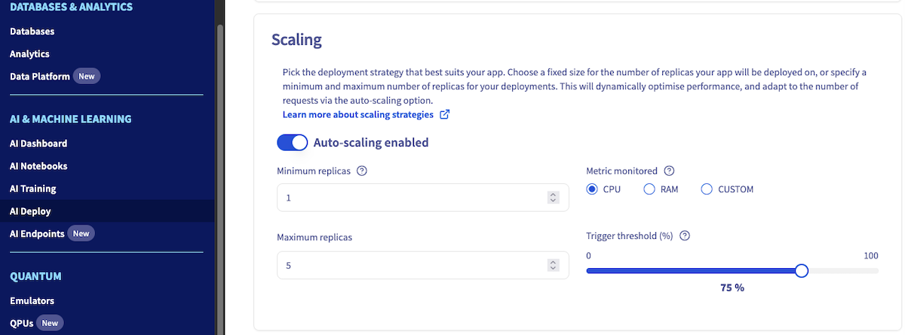
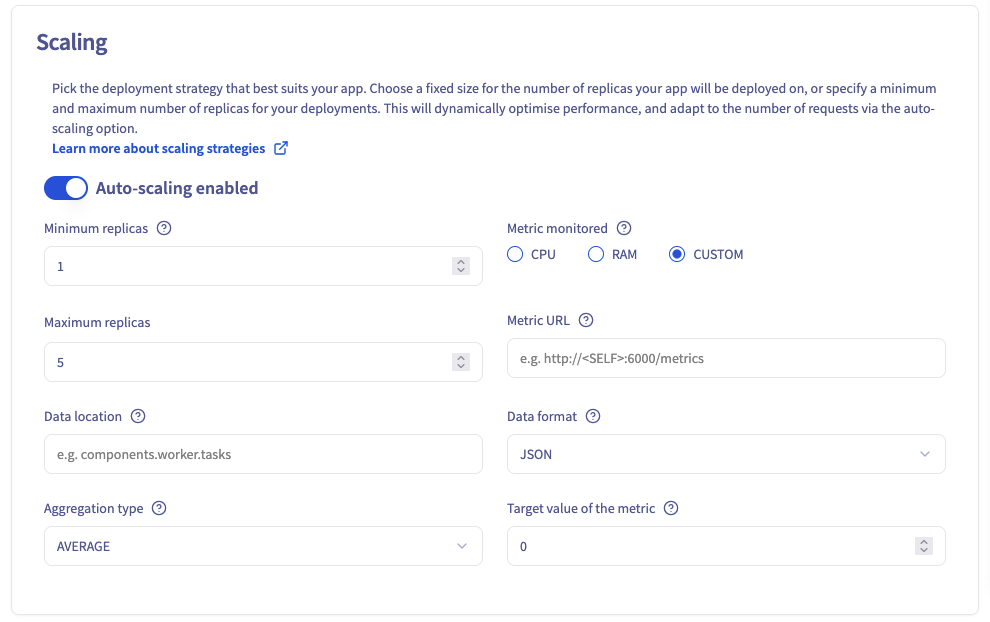
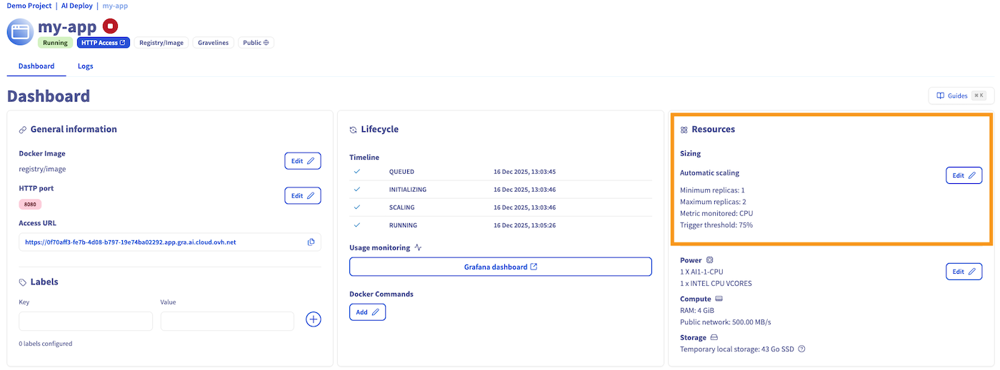
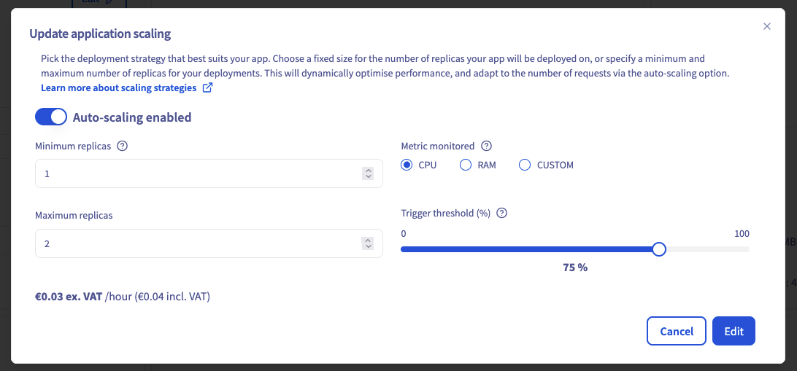

> [!primary]
> AI Deploy is covered by **[OVHcloud Public Cloud Special Conditions](https://storage.gra.cloud.ovh.net/v1/AUTH_325716a587c64897acbef9a4a4726e38/contracts/d2a208c-Conditions_particulieres_OVH_Stack-WE-9.0.pdf)**.

## Objective

This guide provides a comprehensive understanding of the different scaling strategies for AI Deploy. The objective is to explain the differences between **static scaling** and **autoscaling**, guide users on how to choose between them, set them during app creation, and explain how to modify scaling strategies once apps are created.

## Requirements

- An active **Public Cloud** project.
- Access to the [OVHcloud Control Panel](/links/manager).
- The **OVHcloud AI CLI** (`ovhai`) installed. For installation instructions, see [how to install ovhai](/pages/public_cloud/ai_machine_learning/cli_10_howto_install_cli).

## Scaling principles

When creating an application via the `OVHcloud Control Panel (UI)` or the `ovhai` CLI, you can choose one of two scaling strategies:

- **[Static Scaling](#static-scaling)**: Fixed number of running replicas.
- **[Autoscaling](#autoscaling)**: Dynamic replicas based on usage metrics (CPU/RAM or custom metrics).

## Static Scaling

### What is Static Scaling?

Static scaling allows you to configure a **fixed number of replicas** (identical instances of your application) running at all times. This is the **default strategy** if not specified.

The minimum number of replicas is **1** and the maximum is **10**.

> [!warning]
>
> For **High Availability**, it is strongly recommended to deploy a **minimum of 2 replicas**.

### When to choose Static Scaling?

- You have **predictable, consistent workloads**.
- You prefer **fixed, predictable costs** with no unexpected resource usage spikes.
- Your use case requires **minimal latency**, as replicas are always active.

### Setting Static Scaling (UI and CLI)

> [!tabs]
> **Using the Control Panel (UI)**
>>
>> When creating your application, you will have the opportunity to choose your **scaling strategy**. By default, the strategy is set to **static scaling**. To use this strategy, make sure that automatic scaling is not enabled. Then, you will be asked to choose the number of replicas on which your application will run.
>>
>> {.thumbnail}
>>
> **Using ovhai CLI**
>>
>> Use the `ovhai app run` command with the `--replicas` parameter to set the number of replicas at deployment:
>>
>> ```bash
>> ovhai app run <registry-address>/<image-identifier>:<tag-name> \
>>     --replicas 2 \
>>     -- <optional-command>
>> ```
>>

## Autoscaling

### What is Autoscaling?

Autoscaling dynamically adjusts the number of application replicas based on **real-time metrics**, such as CPU or RAM usage. This is optimized for **workloads with varying demand**.

### Autoscaling Key Configuration Parameters

Using this strategy, it is possible to choose: 

| Parameter                  | Description                                                                                   |
|----------------------------|-----------------------------------------------------------------------------------------------|
| **Minimum Replicas**       | Lowest number of running replicas.                                                            |
| **Maximum Replicas**       | Upper bound for replica count (define based on usage expectations).                           |
| **Monitored Metric**       | The metric to be monitored. Choose between `CPU` or `RAM` for triggering autoscaling actions. |
| **Trigger Threshold (%)**  | Average usage percentage used to trigger scaling up or down. Range: 1–100%.                   |

> [!primary]
>
> Autoscaling adjusts by calculating the **average resource usage** across all replicas. If the average exceeds the threshold, new replicas are spun up; if it falls below, replicas are removed.
>

### When to Choose Autoscaling?

- Your app has **irregular or fluctuating** inference/load patterns.
- You want to **scale cost-effectively** with actual usage.
- You are managing a **high-throughput application** with sudden demand spikes.

### Setting Autoscaling (UI and CLI)

> [!tabs]
> **Using the Control Panel (UI)**
>>
>> When creating your application, you will have the opportunity to choose your **scaling strategy**. By default, the strategy is set to **static scaling**. Toggle the button to switch to **Autoscaling** Then, configure minimum/maximum replicas, metric, and threshold.
>>
>> {.thumbnail}
>> 
> **Using ovhai CLI**
>>
>> Use the `ovhai app run` command with the following autoscaling parameters:
>>
>> ```bash
>> ovhai app run <registry-address>/<image-identifier>:<tag-name> \
>>     --auto-min-replicas 1 \
>>     --auto-max-replicas 5 \
>>     --auto-resource-type CPU \
>>     --auto-resource-usage-threshold 75
>> ```
>>

## Advanced: Custom Metrics for Autoscaling

For advanced scenarios, you can define **custom metrics** to drive autoscaling decisions. This is **recommended for workloads such as GPU based inference where CPU and RAM usage provide an incomplete picture of the system's performance or request load**.

This feature can be used through the UI and CLI, and requires an API endpoint to fetch metrics from.

> [!tabs]
> **Using the Control Panel (UI)**
>>
>> To enable custom autoscaling, select **CUSTOM** as the monitored metric in the UI, during the `Scaling` step. Then, you will need to fill several fields:
>>
>> - **Metric URL**: URL of the API operation to call to get the metric value. A specific `<SELF>` placeholder can be given whenever metrics API is served by the deployed app itself.
>> - **Data format**: Format of the metric to scale on (`JSON`, `XML`, `YAML`, `PROMETHEUS`). Default is `JSON`.
>> - **Data location**: Location of the metric value in the response payload. This value is format-specific. See the valueLocation from the parameters list in the [Trigger Specification documentation](https://keda.sh/docs/2.16/scalers/metrics-api/#trigger-specification) for details.
>> - **Target value of the metric**: Target value for metric to scale on. When the metric provided by the API is equal to or greater than this value, scaling occurs upwards. If the metric is less than or equal to 0, scaling is brought back to 0. This value can be a decimal number.
>> - **Aggregation type**: Type of aggregation to perform before comparing the aggregated metric value to the target value. For example, if you choose AVERAGE, the value compared to the target value for scaling will be the average of the metric values from each replica of your AI Deploy app. Options are (`AVERAGE`, `MIN`, `MAX`, `SUM`). Default is `AVERAGE`.
>>
>> {.thumbnail}
>>
> **Using ovhai CLI**
>>
>> Use the `ovhai app run` command with the following parameters:
>>
>> | Parameter | Description |
>> |--------|-------------|
>> | `--auto-custom-api-url`          | URL of the API operation to call to get the metric value. A specific `<SELF>` placeholder can be given whenever metrics API is served by the deployed app itself. |
>> | `--auto-custom-metric-format`    | Format of the metric to scale on (`JSON`, `XML`, `YAML`, `PROMETHEUS`). Default is `JSON`.          |
>> | `--auto-custom-value-location`   | Location of the metric value in the response payload. This value is format-specific. See the valueLocation from the parameters list in the [Trigger Specification documentation](https://keda.sh/docs/2.16/scalers/metrics-api/#trigger-specification) for details. |
>> | `--auto-custom-target-value`     | Target value for metric to scale on. When the metric provided by the API is equal to or greater than this value, scaling occurs upwards. If the metric is less than or equal to 0, scaling is brought back to 0. This value can be a decimal number. |
>> | `--auto-custom-metric-aggregation-type` | Type of aggregation to perform before comparing the aggregated metric value to the target value. For example, if you choose AVERAGE, the value compared to the target value for scaling will be the average of the metric values from each replica of your AI Deploy app. Options are (`AVERAGE`, `MIN`, `MAX`, `SUM`). Default is `AVERAGE`. |
>>
>> **Example**:
>>
>> Scaling based on a custom metric from an internal endpoint:
>>
>> ```bash
>> ovhai app run <registry-address>/<image-identifier>:<tag-name> \
>>     --auto-custom-api-url http://<SELF>:6000/metrics \
>>     --auto-custom-metric-format JSON \
>>     --auto-custom-value-location foo.bar \
>>     --auto-custom-target-value 42 \
>>     --auto-custom-metric-aggregation-type AVERAGE
>> ```

## Modifying Scaling Strategies Post-Deployment

You can also modify the scaling strategy after the app has been created using the Control Panel UI or the `ovhai app scale` CLI command.

> [!tabs]
> **Using the Control Panel (UI)**
>>
>> To modify scaling strategies through the UI, navigate to your application details page by clicking on its name in the AI Deploy section. On this page, you will find general information about your application, including a **Resources** section.
>>
>> 
>> 
>> In this window, click the `Edit`{.action} button to access scaling configuration options. This will open an **Update application scaling** window where you can:
>> - Switch between auto scaling and static scaling
>> - Change replica values
>> - Modify monitored metric and associated values
>>
>> {.thumbnail}
>>
> **Using ovhai CLI**
>>
>> To modify scaling strategies through the CLI, use the `ovhai app scale` command with appropriate parameters:
>>
>> ```bash
>> ovhai app scale [OPTIONS] <ID>
>> ```
>>
>> **Updating Static Scaling**
>>
>> To change the number of replicas for a static scaling strategy, use the `ovhai app scale` command with the `--replicas` parameter:
>>
>> ```bash
>> ovhai app scale --replicas <new-replicas-number> <app-id>
>> ```
>>
>> **Updating Autoscaling**
>>
>> To change the autoscaling parameters, use the `ovhai app scale` command with the following parameters:
>> 
>> ```bash
>> ovhai app scale \
>>     --auto-min-replicas <min> \
>>     --auto-max-replicas <max> \
>>     --auto-resource-type <CPU/RAM> \
>>     --auto-resource-usage-threshold <percent> \
>>     <app-id>
>> ```
>>
>> **Updating Autoscaling using a custom metric**
>>
>> Available options for **Fixed Scaling Strategy**:
>>
>> ```bash
>> ovhai app scale \
>>     --auto-custom-api-url <API URL> \
>>     --auto-custom-value-location <METRIC VALUE LOCATION> \
>>     --auto-custom-target-value <METRIC TARGET VALUE> \
>>     --auto-custom-metric-format <METRIC FORMAT> \
>>     --auto-custom-metric-aggregation-type <METRIC AGGREGATION TYPE> \
>>     <app-id>
>> ```

## Scaling examples

We will use the following example:

In case an app is based on the `AI1-1-CPU` flavor with a resource size of 2 (i.e. **2 CPUs**), this means that each replica of the application will be entitled to **2 vCores** and **8GiB RAM**.

### Example 1

First, we choose an `Autoscaling`.

Then we set the trigger threshold to `75%` of **CPU**.

In this case, the app will be scaled up when the average CPU usage across all its replicas is above **> 1.5 CPU (2*0.75)**, and it will be scaled down when the average CPU usage falls below **< 1.5**.

### Example 2

In this second example, we choose an `Autoscaling`.

Then we set the trigger threshold to `60%` of **RAM**.

In this example, the app will be scaled up when the average RAM usage across all its replicas is above **> 4.8 GB (8*0.60)**, and it will be scaled down when the average RAM usage falls below **< 4.8 GB** again.

> [!primary]
>
> The total deployment price for **autoscaling apps** is calculated based on the **minimum number of replicas**, **but** costs can **increase** during scaling.

## Conclusion

Choosing the right scaling strategy is critical for balancing cost, performance, and reliability in your AI Deploy applications. Static scaling offers stability and predictability, while autoscaling provides flexibility for dynamic workloads.

## Feedback

Please feel free to send us your questions, feedback and suggestions to help our team improve the service on the OVHcloud [Discord server](https://discord.gg/ovhcloud)

If you need training or technical assistance to implement our solutions, contact your sales representative or click on [this link](/links/professional-services) to get a quote and ask our Professional Services experts for a custom analysis of your project.
