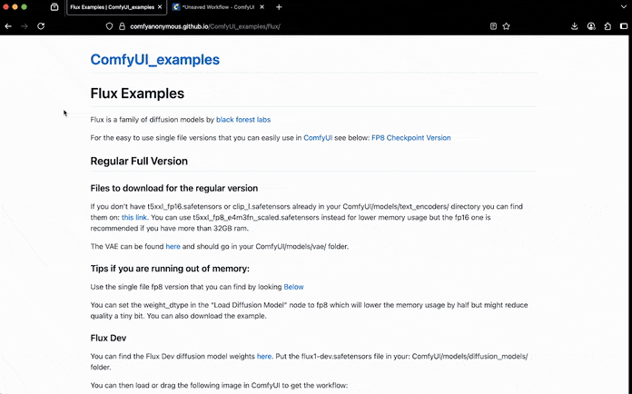

> [!primary]
>
> AI Deploy is covered by **[OVHcloud Public Cloud Special Conditions](https://storage.gra.cloud.ovh.net/v1/AUTH_325716a587c64897acbef9a4a4726e38/contracts/d2a208c-Conditions_particulieres_OVH_Stack-WE-9.0.pdf)**.
>

## Introduction

[FLUX](https://github.com/black-forest-labs/flux) is a flexible family of generative models developed by [Black Forest Technologies](https://bfl.ai/). The **FLUX** models support a variety of tasks, including text-to-image generation, structural conditioning, and inpainting.

In this tutorial, we walk through the process of deploying **FLUX** models on **AI Deploy**. We will show how to use **FLUX** models interactively with [ComfyUI](https://github.com/comfyanonymous/ComfyUI) (a visual programming interface).

## Instructions

You are going to follow different steps to deploy your FLUX model:

- [Choose the right FLUX variant based on your use case](#selecting-the-flux-model-variant)
- [Download model weights and store them in OVHcloud Object Storage](#downloading-model-weights-in-ovhcloud-object-storage)
- [Build a Docker image with ComfyUI and required dependencies](#build-a-docker-image)
- [Deploy app](#deploy-app)
- [Run inference with ComfyUI](#run-inference-with-comfyui)

### Selecting the FLUX Model Variant

FLUX is available in several variants, each tailored to specific use cases, from text-to-image inference to advanced image editing. These variants differ in memory requirements, performance, and licensing terms.

The following table lists the main FLUX variants and their intended use cases:

| Name                        | Usage                                                      | HuggingFace repo                                               | License                                                               |
| --------------------------- | ---------------------------------------------------------- | -------------------------------------------------------------- | --------------------------------------------------------------------- |
| `FLUX.1 [schnell]`          | Text to Image                     | [Schnell repo](https://huggingface.co/black-forest-labs/FLUX.1-schnell)        | [apache-2.0](https://huggingface.co/datasets/choosealicense/licenses/blob/main/markdown/apache-2.0.md)                    |
| `FLUX.1 [dev]`              | Text to Image                     | [Dev repo](https://huggingface.co/black-forest-labs/FLUX.1-dev)            | [FLUX.1-dev Non-Commercial License](https://huggingface.co/black-forest-labs/FLUX.1-dev/blob/main/LICENSE.md) |
| `FLUX.1 Kontext [dev]`      | Image editing                     | [Kontext repo](https://huggingface.co/black-forest-labs/FLUX.1-Kontext-dev)    | [FLUX.1-dev Non-Commercial License](https://huggingface.co/black-forest-labs/FLUX.1-Kontext-dev/blob/main/LICENSE.md) |

Full list is available on the [official repository](https://github.com/black-forest-labs/flux) for FLUX.1 models.

## Requirements

Before proceeding, ensure you have the following:

- Access to the [OVHcloud Control Panel](/links/manager)
- An AI Deploy Project created inside a [Public Cloud project](/links/public-cloud/public-cloud) in your OVHcloud account
- A [user for AI Training & Object Storage](/pages/public_cloud/ai_machine_learning/gi_01_manage_users)
- [The OVHcloud AI CLI](/pages/public_cloud/ai_machine_learning/cli_10_howto_install_cli) installed on your computer
- [Docker](https://www.docker.com/get-started) installed on your computer, **or** access to a Debian Docker Instance, which is available on the [Public Cloud](/links/manager)
- A Hugging Face account, with access to the FLUX model. You need to accept usage terms on the model Hugging Face page.
- A Hugging Face access token (generate one under your Hugging Face account → Access Tokens). This one will be used to authenticate and download the model weights.

### Downloading model weights in OVHcloud Object Storage

To run inference on AI Deploy, you will first need to download the model weights from Hugging Face and upload them to an OVHcloud Object Storage bucket. This bucket will later be mounted into your AI Deploy app at runtime, allowing you to access the downloaded model.

Rather than downloading and uploading files manually, we will automate this process by launching a short AI Training job. This job will:

- Authenticate to Hugging Face using your token
- Create a bucket
- Import packages
- Download the required model weights
- Store them into the created Object Storage bucket

To launch this job, run the following [ovhai](https://cli.gra.ai.cloud.ovh.net/) command in your terminal, **replacing** <your_huggingface_token> with your actual token:

> [!tabs]
> **Schnell**
>>
>> ```console
>> ovhai job run ovhcom/ai-training-pytorch \
>>   --cpu 2 \
>>   --name clone-flux-schnell-weights \
>>   --volume flux-schnell@GRA/:/workspace/flux-model:RW \
>>   --env HF_TOKEN=<your_huggingface_token> \
>>   -- bash -c "pip install 'huggingface_hub[hf_transfer]' && \
>>     huggingface-cli download black-forest-labs/FLUX.1-schnell \
>>       --token \$HF_TOKEN \
>>       --local-dir /workspace/flux-model \
>>       --local-dir-use-symlinks False && \
>>     huggingface-cli download comfyanonymous/flux_text_encoders \
>>       --token \$HF_TOKEN \
>>       --local-dir /workspace/flux-model/comfyanonymous/clip \
>>       --local-dir-use-symlinks False && \
>>     rm -rf /workspace/flux-model/.cache \
>>            /workspace/flux-model/comfyanonymous/clip/.cache"
>> ```
>>
> **Dev**
>>
>> ```console
>> ovhai job run ovhcom/ai-training-pytorch \
>>   --cpu 2 \
>>   --name clone-flux-dev-weights \
>>   --volume flux-dev@GRA/:/workspace/flux-model:RW \
>>   --env HF_TOKEN=<your_huggingface_token> \
>>   -- bash -c "pip install 'huggingface_hub[hf_transfer]' && \
>>     huggingface-cli download black-forest-labs/FLUX.1-dev \
>>       --token \$HF_TOKEN \
>>       --local-dir /workspace/flux-model \
>>       --local-dir-use-symlinks False && \
>>     huggingface-cli download comfyanonymous/flux_text_encoders \
>>       --token \$HF_TOKEN \
>>       --local-dir /workspace/flux-model/comfyanonymous/clip \
>>       --local-dir-use-symlinks False && \
>>     rm -rf /workspace/flux-model/.cache \
>>            /workspace/flux-model/comfyanonymous/clip/.cache"
>> ```
>>
> **Kontext Dev**
>>
>> ```console
>> ovhai job run ovhcom/ai-training-pytorch \
>>   --cpu 2 \
>>   --name clone-flux-kontext-weights \
>>   --volume flux-kontext@GRA/:/workspace/flux-model:RW \
>>   --env HF_TOKEN=<your_huggingface_token> \
>>   -- bash -c "pip install 'huggingface_hub[hf_transfer]' && \
>>     huggingface-cli download black-forest-labs/FLUX.1-Kontext-dev \
>>       --token \$HF_TOKEN \
>>       --local-dir /workspace/flux-model \
>>       --local-dir-use-symlinks False && \
>>     huggingface-cli download comfyanonymous/flux_text_encoders \
>>       --token \$HF_TOKEN \
>>       --local-dir /workspace/flux-model/comfyanonymous/clip \
>>       --local-dir-use-symlinks False && \
>>     rm -rf /workspace/flux-model/.cache \
>>            /workspace/flux-model/comfyanonymous/clip/.cache"
>> ```

This command will:

- Launch a job based on the `ovhcom/ai-training-pytorch` Docker image.
- Create (if it doesn't already exist) a bucket named `flux-schnell`, `flux-dev` or `flux-kontext` depending on the FLUX variant you use, and mount it at `/workspace/flux-model`.
- Install the `huggingface_hub` library.
- Download the FLUX model and its text encoder using `huggingface-cli download`.
- Save model files into the mounted Object Storage bucket.
- Clean up local Hugging Face caches.

You can track the progress of your job using the following commands:

```sh
ovhai job list
ovhai job logs -f <job_id>
```

This will allow you to view the logs generated by your job, seeing the imports and file downloads (might take few minutes to download large model files). Once the model weights are downloaded, the job will enter a `FINALIZING` state if you list your existing jobs. This means the files are being synced to the mounted Object Storage bucket. When the sync is complete, the job will be marked as `DONE`.

You can then verify the presence of your files by checking your Object Storage bucket from the OVHcloud Control Panel or via CLI using the following command:

```sh
ovhai bucket object list <bucket_name>@GRA
```

### Build a Docker image

Once the FLUX model weights are uploaded to Object Storage, the next step is to build a Docker image that packages [ComfyUI](https://github.com/comfyanonymous/ComfyUI) and its required dependencies. 

This image will later be deployed as an AI Deploy application, where the model files will be mounted at runtime from Object Storage. This avoids the need to embed large model weights directly into the container image.

**Create the Dockerfile**

In a new folder, create the following `Dockerfile`. This builds a CUDA environment for ComfyUI:

```Dockerfile
FROM nvidia/cuda:12.1.1-cudnn8-runtime-ubuntu22.04

# Install system dependencies
RUN apt-get update && apt-get install -y \
    git wget curl python3 python3-pip libgl1 libglib2.0-0 \
    && rm -rf /var/lib/apt/lists/*

# Create working directory
WORKDIR /app

# Install PyTorch with CUDA 12.1 support
RUN pip install --no-cache-dir torch torchvision torchaudio --index-url https://download.pytorch.org/whl/cu121

# Clone ComfyUI and install its requirements
RUN git clone https://github.com/comfyanonymous/ComfyUI.git /app/ComfyUI
WORKDIR /app/ComfyUI
RUN pip install --no-cache-dir -r requirements.txt

# Return to root app directory
WORKDIR /app

# Add entrypoint and inference script
COPY entrypoint.sh .

# Make entrypoint executable and fix permissions for OVHcloud user
RUN chmod +x entrypoint.sh
RUN chown -R 42420:42420 /app
ENV HOME=/app

# Start ComfyUI via the entrypoint
ENTRYPOINT ["/app/entrypoint.sh"]
```

**Add the entrypoint.sh script**

This script sets up symbolic links to the mounted model files at runtime, ensuring that ComfyUI finds the downloaded model weights. Indeed, ComfyUI expects the models in specific folders, inside `/app/ComfyUI/models`. 

By linking the models from `/workspace` (where the object storage will be mounted) to ComfyUI expected locations, we avoid redundant file copies and keep the image lightweight.

```bash
#!/bin/bash

set -e

# Required env vars
BUCKET_MOUNT_PATH=${BUCKET_MOUNT_PATH:-/workspace/flux-model}
FLUX_VARIANT=${FLUX_VARIANT:-base}  # options are base | kontext

UNET_FILE=${UNET_FILE:-flux1-schnell.safetensors}
DIFFUSION_MODEL_FILE=${DIFFUSION_MODEL_FILE:-flux1-kontext-dev.safetensors}
VAE_FILE=${VAE_FILE:-ae.safetensors}
CLIP_FILE_1=${CLIP_FILE_1:-clip_l.safetensors}
CLIP_FILE_2=${CLIP_FILE_2:-t5xxl_fp16.safetensors}

# symlinks
if [[ "$FLUX_VARIANT" == "kontext" ]]; then
    echo "→ Deploying Flux Kontext variant"
    ln -sf "${BUCKET_MOUNT_PATH}/${DIFFUSION_MODEL_FILE}" "/app/ComfyUI/models/diffusion_models/${DIFFUSION_MODEL_FILE}"
else
    echo "→ Deploying base (Schnell or DEV) FLUX variant"
    ln -sf "${BUCKET_MOUNT_PATH}/${UNET_FILE}" "/app/ComfyUI/models/unet/${UNET_FILE}"
fi

ln -sf "${BUCKET_MOUNT_PATH}/${VAE_FILE}" "/app/ComfyUI/models/vae/${VAE_FILE}"
ln -sf "${BUCKET_MOUNT_PATH}/comfyanonymous/clip/${CLIP_FILE_1}" "/app/ComfyUI/models/clip/${CLIP_FILE_1}"
ln -sf "${BUCKET_MOUNT_PATH}/comfyanonymous/clip/${CLIP_FILE_2}" "/app/ComfyUI/models/clip/${CLIP_FILE_2}"

# Start ComfyUI
exec python3 /app/ComfyUI/main.py --listen 0.0.0.0 --port 8188
```

*Depending on the FLUX variant, files and expected locations might change. This script adapts the locations, regardless of which version you are using between Schnell, Dev, and Kontext.*

**Build the Docker Image**

Then, launch one of the following commands from the created folder that contain your `Dockerfile` and the `entrypoint.sh` script to build your application image:

```sh
# Build the image using your machine's default architecture
docker build -t flux-image:latest .
 

# Build image targeting the linux/amd64 architecture
docker buildx build --platform linux/amd64 -f Dockerfile -t flux-image:latest .
```

- The **first command** builds the image using your system’s default architecture. This may work if your machine already uses the `linux/amd64` architecture, which is required to run containers with our AI products. However, on systems with a different architecture (e.g. `ARM64` on `Apple Silicon`), the resulting image will not be compatible and cannot be deployed.

- The **second command** explicitly targets the `linux/AMD64` architecture to ensure compatibility with our AI services. This requires `buildx`, which is not installed by default. If you haven’t used `buildx` before, you can install it by running: `docker buildx install`

### Push the image to a registry

After building the image, tag and push it to a container registry. 

In this example, we use the OVHcloud shared registry, available to every AI Deploy user. But you can also use other registires such as OVHcloud Managed Private Registry, Docker Hub, GitHub packages, etc.

> [!warning]
> 
> The shared registry should only be used for testing purpose. Please consider attaching your own registry. More information about this can be found [here](/pages/public_cloud/ai_machine_learning/gi_07_manage_registry). The images pushed to this registry are for AI Tools workloads only, and will not be accessible for external uses.
>

You can find the address of your shared registry by launching this command:

```sh
ovhai registry list
```

Log in to the shared registry with your usual AI Platform user credentials:

```sh
docker login -u <user> -p <password> <registry_address>
```

Tag the compiled image and push it into your registry:

```sh
docker tag flux-image <registry_address>/flux-image:latest
docker push <registry_address>/flux-image:latest
```

### Deploy app

With your Docker image built and model weights available in Object Storage, you are now ready to deploy your application on AI Deploy.

Run the following command to deploy your application:

> [!tabs]
> **Schnell**
>>
>> ```sh
>> ovhai app run <registry_address>/flux-image:latest \
>>   --name flux-schnell-app \
>>   --gpu 1 \
>>   --flavor ai1-1-gpu \
>>   --default-http-port 8188 \
>>   --volume flux-schnell@GRA/:/workspace/flux-model:RO \
>>   --env FLUX_VARIANT=base \
>>   --env BUCKET_MOUNT_PATH=/workspace/flux-model \
>>   --env UNET_FILE=flux1-schnell.safetensors \
>>   --env VAE_FILE=ae.safetensors \
>>   --env CLIP_FILE_1=clip_l.safetensors \
>>   --env CLIP_FILE_2=t5xxl_fp16.safetensors
>> ```
>>
> **Dev**
>>
>> ```sh
>> ovhai app run <registry_address>/flux-image:latest \
>>   --name flux-dev-app \
>>   --gpu 1 \
>>   --flavor ai1-1-gpu \
>>   --default-http-port 8188 \
>>   --volume flux-dev@GRA/:/workspace/flux-model:RO \
>>   --env FLUX_VARIANT=base \
>>   --env BUCKET_MOUNT_PATH=/workspace/flux-model \
>>   --env UNET_FILE=flux1-dev.safetensors \
>>   --env VAE_FILE=ae.safetensors \
>>   --env CLIP_FILE_1=clip_l.safetensors \
>>   --env CLIP_FILE_2=t5xxl_fp16.safetensors
>>
> **Kontext Dev**
>>
>> ```sh
>> ovhai app run <registry_address>/flux-image:latest \
>>   --name flux-kontext-app \
>>   --gpu 1 \
>>   --flavor ai1-1-gpu \
>>   --default-http-port 8188 \
>>   --volume flux-kontext@GRA/:/workspace/flux-model:RO \
>>   --env FLUX_VARIANT=kontext \
>>   --env BUCKET_MOUNT_PATH=/workspace/flux-model \
>>   --env DIFFUSION_MODEL_FILE=flux1-kontext-dev.safetensors \
>>   --env VAE_FILE=ae.safetensors \
>>   --env CLIP_FILE_1=clip_l.safetensors \
>>   --env CLIP_FILE_2=t5xxl_fp16.safetensors
>> ```

**Parameters Explained**

- `<registry_address/flux-image:latest`: The image to deploy. Make sure to use your registry address.
- `--name`: Sets the app name, `flux_app` here.
- `--gpu`: Number of GPUs requested.
- `--flavor`: The type of GPU requested. The `ai1-1-gpu` flavor code corresponds to a `V100S` GPU. To view other GPUs available, run `ovhai capabilities flavor list`. Feel free to change flavor code to another one.
- `--default-http-port 8188`: Default HTTP port of the app. ComfyUI listens on port `8188`.
- `--volume`: Mounts downloaded model files from Object Storage. In this case, the `flux-model` bucket is mounted read-only at `/workspace/flux-model`.
- `--env`: Sets environment variables used by `entrypoint.sh` to configure the FLUX model files symlinks.

> [!warning]
> 
> Other FLUX variants may expect files in different folders. If you plan to use another variant, make sure to also update the environment variables to match this variant, and adjust the `entrypoint.sh` script if necessary to match new files and folder structures.
>

Once you launch the app, AI Deploy will execute the following phases:

- **Image Pull Phase**: Downloads the Docker image from your registry.
- **Data Sync Phase**: Mounts the Object Storage volume and makes the model files available.
- **Runtime Phase**: Starts the container, runs your `entrypoint.sh`, and launches ComfyUI interface.

To monitor your app progress and logs in real time, use:

```sh
ovhai app logs -f <app_id>
```

Once you see in the logs that ComfyUI has started and is listening on port `8188`, the app is ready to use. You can access the interface using the public URL provided by the platform, such as:

```console
https://<app_id>.app.gra.ai.cloud.ovh.net
```

You can retrieve it at any time using the following commands:

```sh
ovhai app list
ovhai app get <app_id>
```

### Run inference with ComfyUI

Once inside the ComfyUI web interface, head to the official [ComfyUI FLUX examples](https://comfyanonymous.github.io/ComfyUI_examples/flux/) page. Find the image matching your deployed variant.

Then, drag and drop this image into your ComfyUI interface. This will automatically load the FLUX image workflow.

You can now customize the text prompt or parameters as desired. Then, just click the `Run`{.action} button to start the image generation or editing process.

Once the image is generated, you can view and download it directly from the ComfyUI output node.

{.thumbnail}

## Go further

If you want to deploy a different interface such as [AUTOMATIC1111](https://github.com/AUTOMATIC1111/stable-diffusion-webui) with Stable Diffusion XL, we have a [step-by-step guide](/pages/public_cloud/ai_machine_learning/deploy_tuto_18_gradio_stable_diffusion_webui) to deploy this popular Web UI on AI Deploy.

If you are interested in image generation concepts, you can learn how image generation networks work and train your own Generative Adversarial Network. Check out this AI Notebooks guide: [Create and train an image generation model](/pages/public_cloud/ai_machine_learning/notebook_tuto_14_image-generation-dcgan).

If you need training or technical assistance to implement our solutions, contact your sales representative or click on [this link](/links/professional-services) to get a quote and ask our Professional Services experts for a custom analysis of your project.

## Feedback

Please send us your questions, feedback and suggestions to improve the service:

- On the OVHcloud [Discord server](https://discord.gg/ovhcloud)
