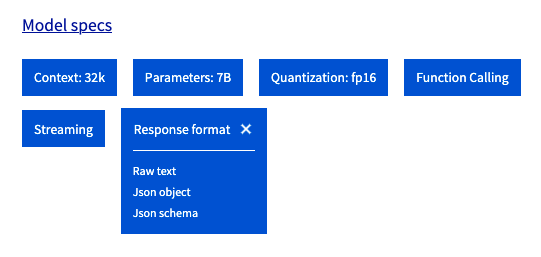

> [!primary]
>
> AI Endpoints is covered by the **[OVHcloud AI Endpoints Conditions](https://storage.gra.cloud.ovh.net/v1/AUTH_325716a587c64897acbef9a4a4726e38/contracts/48743bf-AI_Endpoints-ALL-1.1.pdf)** and the **[OVHcloud Public Cloud Special Conditions](https://storage.gra.cloud.ovh.net/v1/AUTH_325716a587c64897acbef9a4a4726e38/contracts/d2a208c-Conditions_particulieres_OVH_Stack-WE-9.0.pdf)**.
>

## Introduction

[AI Endpoints](https://endpoints.ai.cloud.ovh.net/) is a serverless platform provided by OVHcloud that offers easy access to a selection of world-renowned, pre-trained AI models. The platform is designed to be simple, secure, and intuitive, making it an ideal solution for developers who want to enhance their applications with AI capabilities without extensive AI expertise or concerns about data privacy.

**Structured Output** is a powerful feature that allows you to enforce specific formats for the responses from AI models. By using the `response_format` parameter in your API calls, you can define how you want the output to be structured, ensuring consistency and ease of integration with your applications.
This is particularly useful when you need the AI model to return data in a specific JSON format.
The [JSON schema](https://json-schema.org/) specification can be used to describe what data structure should the output adhere to, and the AI model will generate responses that match it.
This feature allows for seamless integration of AI-generated data into your applications, enabling you to build robust and consistent workflows.

## Objective

This documentation provides an overview on how to use structured outputs with the various AI models offered on [AI Endpoints](https://endpoints.ai.cloud.ovh.net/).

The examples provided in this guide will be using the [Llama 3.3 70b model](https://endpoints.ai.cloud.ovh.net/models/c968b503-27fa-451d-b59d-1b0ff91d304d).

Visit our [Catalog](https://endpoints.ai.cloud.ovh.net/catalog) to find out which models are compatible with Structured Output.

The output formats managed by each model are defined in the Response Format section:



## Requirements

The examples provided during this guide can be used with one of the following environments:

> [!tabs]
> **Python**
>> 
>> A [Python](https://www.python.org/) environment with the [openai client](https://pypi.org/project/openai/) and the pydantic library installed.
>>
>> ```sh
>> pip install openai pydantic
>> ```
>> 
>> **Javascript**
>> 
>> A [Node.js](https://nodejs.org/en) environment with the [request](https://www.npmjs.com/package/request) library.
>> Request can be installed using [NPM](https://www.npmjs.com/):
>> 
>> ```sh
>> npm install request
>> ```
>> 
>> **Curl**
>> 
>> A standard terminal, with [curl](https://curl.se/) installed on the system.
>> 

### Authentication & rate limiting

Most of the examples provided in this guide use anonymous authentication, which makes it simpler to use but may cause rate limiting issues.
If you wish to enable authentication using your own token, simply specify your API key within the requests.

Follow the instructions in the [AI Endpoints - Getting Started](/pages/public_cloud/ai_machine_learning/endpoints_guide_01_getting_started) guide for more information on authentication.

## Instructions

The `response_format` parameter of the Chat Completion API allows us to enable and configure the Structured Output features.

Models that support structured output can manage the three following modes:

- `{"type": "text"}`
The default textual format. This is the same as specifying no `response_format`.

- `{"type": "json_object"}`
The JSON object format is a legacy format that was introduced with the first iteration of Structured Outputs. This mode is non-deterministic and allows the model to output a JSON object without strict validation.

- `{"type": "json_schema", "json_schema": .. }`
[JSON schema](https://json-schema.org/) is a very powerful tool used to specify and validate a JSON data structure. This latest kind of `response_format` allows us to enforce custom output formats in LLM outputs using this specification and ensure consistency and interoperability with a variety of platforms and applications.

When using the JSON schema mode, outputs are deterministic and will always adhere to the schema specified.

We recommend using JSON schema over JSON object whenever possible.

### JSON schema

The following code samples provide a simple example on how to specify a JSON schema, using the `response_format` parameter.

> [!tabs]
> **Python**
>> For this example, we can use the openai Python library, combined with pydantic for powerful JSON schema management. 
>>
>> ```python
>> from pydantic import BaseModel
>> import openai
>> import os
>> 
>> # Define the prompts
>> messages = [
>>     { "content": "You are a helpful assistant that help users rank different things. You always answer in JSON format.", "role": "system" },
>>     { "content": "What are the top 3 most popular programming languages ?", "role": "user" }
>> ]
>> 
>> # Define the data model
>> class Language(BaseModel):
>>     name: str
>>     website: str
>>     ranking: int
>> 
>> class LanguageRankings(BaseModel):
>>     languages: list[Language]
>> 
>> # Initialise the client
>> api_key = os.environ['AI_ENDPOINT_API_KEY'] # Assuming your API key is available in this environment variable (export AI_ENDPOINT_API_KEY='your_api_key')
>> openai_client = openai.OpenAI(
>>     base_url='https://oai.endpoints.kepler.ai.cloud.ovh.net/v1',
>>     api_key=api_key
>> )
>> 
>> # Optionally, print the json schema infered from the pydantic model
>> print(f'JSON schema: {LanguageRankings.model_json_schema()}')
>> 
>> # Run the query
>> response = openai_client.beta.chat.completions.parse(
>>     model='Meta-Llama-3_3-70B-Instruct',
>>     messages=messages,
>>     response_format=LanguageRankings,
>>     temperature=0 # Ensure deterministic output for this guide's purpose
>> )
>> 
>> # Print the parsed response
>> language_rankings = response.choices[0].message.parsed
>> for language in language_rankings.languages:
>>     print(f"{language.name} is the n°{language.ranking} language ({language.website})")
>> ```
>>
>> Output:
>> 
>> ```sh
>> JSON schema: {'$defs': {'Language': {'properties': {'name': {'title': 'Name', 'type': 'string'}, 'website': {'title': 'Website', 'type': 'string'}, 'ranking': {'title': 'Ranking', 'type': 'integer'}}, 'required': ['name', 'website', 'ranking'], 'title': 'Language', 'type': 'object'}}, 'properties': {'languages': {'items': {'$ref': '#/$defs/Language'}, 'title': 'Languages', 'type': 'array'}}, 'required': ['languages'], 'title': 'LanguageRankings', 'type': 'object'}
>> JavaScript is the n°1 language (https://www.javascript.com/)
>> Python is the n°2 language (https://www.python.org/)
>> Java is the n°3 language (https://www.java.com/)
>> ```
>>
>> NOTE: this example is using `openai_client.beta.chat.completions.parse` to leverage automatic parsing with pydantic, but it is also possible to use `openai_client.chat.completions.create`, by using the `response_format` parameter and specifying the JSON schema manually.
>>
> **Curl**
>>
>> Input query:
>>
>> ```sh
>> curl -X POST "https://oai.endpoints.kepler.ai.cloud.ovh.net/v1/chat/completions" \
>>     -H 'accept: application/json'\
>>     -H 'content-type: application/json' \
>>     -d '{
>>         "max_tokens":100,
>>         "messages": [
>>             { "content": "You are a helpful assistant that help users rank different things. You always answer in JSON format.", "role": "system" },
>>             { "content": "What are the top 3 most popular programming languages ?", "role": "user" }
>>         ],
>>         "model": "Meta-Llama-3_3-70B-Instruct",
>>         "response_format": {
>>             "type":"json_schema",
>>             "json_schema": {
>>                 "name": "LanguageRankings",
>>                 "schema": {
>>                     "$defs": {},
>>                     "properties": {
>>                         "languages": {
>>                             "title": "Languages",
>>                             "type": "array",
>>                             "items": {
>>                                 "type": "object",
>>                                 "properties": {
>>                                     "name": {
>>                                         "title": "Name",
>>                                         "type": "string"
>>                                     },
>>                                     "website": {
>>                                         "title": "Website",
>>                                         "type": "string"
>>                                     },
>>                                     "ranking": {
>>                                         "title": "Ranking",
>>                                         "type": "number"
>>                                     }
>>                                 },
>>                                 "required": ["name", "website", "ranking"]
>>                             }
>>                         }
>>                     },
>>                     "required": ["languages"],
>>                     "title": "LanguageRankings",
>>                     "type": "object"
>>                 }
>>             }
>>         },
>>         "temperature": 0
>>     }' 
>> ```
>>
>> Output response:
>>
>> ```sh
>> {"id":"chatcmpl-9276e3e305e04c73bd05224abcb7532b","object":"chat.completion","created":1750772047,"model":"Meta-Llama-3_3-70B-Instruct","choices":[{"index":0,"message":{"role":"assistant","content":"{\"languages\": [\n    {\"name\": \"JavaScript\", \"ranking\": 1, \"website\": \"https://www.javascript.com/\"},\n    {\"name\": \"Python\", \"ranking\": 2, \"website\": \"https://www.python.org/\"},\n    {\"name\": \"Java\", \"ranking\": 3, \"website\": \"https://www.java.com/\"}\n]}"},"finish_reason":"stop","logprobs":null}],"usage":{"prompt_tokens":65,"completion_tokens":80,"total_tokens":145}}
>> ```
>>
>> As we can see, the response is matching the expected JSON schema!
>>
> **Javascript**
>>
>> ```javascript
>> const request = require('request');
>> const fs = require('fs');
>> 
>> // Define the prompts
>> const messages = [
>>     { content: "You are a helpful assistant that help users rank different things. You always answer in JSON format.", role: "system" },
>>     { content: "What are the top 3 most popular programming languages ?", role: "user" }
>> ];
>> 
>> // Define the JSON schema
>> const jsonSchema = {
>>     "name": "LanguageRankings",
>>     "schema": {
>>         "$defs": {},
>>         "properties": {
>>             "languages": {
>>                 "title": "Languages",
>>                 "type": "array",
>>                 "items": {
>>                     "type": "object",
>>                     "properties": {
>>                         "name": {
>>                             "title": "Name",
>>                             "type": "string"
>>                         },
>>                         "website": {
>>                             "title": "Website",
>>                             "type": "string"
>>                         },
>>                         "ranking": {
>>                             "title": "Ranking",
>>                             "type": "number"
>>                         }
>>                     },
>>                     "required": ["name", "website", "ranking"]
>>                 }
>>             }
>>         },
>>         "required": ["languages"],
>>         "title": "LanguageRankings",
>>         "type": "object"
>>     }
>> };
>> 
>> // Initialise the client
>> const apiKey = process.env.AI_ENDPOINT_API_KEY; // Assuming your API key is available in this environment variable (export AI_ENDPOINT_API_KEY='your_api_key')
>> const options = {
>>     url: 'https://oai.endpoints.kepler.ai.cloud.ovh.net/v1/chat/completions',
>>     headers: {
>>         'Content-Type': 'application/json',
>>         'Authorization': `Bearer ${apiKey}`
>>     },
>>     json: true,
>>     body: {
>>         messages: messages,
>>         model: 'Meta-Llama-3_3-70B-Instruct',
>>         response_format: {
>>             type: 'json_schema',
>>             json_schema: jsonSchema
>>         },
>>         temperature: 0
>>     }
>> };
>> 
>> // Run the query
>> request.post(options, (error, response, body) => {
>>     if (!error && response.statusCode == 200) {
>>         const languageRankings = body.choices[0].message.content;
>>         console.log(languageRankings)
>>         const parsedLanguageRankings = JSON.parse(languageRankings);
>>         parsedLanguageRankings.languages.forEach(language => {
>>             console.log(`${language.name} is the n°${language.ranking} most popular language (${language.website})`);
>>         });
>>     } else {
>>         console.error('Error:', error);
>>         console.error('Response:', response.body);
>>     }
>> });
>> ```
>>
>> Output:
>>
>> ```sh
>> {"languages": [
>>     {"name": "JavaScript", "ranking": 1, "website": "https://www.javascript.com/"},
>>     {"name": "Python", "ranking": 2, "website": "https://www.python.org/"},
>>     {"name": "Java", "ranking": 3, "website": "https://www.java.com/"}
>> ]}
>> JavaScript is the n°1 most popular language (https://www.javascript.com/)
>> Python is the n°2 most popular language (https://www.python.org/)
>> Java is the n°3 most popular language (https://www.java.com/)
>> ```
>>
>> This example shows us how to use the JSON schema response format with Javascript.
>>

### JSON object

The following code samples provide a simple example on how to use the legacy JSON object mode, using the `response_format` parameter. Note that when using the JSON object mode, we cannot explicitly specify the schema of the output.

> [!tabs]
> **Python**
>>
>> ```python
>> import json
>> import openai
>> import os
>> 
>> # Define the prompts
>> messages = [
>>     { "content": "You are a helpful assistant that help users rank different things. You always answer in JSON format.", "role": "system" },
>>     { "content": "What are the top 3 most popular programming languages ?", "role": "user" }
>> ]
>> 
>> # Initialise the client
>> api_key = os.environ['AI_ENDPOINT_API_KEY'] # Assuming your API key is available in this environment variable (export AI_ENDPOINT_API_KEY='your_api_key')
>> openai_client = openai.OpenAI(
>>     base_url='https://oai.endpoints.kepler.ai.cloud.ovh.net/v1',
>>     api_key=api_key
>> )
>> 
>> # Run the query
>> response = openai_client.chat.completions.create(
>>     model='Meta-Llama-3_3-70B-Instruct',
>>     messages=messages,
>>     response_format={
>>         "type": "json_object",
>>     },
>>     temperature=0 # Ensure deterministic output for this guide's purpose
>> )
>> 
>> # Print the response
>> output = json.loads(response.choices[0].message.content)
>> print(json.dumps(output, indent=2))
>> ```
>>
>> Output:
>>
>> ```sh
>> {
>>   "rank": [
>>     {
>>       "position": 1,
>>       "language": "JavaScript",
>>       "popularity": "94.5%"
>>     },
>>     {
>>       "position": 2,
>>       "language": "HTML/CSS",
>>       "popularity": "83.6%"
>>     },
>>     {
>>       "position": 3,
>>       "language": "Python",
>>       "popularity": "78.9%"
>>     }
>>   ]
>> }
>> ```
>>
> **Curl**
>>
>> Input query:
>>
>> ```sh
>> curl -X POST "https://oai.endpoints.kepler.ai.cloud.ovh.net/v1/chat/completions" \
>>     -H 'accept: application/json' \
>>     -H 'content-type: application/json' \
>>     -d '{
>>         "model": "Meta-Llama-3_3-70B-Instruct",
>>         "max_tokens": 100,
>>         "messages": [
>>             { "content": "You are a helpful assistant that help users rank different things. You always answer in JSON format.", "role": "system" },
>>             { "content": "What are the top 3 most popular programming languages ?", "role": "user" }
>>         ],
>>         "response_format": {
>>             "type": "json_object"
>>         },
>>         "temperature": 0
>>     }'
>> ```
>>
>> Output:
>>
>> ```sh
>> {"id":"chatcmpl-dfdbf074ab864199bac48ec929179fed","object":"chat.completion","created":1750773314,"model":"Meta-Llama-3_3-70B-Instruct","choices":[{"index":0,"message":{"role":"assistant","content":"{\"rank\": [\n    {\"position\": 1, \"language\": \"JavaScript\", \"popularity\": \"94.5%\"},\n    {\"position\": 2, \"language\": \"HTML/CSS\", \"popularity\": \"93.2%\"},\n    {\"position\": 3, \"language\": \"Python\", \"popularity\": \"87.3%\"}\n]}"},"finish_reason":"stop","logprobs":null}],"usage":{"prompt_tokens":65,"completion_tokens":77,"total_tokens":142}}%
>> ```
>>
> **Javascript**
>>
>> ```javascript
>> const request = require('request');
>> const fs = require('fs');
>> 
>> // Define the prompts
>> const messages = [
>>     { content: "You are a helpful assistant that help users rank different things. You always answer in JSON format.", role: "system" },
>>     { content: "What are the top 3 most popular programming languages ?", role: "user" }
>> ];
>> 
>> // Initialise the client
>> const apiKey = process.env.AI_ENDPOINT_API_KEY; // Assuming your API key is available in this environment variable (export AI_ENDPOINT_API_KEY='your_api_key')
>> const options = {
>>     url: 'https://oai.endpoints.kepler.ai.cloud.ovh.net/v1/chat/completions',
>>     headers: {
>>         'Content-Type': 'application/json',
>>         'Authorization': `Bearer ${apiKey}`
>>     },
>>     json: true,
>>     body: {
>>         messages: messages,
>>         model: 'Meta-Llama-3_3-70B-Instruct',
>>         response_format: {
>>             type: 'json_object',
>>         },
>>         temperature: 0
>>     }
>> };
>> 
>> // Run the query
>> request.post(options, (error, response, body) => {
>>     if (!error && response.statusCode == 200) {
>>         const languages = body.choices[0].message.content;
>>         const parsedData = JSON.parse(languages);
>>         console.log(parsedData)
>>     } else {
>>         console.error('Error:', error);
>>         console.error('Response:', response.body);
>>     }
>> });
>> ```
>>
>> Output:
>>
>> ```sh
>> {
>>   rank: [
>>     { position: 1, language: 'JavaScript', popularity: '94.5%' },
>>     { position: 2, language: 'HTML/CSS', popularity: '87.4%' },
>>     { position: 3, language: 'Python', popularity: '83.8%' }
>>   ]
>> }
>> ```
>> 

### Tips and best practices

This section contains additional tips that may improve the performance of Structured Output queries.

#### Streaming

All kinds of `response_format` are compatible with streaming. To enable streaming, simply use `"streaming": true` in your request's body and process the stream accordingly.

Example with python:

```python
from pydantic import BaseModel
import openai
import os

# Define the prompts
messages = [
    { "content": "You are a helpful assistant that help users rank different things. You always answer in JSON format.", "role": "system" },
    { "content": "What are the top 3 most popular programming languages ?", "role": "user" }
]

# Define the data model
class Language(BaseModel):
    name: str
    website: str
    ranking: int

class LanguageRankings(BaseModel):
    languages: list[Language]

# Initialise the client
api_key = os.environ['AI_ENDPOINT_API_KEY'] # Assuming your API key is available in this environment variable (export AI_ENDPOINT_API_KEY='your_api_key')
openai_client = openai.OpenAI(
    base_url='https://oai.endpoints.kepler.ai.cloud.ovh.net/v1',
    api_key=api_key
)

# Run the query
with openai_client.beta.chat.completions.stream(
    model='Meta-Llama-3_3-70B-Instruct',
    messages=messages,
    response_format=LanguageRankings,
    temperature=0,
) as stream:
    for event in stream:
        if event.type == "response.refusal.delta":
            print(event.delta, end="")
        elif event.type == "response.output_text.delta":
            print(event.delta, end="")
        elif event.type == "response.error":
            print(event.error, end="")
        elif event.type == "response.completed":
            print("Completed")
        elif event.type == "chunk":
            if len(event.chunk.choices):
                print(event.chunk.choices[0].delta.content, end="")

    response = stream.get_final_completion()

# Print the parsed response
language_rankings = response.choices[0].message.parsed
for language in language_rankings.languages:
    print(f"{language.name} is the n°{language.ranking} language ({language.website})")
```

Streamed output response:

```sh
{"languages": [
    {"name": "JavaScript", "ranking": 1, "website": "https://www.javascript.com/"},
    {"name": "Python", "ranking": 2, "website": "https://www.python.org/"},
    {"name": "Java", "ranking": 3, "website": "https://www.java.com/"}
]}
JavaScript is the n°1 language (https://www.javascript.com/)
Python is the n°2 language (https://www.python.org/)
Java is the n°3 language (https://www.java.com/)
```

#### Schema definition

Some considerations about the JSON schema definition:

- Structured output currently supports a subset of the [JSON schema specification](https://json-schema.org/specification). Some features may not be compatible.
- The models will generate the output following alphabetical order of the JSON schema keys. It may be useful to rename your fields to enforce a specific order during generation.
- To avoid divergence, we recommend setting [additional properties](https://json-schema.org/understanding-json-schema/reference/object#additionalproperties) to `false` and explicity setting the [required fields](https://json-schema.org/learn/getting-started-step-by-step#define-required-properties).

Don't hesitate to experiment with different variations of your JSON schemas to reach the best performance!

#### Prompting & additional parameters

Some additional considerations regarding prompts and model parameters:

- Even though the `response_format` can be used to enable structured outputs, models can generally perform better when asked to produce json outputs within the prompt (`messages` field).
- Most models tend to perform better when using lower temperature for structured outputs.
- Some model providers may recommend specific system prompts and parameters to use for structured outputs and function calling. Don't hesitate to visit the model pages to dive deeper into model specifics ([An example for Llama 3.3 on HuggingFace](https://huggingface.co/meta-llama/Llama-3.3-70B-Instruct)).

## Conclusion

In this guide, we have explained how to use Structured Output with the [AI Endpoints](https://endpoints.ai.cloud.ovh.net/) models. We have provided a comprehensive overview of the feature which can help you perfect your integration of LLM for your own application.

## Go further

Browse the full [AI Endpoints documentation](/products/public-cloud-ai-and-machine-learning-ai-endpoints) to further understand the main concepts and get started.

To discover how to build complete and powerful applications using AI Endpoints, explore our dedicated [AI Endpoints guides](/products/public-cloud-ai-and-machine-learning-ai-endpoints).

If you need training or technical assistance to implement our solutions, contact your sales representative or click on [this link](/links/professional-services) to get a quote and ask our Professional Services experts for a custom analysis of your project.

## Feedback

Please send us your questions, feedback and suggestions to improve the service:

- On the OVHcloud [Discord server](https://discord.gg/ovhcloud).
