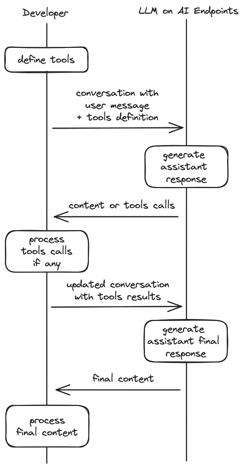

> [!primary]
>
> AI Endpoints is covered by the **[OVHcloud AI Endpoints Conditions](https://storage.gra.cloud.ovh.net/v1/AUTH_325716a587c64897acbef9a4a4726e38/contracts/48743bf-AI_Endpoints-ALL-1.1.pdf)** and the **[OVHcloud Public Cloud Special Conditions](https://storage.gra.cloud.ovh.net/v1/AUTH_325716a587c64897acbef9a4a4726e38/contracts/d2a208c-Conditions_particulieres_OVH_Stack-WE-9.0.pdf)**.
>

## Introduction

[AI Endpoints](https://endpoints.ai.cloud.ovh.net/) is a serverless platform provided by OVHcloud that offers easy access to a selection of world-renowned, pre-trained AI models. The platform is designed to be simple, secure, and intuitive, making it an ideal solution for developers who want to enhance their applications with AI capabilities without extensive AI expertise or concerns about data privacy.

**Function Calling**, also named tool calling, is a feature that enables a large language model (LLM) to trigger user-defined functions (also named tools). These tools are defined by the developer and implement specific behaviors such as calling an API, fetching data or calculating values, which extends the capabilities of the LLM.

The LLM will identify which tool(s) to call and the arguments to use.
This feature can be used to develop assistants or agents for instance.

## Objective

This documentation provides an overview on how to use function calling with the AI models offered on [AI Endpoints](https://endpoints.ai.cloud.ovh.net/).
The examples provided in this guide will be using the [Mistral-Nemo-Instruct-2407](https://endpoints.ai.cloud.ovh.net/models/mistral-nemo-instruct-2407) model.

Visit our [Catalog](https://endpoints.ai.cloud.ovh.net/catalog) to find out which models are compatible with Function Calling.

## Requirements

We use Python for the examples provided through this guide.

Make sure you have a [Python](https://www.python.org/) environment configurer, and install the [openai client](https://pypi.org/project/openai/).
```sh
pip install openai
```

### Authentication & rate limiting

All the examples provided in this guide are using the anonymous authentication which makes it simpler to use but may cause rate limiting issues.
If you wish to enable authentication using your own token, simply specify your API key within the requests.
Follow the following instructions in the [AI Endpoints - Getting Started](/pages/public_cloud/ai_machine_learning/endpoints_guide_01_getting_started) for more information on authentication.

## Function Calling overview

The workflow to use function calling is described below:
1. **Define tools**: tell the model what tools it can use, with a JSON schema for each tool.
2. **Call the model with tools**: pass tools along with your system and user messages to the model, which will eventually generate tool calls.
3. **Process tools calls**: for each tool calls returned by the model, execute the actual implementation of the tool in your code.
4. **Call the model with tools responses**: send a new request to the model, with the conversation updated with tool calls results.
4. **Final response**: process the final generated answer, which takes the tools results into account.

This diagram illustrates the workflow:



## Example: a time-tracking assistant

To illustrate the use of function calling and progressively introduce the important notions related to this feature, we are going to develop a time-tracking assistant, step-by-step.

The assistant will be able to:
* log time spent on a task
* generate a time report

Each task has a name, category and total duration in minutes. Categories are a fixed list of strings, for example "Code" or "Meetings".
A time report can be generated for a category of task.

The user will be able to interact with the assistant to log time and get information about how time was spent.

### Define tools

Our time-tracking assistant will use two tools :
* `log_work`: log time spent on a task. Take the name of the task, category, duration and unit (minutes or hours).
  For example, to log 2 hours on documentation writing, you would call `log_work("User guide", "Documentation", 2, "hours")`
* `time_report`: get JSON data about all tasks of a given category, and the total duration, in a given time unit (minutes or hours).
  For example, to get the breakdown on time spent on coding tasks, in hours, you would call `time_report("Code", "hours")`

To get the model to use those tools, first we have to declare them with JSON schemas, in a `tools` list that we will pass to the Chat Completion API.

Here is how the tools can be declared in Python:

```python
# TOOLS DECLARATION (JSON SCHEMA)
# Possible Categories (we'll reuse this later)
CATEGORIES = ["Code", "Meetings", "Documentation", "Other"]

# Define the tool specification
TOOLS = [
    {
        "type": "function",
        "function": {
            "name": "log_work",
            "description": "Logs a work session for a specific task by providing a start and end datetime.",
            "parameters": {
                "type": "object",
                "properties": {
                    "task_name": {
                        "type": "string",
                        "description": "The name of the task to log work for."
                    },
                    "task_category": {
                        "type": "string",
                        "enum": CATEGORIES,
                        "description": "The category of the task to log work for."
                    },
                    "duration": {
                        "type": "number",
                        "description": "The duration to log work for."
                    },
                    "unit": {
                        "type": "string",
                        "enum": ["minutes", "hours"],
                        "description": "The time unit to log work in."
                    }
                },
                "required": ["task_name", "task_category", "duration", "unit"]
            }
        }
    },
    {
        "type": "function",
        "function": {
            "name": "time_report",
            "description": "Output a JSON with the breakdown of time spent by each task of a given category, returned in a given time unit.",
            "parameters": {
                "type": "object",
                "properties": {
                    "category": {
                        "type": "string",
                        "description": "The name of the category to get the report for."
                    },
                    "unit": {
                        "type": "string",
                        "enum": ["minutes", "hours"],
                        "description": "The time unit to return the result in."
                    }
                },
                "required": ["category", "unit"]
            }
        }
    }
]
```

### Generate tool calls

With our tools ready, we can now try to call the model and see if it understands our tools definition.
We use the OpenAI Python SDK to call the ``/v1/chat/completions`` route on the endpoint, passing the tools definition in the `tools` parameter.

Let's send a simple user message: `log 1 hour team meeting` and see what the model answers.

```python
import os
from openai import OpenAI

MODEL_NAME = "Mistral-Nemo-Instruct-2407"
API_KEY = os.environ.get("OVH_AI_ENDPOINTS_API_KEY")

# Initialize the OpenAI client
client = OpenAI(
    base_url="https://oai.endpoints.kepler.ai.cloud.ovh.net/v1",
    api_key=API_KEY
)

messages = [
    {"role": "user", "content": "log 1 hour team meeting"}
]

response = client.chat.completions.create(
    model=MODEL_NAME,
    messages=messages,
    tools=TOOLS,
    tool_choice="auto",
    temperature=0.15
)

# Add the assistant response to the conversation
assistant_response = response.choices[0].message
messages.append(assistant_response)

print(assistant_response.to_json())
```

Output:
```json
{
  "role": "assistant",
  "tool_calls": [
    {
      "id": "wuvyeH6fR",
      "function": {
        "arguments": "{\"task_name\": \"team meeting\", \"task_category\": \"Meetings\", \"duration\": 1, \"unit\": \"hours\"}",
        "name": "log_work"
      },
      "type": "function"
    }
  ]
}
```

We see that the model understood correctly that it needed to call the `log_work` tool, by looking at the `assistant` message generated.

The `tool_calls` list contains the tool calls the model generated in response to our user message.
The `name` and `arguments` fields tells us which tool to call and which parameters to pass to the function.
The `id` is an unique identifier for this tool call, that we will need later on.
You can have multiple tool calls in this list.

Under the hood, the model has recognized that the user intent was related to the set of tools given, and generated a sequence of specific tokens that were post-processed to create a tool call object.

We add this message to the conversation so that the model can have knowledge about this tool call in the next rounds of our multi-turn conversation.

### Process tools calls

Now that we see that the model is able to generate tool calls, we need to code the Python implementation of the tools, so that we can process the tool calls the LLM will generate and actually start to log time!
Each task is stored in a dict, with the name as key.
Categories are a fixed list.

We define the two functions, `log_work` and `time_report`, in the Python code below:

```python
# TOOLS IMPLEMENTATION

import json
from dataclasses import dataclass

# We store tasks by their names
TASKS_BY_NAME = {}

# A task has a name, category, and total duration in minutes
# When we log a new work entry for a task, we add to this total duration
@dataclass
class Task:
    name: str
    category: str
    duration_minutes: float = 0.0

    def add_entry(self, duration:float, unit:str):
        self.duration_minutes += to_minutes(duration, unit)

    def __str__(self):
        return json.dumps({"name": self.name, "category": self.category, "total_duration": self.duration_minutes})


# TOOL 1 : log a work entry (task name, category, duration and unit = minutes or hours)
def log_work(task_name: str, task_category: str, duration: float, unit: str):
    # we create a new task if the name doesn't exist yet
    if task_name in TASKS_BY_NAME:
        status = "updated"
    else:
        status = "created"
        TASKS_BY_NAME[task_name] = Task(task_name, task_category)

    task = TASKS_BY_NAME.get(task_name)
    task.add_entry(duration=duration, unit=unit)

    # the tool returns the data for the created or updated task, so that the model can use this information if needed
    return {"task": task.name, "task_category": task_category, "total_duration": convert(task.duration_minutes, unit), "status": status}

# TOOL 2 : get JSON data about a tasks in a given category, and total duration (category, unit = minutes or hours)
def time_report(category: str, unit: str):
    data = [{"name":t.name, "total_duration":convert(t.duration_minutes, unit)} for t in TASKS_BY_NAME.values() if t.category == category]
    data.append({"total_duration_for_category": sum([x["total_duration"] for x in data])})
    return data

# Utilities function: convert to and from minutes and hours
def convert(duration_min: float, unit: str) -> float:
    if unit == "minutes":
        return duration_min
    elif unit == "hours":
        return duration_min / 60
    else:
        raise ValueError("Invalid unit. Must be 'minutes', or 'hours'.")

def to_minutes(duration: float, unit: str) -> float:
    if unit == "minutes":
        return duration
    elif unit == "hours":
        return duration * 60
    else:
        raise ValueError("Invalid unit. Must be 'minutes', or 'hours'.")
```

Now, let's see how we can process tool calls generated by the model.


```python
# this map allows us to know which Python function for a given tool
FUNCTION_MAP = {
    "log_work": log_work,
    "time_report": time_report
}

# if there are tool calls in the assistant generated response
if assistant_response.tool_calls:
    print(f"<\t{len(assistant_response.tool_calls)} tool(s) to call")
    # we can have several tool calls
    for tool_call in assistant_response.tool_calls:
        # The tool name should be associated with a Python function
        if tool_call.function.name in FUNCTION_MAP.keys():
            # the arguments provided by the model should be a valid JSON (in production code, this should be checked)
            function_args = json.loads(tool_call.function.arguments)
            print(f">\t\tExecute tool {tool_call.function.name} with arguments {function_args}")
            
            # execute the tool
            function_response = FUNCTION_MAP[tool_call.function.name](**function_args)

            print(function_response)
```

Output:
```
<	1 tool(s) to call
>		Execute tool log_work with arguments {'task_name': 'team meeting', 'task_category': 'Meetings', 'duration': 1, 'unit': 'hours'}
{'task': 'team meeting', 'task_category': 'Meetings', 'total_duration': 1.0}
```

We see that we successfully created a task called "team meeting", in the "Meetings" category with a total duration of 1 hour.

### Send tool calls results and get the final response

Now that we have executed our tool calls, we have to send the result back to the model, so that it can generate a new response that takes this new information into account, to tell the user the task has been created successfully or to give the time report for instance.

All we have to do, is to add the tool results as new `tool` messages into the conversation, so we'll update our code:
```python
if assistant_response.tool_calls:
    print(f"<\t{len(assistant_response.tool_calls)} tool(s) to call")
    # we can have several tool calls
    for tool_call in assistant_response.tool_calls:
        # The tool name should be associated with a Python function
        if tool_call.function.name in FUNCTION_MAP.keys():
            # the arguments provided by the model should be a valid JSON (in production code, this should be checked)
            function_args = json.loads(tool_call.function.arguments)
            print(f">\t\tExecute tool {tool_call.function.name} with arguments {function_args}")

            # execute the tool
            function_response = FUNCTION_MAP[tool_call.function.name](**function_args)

            # Add tool call result to the conversation
            tool_call_result = {
                "role": "tool",
                "name": tool_call.function.name,
                "content": json.dumps(function_response),
                "tool_call_id": tool_call.id
            }
            messages.append(tool_call_result)
            
            print(f">\t\tAdd tool call result to conversation:\n{tool_call_result}")
```

We then call the model with the updated conversation:

```python
print(f">\tCall assistant with tool results")

response = client.chat.completions.create(
    model=MODEL_NAME,
    messages=messages,
)

print(f"<\t\tAssistant final answer:\n{response.choices[0].message.content}")
```

Output:
```
<	1 tool(s) to call
>		Execute tool log_work with arguments {'task_name': 'team meeting', 'task_category': 'Meetings', 'duration': 1, 'unit': 'hours'}
>		Add tool call result to conversation:
{'role': 'tool', 'name': 'log_work', 'content': '{"task": "team meeting", "task_category": "Meetings", "total_duration": 1.0, "status": "created"}', 'tool_call_id': 'v1X1sJP9b'}
>	Call assistant with tool results
<		Assistant final answer:
Following is the details of 1 hour team meeting:

- Task: Team Meeting
- Duration: 1.0 hours
- Status: Created
```
The assistant has generated a response acknowledging the creation of the task.

### Add a system prompt

To make our assistant more robust and powerful, it can be useful to add a system prompt that:
* explains what is expected from the model
* provides useful information to the model, such as the current existing tasks and categories

```python
SYSTEM_PROMPT = \
"""
You are a helpful and precise time-tracking assistant.
You use tools to log work and generate time reports.

# Possible categories: {{categories}}

# Existing tasks: {{tasks}}

"""

def format_system_prompt():
    return SYSTEM_PROMPT \
        .replace("{{tasks}}", json.dumps([str(t) for t in TASKS_BY_NAME.values()])) \
        .replace("{{categories}}", json.dumps(CATEGORIES))

messages = [
    {"role": "system", "content": format_system_prompt()},
    {"role": "user", "content": "log 1 hour team meeting"}
]
```

With this system prompt, the model will be able to use data about existing tasks and categories to generate its responses.

### Putting it all together

Now we can combine all notions we've seen so far to create a `query` method that will:
* call the model with the formatted system prompt and user message
* process tool calls
* call the model a second time with the tool results
* output the final answer

```python
def query(user_prompt: str):
    print(f"> Querying assistant with user prompt: {user_prompt}")

    messages = [
        {"role": "system", "content": format_system_prompt()},
        {"role": "user", "content": user_prompt}
    ]
    
    response = client.chat.completions.create(
        model=MODEL_NAME,
        messages=messages,
        tools=TOOLS,
        tool_choice="auto",
        temperature=0.15
    )

    # Add the assistant response to the conversation
    assistant_response = response.choices[0].message
    messages.append(assistant_response)

    # Process the tool calls
    if assistant_response.tool_calls:
        print(f"<\t{len(assistant_response.tool_calls)} tool(s) to call")
        for tool_call in assistant_response.tool_calls:

            # Execute the function
            if tool_call.function.name in FUNCTION_MAP.keys():
                function_args = json.loads(tool_call.function.arguments)
                print(f">\t\tExecute tool {tool_call.function.name} with arguments {function_args}")
                function_response = FUNCTION_MAP[tool_call.function.name](**function_args)

                # Add results to the conversation
                tool_call_result = {
                    "role": "tool",
                    "name": tool_call.function.name,
                    "content": json.dumps(function_response),
                    "tool_call_id": tool_call.id
                }
                messages.append(tool_call_result)
                
                print(f">\t\tAdd tool call result to conversation:\n{tool_call_result}")
    else:
        print("<\tNO TOOL CALLS")

    print(f">\tCall assistant with tool results")

    response = client.chat.completions.create(
        model=MODEL_NAME,
        messages=messages,
    )

    print(f"<\t\tAssistant final answer:\n{response.choices[0].message.content}")
    print("\n---\n")
```

Let's try our assistant on some examples!

```python
query("Spent 2 hours coding on Feature A")
query("Feature B: 3h")
query("Team meeting 1h")
# this query is more complex
# as it requires the model to generate 2 tool calls (one log_work for each feature),
# and to reuse the task "Feature B" instead of creating a new one
query("log 2 hours on feat B and 3 hours on feature C")
query("time spent in meetings?")
query("total time on coding")
query("on which task did I spent most hours coding?")
```

Output:
```
> Querying assistant with user prompt: Spent 2 hours coding on Feature A
<	1 tool(s) to call
>		Execute tool log_work with arguments {'duration': 2, 'task_category': 'Code', 'task_name': 'Feature A', 'unit': 'hours'}
>		Add tool call result to conversation:
{'role': 'tool', 'name': 'log_work', 'content': '{"task": "Feature A", "task_category": "Code", "total_duration": 2.0, "status": "created"}', 'tool_call_id': 'iGcC6qbte'}
>	Call assistant with tool results
<		Assistant final answer:
Logged time for Code
  Feature A 2 hours, 0 minutes
  ============================

---

> Querying assistant with user prompt: Feature B: 3h
<	1 tool(s) to call
>		Execute tool log_work with arguments {'task_name': 'Feature B', 'task_category': 'Code', 'duration': 3, 'unit': 'hours'}
>		Add tool call result to conversation:
{'role': 'tool', 'name': 'log_work', 'content': '{"task": "Feature B", "task_category": "Code", "total_duration": 3.0, "status": "created"}', 'tool_call_id': 'd30xAKNT1'}
>	Call assistant with tool results
<		Assistant final answer:
- Your work log has been created. Here are the details:
  - Task: Feature B
  - Category: Code
  - Duration: 3 hours
  - Status: Created

---

> Querying assistant with user prompt: Team meeting 1h
<	1 tool(s) to call
>		Execute tool log_work with arguments {'task_name': 'Team meeting', 'task_category': 'Meetings', 'duration': 60, 'unit': 'minutes'}
>		Add tool call result to conversation:
{'role': 'tool', 'name': 'log_work', 'content': '{"task": "Team meeting", "task_category": "Meetings", "total_duration": 60.0, "status": "created"}', 'tool_call_id': 'EV3D7LdPE'}
>	Call assistant with tool results
<		Assistant final answer:
The task "Team meeting" has been created successfully.

---

> Querying assistant with user prompt: log 2 hours on feat B and 3 hours on feature C
<	2 tool(s) to call
>		Execute tool log_work with arguments {'task_name': 'Feature B', 'task_category': 'Code', 'duration': 2, 'unit': 'hours'}
>		Add tool call result to conversation:
{'role': 'tool', 'name': 'log_work', 'content': '{"task": "Feature B", "task_category": "Code", "total_duration": 5.0, "status": "updated"}', 'tool_call_id': 'frrThsgJ5'}
>		Execute tool log_work with arguments {'task_name': 'Feature C', 'task_category': 'Code', 'duration': 3, 'unit': 'hours'}
>		Add tool call result to conversation:
{'role': 'tool', 'name': 'log_work', 'content': '{"task": "Feature C", "task_category": "Code", "total_duration": 3.0, "status": "created"}', 'tool_call_id': 'K4aTPhdBp'}
>	Call assistant with tool results
<		Assistant final answer:
Great! Feature B's total working hours have been updated to 5 hours. Feature C's working time has been recorded as 3 hours.

---

> Querying assistant with user prompt: time spent in meetings?
<	1 tool(s) to call
>		Execute tool time_report with arguments {'category': 'Meetings', 'unit': 'minutes'}
>		Add tool call result to conversation:
{'role': 'tool', 'name': 'time_report', 'content': '[{"name": "Team meeting", "total_duration": 60.0}, {"total_duration_for_category": 60.0}]', 'tool_call_id': '1G8uk1bPH'}
>	Call assistant with tool results
<		Assistant final answer:
Here's the time spent in meetings:

- **Team meeting**: 60 minutes

---

> Querying assistant with user prompt: total time on coding
<	1 tool(s) to call
>		Execute tool time_report with arguments {'category': 'Code', 'unit': 'hours'}
>		Add tool call result to conversation:
{'role': 'tool', 'name': 'time_report', 'content': '[{"name": "Feature A", "total_duration": 2.0}, {"name": "Feature B", "total_duration": 5.0}, {"name": "Feature C", "total_duration": 3.0}, {"total_duration_for_category": 10.0}]', 'tool_call_id': '50bmrsPII'}
>	Call assistant with tool results
<		Assistant final answer:
Here's the breakdown of your coding time:

- Feature A: 2 hours
- Feature B: 5 hours
- Feature C: 3 hours
- **Total**: 10 hours

---

> Querying assistant with user prompt: on which task did I spent most hours coding?
<	1 tool(s) to call
>		Execute tool time_report with arguments {'category': 'Code', 'unit': 'hours'}
>		Add tool call result to conversation:
{'role': 'tool', 'name': 'time_report', 'content': '[{"name": "Feature A", "total_duration": 2.0}, {"name": "Feature B", "total_duration": 5.0}, {"name": "Feature C", "total_duration": 3.0}, {"total_duration_for_category": 10.0}]', 'tool_call_id': 'uFDF7rS0H'}
>	Call assistant with tool results
<		Assistant final answer:
Based on the tracking data, the task on which you spent the most hours coding is:

- **Feature B**: 5 hours
- The total coding time across all tasks is 10 hours.
```

Mission accomplished!

## Tips and best practices
This section contains additional tips that may improve the performance of Function Calling queries.

### Tool choice

You've noticed that we used the `auto` mode in our request to the endpoint.

Here are the available values for this parameter and the impact on the output.

| `tool_choice` value | Effect                                                                                                                                                                                                              |
|---------------------|---------------------------------------------------------------------------------------------------------------------------------------------------------------------------------------------------------------------|
| `auto`              | Default mode when tools are defined, the model generates 0 to N tool calls.                                                                                                                                         |
| `required`          | Force the model to generate at least 1 tool call, using structured outputs.                                                                                                                                         |
| named function      | Force the model to generate at least 1 tool call to the given function.<br/>For example, to force the model to call the `log_work` tool:<br/>`tool_choice = {"type": "function", "function": {"name": "log_work"}}` |
| `none`              | No tool calls generated.                                                                                                                                                                                            |

### Streaming

It is possible to use Function Calling in streaming mode, by setting `stream` to `true` in your request.

Let's see an example with cURL and the LLaMa 3.1 8B model:
```bash
curl -X 'POST'
        'https://llama-3-1-8b-instruct.endpoints.kepler.ai.cloud.ovh.net/api/openai_compat/v1/chat/completions'
        -H 'accept: application/json'
           -H 'Content-Type: application/json'
              -d '{
"max_tokens": 100,
"messages": [
    {
        "content": "What is the current weather in Paris?",
        "role": "user"
    }
],
"model": null,
"seed": null,
"stream": true,
"temperature": 0.1,
"tool_choice": "auto",
"tools": [
    {
        "function": {
            "description": "Get the current weather in a given location",
            "name": "get_current_weather",
            "parameters": {
                "properties": {
                    "country": {
                        "description": "The two-letters country code",
                        "type": "string"
                    },
                    "location": {
                        "description": "The city",
                        "type": "string"
                    },
                    "unit": {
                        "enum": [
                            "celsius",
                            "fahrenheit"
                        ],
                        "type": "string"
                    }
                },
                "required": [
                    "location",
                    "country"
                ],
                "type": "object"
            }
        },
        "type": "function"
    }
],
"top_p": 1
}'
```

You will get tool call deltas in the server-side events chunks, with this format:
```
data: {...,"choices":[{"index":0,"delta":{"role":"assistant","content":""}}],...,"object":"chat.completion.chunk"}
data: {...,"choices":[{"index":0,"delta":{"role":"assistant","tool_calls":[{"index":0,"id":"chatcmpl-tool-e41bfee4ae1346bbbb4336061037e2b5","type":"function","function":{"name":"get_current_weather","arguments":""}}]}}],...,"object":"chat.completion.chunk"}
data: {...,"choices":[{"index":0,"delta":{"role":"assistant","tool_calls":[{"index":0,"function":{"arguments":"{\"country\": \""}}]}}],...,"object":"chat.completion.chunk"}
data: {...,"choices":[{"index":0,"delta":{"role":"assistant","tool_calls":[{"index":0,"function":{"arguments":"FR\""}}]}}],...,"object":"chat.completion.chunk"}
data: {...,"choices":[{"index":0,"delta":{"role":"assistant","tool_calls":[{"index":0,"function":{"arguments":", \"location\": \""}}]}}],...,"object":"chat.completion.chunk"}
data: {...,"choices":[{"index":0,"delta":{"role":"assistant","tool_calls":[{"index":0,"function":{"arguments":"Paris\""}}]}}],...,"object":"chat.completion.chunk"}
data: {...,"choices":[{"index":0,"delta":{"role":"assistant","tool_calls":[{"index":0,"function":{"arguments":", \"unit\": \""}}]}}],...,"object":"chat.completion.chunk"}
data: {...,"choices":[{"index":0,"delta":{"role":"assistant","tool_calls":[{"index":0,"function":{"arguments":"c"}}]}}],...,"object":"chat.completion.chunk"}
data: {...,"choices":[{"index":0,"delta":{"role":"assistant","tool_calls":[{"index":0,"function":{"arguments":"elsius\"}"}}]}}],...,"object":"chat.completion.chunk"}
data: {...,"choices":[{"index":0,"delta":{"role":"assistant","tool_calls":[{"index":0,"function":{"arguments":""}}]},"finish_reason":"tool_calls"}],...,"object":"chat.completion.chunk"}
data: [DONE]
```

Each tool call delta contains either the name of the function to call, either a part of the arguments to use.

To parse these chunks with the OpenAI Python SDK, you can use this code snippet:

```python
final_tool_calls_dict = {}

for chunk in completion:
    if len(chunk.choices) > 0:
        for tool_call in chunk.choices[0].delta.tool_calls or []:
            index = tool_call.index

            if index not in final_tool_calls_dict:
                final_tool_calls_dict[index] = tool_call

            final_tool_calls_dict[index].function.arguments += tool_call.function.arguments

final_tool_calls = [v for (k, v) in sorted(final_tool_calls_dict.items())]
```

### Parallel tool calls

Some models are able to generate multiple tool calls in one round (see the time-tracking tutorial above for an example).
To control this behavior, the OpenAI specification allows to pass a `parallel_tool_calls` boolean parameter.

If `false`, the model can only generate one tool call at most.
This case is currently not supported by AI Endpoints.

If you need your system to process only one tool call at a time, or if the model you are using doesn't support multiple tool calls, we suggest you pick the first one, process it, and call the model again.

Please note that LLaMa models don't support multiple tool calls between users and assistants messages.

#### Prompting & additional parameters

Some additional considerations regarding prompts and model parameters:
- Most models tend to perform better when using lower temperature for function calling.
- The use of a system prompt is recommended, to ground the model into using the tools at its disposal. Whether a system prompt is defined or not, a description of the tools will usually be included in the tokens sent to the model (see the model chat template for more details).
- If you know in advance that your model needs to call tools, use the `tool_choice=required` parameter to make sure it generates at least one tool call.
- Some model providers may recommend specific system prompts and parameters to use for structured output and function calling. Don't hesitate to visit the model pages to dive deeper into model specifics ([example for Llama 3.3 on HuggingFace](https://huggingface.co/meta-llama/Llama-3.3-70B-Instruct)).

## Conclusion

In this guide, we have explained how to use Structured Output with the [AI Endpoints](https://endpoints.ai.cloud.ovh.net/) models.
We have provided a comprehensive overview of the feature which can help you perfect your integration of LLM for your own application.

## Go further

Browse the full [AI Endpoints documentation](/products/public-cloud-ai-and-machine-learning-ai-endpoints) to further understand the main concepts and get started.

To discover how to build complete and powerful applications using AI Endpoints, explore our dedicated [AI Endpoints guides](/products/public-cloud-ai-and-machine-learning-ai-endpoints).

If you need training or technical assistance to implement our solutions, contact your sales representative or click on [this link](/links/professional-services) to get a quote and ask our Professional Services experts for a custom analysis of your project.

## Feedback

Please send us your questions, feedback and suggestions to improve the service:

- On the OVHcloud [Discord server](https://discord.gg/ovhcloud)

