> [!primary]
>
> AI Endpoints is covered by the [OVHcloud AI Endpoints Conditions](https://storage.gra.cloud.ovh.net/v1/AUTH_325716a587c64897acbef9a4a4726e38/contracts/48743bf-AI_Endpoints-ALL-1.1.pdf) and the [OVHcloud Public Cloud Special Conditions](https://storage.gra.cloud.ovh.net/v1/AUTH_325716a587c64897acbef9a4a4726e38/contracts/d2a208c-Conditions_particulieres_OVH_Stack-WE-9.0.pdf).
>

🎉 **New Integration Available!** We're excited to announce a new integration for [AI Endpoints](https://endpoints.ai.cloud.ovh.net/) with [LiteLLM](https://litellm.ai). It will significantly simplify the use of our AI models in your Python applications, and continues our commitment to integrating AI Endpoints into as many open-source tools as possible to simplify its usage.

## Objective

OVHcloud [AI Endpoints](https://endpoints.ai.cloud.ovh.net/) allows developers to easily add AI features to their day to day developments.

In this guide, we will show how to use [LiteLLM](https://litellm.ai) to integrate OVHcloud [AI Endpoints](https://endpoints.ai.cloud.ovh.net/) directly into your Python applications.

With LiteLLM’s unified interface and OVHcloud’s scalable AI infrastructure, you can quickly experiment, switch between models, and streamline the development of your AI-powered applications.

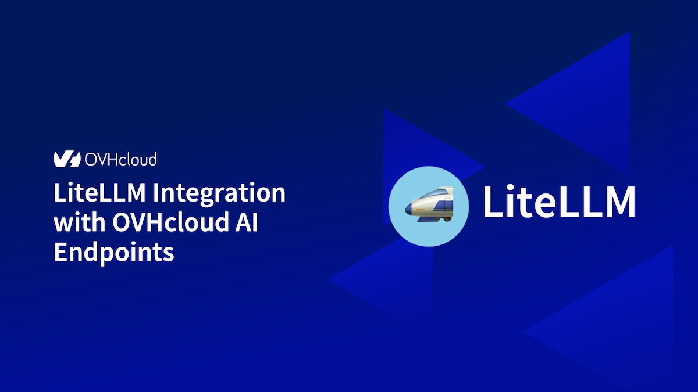{.thumbnail}

## Definition

- [LiteLLM](https://litellm.ai): A Python library that simplifies using Large Language Model (LLM) by providing a unified interface for different AI providers. Instead of managing the specifics of each API, LiteLLM gives you access to over 100 different models using OpenAI format.
- [AI Endpoints](https://endpoints.ai.cloud.ovh.net/): A serverless platform by OVHcloud providing easy access to a variety of world-renowned AI models including Mistral, LLaMA, and more. This platform is designed to be simple, secure, and intuitive with data privacy as a top priority.

### Why is this integration important?

This new integration offers you several advantages:

- **Simplicity**: A unified interface for all your AI models
- **Flexibility**: Switch between models without rewriting your code
- **Compatibility**: OpenAI-compatible syntax for easy migration
- **Robustness**: Automatic error handling and retry mechanisms
- **Observability**: Built-in logging and monitoring capabilities
- **Models**: All of our models are available in LiteLLM!

## Requirements

Before getting started, make sure you have:

1. An OVHcloud account with access to AI Endpoints
2. Python 3.8 or higher installed
3. An API key generated from the [OVHcloud Control Panel](/links/manager), in `Public Cloud`{.action} > `AI Endpoints` > `API keys`{.action}

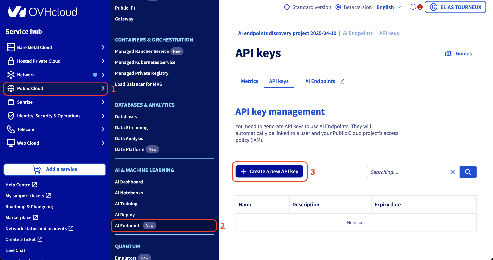{.thumbnail}

## Instructions

### Installation

Install LiteLLM via pip:

```bash
pip install litellm
```

And that's all, you are ready to go! 🎉

### Basic Configuration

#### Environment Variables

The recommended method to configure your API key is using environment variables:

```python
import os

# Set your API key via environment variable
os.environ['OVHCLOUD_API_KEY'] = "your-api-key"
```

### Basic Usage

Here's a simple usage example:

```python
from litellm import completion

response = completion(
    model="ovhcloud/Meta-Llama-3_3-70B-Instruct",
    messages=[
        {
            "role": "user",
            "content": "What's the capital of France?"
        }
    ],
    max_tokens=100,
    temperature=0.7
)

print(response.choices[0].message.content)
```

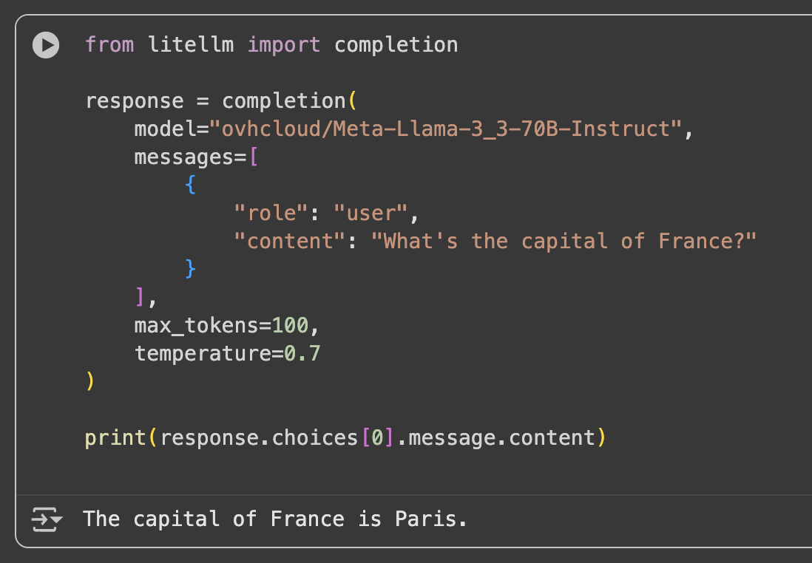{.thumbnail}

### Advanced Features

#### Response Streaming

For applications requiring real-time responses, use streaming:

```python
from litellm import completion

response = completion(
    model="ovhcloud/Meta-Llama-3_3-70B-Instruct",
    messages=[
        {
            "role": "user",
            "content": "Write me a short story about a robot learning to cook."
        }
    ],
    max_tokens=500,
    temperature=0.8,
    stream=True  # Enable streaming
)

# Progressive display of the response
for chunk in response:
    if chunk.choices[0].delta.content:
        print(chunk.choices[0].delta.content, end='', flush=True)
```

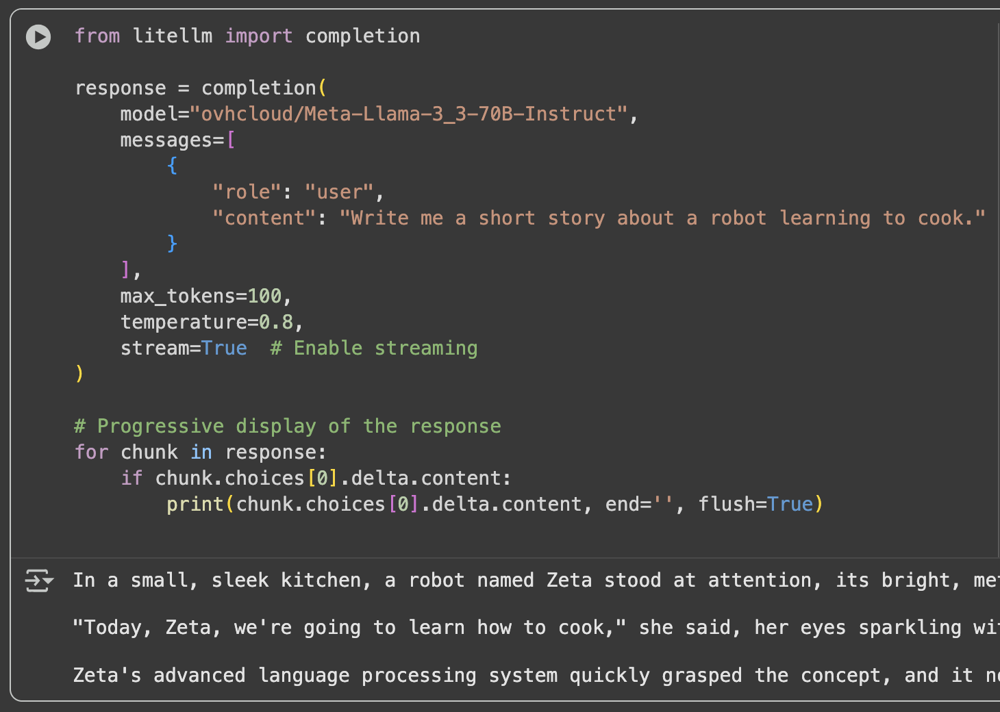

#### Function Calling (or Tool Calling)

LiteLLM supports function calling with AI Endpoints compatible models:

```python
from litellm import completion
import json

def get_current_weather(location, unit="celsius"):
    """Simulated function to get the weather"""
    if unit == "celsius":
        return {"location": location, "temperature": "22", "unit": "celsius"}
    else:
        return {"location": location, "temperature": "72", "unit": "fahrenheit"}

# Define available tools
tools = [
    {
        "type": "function",
        "function": {
            "name": "get_current_weather",
            "description": "Get the current weather in a given location",
            "parameters": {
                "type": "object",
                "properties": {
                    "location": {
                        "type": "string",
                        "description": "The city and country, e.g. Paris, France"
                    },
                    "unit": {
                        "type": "string", 
                        "enum": ["celsius", "fahrenheit"]
                    }
                },
                "required": ["location"]
            }
        }
    }
]

# First call to get the tool usage decision
response = completion(
    model="ovhcloud/Meta-Llama-3_3-70B-Instruct",
    messages=[{"role": "user", "content": "What's the weather like in Paris?"}],
    tools=tools,
    tool_choice="auto"
)

# Process tool calls
if response.choices[0].message.tool_calls:
    tool_call = response.choices[0].message.tool_calls[0]
    function_args = json.loads(tool_call.function.arguments)
    
    # Execute the function
    result = get_current_weather(
        location=function_args.get("location"),
        unit=function_args.get("unit", "celsius")
    )
    
    print(f"Tool result: {result}")
```

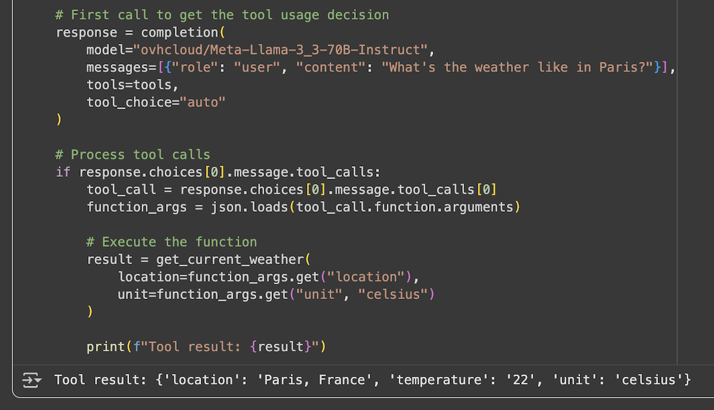

#### Vision and Image Analysis

For models supporting vision capabilities:

```python
from base64 import b64encode
from mimetypes import guess_type
import litellm

def encode_image(file_path):
    """Encode an image to base64 for the API"""
    mime_type, _ = guess_type(file_path)
    if mime_type is None:
        raise ValueError("Could not determine MIME type of the file")
    
    with open(file_path, "rb") as image_file:
        encoded_string = b64encode(image_file.read()).decode("utf-8")
        data_url = f"data:{mime_type};base64,{encoded_string}"
        return data_url

# Image analysis
response = litellm.completion(
    model="ovhcloud/Mistral-Small-3.2-24B-Instruct-2506",
    messages=[
        {
            "role": "user",
            "content": [
                {
                    "type": "text",
                    "text": "What do you see in this image?"
                },
                {
                    "type": "image_url",
                    "image_url": {
                        "url": encode_image("my_image.jpg"),
                        "format": "image/jpeg"
                    }
                }
            ]
        }
    ],
    stream=False
)

print(response.choices[0].message.content)
```

| Reference Photo  | Output          
| :--------------- |:---------------|
|   |   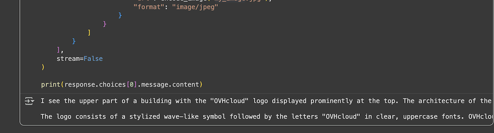        |

#### Structured Output (JSON Schema)

To get responses in a structured format:

```python
from litellm import completion

response = completion(
    model="ovhcloud/Meta-Llama-3_3-70B-Instruct",
    messages=[
        {
            "role": "system",
            "content": "You are a specialist in extracting structured data from unstructured text."
        },
        {
            "role": "user",
            "content": "Room 12 contains books, a desk, and a lamp."
        }
    ],
    response_format={
        "type": "json_schema",
        "json_schema": {
            "title": "extracted_data",
            "name": "data_extraction",
            "schema": {
                "type": "object",
                "properties": {
                    "room": {"type": "string"},
                    "items": {
                        "type": "array",
                        "items": {"type": "string"}
                    }
                },
                "required": ["room", "items"],
                "additionalProperties": False
            },
            "strict": False
        }
    }
)

print(response.choices[0].message.content)
```

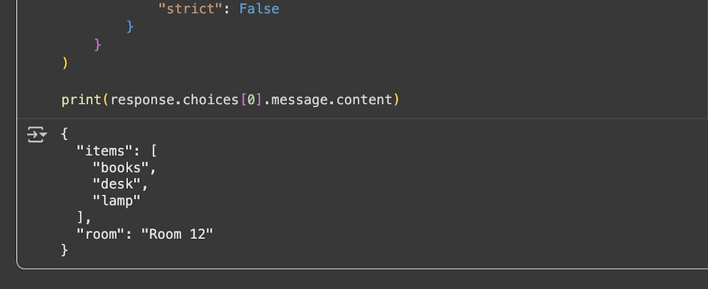

#### Embeddings

To generate embeddings with compatible models:

```python
from litellm import embedding

response = embedding(
    model="ovhcloud/BGE-M3",
    input=["sample text to embed", "another sample text to embed"]
)

print(response.data)
```

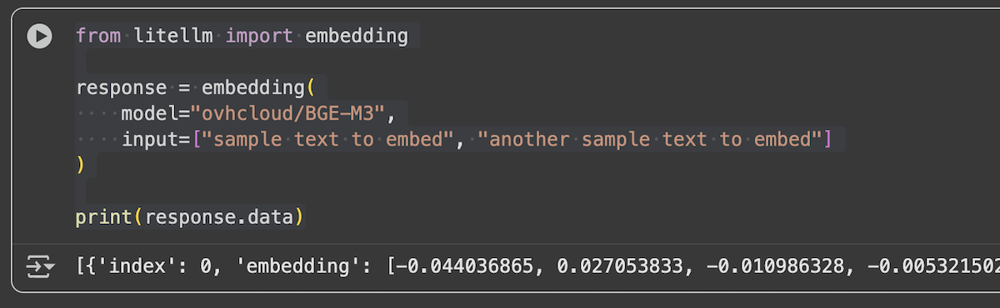

### Using LiteLLM Proxy Server

#### Proxy Server Configuration

For production deployments, you can use the LiteLLM proxy server:

1\. Install LiteLLM proxy:

```bash
pip install 'litellm[proxy]'
```

2\. Create a `config.yaml` file:

```yaml
model_list:
  - model_name: my-llama
    litellm_params:
      model: ovhcloud/Meta-Llama-3_3-70B-Instruct
      api_key: your-ovh-api-key
      
  - model_name: my-mistral
    litellm_params:
      model: ovhcloud/Mistral-Small-3.2-24B-Instruct-2506
      api_key: your-ovh-api-key

  - model_name: my-embedding
    litellm_params:
      model: ovhcloud/BGE-M3
      api_key: your-ovh-api-key
```

3\. Start the proxy server:

```bash
litellm --config /path/to/config.yaml --port 4000
```

The proxy server is live with our models!

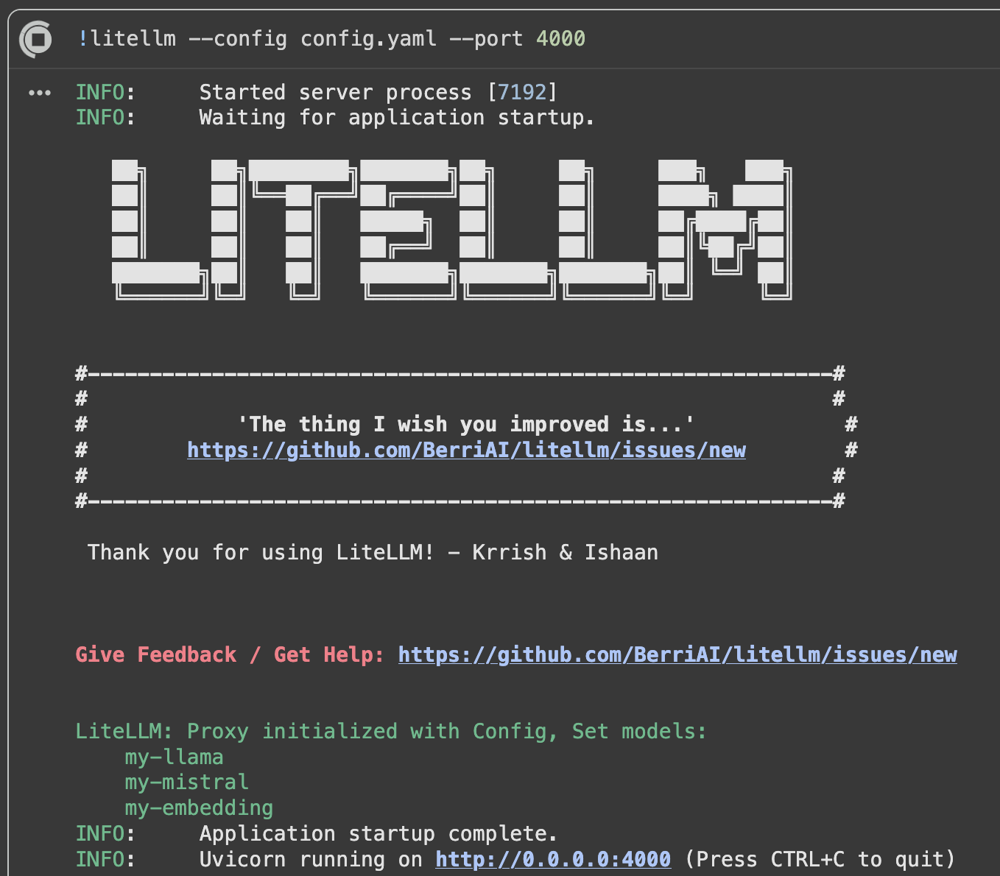{.thumbnail}

#### Using the Proxy

Once the proxy is running, use it like a standard OpenAI API:

```python
import openai

client = openai.OpenAI(
    api_key="sk-1234",  # LiteLLM proxy key
    base_url="http://localhost:4000"  # Proxy URL
)

response = client.chat.completions.create(
    model="my-llama",
    messages=[
        {
            "role": "user",
            "content": "What is OVHcloud?"
        }
    ]
)

print(response.choices[0].message.content)
```

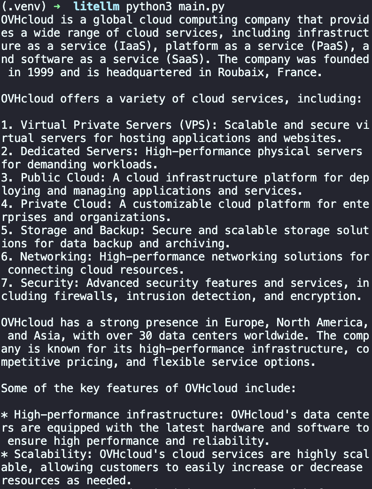{.thumbnail}

### Available Models

OVHcloud AI Endpoints offers a wide range of models accessible via LiteLLM. For the complete and up-to-date list, visit our [model catalog](https://endpoints.ai.cloud.ovh.net/catalog).

#### Popular Models

- **Llama 3.3 70B Instruct**: `ovhcloud/Meta-Llama-3_3-70B-Instruct`
- **Mistral Small**: `ovhcloud/Mistral-Small-3.2-24B-Instruct-2506`
- **GPT-OSS-120B**: `ovhcloud/gpt-oss-120b`
- **BGE-M3** (Embeddings): `ovhcloud/BGE-M3`

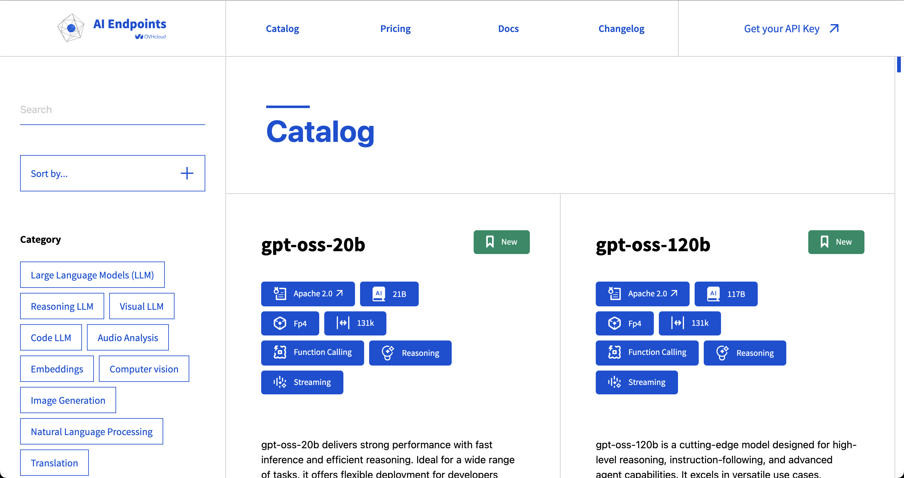{.thumbnail}

### Best Practices

#### 1. API Key Management

- Always use environment variables for API keys.
- Never commit keys to source code.
- Implement regular key rotation. You can set an expiry date to your key in the OVHcloud Control Panel.

#### 2. Performance Optimization

- Use streaming for long responses.
- Cache frequent responses.
- Adjust `max_tokens` parameters according to your needs.

### Conclusion

In this article, we explored how to integrate OVHcloud AI Endpoints with LiteLLM to seamlessly use a wide range of AI models in your Python applications. Thanks to LiteLLM’s unified interface, switching between models and providers becomes straightforward, while OVHcloud AI Endpoints ensures secure, scalable, and production-ready AI infrastructure.

## Go further

You can find more informations about LiteLLM on their [official documentation](https://docs.litellm.ai). You can also navigate in the [AI Endpoints catalog](https://endpoints.ai.cloud.ovh.net/catalog) to explore the models that are available through LiteLLM.

To take your use of LiteLLM even further and get the most out of **OVHcloud AI Endpoints**, you can easily implement intelligent request routing. LiteLLM allows you to manage the **routing** and **load balancing** of incoming requests. Refer to this [tutorial](https://github.com/ovh/public-cloud-examples/blob/main/ai/ai-endpoints/litellm-router-loadbalancing/tutorial_litellm_routing_ai_endpoints.ipynb).

Browse the full [AI Endpoints documentation](/products/public-cloud-ai-and-machine-learning-ai-endpoints) to further understand the main concepts and get started.

If you need training or technical assistance to implement our solutions, contact your sales representative or click on [this link](/links/professional-services) to get a quote and ask our Professional Services experts for a custom analysis of your project.

## Feedback

Please feel free to send us your questions, feedback, and suggestions regarding AI Endpoints and its features:

- In the #ai-endpoints channel of the OVHcloud [Discord server](https://discord.gg/ovhcloud), where you can engage with the community and OVHcloud team members.
