## Objective

This tutorial covers the process of starting a job using a Visual Studio Code Remote via SSH.

## Requirements

- Access to the [OVHcloud Control Panel](/links/manager)
- An AI Notebook or AI Training Project created inside a [Public Cloud project](/links/public-cloud/public-cloud) in your OVHcloud account
- An [AI user](/pages/public_cloud/ai_machine_learning/gi_01_manage_users)
- [The OVHcloud AI CLI](/pages/public_cloud/ai_machine_learning/cli_10_howto_install_cli) installed on your computer

## Instructions

### Installation

1. Install an [OpenSSH compatible SSH client](https://code.visualstudio.com/docs/remote/troubleshooting#_installing-a-supported-ssh-client) if one is not already present.
2. Install [Visual Studio Code](https://code.visualstudio.com/).
3. Install the [Remote Development extension pack](https://marketplace.visualstudio.com/items?itemName=ms-vscode-remote.vscode-remote-extensionpack).

### Generate an SSH Keypair

If you don’t already have an SSH key, you will need to create one. To do so, open a Terminal / PowerShell, and run the key generation command:

```bash
ssh-keygen -t ed25519 -C "your_email@example.com"
```

> [!primary]
>
> - `-t ed25519` creates a modern, secure key (recommended).
> - `-C` lets you add a label (usually your email) to identify the key.

This will create a private key (e.g., `id_ed25519`, not to share) and a public key (e.g., `id_ed25519.pub`) in your `~/.ssh/` directory.

### Specify the SSH Key during AI Notebook or AI Training Job Creation

Here is how to add your SSH key to your AI Solution if you are using the [OVHcloud Control Panel](/links/manager) or the `ovhai` CLI:

> [!tabs]
> **Using the Control Panel (UI)**
>>
>> First, go to the `Public Cloud`{.action} section of the [OVHcloud Control Panel](/links/manager).
>>
>> Select your Public Cloud project, then go to the `AI & Machine Learning`{.action} category in the left menu and choose `AI Notebooks`{.action} or `AI Training`{.action} section.
>>
>> From there, click on the `+ Create a notebook`{.action} or `+ Launch a job`{.action} button to configure and create your AI Solution.
>>
>> 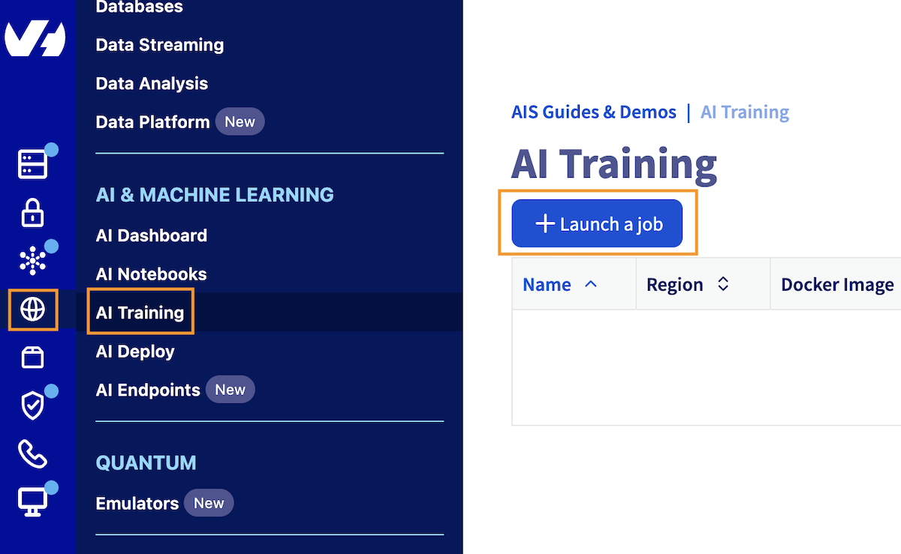{.thumbnail}
>>
>> Fill in the various details required until you find the `Advanced configuration`{.action} section. Open it.
>>
>> 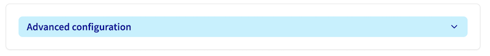{.thumbnail}
>>
>> From there you will find a `SSH Public Keys` sub-section where you can add and configure new SSH keys by clicking on the `+ Configure an SSH Key`{.action} button:
>>
>> 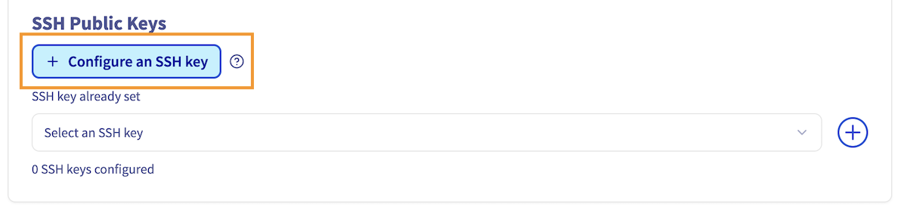{.thumbnail}
>>
>> This will open a window where you can put the content of your public key file (e.g., `id_ed25519.pub`):
>>
>> 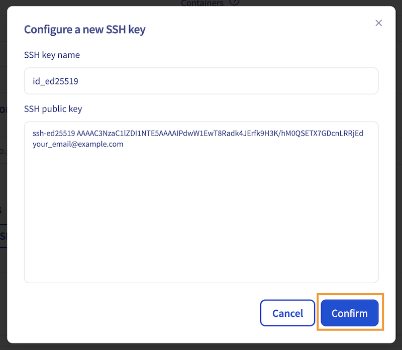{.thumbnail}
>>
>> Click on `Confirm`{.action}. Once your key is added, you can select it from your SSH Keys list:
>>
>> 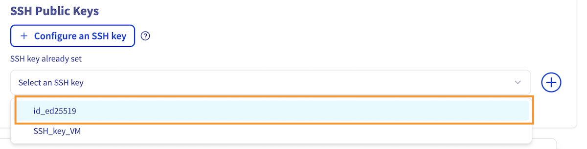{.thumbnail}
>>
>> Once selected, make sure to click on the `+`{.action} to confirm the addition of your key. You should see the following message: `1 of 10 SSH key configured`.
>>
>> 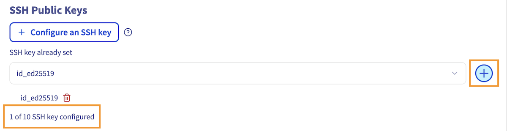{.thumbnail}
>>
> **Using ovhai CLI**
>>
>> To follow this part, make sure you have installed the [ovhai CLI](/pages/public_cloud/ai_machine_learning/cli_10_howto_install_cli) on your computer or on an instance.
>>
>> When creating your AI resource using the `ovhai` CLI, specify the SSH public key using the `--ssh-public-keys` option, or `-s` shortcut:
>>
>> ```bash
>> ovhai job run <job_image> \
>>   --gpu <nb-gpus> \
>>   --ssh-public-keys ~/.ssh/id_ed25519.pub
>> ```
>>
>> Once the job is `Running`, you can see the `sshUrl` by getting your job information:
>>
>> ```bash
>> ovhai job get <job-id>
>> ```

Once your job is created, regardless of the method chosen, you will be able to copy your job id (e.g., `bfa1d77a-9746-4128-9974-f94139937927`), which will be needed in the following steps.

> [!warning]
> In order to work, the deployed image needs to contain the `bash` binary and a glibc-based Linux (Ubuntu / Debian).

### Verify you can connect to the SSH host

Before continuing, you can verify you can access your job by running the following command from a terminal / PowerShell window, replacing `<job-id>` with the ID of your job and `<region>` with your resource location (e.g., `gra`, `bhs`):

```bash
ssh <job-id>@<region>.ai.cloud.ovh.net
```

If the SSH key is well configured, you should see the following:

```
Welcome to OVHcloud!
ovh@job-36ed1f18-626b-42f7-b15f-0ed844e65d20:~$
```

### Configure VSCode Remote Connection

In Visual Studio Code, click on the `Remote Explorer`{.action} icon.

{.thumbnail}

From there, click the gear icon on the SSH feature to access the SSH configuration file for VSCode, typically located at `~/.ssh/config`, and open it.

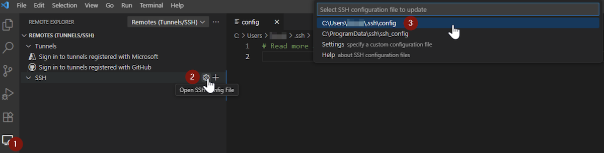{.thumbnail}

Add the following section for your new host:

```
Host my_ai_training_job
HostName <region>.ai.cloud.ovh.net # Adapt to your resource location (gra, bhs)
User bfa1d77a-9746-4128-9974-f94139937927 # ID of your AI Training Job or AI Notebook
IdentityFile C:\Path\To\id_ed25519 # Path to your private key file (not .pub)
```

Save the `config` file. Then refresh remotes by clicking on this icon:

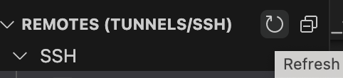{.thumbnail}

Your resource should now appear in the SSH menu on the left. Connect to it by clicking the arrow next to your resource. VSCode will restart to connect to your remote resource:

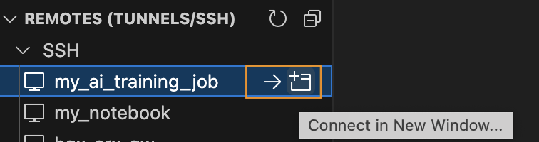{.thumbnail}

If the connection is well established, you should see this message in the bottom-left corner of VSCode:

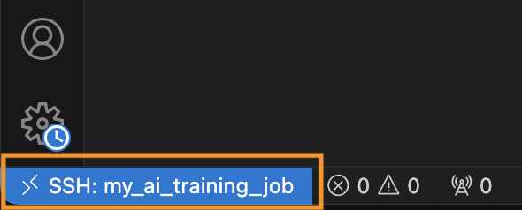{.thumbnail}

### Develop and Run Your Code

Once connected, you can start developing and running your code in the default `/workspace` folder, by clicking on the `Open folder`{.action} blue button, and select `/workspace`.

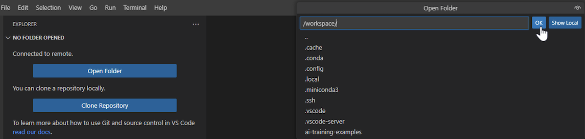{.thumbnail}

You can also open a terminal and run commands from it. Enjoy!

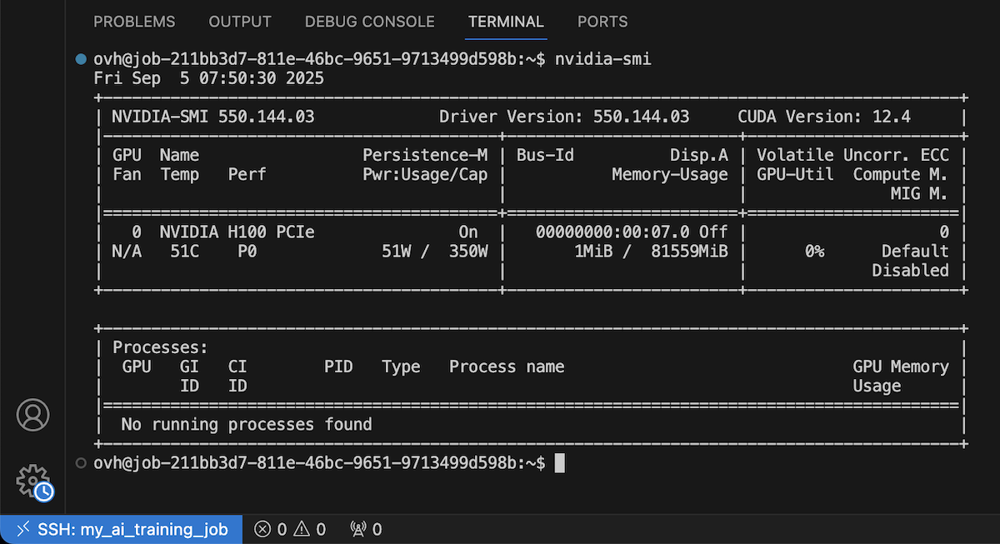{.thumbnail}

## Go further

You can compare AI models based on resource consumption, accuracy and training time. Refer to this [tutorial](/pages/public_cloud/ai_machine_learning/training_tuto_06_models_comparaison_weights_and_biases).

If you need training or technical assistance to implement our solutions, contact your sales representative or click on [this link](/links/professional-services) to get a quote and ask our Professional Services experts for a custom analysis of your project.

## Feedback

Please send us your questions, feedback and suggestions to improve the service:

- On the OVHcloud [Discord server](https://discord.gg/ovhcloud)
