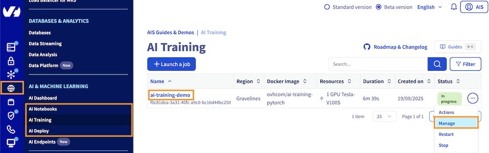
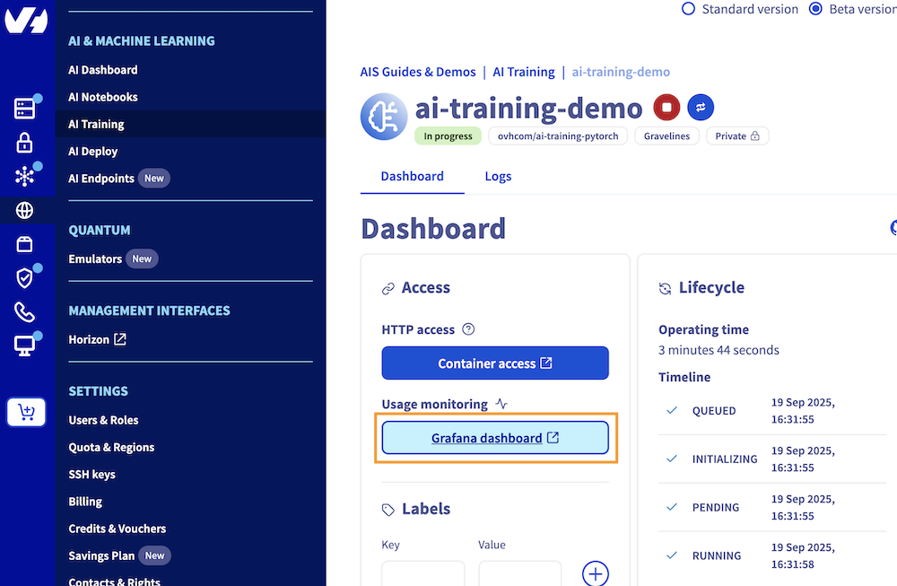
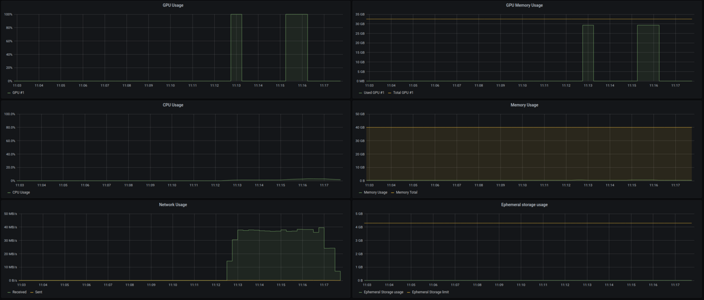

## Objective

**AI Tools** offers comprehensive monitoring capabilities for your cloud resources, ensuring optimal performance and efficiency. 

This guide will walk you through accessing and interpreting the various metrics provided by the monitoring dashboard, which is accessible for AI Notebooks, AI Training, and AI Deploy services through a dedicated UI on **Grafana**.

## Requirements

- An AI Project created inside a [Public Cloud project](/links/public-cloud/public-cloud) in your OVHcloud account
- An [AI user](/pages/public_cloud/ai_machine_learning/gi_01_manage_users)
- Access to the [OVHcloud Control Panel](/links/manager) or [the OVHcloud AI CLI](/pages/public_cloud/ai_machine_learning/cli_10_howto_install_cli) installed on your computer
- A running **OVHcloud AI Tool** (AI Notebooks, AI Training, or AI Deploy)

## Instructions

### Monitoring Grafana Access

The monitoring dashboard for **AI Tools** can be accessed via a dedicated URL, which is provided in the AI Tool details, accessible from the Control Panel (UI) or with the [ovhai CLI](/pages/public_cloud/ai_machine_learning/cli_10_howto_install_cli). The monitoring URL is structured as follows: *`https://monitoring.<REGION>.ai.cloud.ovh.net/d/gpu?var-job=<JOB-ID>`*.

To fetch your AI Tool monitoring URL, you can use either the CLI or the Control Panel UI:

> [!tabs]
> **Using the Control Panel (UI)**
>>
>> First, go to the `Public Cloud`{.action} section of the [OVHcloud Control Panel](/links/manager).
>>
>> Select your Public Cloud project, then go to the `AI & Machine Learning`{.action} category in the left menu and choose `AI Notebooks`{.action}, `AI Training`{.action} or `AI Deploy`{.action} section depending on the AI Tool you are using.
>>
>> From there, you will access a table listing your instances, where you can find the one you need and its general information. To view your instance details, click either the instance name or the `...`{.action} button and then `Manage`{.action}.
>>
>> {.thumbnail}
>>
>> From there, you can click on the `Grafana Dashboard`{.action} button, under `Usage monitoring`{.action}, to access your monitoring Grafana UI.
>>
>> {.thumbnail}
>>
> **Using ovhai CLI**
>>
>> To follow this part, make sure you have installed the [ovhai CLI](/pages/public_cloud/ai_machine_learning/cli_10_howto_install_cli) on your computer or on an instance.
>>
>> If you have not done it already, log in to the `ovhai` CLI. Once logged in, you can list your existing notebooks, jobs, or apps by running one of the following commands, depending on the AI tool you are using:
>>
>> ```bash
>> ovhai notebook list
>> ovhai job list
>> ovhai app list
>> ```
>>
>> Using the ID of the instance you are interested in, you can retrieve more information, including the monitoring link, by executing one of the following commands:
>>
>> ```bash
>> ovhai notebook get <NOTEBOOK-ID>
>> ovhai job get <JOB-ID>
>> ovhai app get <APP-ID>
>> ```
>>
>> Replace <NOTEBOOK-ID>, <JOB-ID>, or <APP-ID> with the respective id of your notebook, job, or app, respectively.
>>
>> This will give you a similar output:
>> 
>> ``` {.console}
>> Created At: 01-01-25 14:00:00
>> Id:         abcdefgh-ijkl-mnop-qrst-uvwxyz01234567
>> Spec:
>>   Command:
>>   Default Http Port:    8080
>>   Env Vars:             ~
>>   Image:                ovhcom/ai-training-pytorch
>>   Labels:
>>     ovh/id:   abcdefgh-ijkl-mnop-qrst-uvwxyz01234567
>>     ovh/type: job
>>   Name:                 ai-tool-demo
>>   Resources:
>>     Cpu:               28
>>     Ephemeral Storage: 3.0 TiB
>>     Flavor:            h100-1-gpu
>>     Gpu:               1
>>     Gpu Brand:         NVIDIA
>>     Gpu Memory:        79.6 GiB
>>     Gpu Model:         H100
>>     Memory:            350.0 GiB
>>     Private Network:   0 bps
>>     Public Network:    5.0 Gbps
>>   Shutdown:             ~
>>   Ssh Public Keys:      ~
>>   Timeout:              0
>>   Timeout Auto Restart: false
>>   Unsecure Http:        false
>>   Volumes:              ~
>>   Grpc Port:            0
>> Status:
>>   Data Sync:            ~
>>   Duration:             111s
>>   External Ip:          51.210.38.76
>>   History:
>>     DATE                  STATE
>>     19-09-25 14:16:43     QUEUED
>>     19-09-25 14:16:44     INITIALIZING
>>     19-09-25 14:16:44     PENDING
>>     19-09-25 14:16:46     RUNNING
>>   Info:
>>     Message:   Job is running
>>   Info Url:             https://ui.gra.ai.cloud.ovh.net/job/abcdefgh-ijkl-mnop-qrst-uvwxyz01234567
>>   Ip:                   10.42.178.59
>>   Monitoring Url:       https://monitoring.gra.ai.cloud.ovh.net/d/job?var-job=abcdefgh-ijkl-mnop-qrst-uvwxyz01234567&from=1758291343926
>>   Ssh Url:              ~
>>   State:                RUNNING
>>   Url:                  https://abcdefgh-ijkl-mnop-qrst-uvwxyz01234567.job.gra.ai.cloud.ovh.net
>>   Volumes:              ~
>>   Grpc Address:         abcdefgh-ijkl-mnop-qrst-uvwxyz01234567.job-grpc.gra.ai.cloud.ovh.net:443
>> Updated At: 19-09-25 14:16:48
>> User:       user-abcdefghijkl
>> ```
>>
>> The AI Tool monitoring can be found in the **Monitoring Url** field, located at the bottom of the details section.

### Monitoring UI Details for AI Tools

The monitoring dashboard for **AI Tools** provides detailed insights into the resource usage of your instances. The available panels vary depending on the service (AI Notebooks, AI Training, or AI Deploy).

#### AI Notebooks and AI Training Jobs

For AI Notebooks and AI Training, the following features are available:

- **GPUs (int)**: Number of GPUs allocated to your AI Tool.
- **GPU Average Usage (%)**: Average GPU usage percentage.
- **GPU Average Temperature (°C)**: Average temperature of the GPUs.
- **GPU Average Power Usage (w)**: Average power usage of the GPUs.
- **CPU Usage (%)**: Overall CPU usage percentage.
- **Memory Usage (GB)**: Usage and limit of memory allocated to your job.

**Detailed GPU Metrics**

- **GPU Usage**: Utilization of each GPU allocated to your notebook or job.
- **GPU Memory Usage**: Usage and limit of memory for each GPU.
- **SM Clocks**: Streaming Multiprocessor clocks for each GPU.
- **GPU Memory Clocks**: Memory clocks for each GPU.
- **Framebuffer Used**: Amount of framebuffer memory used.
- **GPU Power Usage**: Power usage of each GPU.
- **GPU Temperature**: Temperature of each GPU.
- **CPU Usage**: Overall CPU usage.
- **Memory Usage**: Usage and limit of memory allocated to your notebook or job.
- **Network Usage**: Input and output traffic on your notebook or job.
- **Ephemeral Storage Usage**: Usage and limit of ephemeral storage allocated to your notebook or job.
- **Volumes Total Size**: Total size of volumes attached to your notebook or job.
- **Volumes Total File Count**: Total number of files in attached volumes.

{.thumbnail}

#### AI Deploy Applications

For AI Deploy, which allows deploying applications, the following categories are available:

**Resource Usage**

- **GPU Average Usage**: Average GPU usage percentage.
- **GPU Average Memory Usage**: Average memory usage of the GPUs.
- **CPU Average Usage**: Average CPU usage percentage.
- **Ephemeral Storage Usage**: Usage and limit of ephemeral storage allocated to your app.
- **Network Usage**: Input and output traffic on your app.
- **Memory Total Usage**: Total memory usage.
- **Volumes Total Size**: Total size of volumes attached to your app.
- **Volumes Total File Count**: Total number of files in attached volumes.

**HTTP**

- **HTTP Call Latency**: Response time for HTTP calls.
- **HTTP Call Count**: Number of HTTP calls made.

**Auto-scaling**

- **Replicas**: Number of replicas.
- **Usage Target**: Target usage for scaling.
- **CPU Usage**: Overall CPU usage.
- **Memory Usage**: Usage and limit of memory allocated to your app.
- **GPU Usage**: Utilization of each GPU allocated to your app.
- **GPU Memory Usage**: Usage and limit of memory for each GPU.
- **GPU SM Clocks**: Streaming Multiprocessor clocks.
- **GPU Memory Clocks**: Memory clocks.
- **GPU Power Usage**: Power usage of each GPU.
- **Framebuffer Used**: Amount of framebuffer memory.
- **GPU Temperature**: Temperature of each GPU.

## Warnings

> [!warning]
> * GPUs panels (usage, memory) are only available for AI Tools that consume GPUs.

> [!warning]
> * AI Tools can use ephemeral storage for data not within a synchronised container. If your usage goes beyond the limit of the ephemeral storage, your job will be rejected.

## Feedback

Please send us your questions, feedback, and suggestions to improve the service:

- On the OVHcloud [Discord server](https://discord.gg/ovhcloud)

If you need training or technical assistance to implement our solutions, contact your sales representative or click on [this link](/links/professional-services) to get a quote and ask our Professional Services experts for a custom analysis of your project. 
