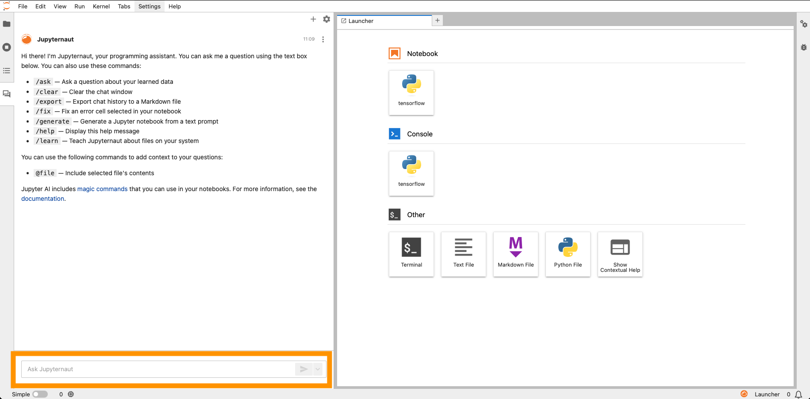
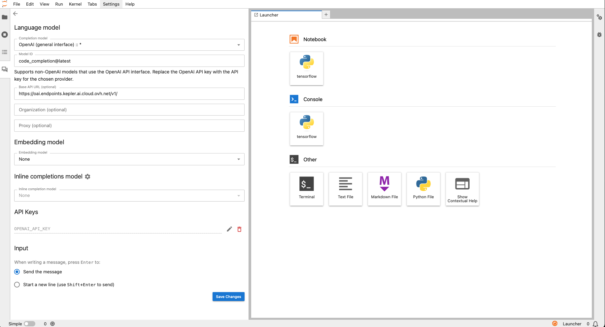
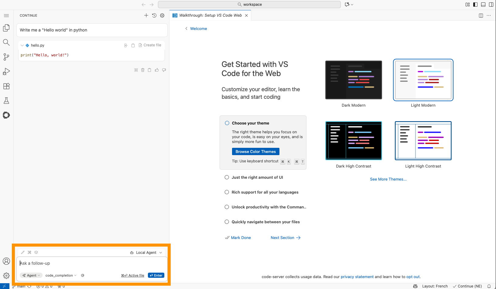
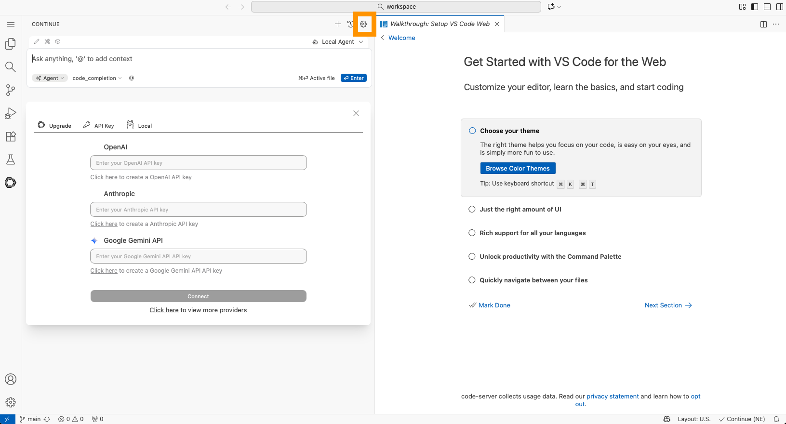

## Objective

This tutorial shows how to use **AI Endpoints** in AI Notebooks to get a coding assistant.

[AI Endpoints](https://endpoints.ai.cloud.ovh.net/) is a serverless platform that provides easy access to world‑renowned pre‑trained AI models. It is simple, secure, and intuitive, with data privacy as a top priority. We do not store user data, making it ideal for developers who want to add AI capabilities while keeping data private.

No extensive AI expertise is required, so AI Endpoints is a convenient, secure choice for integrating AI into your applications.

By default you can use our [AI Endpoints](https://endpoints.ai.cloud.ovh.net/) solution in all notebooks without a personal token, but you will be rate‑limited.

## Requirements

- Access to the [OVHcloud Control Panel](/links/manager)
- An AI Notebooks project created inside a [Public Cloud project](/links/public-cloud/public-cloud) in your OVHcloud account
- An AI Notebooks user

## Instructions

You can launch a notebook from the [OVHcloud Control Panel](/links/manager) or via the [ovhai CLI](/pages/public_cloud/ai_machine_learning/cli_11_howto_run_notebook_cli).

> [!warning]
>
> If you don’t see this plugin enabled in your current notebook, it’s because you’re not using the latest framework version available from our catalog of images. Please start a new notebook to access this new feature.

### Launching a notebook via UI (Control Panel)

To launch your notebook from the [OVHcloud Control Panel](/links/manager), refer to the following steps. There is a different coding assistant for Jupyter and VS Code notebooks.

> [!tabs]
> **Using JupyterLab (or JupyterLab Collaborative)**
>>
>> JupyterLab is configured with Jupyter‑AI, which provides a native integration with JupyterLab.
>>
>> **1\. Ask your question**
>>
>> You are ready to go with the default settings; ask your first question about your code!
>>
>> {.thumbnail}
>>
>> **2\. Update settings**
>>
>> If you need to use your own AI Endpoints token, update your settings.
>> You may also want to use another public AI Endpoint available from the completion model dropdown list.
>>
>> {.thumbnail}
>> 
> **Using VS Code**
>>
>> VS Code is configured with Continue.
>>
>> **1\. Ask your question**
>>
>> You are ready to go with the default settings; ask your first question about your code!
>>
>> {.thumbnail}
>>
> **Update settings**
>>
>> If you need to use your own AI Endpoints token, update your settings.
>> You may also want to use another public AI Endpoints available from the completion model dropdown list.
>>
>> {.thumbnail}
>>
>>

## Go further

If you need training or technical assistance to implement our solutions, contact your sales representative or click on [this link](/links/professional-services) to get a quote and ask our Professional Services experts for a custom analysis of your project.

## Feedback

Please send us your questions, feedback and suggestions to improve the service:

- On the OVHcloud [Discord server](https://discord.gg/ovhcloud)
