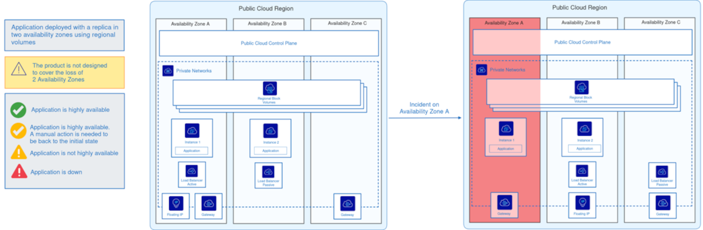
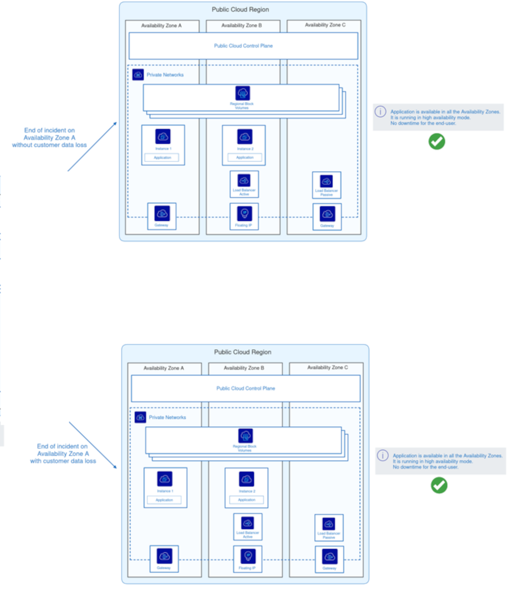
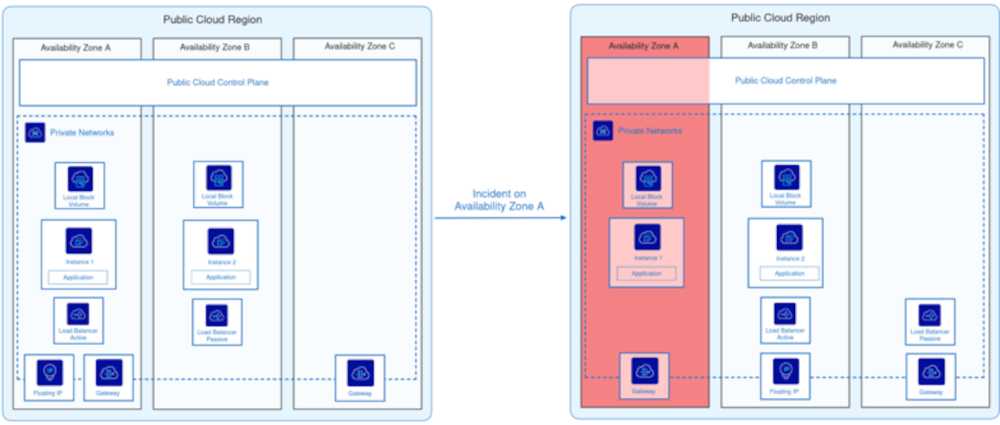
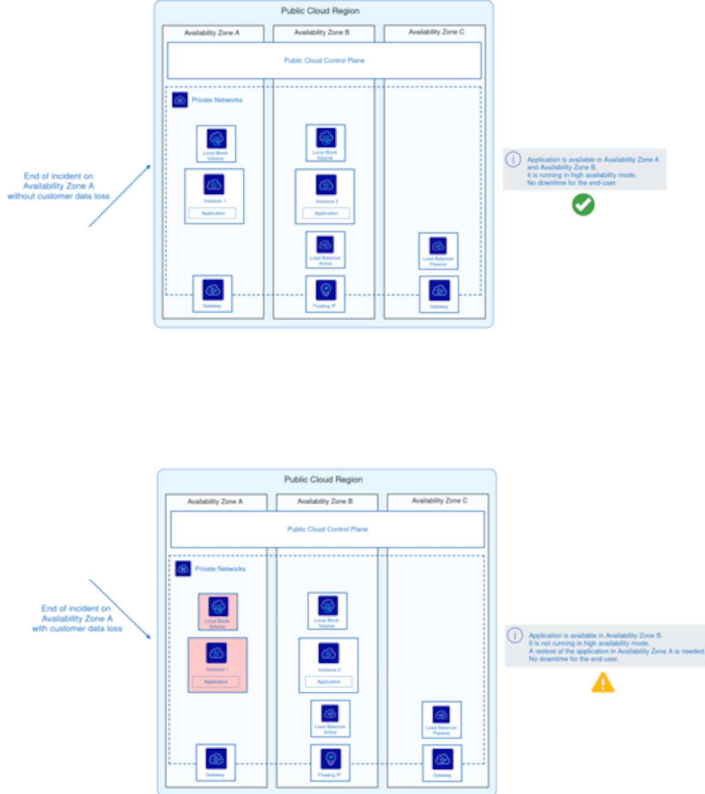

## Objectives

This guide aims to educate and support customers on the principles of resilience in **3AZ** and the associated reference architectures. It details how OVHcloud services are designed to operate in a multi-AZ environment, deployment best practices and mechanisms for ensuring high availability. A table of **3AZ** service specifications is provided, along with examples of **2AZ** architectures to help users structure their infrastructures in a resilient way.

## Deployment and resilience of 3AZ services

In a cloud environment, service availability and resilience are essential to guarantee business continuity, even in the event of an Availability Zone (AZ) failure. This document presents the different cloud offerings and their resilience mechanisms when deployed over three availability zones (3AZ).

The table below lists the services offered, their scope (zonal, regional or global), and the best configuration practices for ensuring optimum resilience. Finally, it details the expected behavior in the event of an AZ failure, to help customers anticipate risks and set up appropriate architectures.

| Service | Zonal/Local | Régional | Global | Architecture/Configuration Best Practices      | in case of AZ failure                                                                |
| ------- | ----------- | -------- | ------ | ---------------------------------------------- | ------------------------------------------------------------------------------------ |
| Instances | X | | | As instances are zonal services, they are only deployed in a single zone of activity. To ensure resilience, customers must manually distribute their instances across several AZs, and use regional Load Balancers for a 3AZ architecture.| In the event of AZ failure, the VM will be lost. If the customer has not set up resilience with a regional Load Balancer and a VM2 in AZ2, there will be a service interruption. On the other hand, with a regional Load Balancer and a VM2 in AZ2, the Load Balancer will automatically rebalance the load on VM2. When AZ1 is restored, VM1 will be in its original state.
| Private Network | | X | | | DHCP/DNS agents operate in two AZs. If one AZ fails, they will be automatically reactivated in the AZ where they are not already running. |
| Public Cloud Load Balancer ( Octavia ) | | X | | The regional Load Balancer consists of an active Load Balancer and a passive Load Balancer, each deployed in a separate AZ. | The service will remain available without interruption. In the event of failure of an AZ containing a Load Balancer node, the latter will automatically be moved to the last AZ. The regional service will be automatically reactivated by OVHcloud once the AZ has been restored. |
| Gateway | | X | | The regional gateway consists of an active and a passive gateway, each deployed in a separate AZ. If an AZ containing a Gateway node fails, it will **NOT** be recreated in another AZ.
| Floating Ip | | X | | The customer can attach a multi-AZ floating IP to any instance or Load Balancer in any AZ. | The service will remain available without interruption. It will be automatically reactivated by OVHcloud as soon as the AZ is restored.
| Object Storage ( Standard class) | X | | | Object Storage is a regional service offering advanced data protection options, including integrated off-site replication via the control panel and S3-compatible asynchronous replication via the API for custom configuration. | No impact on Object Storage service or data. Data remains available for read and write operations, even in the event of AZ failure. This configuration is ideal for high-availability, fault-tolerant applications. Once the AZ is restored, blocks are moved to the affected AZ.
| Block storage High Speed gen 1/2 | X | | | HighSpeed (Gen1 and Gen2) is a zonal service with triple replication within a single AZ. To ensure resilience, customers must manually deploy HighSpeed Block Storage on several AZs and set up an application replication mechanism, with at least one volume backup in another AZ or region. | In the event of an outage, data will remain available and the Block Storage service will resume as soon as the incident is over. In the event of a major incident, customers could lose their data and will have to recreate their Block volume when the AZ is restored. |
| Block storage Classic Multi-Zone | | X | | Block Storage Classic is a regional service using distributed erasure coding across several AZs. Off-site replication is recommended to protect against regional failure. | Block Storage data will remain available without impact or downtime. In the event of a major incident, chunks will be recreated as soon as the AZ is restored. |
| File storage | | | | File Storage is a zonal service with EC/triple replication within a single AZ. It is recommended to set up a backup or snapshot in another AZ. | File Storage within the AZ will be lost.   The customer would be able to re-spawner a file from a backup when the AZ is available again. |
| Managed K8s | | X | | With the "Premium offer", the control plane is distributed over 3 AZs. The customer must deploy worker nodes on several AZs and use Block Storage Multi-Zone Classic for persistent volumes. In the event of an AZ failure, the control plane remains available and the customer's workload is rescheduled on the nodes of another available AZ. Note that workloads using persistent volumes of single-zone classes cannot be migrated to other AZs. When the AZ is restored, the control plane will become available again in the AZ and the unmigrated workload will resume. |
| Private Registry | | X | | Based on S3, with a control plane distributed over several geographical zones. Off-site replication is recommended in the event of regional failure. | In the event of AZ failure, the registry remains available.   On the basis of S3 3AZ/regional storage, the data will remain available without impact.   The chunks will be recreated once the AZ is operational again. |
| Rancher | | X | Rancher managed service is a “global” service | No impact |
| DBaaS | | X | | Database nodes are distributed across several nodes in different AZs. Backup is useful in the event of regional failure or for a single-node database. | In the event of an interruption, data will remain available and database services will resume as soon as the incident is over. In the event of AZ failure, Business and Enterprise customers will not lose their data. For Essential customers, data may be lost if no backup has been made. |

## Reference architecture for Multi-AZ deployment

> [!warning]
>
> When deploying a zonal/local service (e.g. 3AZ Compute instances), this means that it is compatible with the 3AZ regions, but not automatically deployed in each of these AZ.
>
> - For a 2AZ architecture, you must manually create an instance in AZ-a and AZ-b.
> - For a 3AZ architecture, you need to create one in AZ-a, AZ-b and AZ-c.
>

This section presents reference architectures for multi-AZ deployment, illustrating different resilience scenarios in the face of AZ failure. Through detailed diagrams and technical explanations, we highlight best practices for designing robust infrastructures, guaranteeing service availability and optimizing disaster recovery.

> [!primary]
>
> The Public Cloud Control Plane, present in all Availability Zones (AZ), plays a key role in the management and orchestration of cloud services. It handles load balancing, private network management, and resource and storage coordination.
> 
> During an incident on the AZ-a, the Control Plane remains operational from the other AZs, guaranteeing continuity of critical services. This enables the Floating IP and Load Balancer to dynamically adapt traffic to the instances still available, ensuring an uninterrupted user experience.
> 
> When AZ-a is restored, the Control Plane gradually reintegrates the resources and instances concerned into the overall infrastructure. However, if data has been lost, recovery depends on the implementation of a backup strategy. In the absence of backup, some recent data may remain irrecoverable, except for services such as Block Storage Classic Multi-Zone or Object Storage, which have built-in resilience mechanisms.
>

/// details | **Deployment in 2AZ with regional Storage**

{.thumbnail}

This diagram illustrates an application deployed across two availability zones (AZ), relying on a regional Storage service to ensure resilience:

**Normal Operation** (Left side):

- The app is spread over two AZs (A and B).
- The 2 AZs are in the same Private Networks.
- Instance 1 runs on AZ-a and Instance 2 on AZ-b.
- An active Load Balancer distributes traffic on the AZ-a, with a passive Load Balancer waiting on the AZ-b.
- The Storage service is regional, shared between the AZs.
- Connectivity is provided by a Floating IP and a Gateway (including a second one available in case of failure of the first).

**AZ-a Incident** (Right Side):

- The AZ-a goes down, making Instance 1 and the active Load Balancer unavailable.
- The AZ-a Gateway becomes inaccessible but a second one in another AZ takes over.
- The passive Load Balancer becomes active to ensure continuity of service.
- The Floating IP dynamically switches through Private Networks to the AZ-b to allow continuous access to the application.
- Instance 2 (which is located in AZ-b) automatically takes over.
- The app remains available, but the app no longer works in High Availability (HA) mode.

{.thumbnail width="900"}

This diagram illustrates two recovery scenarios following the previous incident on AZ-a.

In both cases, once AZ-a is restored, the application returns to its initial state and becomes fully operational again. Thanks to dynamic service transfer between availability zones, the application remained active throughout the incident, without interruption to users.

If the regional storage service preserved the data, the incident will have had no impact on users. However, if data was lost during the outage, its recovery will depend on the presence of a backup mechanism. Without a backup, some recent data will be irretrievably lost.

This situation underscores the importance of an appropriate backup strategy to ensure data integrity in the event of an availability zone failure.

///

/// details | **2 AZ deployment with local storage**

This diagram illustrates a 2 AZ deployment architecture with local Storage service.

{.thumbnail}

**Normal Operation** (Left Side):

- The app is spread over two AZs (A and B).
- The 2 AZs are in the same Private Networks.
- Instance 1 runs on AZ-a, and Instance 2 on AZ-b.
- An active Load Balancer distributes traffic across AZ-a, with a passive Load Balancer waiting on AZ-b.
- The Storage service is local, meaning that each instance has its own volume attached to its AZ and not shared with the other AZ.
- Connectivity is provided by a Floating IP and a Gateway (a second one is available in case the first one fails).

**Incident on AZ-a** (Right Side):

- AZ-a fails, rendering Instance 1 and the active Load Balancer unavailable.
- The Gateway in AZ-a becomes inaccessible, but a second one located in another AZ takes over.
- The passive Load Balancer becomes active to ensure service continuity.
- The Floating IP dynamically fails over to AZ-b via Private Networks to allow continued access to the application.
- Instance 2 (located in AZ-b) automatically takes over.
- The application remains available, but it no longer runs in High Availability (HA) mode.
- Since the Storage service is local and not regional, data stored on the AZ-a instance is temporarily lost until the zone is restored.

{.thumbnail width="900"}

This diagram illustrates two recovery scenarios after the previous incident on the AZ-a:

**Return to normal without data loss** (top diagram):

- AZ-a becomes operational again.
- The instance and its Storage service are recovered without data loss.
- The application returns to high availability mode, with normal operation on both AZs.

**Return to normal with data loss** (bottom diagram):

- The application remains available to users, but it is no longer in high availability until AZ-a is fully restored.
- The AZ-a instance must be manually restored to return to a normal state.
- AZ-a becomes operational again, but the local data stored on this AZ before the incident is lost.
- A pre-scheduled backup would recover the lost data; otherwise, it is permanently lost.

In both cases, the application remained accessible to users thanks to the dynamic transfer of services to AZ-b. However, with a local storage service, the lack of replication between AZs exposes the risk of data loss in the event of a major incident.

///

## Go Further

If you need training or technical assistance to implement our solutions, contact your sales representative or click on [this link](/links/professional-services) to get a quote and ask our Professional Services experts for assisting you on your specific use case.

Join our [community of users](/links/community) and visit our [Discord channel](https://discord.gg/ovhcloud).
