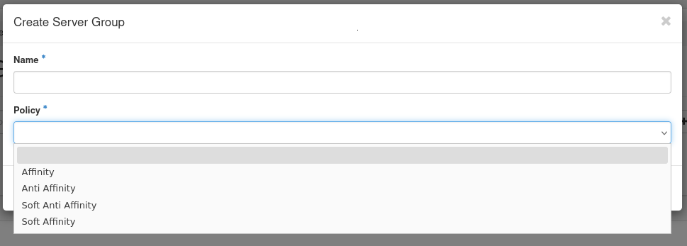
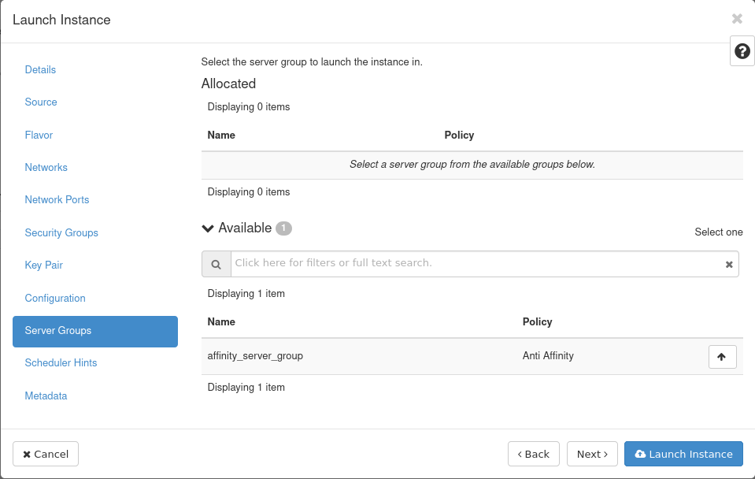
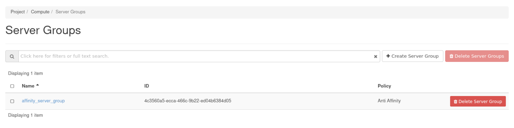
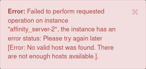

## Objective

This documentation explains how to use the Server Groups feature to control the scheduling of a group of instances.

**Using Server Groups to provide a mechanism to group instances according to a certain policy.**

## Prerequisites

- A [Public Cloud project](/pages/public_cloud/public_cloud_cross_functional/create_a_public_cloud_project) in your OVHcloud account
- [Access to the Horizon interface](/pages/public_cloud/public_cloud_cross_functional/introducing_horizon)

To use the OpenStack CLI, make sure you consult the following guides:

- [Prepare the environment to use the OpenStack API](/pages/public_cloud/public_cloud_cross_functional/prepare_the_environment_for_using_the_openstack_api) by installing python-swiftclient.
- [Load the OpenStack environment variables](/pages/public_cloud/public_cloud_cross_functional/loading_openstack_environment_variables).

### Definition

#### Policies

A Server Group can have one of four different policies: **Affinity**, **Soft Affinity**, **Anti Affinity** or **Soft Anti Affinity**.

##### **Affinity**

A Server Group with the policy of `affinity` will make sure that all the instances in that group are **always** placed on the same physical compute node.

##### **Soft Affinity**

A Server Group with the policy of `soft affinity` will **try to** make sure that all the instances in that group are placed on the same physical compute node, but ultimately will allow it if otherwise not possible.

##### **Anti Affinity**

A Server Group with the policy of `anti affinity` will make sure that the instances in that group are **never** placed on the same physical compute node.

##### **Soft Anti Affinity**

A Server Group with the policy of `soft anti affinity` will **try to** make sure that all the instances in that group are not placed on the same physical compute node, but ultimately will allow it if otherwise not possible.

### Step 1: Creating Server Groups

> [!tabs]
> OpenStack Dashboard
>>
>> {.thumbnail}
>> 
>> 1. Log in to the [Horizon interface](https://horizon.cloud.ovh.net/auth/login/).
>> 1. Select the appropriate region from the drop down menu at the top left.
>> 1. Click on `Compute`{.action} in left tab, then on `Server Groups`{.action}.
>> 1. Next, cick on `+ Create Server Group`{.action}.
>> 1. In the popup window that appears, select a `Name` and `Policy` for your server group.
>> 1. Click on `Submit`{.action}.
>>
> CLI
>> To create a Server Group, use the following command:
>>
>> ```bash
>> openstack server group create \ --policy [affinity|soft-affinity|anti-affinity|soft-anti-affinity] \<server_group_name>
>> ```
>>

### Step 2: Creating an Instance with a Server Group

> [!tabs]
> OpenStack Dashboard
>>
>> Horizon can create, read, update, and delete, as well as obtain a list of Server Groups for a tenant to enable the specification of a group when starting a virtual machine.
>>
>> 1. Log in to the [Horizon interface](https://horizon.cloud.ovh.net/auth/login/).
>> 1. Select the appropriate region from the drop down menu at the top left.
>> 1. Click on `Compute`{.action} in left tab, then on `Instances`{.action}.
>> 1. Click on `Launch Instance`{.action}.
>> 1. In the pop-up window, fill in the required fields to create your instance. In the `Server Group`{.action} field, click on the drop-down arrow next to `Available` to display the list of available Server Groups. Select a Server Group and it will be moved to `Allocated`.
>>      {.thumbnail}
>> 1. Once done, click on `Launch Instance`{.action}.
>>
> CLI
>>
>> To apply a Server Group policy, you must specify the group when creating an instance, as a *scheduling hint.*  
>> To do that, use the `--hint` parameter in the following command:
>>
>> ```bash
>> openstack server create --hint group=<server_group_id> [...] <server_name>
>> ```
>>

If you subsequently launch more instances referencing the same Server Group, the scheduler concentrates or distributes them according to the Server Group's policy.

### Modifiying a Server Group

{.thumbnail}

> [!alert]
>
> Once created, a Server Group cannot be modified.
>
> In addition, an instance cannot be moved between Server Groups.
>
> In both cases, this is because it would potentially require moving the instance to comply with the Server's Group policy.

### Troubleshooting common issues

If you keep creating instances within a Server Group with a policy of `anti affinity`, you will eventually exceed the total amount of physical compute nodes in the region.

The command will still succeed, but the instance will subsequently fail to be scheduled to a compute node.

Instead, it will assume the `ERROR` status with the following `fault` message: _No valid host was found. There are not enough hosts available.

```bash
$ openstack server show -c fault -c status <server_id>
+--------+--------------------------------------------------+
| Field  | Value                                            |
+--------+--------------------------------------------------+
| fault  | {'code': 500, 'created': '2025-09-15T11:21:33Z', |
|        | 'message': 'No valid host was found.             |
|        | There are not enough hosts available.'}          |
| status | ERROR                                            |
+--------+--------------------------------------------------+
```

{.thumbnail}

Another reason is that OpenStack cannot schedule the instance on a different physical compute node because there is already a server in the Server Group on every node.

The same scheduling error and "fault" message will occur when using a Server Group with a policy of `affinity` as well, when you create more instances than a physical compute node can host.

However when using a Soft Affinity policy, such as `soft affinity` or `soft anti affinity`, the scheduler is allowed to break the Server Group's policy if it is unable to uphold it.

### Checking an instance in a Server Group

This means you may want to verify that your instances are on the same or on different physical compute nodes by looking at their _hostId_ value. 

We deployed four instances, two named `anti_affinity_server` with an `anti affinity` Server Group and two named `affinity_server` with an `affinity` Server Group:

```bash
openstack server list 
+------------------------+--------+-----------+--------+
| Name                   | Status | Image     | Flavor |
+------------------------+--------+-----------+--------+
| affinity_server-2      | ACTIVE | Debian 13 | d2-4   |
| affinity_server-1      | ACTIVE | Debian 13 | d2-4   |
| anti_affinity_server-1 | ACTIVE | Debian 13 | d2-2   |
| anti_affinity_server-2 | ACTIVE | Debian 13 | d2-2   |
+------------------------+--------+-----------+--------+
```

You can confirm the scheduler was done following the policy of the Server Group with the following command:

```bash
openstack server show -c hostId xSERVER_IDx
```

With the 4 instances created, we obtain the following output example:

```bash
openstack server show -c hostId affinity_server-2
+--------+----------------------------------------------------------+
| Field  | Value                                                    |
+--------+----------------------------------------------------------+
| hostId | c53cff4ce860b94139db559cfeafc08d228b48925ca00f1b05f3a23d |
+--------+----------------------------------------------------------+
openstack server show -c hostId affinity_server-1
+--------+----------------------------------------------------------+
| Field  | Value                                                    |
+--------+----------------------------------------------------------+
| hostId | c53cff4ce860b94139db559cfeafc08d228b48925ca00f1b05f3a23d |
+--------+----------------------------------------------------------+
openstack server show -c hostId anti_affinity_server-1
+--------+----------------------------------------------------------+
| Field  | Value                                                    |
+--------+----------------------------------------------------------+
| hostId | 66e9f9525487cad5cab2da65a51542d5a9bc0ca4bdb9fea7cdce8424 |
+--------+----------------------------------------------------------+
openstack server show -c hostId anti_affinity_server-2
+--------+----------------------------------------------------------+
| Field  | Value                                                    |
+--------+----------------------------------------------------------+
| hostId | 2c2907e312fec85fd92929a5afcc2ca4ac22c09c85480eea95b4fc08 |
+--------+----------------------------------------------------------+
```

`hostId` is a unique identifier for each physical compute node. By comparing this value across your various instances, you can ensure that your Server Group policy is being followed or not.

> [!primary]
>
> It's not possible to compare `hostId` between different projects because the values are unique for each project.

### Server Group quota

> [!primary]
>
> You have to use or specify `--os-compute-api-version 2.50` or higher to see server-groups and server-group-members output for a given quota class.

Regarding quota, Server Groups and Server Groups Members are in the Compute Service Quotas.

| Quota | Description | Property name |
| ----------- | ------------------------------------------------------ | ------------------------------------------------------|
| Server Groups | Number of server groups per project. | server_groups |
| Server Group Members | Number of servers per server group. |server_group_members |

```bash
openstack quota show --compute <PROJECT>
```

Here is an output example:

```bash
openstack quota show <project> |grep -i server-group
| server-group-members        | 10                               |
| server-groups               | 10                               |
```

## Go further

Join our [community of users](/links/community).