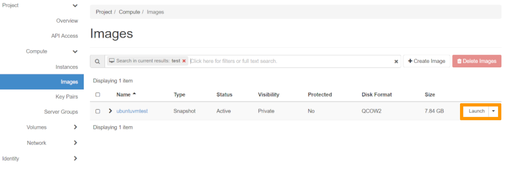
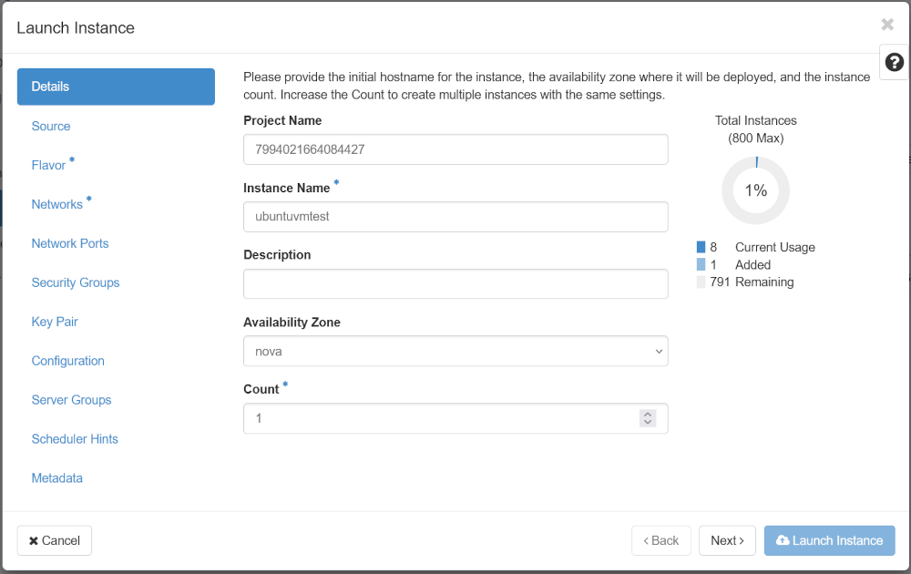
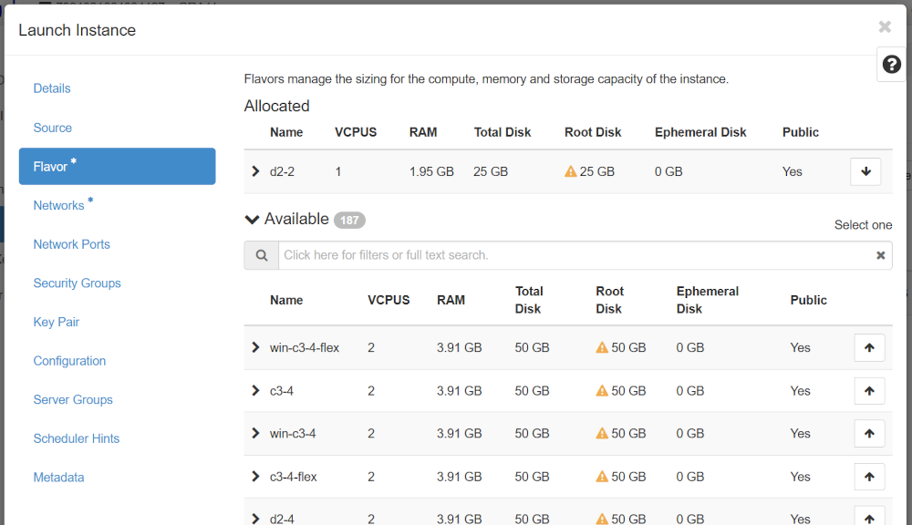
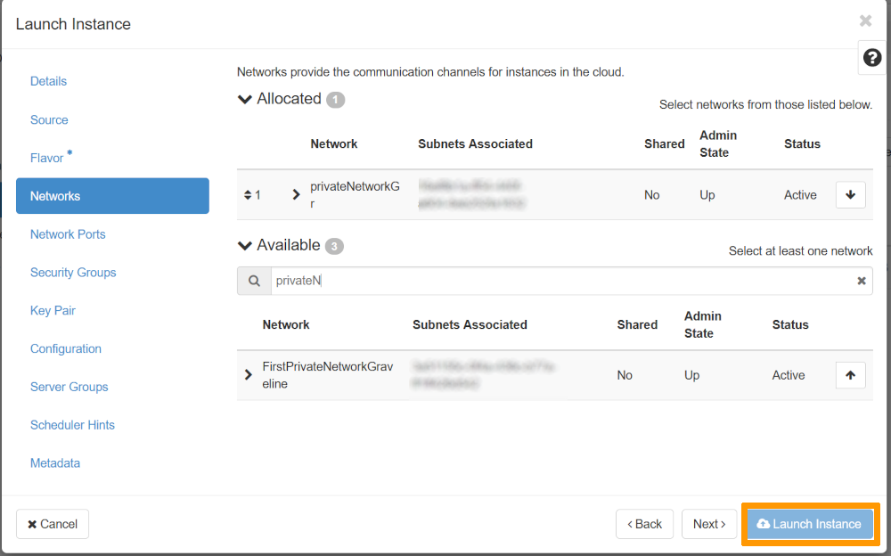
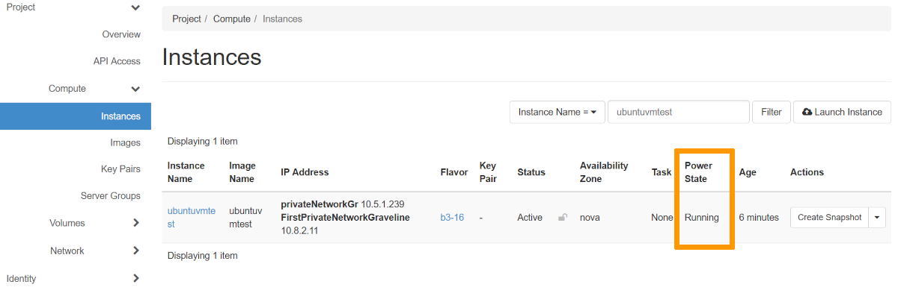
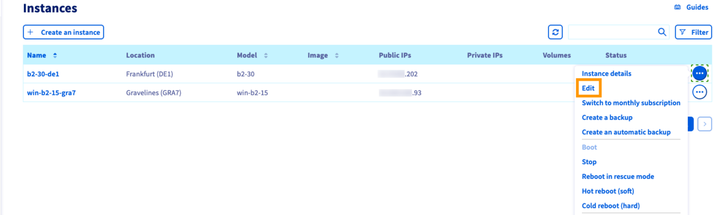

## Ziel

Das OVHcloud Kundencenter erlaubt es Ihnen, mit wenigen Klicks [Backups Ihrer Instanzen zu erstellen](/pages/public_cloud/compute/save_an_instance) und diesen Prozess auch zu automatisieren.
Sie können diese Instanzsicherungen für zwei grundlegende Zwecke verwenden:

- Instanz auf der Grundlage des Backups erstellen, um die originale Instanz zu duplizieren; zum Beispiel, wenn Sie eine Infrastruktur zur Lastverteilung (Loadbalancing) konfigurieren.
- Instanz mithilfe eines Backups wiederherstellen; zum Beispiel, wenn aufgrund kürzlicher Änderungen kritische Konfigurationsdaten der Instanz beschädigt wurden.

**Diese Anleitung erklärt, wie Sie Backups verwenden, um Ihre Instanzen zu duplizieren oder wiederherzustellen.**

## Voraussetzungen

- Sie verfügen über ein Backup einer [Public Cloud Instanz](/links/public-cloud/instance-backup).
- Sie haben Zugriff auf Ihr [OVHcloud Kundencenter](/links/manager).

## In der praktischen Anwendung

### Eine Instanz aus einem Backup erstellen

> [!tabs]
> Über das OVHcloud Kundencenter
>> Melden Sie sich bei Ihrem [OVHcloud Kundencenter](/links/manager) an, wechseln Sie in den Bereich `Public Cloud`{.action} und wählen Sie das betreffende Public Cloud Projekt aus.<br>
>> Klicken Sie anschließend auf `Instance Backup`{.action} in der linken Navigationsleiste unter **Compute**.
>>
>> {.thumbnail}
>>
>> Klicken Sie dann auf die `...`{.action} rechts neben der ausgewählten Sicherung und schließlich auf `Instanz erstellen`{.action}.
>>
>> Eine vereinfachte Version der Instanz-Erstellungsseite wird angezeigt, die es Ihnen ermöglicht, einige Optionen anzupassen.
>>
>> {.thumbnail}
>>
>> Einige Elemente sind vordefiniert:
>>
>> - **Standort**: Ihre Instanz wird im gleichen Rechenzentrum wie Ihre Sicherung erstellt.
>> - **Image**: Das Bild entspricht Ihrer Sicherung.
>> - **Modell**: Nur Modelle, die Ihr Bild aufnehmen können, sind verfügbar, abhängig von Ihrem Kontingent.
>>
>> {.thumbnail}
>>
>> Geben Sie den Namen der neuen Instanz, den SSH-Schlüssel, das vRack und den Abrechnungszeitraum an, und klicken Sie dann auf den Button `Instance erstellen`{.action}.
>>
>> Weitere Informationen zur Erstellung einer Instanz finden Sie in [diesem Leitfaden](/pages/public_cloud/compute/public-cloud-first-steps).
>>
>> > [!primary]
>> >
>> > Um eine Instanz in einem anderen Rechenzentrum als dem der Sicherung zu erstellen, müssen Sie diese zuerst in die entsprechende Zone übertragen. Verweisen Sie hierzu auf den [Leitfaden zur Sicherung einer Instanz zwischen Rechenzentren](/pages/public_cloud/compute/transfer_instance_backup_from_one_datacentre_to_another).
>> >
>>
> Über die OpenStack CLI
>>
>> Um eine Instanz aus Ihrer Sicherung zu erstellen, verwenden Sie die Sicherungs-ID als Bild mit diesem Befehl:
>>
>> ```bash
>> $ openstack server create --key-name SSHKEY --flavor 98c1e679-5f2c-4069-b4da-4a4f7179b758 --image 0a3f5901-2314-438a-a7af-ae984dcbce5c Server1_from_snap
>> ```
>>
> Über Horizon
>> In der Horizon-Oberfläche klicken Sie auf `Compute`{.action} im linken Menü und dann auf `Images`{.action}. Suchen Sie das gewünschte Bild und klicken Sie auf den Button `Launch`{.action} rechts neben der Zeile Ihres Bildes.
>>
>> {.thumbnail}
>>
>> Geben Sie den Namen Ihrer Instanz im entsprechenden Feld an und bestimmen Sie die Anzahl der zu erstellenden Instanzen. Klicken Sie anschließend auf das Register `Flavor`{.action}.
>>
>> {.thumbnail}
>>
>> Wählen Sie das gewünschte Instanzmodell aus und klicken Sie auf das Register `Networks`{.action}.
>>
>> > [!warning]
>> >
>> > Wenn Ihre Instanz ein Windows-Server ist, müssen Sie ein Flavor des Typs win-xx-xx (z. B. win-b2-15) auswählen und über eine öffentliche Schnittstelle im Netzwerk Ext-Net verfügen. Ohne diese Voraussetzungen ist eine Authentifizierung beim OVHcloud KMS nicht möglich, und Ihr Server bleibt mit einer [nicht aktivierten Lizenz](/pages/public_cloud/compute/activate-windows-license-private-mode) bestehen. Dies könnte zu Einschränkungen führen, insbesondere zu fehlenden Updates. Zu beachten ist, dass eine Linux-Instanz (z. B. b2-15) nicht in eine Windows-Instanz (z. B. win-b2-15) skaliert werden kann. Um diese Übergabe vorzunehmen, ist es notwendig, eine neue Instanz zu erstellen.
>> >
>>
>> {.thumbnail}
>>
>> Wählen Sie das Netzwerk aus, das Sie zuweisen möchten, und klicken Sie auf den Button `Instance starten`{.action}.
>>
>> {.thumbnail}
>>
>> Den Status Ihrer neuen Instanz können Sie unter `Compute`{.action} im linken Menü und dann auf `Instances`{.action} einsehen.
>>
>> {.thumbnail}
>>
> Über die OVHcloud API <a name="createinstanceviaapi"></a>
>>
>> > [!api]
>> >
>> > @api {v1} /cloud POST /cloud/project/{serviceName}/region/{regionName}/instance
>> >
>>
>> Füllen Sie die Variablen aus:
>>
>> - **serviceName** : Die ID des OVHcloud Projekts.
>> - **regionName** : Der Name der Region, in der die Instanz erstellt wird.
>>
>> Beispiel für den Anfragetext:
>>
>> ```json
>> {
>>   "billingPeriod": "hourly",
>>   "bootFrom": {
>>     "imageId": "5cb8ea68-****-****-****-820be8346***"
>>   },
>>   "flavor": {
>>     "id": "e81b46f8-****-****-****-cad655e65***"
>>   },
>>   "name": "newInstance",
>>   "network": {
>>     "public": true
>>   },
>>   "sshKey": {
>>     "name": "MySSHKey"
>>   }
>> }
>> ```
>>

### Eine Instanz mithilfe eines Backups wiederherstellen

> [!tabs]
> Über das OVHcloud Kundencenter
>> Melden Sie sich bei Ihrem [OVHcloud Kundencenter](/links/manager) an, wechseln Sie in den Bereich `Public Cloud`{.action} und wählen Sie das betreffende Public Cloud Projekt aus.<br>
>> Klicken Sie anschließend auf `Instanzen`{.action} in der linken Navigationsleiste unter **Compute**.
>>
>> {.thumbnail}
>>
>> Klicken Sie auf den Button `...`{.action} rechts neben der Instanz, die Sie wiederherstellen möchten, und klicken Sie auf `Bearbeiten`{.action}.
>>
>> Die Instanz-Bearbeitungsseite wird angezeigt. Dort können Sie folgende Einstellungen ändern:
>>
>> - den Namen der Instanz;
>> - das Image der Instanz;
>> - das Modell der Instanz;
>> - die Abrechnung der Instanz (nur von der Stundentarifoption zur Monatstarifoption).
>>
>> Führen Sie die erforderlichen Änderungen durch und wählen Sie anschließend das Register `Backups`{.action} im Abschnitt „Bild“ aus.
>>
>> {.thumbnail}
>>
>> Wählen Sie eine Sicherung aus der Liste der verfügbaren Sicherungen aus. Klicken Sie auf `Image ändern`{.action}, wenn Sie sicher sind, dass Sie das aktuelle Bild durch die Sicherung ersetzen möchten.
>>
>> Die Instanz hat den Status `Neuinstallation`, bis der Vorgang abgeschlossen ist. Es kann erforderlich sein, die Seite im Browser zu aktualisieren, um den aktuellen Status anzuzeigen.
>>
>> > [!warning]
>> >
>> > Wie im gelben Hinweisfeld angegeben, können keine Daten, die nach der Erstellung dieser Sicherung hinzugefügt wurden, wiederhergestellt werden.
>> >
>>
> Über die OVHcloud API
>> > [!api]
>> >
>> > @api {v1} /cloud POST /cloud/project/{serviceName}/region/{regionName}/instance/{instanceId}/reinstall
>> >
>>
>> Füllen Sie die Variablen aus:
>>
>> - **serviceName** : Die ID des OVHcloud Projekts.
>> - **regionName** : Der Name der Region, in der sich die Quellinstanz befindet.
>> - **instanceId** : Die eindeutige ID der Instanz.
>>
>> Beispiel für den Anfragetext:
>>
>> ```json
>> {
>>   "imageId": "5cb8ea68-****-****-****-820be8346***",
>>   "imageRegionName": "GRA11"
>> }
>> ```
>>

## Weiterführende Informationen

[Erste Schritte](/pages/public_cloud/compute/public-cloud-first-steps)

[Backup einer Instanz erstellen](/pages/public_cloud/compute/save_an_instance)

Treten Sie unserer [User Community](/links/community) bei.