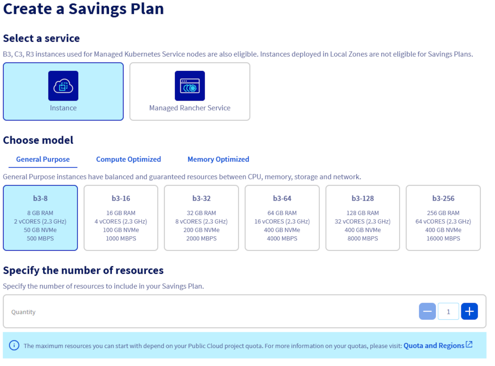

## Objective

This guide aims to provide a clear and detailed method for creating and updating Savings Plans for your resources. You will discover how to manage your Savings Plans using the OVHcloud Control Panel, the API and Terraform. By following this guide, you will be able to :

- Create a savings plan for your resources. 
- Modify a savings plan.
- Automate the management of Savings Plans via the API or Terraform for greater efficiency and flexibility.

### Requirements

- Access to the [OVHcloud API](https://api.ovh.com/) (create your identifiers by consulting [this guide](/pages/manage_and_operate/api/first-steps))
- A [Public Cloud project](https://www.ovhcloud.com/en-gb/public-cloud/) in your OVHcloud account.
- Access to your [OVHcloud Control Panel](https://www.ovh.com/auth/?action=gotomanager&from=https://www.ovh.co.uk/&ovhSubsidiary=GB) or to the [OVHcloud API](https://api.ovh.com/)   
- Be familiar with [Terraform] (/pages/public_cloud/compute/how_to_use_terraform) if you wish to use it.
- Be familiar with the principles of a [savings plan](...)

## Instructions

Log in to your [OVHcloud Control Panel] (https://www.ovh.com/auth/?action=gotomanager&from=https://www.ovh.co.uk/&ovhSubsidiary=GB) and go to the `Public Cloud`{.action} section. Once you have selected your Public Cloud project, click on `Savings Plans`{.action} in the left-hand navigation bar under **Project Management**.

### Create a Savings Plan

You can create your Savings Plan for the type of resource you want by following these steps:

> [!tabs]
> Via OVHcloud Control Panel
>> Click on the `Create a Savings Plan`{.action} button.
>>
>> {.thumbnail}
>>
>> Select the type of resource for which the Savings Plan will apply, define the specific resource model and specify the number of resources affected by this plan.
>>
>> {.thumbnail}
>>
>> Choose the duration of your Savings Plan from the available durations and enter its name. 
>>
>>[Savings Plan duration name](images/savings_plan_duration_name.png){.thumbnail}
>>
>> Read the terms and conditions carefully, then tick the box to confirm your acceptance. knowledge of them. Once all the parameters have been configured, click on the `Create a Savings Plan`{.action} button to finalise the creation.
>>
>> {.thumbnail}
>>
> Via Terraform
>> To create a Savings plan, you will need at least 5 elements:
>> 
>> * The ID of your Public Cloud project.
>> * The flavour concerned by your Savings Plan
>> * The duration of your Savings Plan (in standard ISO 8601 format)
>> * The number of resources concerned.
>> * The name of your Savings Plan
>>
>> In our example, we are going to create a Savings Plan for 10 instances of type **b3-8**, for a duration of 1 month. Add the following lines to a file named *savings_plan.tf* :
>>
>> ```python
>> # creation of a Savings Plan
>> resource "ovh_savings_plan" "savings_plan_b3_8" {
>>   service_name = "<public cloud project ID>"
>>   flavor = "B3-8"
>>   period = "P1M" #  P mandatory, number for duration and M for ‘month’, Y for ‘year’ ...
>>   size = 10
>>   display_name = "Savings_plan_simple_b3_8"
>>   auto_renewal = true # optional, ‘true’ to activate.
>> }
>> ```
>>
>> You can create your Savings Plan by entering the following command in your console:
>>
>> ```console
>> terraform apply
>> ```
>>
>> The output should look like this:
>> 
>> ```console
>> $ terraform apply
>> 

## Go further

Join our [community of users](/links/community).
