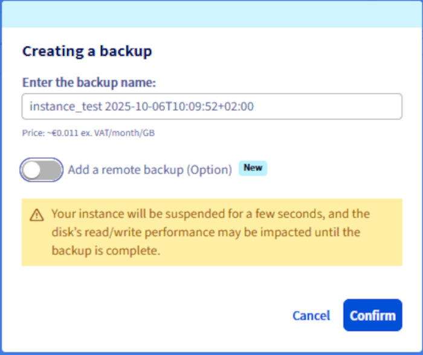
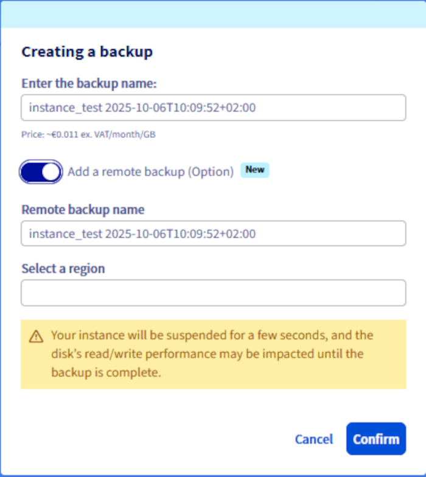

<style>
details>summary {
    color:rgb(33, 153, 232) !important;
    cursor: pointer;
}
details>summary::before {
    content:'\25B6';
    padding-right:1ch;
}
details[open]>summary::before {
    content:'\25BC';
}
</style>

## Objective

You can create a single backup of an instance or configure a schedule in order to automate your instance backups. Backups can be used to restore your instance to a previous state or to create a new, identical instance.

**This guide explains how to create manual and automatic backups of a Public Cloud instance.**

## Requirements

- A [Public Cloud instance](https://www.ovhcloud.com/en-gb/public-cloud/) in your OVHcloud account
- Access to the [OVHcloud Control Panel](/links/manager)
- OpenStack CLI. Use [our guide to know how to prepare the environment to use the OpenStack API](/pages/public_cloud/public_cloud_cross_functional/prepare_the_environment_for_using_the_openstack_api).

## Instructions

### Creating a backup of an instance

> [!warning]
> This option is only available through a **Cold Snapshot** for Metal instances. During this process, the Metal instance will be switched to rescue-mode, and once the backup is performed, the instance will reboot back to normal mode.
>

>[!tabs]
> Via the OVHcloud Control Panel
>> Log in to [OVHcloud customer area](/links/manager), access the `Public Cloud`{.action} section and select the relevant Public Cloud project. Then click on `Instances`{.action} in the left-hand menu.
>>
>> Click on the `...`{.action} button to the right of the instance and select `Create backup`{.action}.
>>
>> {.thumbnail}
>>
>> > [primary]
>> >
>> > Two types of backup are available: local and distant.
>> >
>> > The remote backup option also generates a local backup, billed separately and not deleted automatically.
>> >
>> > It is recommended that you keep this backup local, because if you recreate an instance in the same region, restoration will be significantly faster. This practice optimizes recovery times and performance.
>> >
>>
>> /// details | Local backup
>>
>> Enter a name for the backup. Review the pricing information and click `Confirm`{.action}.
>>
>> {.thumbnail}
>>
>> ///
>>
>> /// details | Distant backup
>>
>> Enter a name for the local backup in the `Enter the name of your backup :` field.
>>
>> {.thumbnail}
>>
>> Next, `activate`{.action} the option to add a remote backup, then specify the name of this backup, select its destination region and click `Confirm`{.action}.
>>
>> {.thumbnail}
>>
>> ///
>>
>> It is not possible to monitor backup progress in real time. However, in the `Instance Backup`{.action} section under **Compute** in the left-hand menu, the status `Backup in progress` will be displayed during the process.
>>
>> {.thumbnail}
>>
>> Once the backup is complete, it will be available in the `Instance Backup`{.action} section under **Compute** in the left-hand menu.
>>
>> {.thumbnail}
>>
> Via Openstack
>> ```bash
>> $ openstack server list
>>
>> +--------------------------------------+-----------+--------+--------------------------------------------------+--------------+
>> | ID | Name | Status | Networks | Image Name |
>> +--------------------------------------+-----------+--------+--------------------------------------------------+--------------+
>> | aa7115b3-83df-4375-b2ee-19339041dcfa | Server 1 | ACTIVE | Ext-Net=51.xxx.xxx.xxx, 2001:41d0:xxx:xxxx::xxxx | Ubuntu 16.04 |
>> +--------------------------------------+-----------+--------+--------------------------------------------------+--------------+
>> ```
>>
>> /// details | Local backup
>>
>> Then run the following command to create a backup of your instance:
>>
>> ````bash
>> $ openstack server image create --name snap_server1 aa7115b3-83df-4375-b2ee-19339041dcfa
>> ```
>>
>> ///
>>
>> /// details | Remote backup
>>
>> Run the following command after following the local backup step:
>>
>> ````bash
>> $ openstack workflow execution create ovh. glance.glance_download '{"src_image_id":"<image_id>", "src_region":"<current_region>", "dst_region":"<remote_region>"}'
>> ````
>>

### Creating an automated backup of an instance

> [!primary]
>
> If you want to automate this functionality directly via OpenStack, you can create a Mistral workflow associated with a cron trigger.
>

Click on the `...`{.action} button to the right of the instance and select `Create an automatic backup`{.action}.

{.thumbnail}

You can configure the following backup settings on the next page:

#### **The workflow** 

Currently, only one workflow exists. It will create a backup for the instance and its primary volume.

{.thumbnail}

#### **The resource** 

You can select the instance to back up.

{.thumbnail}

#### **The schedule** 

You can set up a custom backup schedule or choose one of the default frequencies:

- Daily backup with retention of the last 7 backups
- Daily backup with retention of the last 14 backups

{.thumbnail}

#### **The name** 

Enter a name for the automatic backup schedule. Take note of the pricing information and create the schedule with `Confirm`{.action}.
 
{.thumbnail}

### Managing backups and schedules

Schedules can be created and deleted in the `Workflow Management`{.action} section, which is located under **Compute** in the left-hand menu.

{.thumbnail}

Your instance backups are managed in the Public Cloud `Instance Backup`{.action} section, which can be found under **Compute** in the left-hand menu.

{.thumbnail}

> [!warning]
> The instance backup option must be deleted separately if you no longer wish to be billed for it. Deleting an instance does not delete the options attached to it.
>

> [!warning]
> **Note that you cannot delete an instance backup if an instance that has been spawned from this backup is running at the time of the delete action.**

Find out how to use backups to clone or restore instances in [this guide](/pages/public_cloud/compute/create_restore_a_virtual_server_with_a_backup).

## Go further

[Using instance backups to create or restore an instance](/pages/public_cloud/compute/create_restore_a_virtual_server_with_a_backup)

Join our [community of users](/links/community).